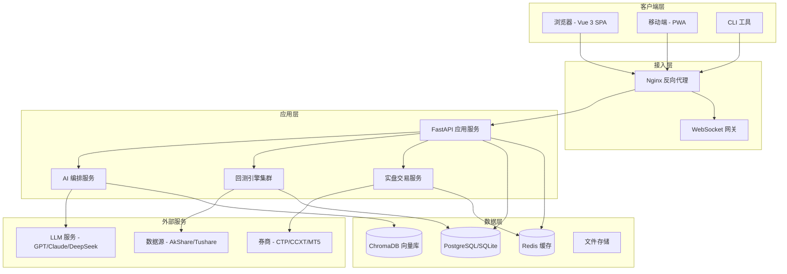

# 技术设计文档：架构文档更新

## Overview

本设计文档描述 Backtrader Web 平台的完整系统架构更新方案。基于技术研究报告的结论，涵盖当前架构状态和目标演进方向，包含高层设计（系统组件、数据流、部署架构）和低层设计（接口定义、数据模型、关键算法）。

### 目标

将现有的基础架构文档 `docs/ARCHITECTURE.md` 升级为全面反映系统当前状态和演进方向的正式架构文档，覆盖多引擎回测、AI 编排、实盘交易高可用、数据架构、安全架构和可观测性等核心领域。

### 范围

- 更新 `docs/ARCHITECTURE.md` 为完整的系统架构文档
- 涵盖后端分层架构、前端架构、数据架构、安全架构、部署架构
- 包含接口定义、数据模型、API 设计模式等低层设计
- 记录技术选型决策和架构演进路径

## Architecture

### 系统架构总览



### 后端分层架构

```text
┌─────────────────────────────────────────────────────────────────────┐
│                        中间件层 (Middleware)                          │
│  异常处理 | 安全头 | 日志记录 | 速率限制 | OpenTelemetry | CORS      │
└─────────────────────────────────────────────────────────────────────┘
┌─────────────────────────────────────────────────────────────────────┐
│                        路由层 (API Routes)                           │
│  auth | strategy | backtest | optimization | live-trading | ai-chat │
│  analytics | monitoring | data | quote | workspace | risk-control   │
└─────────────────────────────────────────────────────────────────────┘
┌─────────────────────────────────────────────────────────────────────┐
│                        服务层 (Services)                             │
│  AuthService | BacktestService | StrategyService | LiveTradingMgr   │
│  OptimizationService | AnalyticsService | RiskControlService        │
│  AIOrchestrator | QuoteService | WorkspaceService                   │
└─────────────────────────────────────────────────────────────────────┘
┌─────────────────────────────────────────────────────────────────────┐
│                        数据访问层 (Repository)                       │
│  SQLRepository | Cache | SessionProvider | Factory                   │
└─────────────────────────────────────────────────────────────────────┘
┌─────────────────────────────────────────────────────────────────────┐
│                        基础设施层 (Infrastructure)                    │
│  Database | Redis | ChromaDB | FileSystem | MessageQueue             │
└─────────────────────────────────────────────────────────────────────┘
```

### 回测引擎架构（多引擎）

引擎选择器根据策略复杂度、数据粒度、用户偏好选择最优引擎：

- **Backtrader 引擎（精确模式）**：事件驱动、Tick 级别、复杂策略、多资产组合、实盘一致性
- **Vectorbt 引擎（快速模式）**：向量化计算、批量回测、简单策略、参数扫描、10-100x 加速

### AI 编排架构

多 Agent 协作模式：意图识别 → 任务分解 → Agent 调度 → 结果合成

- **策略生成 Agent**：调用 LiteLLM 多模型网关生成策略代码
- **回测执行 Agent**：自动配置参数并执行回测
- **知识检索 Agent**：混合检索（BM25 + 向量相似度）从 ChromaDB 获取相关知识

### 实盘交易高可用架构

- 交易网关集群：CTP/CCXT/MT5 独立网关进程
- 统一订单路由层：标准化订单格式，路由到对应网关
- 风控引擎：实时检查仓位限制、频率限制、最大亏损、异常行为
- 策略执行引擎：每个策略独立进程，崩溃隔离

### 数据架构

四层数据架构：采集层 → 标准化层 → 存储层 → 服务层

存储层分为三类：
- 时序数据（行情/K线）：TimescaleDB / PostgreSQL
- 关系数据（用户/策略）：PostgreSQL / SQLite
- 向量数据（AI 嵌入）：ChromaDB

### 部署架构

支持两种部署模式：
- **单机部署**：Docker Compose（Nginx + FastAPI + PostgreSQL + Redis）
- **分布式部署**：Kubernetes（HPA 自动扩缩容、主从数据库、Redis 集群）

## Components and Interfaces

### 回测引擎接口

```python
from typing import Protocol
from dataclasses import dataclass
from pandas import DataFrame


@dataclass
class BacktestResult:
    """统一回测结果格式"""
    task_id: str
    equity_curve: list[dict]
    trades: list[dict]
    metrics: dict
    risk_metrics: dict
    chart_data: dict
    engine_used: str
    execution_time_ms: int


class BacktestEngine(Protocol):
    """回测引擎统一接口"""

    async def run(
        self,
        strategy_code: str,
        data: DataFrame,
        params: dict,
        initial_cash: float = 100000.0,
    ) -> BacktestResult: ...

    def supports_complexity(self, complexity: str) -> bool: ...
```

### AI 编排层接口

```python
from enum import Enum
from pydantic import BaseModel


class AIIntent(str, Enum):
    STRATEGY_GENERATE = "strategy_generate"
    STRATEGY_REVIEW = "strategy_review"
    STRATEGY_EXPLAIN = "strategy_explain"
    BACKTEST_RUN = "backtest_run"
    KNOWLEDGE_QUERY = "knowledge_query"
    RISK_ASSESS = "risk_assess"


class AIRequest(BaseModel):
    user_message: str
    context: dict | None = None
    model_preference: str = "auto"
    mode: str = "chat"


class AIResponse(BaseModel):
    content: str
    intent: AIIntent
    metadata: dict = {}
    model_used: str = ""
    tokens_used: int = 0


class AIOrchestrator:
    """AI 编排器"""

    async def process(self, request: AIRequest, user_id: str) -> AIResponse:
        intent = await self._identify_intent(request.user_message)
        agent = self._select_agent(intent)
        return await agent.execute(request, user_id)
```

### 统一数据接口

```python
from datetime import datetime
from pandas import DataFrame


class UnifiedDataFeed(Protocol):
    """统一数据源接口"""

    async def get_bars(
        self, symbol: str, timeframe: str, start: datetime, end: datetime
    ) -> DataFrame: ...

    async def subscribe_realtime(
        self, symbols: list[str], callback: "Callable[[str, dict], None]"
    ) -> None: ...

    async def get_symbols(self, market: str = "") -> list[dict]: ...


class UnifiedBroker(Protocol):
    """统一交易接口"""

    async def place_order(self, order: "Order") -> "OrderResult": ...
    async def cancel_order(self, order_id: str) -> bool: ...
    async def get_positions(self) -> list["Position"]: ...
    async def get_account(self) -> "AccountInfo": ...
```

### 风控引擎接口

```python
from enum import Enum
from dataclasses import dataclass


class RiskAction(str, Enum):
    ALLOW = "allow"
    REJECT = "reject"
    REDUCE = "reduce"
    CLOSE = "close"
    ALERT = "alert"
    SUSPEND = "suspend"


@dataclass
class RiskCheckResult:
    action: RiskAction
    reason: str
    details: dict | None = None


class RiskControlEngine:
    """实时风控引擎"""

    async def check_order(
        self, order: "Order", context: "TradingContext"
    ) -> RiskCheckResult:
        for rule in self._rules:
            result = await rule.evaluate(order, context)
            if result.action != RiskAction.ALLOW:
                return result
        return RiskCheckResult(action=RiskAction.ALLOW, reason="passed")

    async def monitor_position(self, position: "Position") -> RiskCheckResult: ...
```

### WebSocket 消息协议

```python
class WSMessage(BaseModel):
    type: str       # "subscribe" | "unsubscribe" | "data" | "error"
    channel: str    # "backtest.progress" | "trading.position" | "quote.realtime"
    payload: dict
    timestamp: float

# 频道定义:
# backtest.progress.{task_id}    - 回测进度
# trading.position.{instance_id} - 持仓更新
# trading.order.{instance_id}    - 订单更新
# quote.realtime.{symbol}        - 实时行情
# alert.{user_id}                - 用户告警
```

## Data Models

### 核心实体模型

```python
from sqlalchemy.orm import Mapped, mapped_column
from sqlalchemy import String, Text, JSON, ForeignKey, func
from datetime import datetime


class Strategy(SQLAlchemyBase):
    __tablename__ = "strategies"
    id: Mapped[str] = mapped_column(primary_key=True)
    user_id: Mapped[str] = mapped_column(ForeignKey("users.id"))
    name: Mapped[str] = mapped_column(String(200))
    code: Mapped[str] = mapped_column(Text)
    category: Mapped[str] = mapped_column(String(50))
    complexity: Mapped[str] = mapped_column(String(20))
    is_template: Mapped[bool] = mapped_column(default=False)
    version: Mapped[int] = mapped_column(default=1)
    created_at: Mapped[datetime] = mapped_column(default=func.now())
    updated_at: Mapped[datetime] = mapped_column(onupdate=func.now())


class BacktestTask(SQLAlchemyBase):
    __tablename__ = "backtest_tasks"
    id: Mapped[str] = mapped_column(primary_key=True)
    user_id: Mapped[str] = mapped_column(ForeignKey("users.id"))
    strategy_id: Mapped[str] = mapped_column(ForeignKey("strategies.id"))
    status: Mapped[str] = mapped_column(String(20))
    engine: Mapped[str] = mapped_column(String(20))
    params: Mapped[dict] = mapped_column(JSON)
    result: Mapped[dict | None] = mapped_column(JSON, nullable=True)
    started_at: Mapped[datetime | None] = mapped_column(nullable=True)
    completed_at: Mapped[datetime | None] = mapped_column(nullable=True)
    execution_time_ms: Mapped[int | None] = mapped_column(nullable=True)


class LiveTradingInstance(SQLAlchemyBase):
    __tablename__ = "live_trading_instances"
    id: Mapped[str] = mapped_column(primary_key=True)
    user_id: Mapped[str] = mapped_column(ForeignKey("users.id"))
    strategy_id: Mapped[str] = mapped_column(ForeignKey("strategies.id"))
    broker_type: Mapped[str] = mapped_column(String(20))
    status: Mapped[str] = mapped_column(String(20))
    config: Mapped[dict] = mapped_column(JSON)
    risk_config: Mapped[dict] = mapped_column(JSON)
    pid: Mapped[int | None] = mapped_column(nullable=True)
    last_heartbeat: Mapped[datetime | None] = mapped_column(nullable=True)
```

### 数据存储策略

| 数据类型 | 存储方案 | 访问模式 | 缓存策略 |
| --- | --- | --- | --- |
| 用户/策略/任务 | PostgreSQL/SQLite | CRUD | Redis TTL 60s |
| 行情K线数据 | PostgreSQL (未来 TimescaleDB) | 时间范围查询 | Redis TTL 1s (实时) |
| AI 嵌入向量 | ChromaDB | 相似度检索 | 无 (内存索引) |
| 回测结果 | PostgreSQL JSON 字段 | 按 ID 查询 | Redis TTL 1h |
| 策略文件 | 文件系统 | 读取为主 | 进程内 LRU |
| 会话/令牌 | Redis | 高频读写 | 原生 |

## Correctness Properties

### Property 1: 引擎一致性

对于相同的策略代码和数据，Backtrader 引擎和 Vectorbt 引擎在简单策略上的回测结果（总收益率）偏差不超过 0.1%。

### Property 2: 风控不可绕过

所有实盘订单必须经过风控引擎检查，任何绕过风控的订单路径都是 bug。

### Property 3: 数据完整性

回测任务状态机只允许合法转换（pending → running → completed/failed），不允许跳跃或回退。

### Property 4: 认证不可伪造

过期或无效的 JWT Token 必须被拒绝，不存在绕过认证的 API 路径。

### Property 5: 进程隔离

单个策略进程崩溃不影响其他策略实例和主服务进程。

### Property 6: 缓存一致性

数据变更后，缓存在 TTL 时间内失效或被主动清除，不返回过期数据。

## Error Handling

### 错误处理规范

```python
class ServiceError(Exception):
    """服务层基础异常"""
    def __init__(self, message: str, code: str = "INTERNAL_ERROR"):
        self.message = message
        self.code = code


class NotFoundError(ServiceError):
    def __init__(self, entity: str, id: str):
        super().__init__(f"{entity} not found: {id}", "NOT_FOUND")


class ValidationError(ServiceError):
    def __init__(self, field: str, reason: str):
        super().__init__(f"Validation failed: {field} - {reason}", "VALIDATION_ERROR")
```

### 错误映射

| 服务层异常 | HTTP 状态码 | 场景 |
| --- | --- | --- |
| NotFoundError | 404 | 资源不存在 |
| ValidationError | 422 | 输入验证失败 |
| PermissionError | 403 | 权限不足 |
| AuthenticationError | 401 | 认证失败 |
| RateLimitError | 429 | 请求频率超限 |
| ServiceError (通用) | 500 | 内部错误 |

### 错误响应格式

```python
class ErrorResponse(BaseModel):
    code: int
    message: str
    detail: str | None = None
    request_id: str | None = None
```

## Testing Strategy

### 测试层级

| 层级 | 工具 | 覆盖目标 | 运行频率 |
| --- | --- | --- | --- |
| 单元测试 | pytest + hypothesis | 服务层逻辑、工具函数 | 每次提交 |
| 集成测试 | pytest + httpx | API 端点、数据库交互 | 每次提交 |
| 属性测试 | hypothesis | 正确性属性验证 | 每次提交 |
| E2E 测试 | Playwright | 核心用户流程 | PR 合并前 |
| 性能测试 | pytest-benchmark | API 响应时间基准 | 每周 |
| 安全测试 | bandit + safety | 代码安全扫描 | 每次提交 |

### 关键测试场景

- 多引擎回测结果一致性验证
- 风控规则全路径覆盖
- JWT 认证边界条件（过期、篡改、重放）
- WebSocket 连接断开重连
- 实盘交易进程崩溃恢复
- 并发回测任务资源竞争

## 技术选型决策

| 组件 | 选择 | 理由 |
| --- | --- | --- |
| Web 框架 | FastAPI | 异步原生、自动文档、类型安全 |
| ORM | SQLAlchemy 2.0 | 异步支持、成熟稳定、多数据库兼容 |
| 验证 | Pydantic v2 | 性能优秀、与 FastAPI 深度集成 |
| 前端框架 | Vue 3 + TypeScript | 组合式 API、类型安全、生态成熟 |
| 状态管理 | Pinia | 轻量、TypeScript 友好 |
| UI 组件库 | Element Plus | 中文生态好、组件丰富 |
| 图表 | ECharts + KLineChart | 通用图表 + 专业金融K线 |
| AI 网关 | LiteLLM | 多模型统一接口、故障转移 |
| 向量数据库 | ChromaDB | 轻量、Python 原生 |
| 缓存 | Redis | 高性能、Pub/Sub 支持 |
| 可观测性 | OpenTelemetry + Prometheus | 标准化、厂商无关 |
| 容器化 | Docker + Compose | 标准化部署 |

## 架构演进路径

- **Phase 1（当前）**：单体应用 + 多进程回测 → 数据缓存优化、Cython 热点加速、完善可观测性
- **Phase 2**：服务拆分 + AI 深度集成 → AI 编排服务独立、多引擎回测、智能风控
- **Phase 3**：平台化 + 微服务 → 策略市场服务、插件系统、多租户隔离
- **Phase 4**：云原生 + 全球化 → K8s 部署、多区域、自动扩缩容
