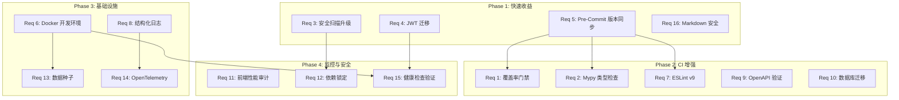

# Design Document

## Overview

本设计文档描述 Backtrader Web 平台按照行业最佳实践进行系统性改进的技术方案。改进涵盖 16 个需求，分为四个实施阶段：

- **Phase 1（快速收益）**：Req 5 Pre-Commit 版本同步、Req 3 安全扫描升级、Req 4 JWT 迁移、Req 16 Markdown 安全配置
- **Phase 2（CI 增强）**：Req 1 覆盖率门禁、Req 2 Mypy 类型检查、Req 7 ESLint v9、Req 9 OpenAPI 验证、Req 10 数据库迁移规范
- **Phase 3（基础设施）**：Req 6 Docker 开发环境、Req 8 结构化日志、Req 13 数据种子、Req 14 OpenTelemetry
- **Phase 4（监控与安全）**：Req 11 前端性能审计、Req 12 依赖锁定与漏洞扫描、Req 15 健康检查验证

各阶段之间存在依赖关系：Phase 2 依赖 Phase 1 完成（特别是 Req 5 确保工具版本一致后再修改 CI）；Phase 3 的 Req 8 结构化日志为 Phase 4 的 Req 14 OpenTelemetry 提供基础；Phase 4 的 Req 15 健康检查验证依赖 Phase 3 的 Req 6 Docker 环境提供集成测试基础设施。



## Architecture

整体改进不改变现有系统架构，而是在现有分层架构之上增强工程实践：

```
┌─────────────────────────────────────────────────────────────┐
│                    CI/CD Pipeline (GitHub Actions)            │
│  ┌─────────┐ ┌─────────┐ ┌──────────┐ ┌─────────────────┐  │
│  │ Lint    │ │ Test    │ │ Security │ │ Integration     │  │
│  │ (Ruff,  │ │ (pytest,│ │ (Bandit, │ │ (OpenAPI, LHCI, │  │
│  │  Mypy,  │ │ Vitest) │ │  Safety, │ │  Health Check)  │  │
│  │  ESLint)│ │         │ │  Audit)  │ │                 │  │
│  └─────────┘ └─────────┘ └──────────┘ └─────────────────┘  │
└─────────────────────────────────────────────────────────────┘

┌─────────────────────────────────────────────────────────────┐
│                    Local Development                          │
│  ┌──────────────┐  ┌──────────────┐  ┌──────────────────┐  │
│  │ Pre-Commit   │  │ Docker Dev   │  │ Seed Data        │  │
│  │ (Ruff v0.15) │  │ (Compose)    │  │ (seed_dev_data)  │  │
│  └──────────────┘  └──────────────┘  └──────────────────┘  │
└─────────────────────────────────────────────────────────────┘

┌─────────────────────────────────────────────────────────────┐
│                    Backend (FastAPI)                          │
│  ┌──────────────┐  ┌──────────────┐  ┌──────────────────┐  │
│  │ Auth (PyJWT) │  │ Structured   │  │ OpenTelemetry    │  │
│  │              │  │ Logging      │  │ (Core Dep)       │  │
│  └──────────────┘  └──────────────┘  └──────────────────┘  │
│  ┌──────────────┐  ┌──────────────┐                        │
│  │ Health Check │  │ Alembic      │                        │
│  │ (/api/v1/    │  │ Migrations   │                        │
│  │  health)     │  │              │                        │
│  └──────────────┘  └──────────────┘                        │
└─────────────────────────────────────────────────────────────┘

┌─────────────────────────────────────────────────────────────┐
│                    Frontend (Vue 3 + TypeScript)              │
│  ┌──────────────┐  ┌──────────────┐  ┌──────────────────┐  │
│  │ ESLint v9    │  │ Markdown     │  │ Bundle Analysis  │  │
│  │ (Flat Config)│  │ Sanitizer    │  │ (Lighthouse CI)  │  │
│  └──────────────┘  └──────────────┘  └──────────────────┘  │
└─────────────────────────────────────────────────────────────┘
```

### 设计决策

1. **JWT 库选择 PyJWT 而非 authlib**：PyJWT 是 Python 生态中最广泛使用的 JWT 库，API 简洁，与 python-jose 接口相似度高，迁移成本最低。
2. **结构化日志保持 loguru**：现有代码已深度集成 loguru，通过配置 sink 即可实现 JSON 输出，无需更换日志框架。
3. **ESLint v9 使用 typescript-eslint 新架构**：ESLint v9 flat config 与 `typescript-eslint` v8+ 的 `tseslint.config()` 工具函数配合，提供类型安全的配置体验。
4. **OpenTelemetry 移至核心依赖**：消除可选依赖的安装复杂性，通过环境变量控制启用/禁用，未启用时零开销。
5. **Docker Compose 使用 profiles 而非多文件**：单一 `docker-compose.dev.yml` 文件降低认知负担，通过环境变量实现灵活配置。

## Components and Interfaces

### Phase 1 组件

#### Req 5: Pre-Commit 版本同步

**修改文件**：
- `.pre-commit-config.yaml` — 更新 Ruff hook `rev` 为 `v0.15.11`（与 `.ruff_cache` 最新版本一致），添加版本更新说明注释

**接口**：无新接口，仅配置变更。

#### Req 3: 安全扫描升级

**修改文件**：
- `.github/workflows/ci.yml` — 移除 `backend-security` job 的 `continue-on-error`，添加 severity 过滤脚本，将 security 移至 blocker 区域

**新增文件**：
- `scripts/bandit_gate.sh` — Bandit 结果过滤脚本，仅 HIGH severity + MEDIUM/HIGH confidence 时返回非零退出码

```bash
# scripts/bandit_gate.sh 接口
# 输入：bandit JSON 报告路径
# 输出：exit 0 (无 HIGH 问题) 或 exit 1 (存在 HIGH 问题)
# 副作用：将 LOW/MEDIUM 问题输出为 warning
```

#### Req 4: JWT 迁移 (python-jose → PyJWT)

**修改文件**：
- `src/backend/pyproject.toml` — 替换依赖声明，更新 mypy overrides
- `src/backend/app/utils/security.py` — 替换 `jose` 导入为 `jwt`（PyJWT），更新异常处理

**接口变更**：

```python
# 迁移前 (python-jose)
from jose import JWTError, jwt
jwt.encode(payload, key, algorithm="HS256")
jwt.decode(token, key, algorithms=["HS256"])

# 迁移后 (PyJWT)
import jwt
from jwt.exceptions import InvalidTokenError
jwt.encode(payload, key, algorithm="HS256")
jwt.decode(token, key, algorithms=["HS256"])
```

内部函数签名不变：`create_access_token(data, expires_delta)` → `str`，`decode_access_token(token)` → `dict | None`。

#### Req 16: Markdown 安全配置

**新增文件**：
- `src/frontend/src/utils/markdown-sanitizer.ts` — 统一的 Markdown 渲染 + DOMPurify 净化工具

**修改文件**：
- 所有使用 `v-html` 渲染 Markdown 的组件 — 改用统一净化函数

**接口**：

```typescript
// src/frontend/src/utils/markdown-sanitizer.ts
export interface SanitizeOptions {
  allowImages?: boolean
  allowLinks?: boolean
}

export function renderMarkdown(raw: string, options?: SanitizeOptions): string
// 输入：原始 Markdown 字符串
// 输出：经 DOMPurify 净化后的安全 HTML 字符串
```

### Phase 2 组件

#### Req 1: 覆盖率门禁提升

**修改文件**：
- `.github/workflows/ci.yml` — `--cov-fail-under=70`，添加 diff-cover 步骤
- `src/backend/.coveragerc` — 移除 `workspace_service.py` 和 `sync_service.py` 的 omit

**新增依赖**：
- `diff-cover` 添加到 `[dev]` 依赖组

#### Req 2: Mypy 严格模式

**修改文件**：
- `src/backend/pyproject.toml` — `[tool.mypy]` 配置更新
- `.github/workflows/ci.yml` — `backend-lint` job 添加 mypy 步骤

**配置变更**：
```toml
[tool.mypy]
check_untyped_defs = true  # 从 false 改为 true

[[tool.mypy.overrides]]
module = ["app.api.*", "app.schemas.*"]
disallow_untyped_defs = true
```

#### Req 7: ESLint v9 Flat Config

**新增文件**：
- `src/frontend/eslint.config.js` — ESLint v9 flat config

**删除文件**：
- `src/frontend/.eslintrc.cjs`

**修改文件**：
- `src/frontend/package.json` — 升级 eslint 及插件版本，更新 lint 脚本
- `.github/workflows/ci.yml` — 移除 `--ext` 参数
- `.pre-commit-config.yaml` — 移除 `--ext` 参数

#### Req 9: OpenAPI Schema 验证

**新增文件**：
- `scripts/export_openapi.py` — 从 FastAPI app 导出 OpenAPI JSON
- `scripts/check_api_compat.py` — OpenAPI schema 向后兼容性检查

**修改文件**：
- `.github/workflows/ci.yml` — 添加 `check-openapi` pre-flight job

**新增依赖**：
- `openapi-spec-validator` (后端 dev 依赖)

#### Req 10: 数据库迁移规范

**新增文件**：
- `src/backend/alembic/versions/001_baseline.py` — Baseline 迁移文件

**修改文件**：
- `.github/workflows/ci.yml` — 增强 `check-migrations` job（添加 `alembic upgrade head` 和 `alembic check`）
- `scripts/check_alembic_heads.py` — 增强验证逻辑

### Phase 3 组件

#### Req 6: Docker 开发环境

**新增文件**：
- `docker-compose.dev.yml` — 开发环境编排
- `docker/backend.dev.Dockerfile` — 后端开发镜像
- `docker/frontend.dev.Dockerfile` — 前端开发镜像
- `docker/entrypoint-dev.sh` — 后端开发入口脚本（处理 DB_AUTO_CREATE_SCHEMA、SEED_DATA）

#### Req 8: 结构化日志

**修改文件**：
- `src/backend/app/utils/logger.py` — 增强 `_serialize_log` 函数，确保 JSON 输出包含所有必需字段（timestamp ISO 8601 毫秒精度、level、message、module、request_id）
- `src/backend/app/middleware/logging.py` — 确保 `request_id` 通过 loguru bind 注入上下文
- `src/backend/app/config.py` — 添加 `LOG_FORMAT` 环境变量支持

**接口**：现有 `get_logger(__name__)` 和 `logger.info/error/warning` 调用无需修改。

#### Req 13: 数据种子

**新增文件**：
- `scripts/seed_dev_data.py` — 开发数据种子脚本

**接口**：
```bash
# 用法
python scripts/seed_dev_data.py          # 创建示例数据（跳过已存在）
python scripts/seed_dev_data.py --reset  # 清除并重新生成
```

#### Req 14: OpenTelemetry 默认集成

**修改文件**：
- `src/backend/pyproject.toml` — 将 `[otel]` 可选依赖移至核心 `dependencies`
- `src/backend/app/telemetry.py` — 移除 ImportError 降级逻辑（包已在核心依赖中），增强日志输出

### Phase 4 组件

#### Req 11: 前端性能审计

**新增文件**：
- `.github/workflows/lighthouse.yml` 或集成到 `ci.yml` — Lighthouse CI job
- `lighthouserc.js` — Lighthouse CI 配置

**修改文件**：
- `.github/workflows/ci.yml` — `frontend-build` job 添加 bundle size 比较步骤

#### Req 12: 依赖锁定与漏洞扫描

**新增文件**：
- `src/backend/requirements-dev.lock` — 开发环境完整依赖锁文件
- `src/backend/requirements-prod.lock` — 生产环境完整依赖锁文件
- `scripts/generate_lockfiles.sh` — 锁文件生成脚本
- `scripts/check_lockfile_sync.py` — 锁文件一致性检查脚本

**修改文件**：
- `.github/workflows/ci.yml` — 添加 npm audit 和 lockfile 检查步骤
- `.github/workflows/nightly.yml` — 添加全量漏洞扫描和 Issue 创建

#### Req 15: 健康检查验证

**修改文件**：
- `src/backend/app/api/` 中的健康检查端点 — 确保响应格式符合规范（status、version、database、uptime 字段）
- `.github/workflows/ci.yml` — `integration-test` job 添加健康检查验证步骤

## Data Models

### JWT Token Payload（Req 4，无变更）

```python
# Token payload 结构保持不变
{
    "sub": str,          # 用户 ID
    "username": str,     # 用户名
    "token_type": str,   # "access" | "refresh"
    "exp": int,          # 过期时间戳
    "jti": str,          # Token ID (仅 refresh token)
}
```

### 结构化日志 JSON Schema（Req 8）

```json
{
    "timestamp": "2024-01-15T10:30:45.123+08:00",
    "level": "INFO",
    "message": "Request completed: GET /api/v1/strategies -> 200",
    "module": "logging",
    "request_id": "a1b2c3d4"
}
```

可选扩展字段：`exception`、`context`、`user_id`、`task_id`。

### 健康检查响应 Schema（Req 15）

```json
{
    "status": "healthy",
    "version": "1.0.0",
    "database": "healthy",
    "uptime": 3600.5
}
```

HTTP 503 时：
```json
{
    "status": "unhealthy",
    "version": "1.0.0",
    "database": "unhealthy",
    "uptime": 3600.5
}
```

### DOMPurify 配置（Req 16）

```typescript
const ALLOWED_TAGS = [
  'p', 'br', 'hr',
  'h1', 'h2', 'h3', 'h4', 'h5', 'h6',
  'ul', 'ol', 'li',
  'table', 'thead', 'tbody', 'tr', 'th', 'td',
  'pre', 'code', 'blockquote',
  'strong', 'em', 'del', 's', 'mark', 'sub', 'sup',
  'a', 'img',
  'span', 'div',
]

const ALLOWED_ATTR = ['href', 'src', 'alt', 'class', 'id', 'title', 'target', 'rel']
```

## Correctness Properties

*A property is a characteristic or behavior that should hold true across all valid executions of a system—essentially, a formal statement about what the system should do. Properties serve as the bridge between human-readable specifications and machine-verifiable correctness guarantees.*

### Property 1: JWT Token Round-Trip

*For any* valid payload containing fields `sub` (string), `username` (string), `token_type` ("access" or "refresh"), and `exp` (future timestamp), encoding the payload with PyJWT using HS256 algorithm and a secret key, then decoding the resulting token with the same key and algorithm, SHALL produce a payload where `sub`, `username`, and `token_type` fields are identical to the original.

**Validates: Requirements 4.2, 4.3, 4.4**

### Property 2: Structured Logging Contains Required Fields

*For any* log message string (non-empty, up to 10000 characters) emitted at any valid log level (DEBUG, INFO, WARNING, ERROR, CRITICAL) when `LOG_FORMAT=json`, the JSON output SHALL be parseable as valid JSON and SHALL contain all required fields: `timestamp` (ISO 8601 format with milliseconds), `level` (matching the emission level), `message` (containing the original message text), `module` (non-empty string), and `request_id` (string, "N/A" when no request context).

**Validates: Requirements 8.1, 8.2**

### Property 3: Request ID Generation

*For any* HTTP request to a non-skipped path, the LoggingMiddleware SHALL include an `X-Request-ID` response header whose value is exactly 8 characters long and consists of hexadecimal characters or URL-safe base64 characters.

**Validates: Requirements 8.5**

### Property 4: XSS Sanitization Removes Dangerous Content

*For any* HTML string containing one or more dangerous elements (`<script>`, `<iframe>`, `<object>`, `<embed>`, `<form>` tags, `javascript:` or `data:` protocol URIs, or event handler attributes like `onerror`, `onload`), the `renderMarkdown` function SHALL produce output that does not contain any of these dangerous elements, while preserving all content rendered from safe Markdown syntax (paragraphs, headings, lists, code blocks, links with `http/https` protocols, images).

**Validates: Requirements 16.1, 16.2**

## Error Handling

### Phase 1

| 场景 | 处理方式 |
|------|----------|
| Bandit/Safety 工具自身错误（网络超时） | 脚本检测工具退出码，非正常退出时标记 CI 失败并注明扫描未完成 |
| PyJWT decode 遇到无效 token | 捕获 `jwt.exceptions.InvalidTokenError`，返回 `None`（与原 `JWTError` 行为一致） |
| DOMPurify 遇到非字符串输入 | `renderMarkdown` 函数对 `null`/`undefined` 输入返回空字符串 |

### Phase 2

| 场景 | 处理方式 |
|------|----------|
| diff-cover 无法获取 diff（新仓库/无基准分支） | 步骤输出 warning 但不阻塞（`continue-on-error: true` 仅此步骤） |
| Mypy 发现类型错误 | CI 失败，开发者需修复后重新提交 |
| OpenAPI schema 导出失败（app 无法启动） | 脚本以非零退出码退出，CI 标记失败 |
| Alembic upgrade head 超时（120s） | CI 步骤超时失败，需检查迁移脚本性能 |

### Phase 3

| 场景 | 处理方式 |
|------|----------|
| Docker 服务启动失败 | healthcheck 保持 unhealthy，日志输出错误原因 |
| 种子脚本数据库不可用 | stderr 输出错误信息，非零退出码 |
| LOG_FORMAT 值无效 | 回退到默认行为（DEBUG=true 用彩色，DEBUG=false 用 JSON） |
| OTEL collector 不可达 | 应用继续运行，日志记录连接失败 warning |

### Phase 4

| 场景 | 处理方式 |
|------|----------|
| Lighthouse 无法启动浏览器 | CI 步骤失败，建议检查 runner 环境 |
| npm audit 网络超时 | 步骤失败，nightly 下次重试 |
| pip-audit 数据库不可用 | 步骤失败并记录原因 |
| 健康检查端点数据库连接超时（>5s） | 返回 HTTP 503，`database: "unhealthy"` |

## Testing Strategy

### 测试分层

本特性改进涉及多个层面，测试策略按类型分层：

#### 1. Property-Based Tests（属性测试）

使用 **Hypothesis**（Python）和 **fast-check**（TypeScript）进行属性测试，每个属性最少 100 次迭代。

**后端（Hypothesis）**：
- Property 1: JWT round-trip — 生成随机 payload，验证 encode/decode 一致性
- Property 2: Structured logging fields — 生成随机日志消息，验证 JSON 输出包含必需字段
- Property 3: Request ID format — 生成随机 HTTP 请求，验证响应头格式

**前端（fast-check）**：
- Property 4: XSS sanitization — 生成包含随机 XSS payload 的 HTML，验证净化后无危险内容

**配置**：
- 每个属性测试最少 100 次迭代
- 每个测试标注对应的设计属性编号
- Tag 格式：`Feature: best-practices-improvement, Property {number}: {property_text}`

#### 2. Unit Tests（单元测试）

- **Req 4**：现有 `test_auth.py`、`test_auth_improved.py`、`test_refresh_token.py` 全部通过
- **Req 8**：LOG_FORMAT 回退行为、DEBUG 模式切换
- **Req 16**：8+ 个 XSS payload 测试用例（脚本注入、事件处理器、协议 XSS、iframe）

#### 3. Integration Tests（集成测试）

- **Req 6**：Docker Compose 启动验证（60s 内 healthy）
- **Req 10**：Alembic upgrade head 在空数据库上执行
- **Req 13**：种子脚本创建数据、--reset 重置、幂等性
- **Req 15**：健康检查端点响应格式和状态码验证

#### 4. Smoke Tests（冒烟测试）

- **Req 1**：CI 配置包含 `--cov-fail-under=70`
- **Req 2**：pyproject.toml 包含正确的 mypy 配置
- **Req 3**：CI YAML 不含 `continue-on-error` 在 security job 上
- **Req 5**：pre-commit config 版本与 ruff_cache 一致
- **Req 7**：eslint.config.js 存在且 .eslintrc.cjs 已删除
- **Req 9**：CI 包含 OpenAPI 验证 job
- **Req 14**：pyproject.toml 核心依赖包含 OTel 包

### PBT 库选择

| 语言 | 库 | 理由 |
|------|-----|------|
| Python | Hypothesis | Python 生态标准 PBT 库，与 pytest 无缝集成 |
| TypeScript | fast-check | TypeScript 生态最成熟的 PBT 库，支持 Vitest |

### 测试文件规划

```
src/backend/tests/
├── test_jwt_migration.py          # Req 4: JWT round-trip property + unit tests
├── test_structured_logging.py     # Req 8: Logging properties + unit tests
├── test_health_endpoint.py        # Req 15: Health check integration tests

src/frontend/src/utils/
├── __tests__/
│   └── markdown-sanitizer.spec.ts # Req 16: XSS property + 8 unit tests
```
