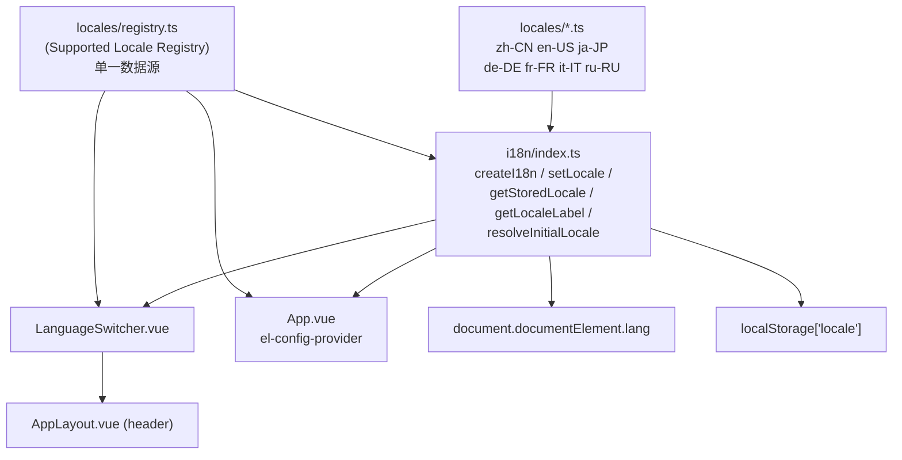
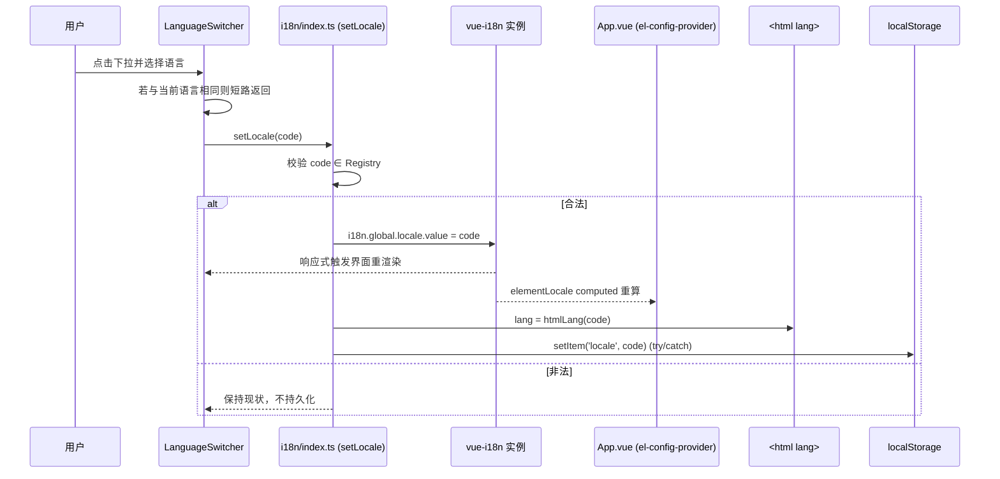

# Design Document

## Overview

本设计在前端现有的 vue-i18n 基础设施之上，将多语言支持从「中文 + 英文」扩展为 7 种语言（en-US、zh-CN、ja-JP、de-DE、fr-FR、it-IT、ru-RU），并在主布局顶部 header 的「主题切换按钮」与「用户(admin)下拉菜单」之间挂载语言切换控件。

设计的核心思路是**集中化与泛化**：当前 `i18n/index.ts`、`App.vue`、`LanguageSwitcher.vue` 各自硬编码了 `zh-CN`/`en-US` 两种语言的判断逻辑。本设计引入一个单一的「受支持语言注册表」（Supported Locale Registry）作为唯一数据源，所有消费方（i18n 初始化、语言校验、标签展示、Element Plus locale 映射、`<html lang>` 设置、切换控件下拉项）都从该注册表派生，从而新增一种语言时只需修改注册表与新增一个语言包文件。

本特性仅涉及前端展示文本国际化，不改动后端 API，不引入服务端语言存储。

### 范围内
- 受支持语言注册表（新增）
- i18n 模块泛化（改造 `i18n/index.ts`）
- 语言切换控件挂载与动态化（改造 `LanguageSwitcher.vue`、`AppLayout.vue`）
- Element Plus locale 联动（改造 `App.vue`）
- 5 个新增语言包文件（ja-JP、de-DE、fr-FR、it-IT、ru-RU）
- `<html lang>` 同步、缺失键回退、持久化

### 范围外
- 后端响应文本/邮件的本地化
- 服务端持久化用户语言偏好
- 日期/数字/货币的区域格式化深度定制（沿用 Element Plus locale 默认能力）
- 翻译文案的专业审校流程（首版可由机器翻译/占位 + 后续迭代完善）

## Requirements Traceability

| 需求 | 设计应对 |
|------|----------|
| R1 控件布局位置 | `AppLayout.vue` header 右侧操作区，`<ThemeSwitcher/>` 与用户下拉之间插入 `<LanguageSwitcher/>` |
| R2 受支持语言集合 | Supported Locale Registry 定义 7 种语言；`LanguageSwitcher` 从注册表渲染下拉项 |
| R3 切换并更新文本 | `setLocale()` 更新 `i18n.global.locale`，vue-i18n 响应式重渲染；相同语言短路 |
| R4 持久化与刷新保持 | `localStorage['locale']` 读写；`getStoredLocale()` 初始化；写入失败容错 |
| R5 默认语言与浏览器推断 | `resolveInitialLocale()` 按语言子标签匹配，回退 en-US |
| R6 缺失键回退 | `createI18n({ fallbackLocale: 'en-US' })` + `missingWarn` 处理 |
| R7 泛化 i18n 基础设施 | Supported Locale Registry 作为单一数据源被所有消费方引用 |
| R8 新增语言包与覆盖 | 5 个 locale 文件 + 完整性校验脚本/测试 |
| R9 `<html lang>` 同步 | `setLocale()` 与初始化时设置 `document.documentElement.lang` |
| R10 可访问性 | `LanguageSwitcher` 触发元素加 `aria-label`、可聚焦、焦点样式、键盘操作（沿用 el-dropdown） |
| R11 项目约定一致 | `<script setup lang="ts">`、scoped 样式、lint/typecheck、保留 `i18n-ignore`、复用主题按钮样式、现有测试通过 |

## Architecture

### 模块关系



### 语言切换数据流



## Components and Interfaces

### 1. Supported Locale Registry（新增 `src/frontend/src/i18n/locales/registry.ts`）

唯一数据源，定义每种语言的代码、本族文字标签、`<html lang>` 值、Element Plus locale 模块与消息包加载。

```typescript
import type { Language } from 'element-plus/es/locale'
import type { DefineLocaleMessage } from 'vue-i18n'

import zhCN from './zh-CN'
import enUS from './en-US'
import jaJP from './ja-JP'
import deDE from './de-DE'
import frFR from './fr-FR'
import itIT from './it-IT'
import ruRU from './ru-RU'

import elZhCn from 'element-plus/dist/locale/zh-cn.mjs'
import elEn from 'element-plus/dist/locale/en.mjs'
import elJa from 'element-plus/dist/locale/ja.mjs'
import elDe from 'element-plus/dist/locale/de.mjs'
import elFr from 'element-plus/dist/locale/fr.mjs'
import elIt from 'element-plus/dist/locale/it.mjs'
import elRu from 'element-plus/dist/locale/ru.mjs'

export type LocaleCode =
  | 'en-US' | 'zh-CN' | 'ja-JP' | 'de-DE' | 'fr-FR' | 'it-IT' | 'ru-RU'

export interface LocaleEntry {
  /** BCP 47 代码，同时用作 vue-i18n key 与 <html lang> 值 */
  code: LocaleCode
  /** 下拉菜单展示的本族文字自称 */
  label: string
  /** vue-i18n 消息包 */
  messages: DefineLocaleMessage
  /** Element Plus 对应 locale 模块 */
  elementLocale: Language
}

/** 注册顺序即下拉展示顺序（需求 R2.2） */
export const DEFAULT_LOCALE: LocaleCode = 'en-US'

export const LOCALE_ENTRIES: readonly LocaleEntry[] = [
  // i18n-ignore: 以下 label 为各语言本族自称，刻意不走 t() 翻译。
  { code: 'en-US', label: 'English',  messages: enUS, elementLocale: elEn },
  { code: 'zh-CN', label: '中文',      messages: zhCN, elementLocale: elZhCn },
  { code: 'ja-JP', label: '日本語',    messages: jaJP, elementLocale: elJa },
  { code: 'de-DE', label: 'Deutsch',   messages: deDE, elementLocale: elDe },
  { code: 'fr-FR', label: 'Français',  messages: frFR, elementLocale: elFr },
  { code: 'it-IT', label: 'Italiano',  messages: itIT, elementLocale: elIt },
  { code: 'ru-RU', label: 'Русский',   messages: ruRU, elementLocale: elRu },
]

export const SUPPORTED_LOCALES: readonly LocaleCode[] =
  LOCALE_ENTRIES.map((e) => e.code)

export function isSupportedLocale(code: string): code is LocaleCode {
  return (SUPPORTED_LOCALES as readonly string[]).includes(code)
}

export function getEntry(code: LocaleCode): LocaleEntry {
  return LOCALE_ENTRIES.find((e) => e.code === code) ?? LOCALE_ENTRIES[0]
}
```

> 设计决策：`<html lang>` 直接复用 BCP 47 完整代码（`zh-CN`、`ja-JP` 等），满足 R9.3「7 种各自唯一」。这比旧实现仅输出 `zh`/`en` 更精确，且对屏幕阅读器友好。

### 2. i18n 模块（改造 `src/frontend/src/i18n/index.ts`）

去除硬编码数组，全部从 Registry 派生。

```typescript
import { createI18n } from 'vue-i18n'
import {
  LOCALE_ENTRIES, SUPPORTED_LOCALES, DEFAULT_LOCALE,
  isSupportedLocale, getEntry, type LocaleCode,
} from './locales/registry'

const STORAGE_KEY = 'locale'

function buildMessages() {
  return Object.fromEntries(LOCALE_ENTRIES.map((e) => [e.code, e.messages]))
}

/** 浏览器语言推断：按语言子标签（连字符前部分）不区分大小写匹配（R5） */
function inferFromBrowser(): LocaleCode {
  const raw = (typeof navigator !== 'undefined' && navigator.language) || ''
  const sub = raw.split('-')[0]?.toLowerCase()
  if (sub) {
    const hit = SUPPORTED_LOCALES.find((c) => c.split('-')[0].toLowerCase() === sub)
    if (hit) return hit
  }
  return DEFAULT_LOCALE
}

/** 读取持久化值；非法/缺失时按浏览器推断（R4、R7.6） */
export function getStoredLocale(): LocaleCode {
  try {
    const stored = localStorage.getItem(STORAGE_KEY)
    if (stored && isSupportedLocale(stored)) return stored
  } catch {
    /* localStorage 不可用，忽略 */
  }
  return inferFromBrowser()
}

const i18n = createI18n({
  legacy: false,
  locale: getStoredLocale(),
  fallbackLocale: DEFAULT_LOCALE,
  messages: buildMessages(),
})

/** 应用初始 <html lang>（R9.2） */
applyHtmlLang(i18n.global.locale.value as LocaleCode)

function applyHtmlLang(code: LocaleCode): void {
  if (typeof document !== 'undefined') {
    document.documentElement.lang = getEntry(code).code
  }
}

export interface SetLocaleResult {
  ok: boolean
  reason?: 'unsupported' | 'persist-failed'
}

/** 切换语言并持久化（R3、R4、R7、R9） */
export function setLocale(code: string): SetLocaleResult {
  if (!isSupportedLocale(code)) return { ok: false, reason: 'unsupported' }
  i18n.global.locale.value = code
  applyHtmlLang(code)
  try {
    localStorage.setItem(STORAGE_KEY, code)
  } catch {
    return { ok: true, reason: 'persist-failed' }
  }
  return { ok: true }
}

export function getLocale(): LocaleCode {
  return i18n.global.locale.value as LocaleCode
}

/** 标签查询；未知代码返回原值（R7.4） */
export function getLocaleLabel(code: string): string {
  return isSupportedLocale(code) ? getEntry(code).label : code
}

export default i18n
```

> 设计决策：`setLocale` 由 `void` 返回值改为返回 `SetLocaleResult`，使「持久化失败」（R4.2）与「非法代码」（R3.4）成为可观测结果，供切换控件在持久化失败时给出 `ElMessage` 提示，且不破坏现有调用方（返回值可被忽略）。

### 3. LanguageSwitcher（改造 `src/frontend/src/components/LanguageSwitcher.vue`）

下拉项从 Registry 动态生成，移除内部硬编码语言数组；补充可访问性属性。

```vue
<template>
  <el-dropdown
    trigger="click"
    @command="handleChange"
  >
    <button
      type="button"
      class="language-switcher"
      :aria-label="t('nav.languageSwitcher')"
    >
      <el-icon><Promotion /></el-icon>
      <span class="language-label">{{ currentLabel }}</span>
    </button>
    <template #dropdown>
      <el-dropdown-menu>
        <el-dropdown-item
          v-for="entry in LOCALE_ENTRIES"
          :key="entry.code"
          :command="entry.code"
          :class="{ 'is-active': currentLocale === entry.code }"
        >
          {{ entry.label }}
        </el-dropdown-item>
      </el-dropdown-menu>
    </template>
  </el-dropdown>
</template>

<script setup lang="ts">
import { computed } from 'vue'
import { Promotion } from '@element-plus/icons-vue'
import { ElMessage } from 'element-plus'
import { useI18n } from 'vue-i18n'
import { setLocale, getLocaleLabel } from '@/i18n'
import { LOCALE_ENTRIES } from '@/i18n/locales/registry'

const { t, locale } = useI18n()
const currentLocale = computed(() => locale.value)
const currentLabel = computed(() => getLocaleLabel(currentLocale.value))

function handleChange(code: string): void {
  if (locale.value === code) return            // R3.3 相同语言短路
  const result = setLocale(code)
  if (result.ok && result.reason === 'persist-failed') {
    ElMessage.warning(t('common.localePersistFailed'))  // R4.2
  }
}
</script>
```

> 触发元素由 `<span>` 改为 `<button type="button">`，天然可聚焦、可键盘激活，并复用 `el-dropdown` 的菜单键盘交互（Enter/Space 打开、方向键导航、Esc 关闭），满足 R10.2/R10.5/R10.7。scoped 样式新增 `:focus-visible` 焦点轮廓（R10.3），并与 `ThemeSwitcher` 复用相同的尺寸/间距/圆角/颜色变量令牌（R11.5）。

### 4. AppLayout 挂载（改造 `src/frontend/src/components/common/AppLayout.vue`）

在 header 右侧操作区，`<ThemeSwitcher />` 之后、用户下拉之前插入控件：

```vue
<div class="flex items-center gap-4 shrink-0">
  <ThemeSwitcher />
  <LanguageSwitcher />        <!-- 新增：位于主题与用户菜单之间 (R1.2) -->
  <el-dropdown @command="handleCommand">
    <!-- 用户(admin)下拉，保持不变 -->
  </el-dropdown>
</div>
```

`import LanguageSwitcher from '@/components/LanguageSwitcher.vue'`。该容器使用 `flex` + `gap-4`，新增控件自动复用相同水平间距与垂直对齐（R1.5）；不加移动端隐藏类，保证小屏仍可见（R1.3）。

### 5. App.vue Element Plus locale 联动（改造）

`elementLocale` computed 改为从 Registry 查表，而非二选一：

```typescript
import { getEntry, isSupportedLocale, DEFAULT_LOCALE } from '@/i18n/locales/registry'

const elementLocale = computed(() => {
  const code = isSupportedLocale(locale.value) ? locale.value : DEFAULT_LOCALE
  return getEntry(code).elementLocale
})
```

### 接口/契约一览

| 导出 | 签名 | 用途 |
|------|------|------|
| `LocaleCode` | union type | 全局语言代码类型 |
| `LOCALE_ENTRIES` | `readonly LocaleEntry[]` | 下拉项、消息包、EP locale 来源 |
| `SUPPORTED_LOCALES` | `readonly LocaleCode[]` | 校验集合 |
| `isSupportedLocale(code)` | `code is LocaleCode` | 类型守卫 |
| `setLocale(code)` | `SetLocaleResult` | 切换+持久化+lang |
| `getLocale()` | `LocaleCode` | 当前语言 |
| `getLocaleLabel(code)` | `string` | 标签（未知返回原值） |
| `getStoredLocale()` | `LocaleCode` | 初始语言解析 |

## Data Models

### 语言包文件结构（`src/frontend/src/i18n/locales/<code>.ts`）

每个新增语言包与 `zh-CN.ts`/`en-US.ts` 保持**完全一致的嵌套键结构**，由 `i18n.d.ts` 的 `DefineLocaleMessage` 接口约束（R8.2、R8.3、R8.4）：

```typescript
// 例：ja-JP.ts
import type { DefineLocaleMessage } from 'vue-i18n'

const jaJP: DefineLocaleMessage = {
  common: { loading: '読み込み中', success: '成功', /* ... */ },
  nav: { dashboard: 'ダッシュボード', /* ... 含新增 languageSwitcher ... */ },
  // ... 其余命名空间与 zh-CN 一一对应
}
export default jaJP
```

### 新增翻译键

需在**全部 7 个**语言包及 `i18n.d.ts` 中补充：

| 键 | 用途 | 需求 |
|----|------|------|
| `nav.languageSwitcher` | 切换控件 `aria-label`（如「Language」/「语言」/「言語」） | R10.1 |
| `common.localePersistFailed` | 持久化失败提示文案 | R4.2 |

### 翻译完整性策略（R8 关键）

`zh-CN.ts`/`en-US.ts` 各约 2900+ 行键值。为保证 5 个新语言包键路径与基准**逐一对应、无缺失无多余**：

1. **以 `en-US` 为结构基准**克隆键树生成 5 个语言包骨架。
2. 填充各语言译文（首版可借助机器翻译，关键导航/按钮/提示人工校正）。
3. 编写**键完整性单元测试**（见测试策略），CI 中阻止结构漂移。
4. 运行期对缺失键由 `fallbackLocale: 'en-US'` 兜底（R6.2），并保留 vue-i18n 默认 `missing` 告警（R8.5 控制台告警）。

> 设计决策：键完整性以「测试 + 类型」双保险。`DefineLocaleMessage` 提供编译期类型约束（typecheck 捕获缺键/多键），单元测试提供运行期键集合对比，避免类型断言 `as` 绕过类型检查导致漏检。

## Error Handling

| 场景 | 处理 | 需求 |
|------|------|------|
| `setLocale` 收到非法代码 | 返回 `{ok:false, reason:'unsupported'}`，不改语言、不持久化、不改 `<html lang>` | R3.4、R7.3、R9.4 |
| `localStorage` 写入失败 | try/catch 吞异常，语言仍切换成功，返回 `reason:'persist-failed'`，控件 `ElMessage.warning` | R4.2 |
| `localStorage` 读取失败/值非法 | `getStoredLocale` 回退浏览器推断 | R4.5 |
| `navigator.language` 为空/undefined/不匹配 | 回退 `DEFAULT_LOCALE`（en-US） | R5.3 |
| 当前语言缺某键 | `fallbackLocale` 取 en-US 值 | R6.2 |
| 某键在当前语言与 en-US 均缺失 | vue-i18n 默认输出键名作兜底，不中断渲染 | R6.4 |
| `getLocaleLabel` 收到未知代码 | 返回原始代码字符串 | R7.4 |
| 某语言包某项缺失/空 | 运行期 fallback + 控制台告警；CI 由完整性测试拦截 | R8.5 |

## Testing Strategy

遵循项目约定（Vitest + 现有 vue-i18n mock）。注意现有 `__tests__/setup.ts` 与若干测试将 vue-i18n mock 为 zh-CN，本特性不破坏该 mock（R11.6）。

### 单元测试

1. **`registry.spec.ts`**
   - `SUPPORTED_LOCALES` 恰含 7 个代码且顺序为 en-US,zh-CN,ja-JP,de-DE,fr-FR,it-IT,ru-RU（R2.1/R2.2）
   - 每个 entry 的 `label` 非空、`messages`/`elementLocale` 存在（R2.3）
   - `isSupportedLocale` 对合法/非法输入正确（R7.2）

2. **`i18n-index.spec.ts`**（隔离 mock `localStorage`/`navigator`）
   - `getStoredLocale`：有效持久值优先 / 非法值回退浏览器 / 浏览器子标签匹配 / 无匹配回退 en-US（R4、R5）
   - `setLocale`：合法切换并写入；非法返回 unsupported 且不写入；写入抛错返回 persist-failed（R3.4/R4.1/R4.2）
   - `setLocale`/初始化设置 `document.documentElement.lang` 为完整 BCP 47（R9）
   - `getLocaleLabel` 未知代码返回原值（R7.4）

3. **`locale-completeness.spec.ts`**（R8 核心）
   - 将 en-US 扁平化为键路径集合作为基准
   - 断言 zh-CN/ja-JP/de-DE/fr-FR/it-IT/ru-RU 键路径集合与基准**完全相等**（无缺失/无多余）
   - 断言所有叶子值为去空白后非空字符串（R8.3）

4. **`LanguageSwitcher.spec.ts`**
   - 渲染下拉项数量 = 7 且顺序正确（R2.2）
   - 当前语言项含 `is-active`，且仅 1 项（R2.4）
   - 选择不同语言调用 `setLocale`；选择相同语言不调用（R3.3）
   - 触发元素含非空 `aria-label`（R10.1）
   - persist-failed 时触发 warning 提示（R4.2）

### 组件/集成测试

5. **`AppLayout` 渲染**：header 右侧操作区 DOM 顺序为 ThemeSwitcher → LanguageSwitcher → 用户下拉（R1.2）。

### 质量门禁
- `npm run lint`、`npm run typecheck` 0 错误 0 警告（R11.2）
- 现有单元测试全部通过、无新增失败（R11.6）

## Correctness Properties

以下不变式应在任意状态下成立，可作为属性测试/断言基础。

### Property 1: 唯一数据源一致性
`SUPPORTED_LOCALES`、`LanguageSwitcher` 下拉项、`i18n.messages` 的键集合三者恒等（均派生自 `LOCALE_ENTRIES`），元素数恒为 7。

**Validates: Requirements 2.1, 2.2, 7.1, 7.7**

### Property 2: 当前语言始终合法
任意时刻 `i18n.global.locale.value ∈ SUPPORTED_LOCALES`；非法 `setLocale` 调用不改变该值。

**Validates: Requirements 3.4, 7.2, 7.3**

### Property 3: 持久化与生效一致
当 `localStorage['locale']` 写入成功后，其值等于 `getLocale()`；写入失败时生效语言仍切换，但存储保持旧值。

**Validates: Requirements 4.1, 4.2**

### Property 4: `<html lang>` 跟随
`document.documentElement.lang` 恒等于当前生效语言的完整 BCP 47 代码；非法切换尝试不改变它。

**Validates: Requirements 9.1, 9.2, 9.3, 9.4**

### Property 5: 选中态唯一
`LanguageSwitcher` 下拉中 `is-active` 选项数量恒为 1，且对应 `getLocale()`。

**Validates: Requirements 2.4, 10.4**

### Property 6: 键集合相等
每个语言包扁平化后的键路径集合与 en-US 基准集合相等（无缺失、无多余）。

**Validates: Requirements 8.2, 8.3, 8.4**

### Property 7: 无空白渲染
对任一被请求的键，渲染结果非空白——要么当前语言值，要么 en-US 回退值，要么键名兜底。

**Validates: Requirements 6.2, 6.3, 6.4**

### Property 8: 幂等切换
以当前语言为参数调用切换不产生副作用（不写存储、不触发额外渲染）。

**Validates: Requirements 3.3**

## Design Decisions & Trade-offs

1. **Registry 单一数据源 vs 分散配置**：选择集中注册表。代价是引入一个新文件并需要静态 import 全部语言包（首屏 bundle 含全部语言文案）。鉴于现状即为全量静态 import 且文案体量可接受，不引入按需懒加载以降低复杂度；若未来 bundle 体积成为问题，可将 `messages`/`elementLocale` 改为 `() => import()` 动态加载（注册表接口已可平滑演进）。

2. **`<html lang>` 用完整 BCP 47 vs 仅语言段**：选择完整代码（zh-CN 而非 zh），更利于无障碍与区域识别，且满足 R9.3 唯一性。

3. **`setLocale` 返回结果对象 vs 抛异常 vs void**：选择返回 `SetLocaleResult`。非法输入与持久化失败属预期内分支，返回值比抛异常更契合 AGENTS.md「预期失败返回值」约定，且向后兼容现有忽略返回值的调用方。

4. **翻译完整性靠测试+类型双保险**：避免仅靠人工，CI 拦截结构漂移；运行期 fallback 保证用户永不见到空白。
