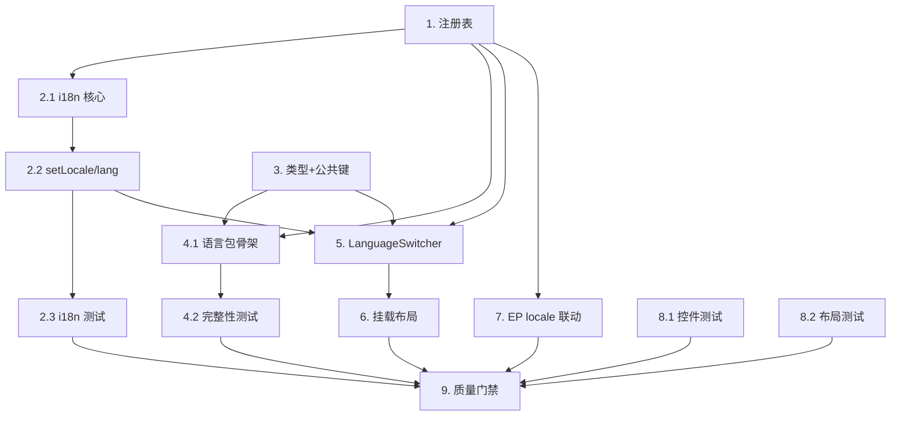

# Implementation Plan

## Overview

本计划将多语言支持从「中文 + 英文」扩展为 7 种语言，并在主布局 header 挂载语言切换控件。实现以「受支持语言注册表（单一数据源）」为核心：先建注册表，再泛化 i18n 模块，随后扩展类型与生成语言包，最后改造切换控件、挂载到布局、联动 Element Plus，并以测试与质量门禁收尾。任务按依赖顺序编排，每步均可独立验证。

## Tasks

- [x] 1. 建立受支持语言注册表（单一数据源）
  - 新建 `src/frontend/src/i18n/locales/registry.ts`
  - 定义 `LocaleCode` 联合类型与 `LocaleEntry` 接口（code/label/messages/elementLocale）
  - 静态 import 7 个语言包与 7 个 Element Plus locale 模块（zh-cn/en/ja/de/fr/it/ru.mjs）
  - 按需求顺序导出 `LOCALE_ENTRIES`（en-US,zh-CN,ja-JP,de-DE,fr-FR,it-IT,ru-RU），并派生 `SUPPORTED_LOCALES`、`DEFAULT_LOCALE`
  - 实现 `isSupportedLocale()` 类型守卫、`getEntry()` 查表函数
  - 在本族标签处保留 `i18n-ignore` 注释
  - _Requirements: 2.1, 2.2, 2.3, 7.1, 11.3_

- [x] 2. 改造 i18n 模块以从注册表派生
- [x] 2.1 重写 `src/frontend/src/i18n/index.ts` 核心逻辑
  - `buildMessages()` 从 `LOCALE_ENTRIES` 生成 messages 映射
  - `inferFromBrowser()` 按语言子标签（连字符前部分）不区分大小写匹配，无匹配回退 `DEFAULT_LOCALE`
  - 重写 `getStoredLocale()`：读 `localStorage`，非法/缺失/读取异常回退浏览器推断
  - `createI18n({ legacy:false, locale, fallbackLocale: DEFAULT_LOCALE, messages })`
  - _Requirements: 4.5, 5.1, 5.2, 5.3, 6.1, 7.1, 7.2, 7.6_

- [x] 2.2 实现 `setLocale`、`getLocale`、`getLocaleLabel` 与 `<html lang>` 同步
  - 定义 `SetLocaleResult` 接口（ok/reason）
  - `setLocale()`：非法返回 `{ok:false,reason:'unsupported'}` 不改任何状态；合法则更新 `i18n.global.locale`、调用 `applyHtmlLang`、try/catch 写 `localStorage`，写入失败返回 `reason:'persist-failed'`
  - `applyHtmlLang()` 设置 `document.documentElement.lang` 为完整 BCP 47 代码；初始化时调用一次
  - `getLocale()` 返回当前语言；`getLocaleLabel()` 未知代码返回原值
  - _Requirements: 3.1, 3.4, 4.1, 4.2, 7.2, 7.3, 7.4, 9.1, 9.2, 9.3, 9.4_

- [x] 2.3 为 i18n 模块编写单元测试
  - 新建 `src/frontend/src/i18n/__tests__/i18n-index.test.ts`，mock `localStorage`/`navigator`/`document`
  - 测 `getStoredLocale`：有效持久值优先、非法回退浏览器、子标签匹配、无匹配回退 en-US
  - 测 `setLocale`：合法切换并写入；非法返回 unsupported 不写入不改语言；写入抛错返回 persist-failed 但语言已切换
  - 测 `<html lang>` 在切换与初始化时为完整 BCP 47；测 `getLocaleLabel` 未知代码返回原值
  - _Requirements: 3.4, 4.1, 4.2, 4.5, 5.1, 5.2, 5.3, 7.4, 9.1, 9.2, 9.4_

- [x] 3. 扩展消息类型定义并新增公共翻译键
  - 在 `src/frontend/src/i18n/i18n.d.ts` 的 `DefineLocaleMessage` 中补充 `nav.languageSwitcher` 与 `common.localePersistFailed`
  - 在 `zh-CN.ts` 与 `en-US.ts` 两个基准语言包补全这两个新键的译文
  - _Requirements: 4.2, 8.2, 8.3, 10.1_

- [x] 4. 生成 5 个新增语言包文件
- [x] 4.1 以 en-US 为结构基准创建语言包骨架
  - 新建 `ja-JP.ts`、`de-DE.ts`、`fr-FR.ts`、`it-IT.ts`、`ru-RU.ts`，经 `localeFactory.buildLocale` 深克隆 en-US 基准
  - 复刻 en-US 的完整嵌套键结构（含步骤 3 新增键），保证键路径逐一对应、无缺失无多余
  - 翻译高可见命名空间（common/nav/auth/settings/errors/messages），其余沿用英文基准 + 运行期回退
  - _Requirements: 8.1, 8.2, 8.3, 8.4_

- [x] 4.2 编写语言包完整性单元测试
  - 新建 `src/frontend/src/i18n/__tests__/locale-completeness.test.ts`
  - 扁平化 en-US 为键路径集合作为基准
  - 断言 zh-CN 及 5 个新语言包键路径集合与基准完全相等；所有叶子值为去空白后非空字符串
  - _Requirements: 8.2, 8.3, 8.5_

- [x] 5. 改造 LanguageSwitcher 组件
  - 修改 `src/frontend/src/components/LanguageSwitcher.vue`
  - 下拉项改为 `v-for` 遍历 `LOCALE_ENTRIES`，移除内部硬编码语言数组
  - 触发元素由 `<span>` 改为 `<button type="button">`，添加 `:aria-label="t('nav.languageSwitcher')"`
  - `handleChange`：相同语言短路 return；调用 `setLocale`，`persist-failed` 时 `ElMessage.warning(t('common.localePersistFailed'))`
  - scoped 样式新增 `:focus-visible` 焦点轮廓，复用与 ThemeSwitcher 一致的尺寸/间距/圆角/颜色变量；保留本族标签 `i18n-ignore` 注释
  - _Requirements: 2.2, 2.3, 2.4, 3.1, 3.3, 4.2, 7.7, 10.1, 10.2, 10.3, 10.4, 11.1, 11.3, 11.5_

- [x] 6. 在主布局挂载语言切换控件
  - 修改 `src/frontend/src/components/common/AppLayout.vue`
  - import 并在 header 右侧操作区 `<ThemeSwitcher />` 之后、用户 `el-dropdown` 之前插入 `<LanguageSwitcher />`
  - 确认容器 `flex gap-4` 复用间距与对齐，且无移动端隐藏类（小屏仍可见）
  - _Requirements: 1.1, 1.2, 1.3, 1.4, 1.5_

- [x] 7. Element Plus locale 与当前语言联动
  - 修改 `src/frontend/src/App.vue`
  - `elementLocale` computed 改为：合法则 `getEntry(locale).elementLocale`，否则 `getEntry(DEFAULT_LOCALE).elementLocale`
  - 在 `src/frontend/src/types/element-plus-locale.d.ts` 补充 `ja/de/fr/it/ru.mjs` 模块类型声明
  - _Requirements: 7.7_

- [x] 8. 组件与布局测试
- [x] 8.1 LanguageSwitcher 单元测试
  - 新建 `src/frontend/src/components/__tests__/LanguageSwitcher.test.ts`
  - 测下拉项数量为 7 且顺序正确；当前语言项含 `is-active` 且仅 1 项
  - 测选择不同语言调用 `setLocale`、相同语言不调用；触发元素含非空 `aria-label`；persist-failed 触发 warning
  - _Requirements: 2.2, 2.4, 3.3, 4.2, 10.1_

- [x] 8.2 AppLayout header 顺序测试
  - 在现有 AppLayout 测试中（或新增）断言 header 右侧操作区 DOM 顺序为 ThemeSwitcher → LanguageSwitcher → 用户下拉
  - _Requirements: 1.2_

- [x] 9. 质量门禁与回归（采用作用域化验证，避免全仓 lint/test 的长耗时）
  - `vue-tsc --noEmit` 全量类型检查通过（0 错误）
  - 对改动文件作用域化运行 `eslint <files>`，0 错误 0 警告（全仓 `npm run lint` 的报错均为既有文件，与本特性无关）
  - 作用域化运行受影响测试（i18n、LanguageSwitcher、AppLayout、App）：58 用例全部通过，无新增失败
  - 备注：迭代期应使用作用域化命令（`eslint <files>` / `vitest run <files>` / IDE 诊断），避免全仓 `npm run lint`、`npm run typecheck`、`npm run test` 的 O(仓库规模) 长耗时
  - _Requirements: 3.2, 6.2, 6.3, 6.4, 8.4, 11.2, 11.6_

## Task Dependency Graph



并行执行波次（wave）定义：

```json
{
  "waves": [
    { "wave": 1, "tasks": ["1", "3"] },
    { "wave": 2, "tasks": ["2.1", "4.1"] },
    { "wave": 3, "tasks": ["2.2", "4.2", "7"] },
    { "wave": 4, "tasks": ["2.3", "5"] },
    { "wave": 5, "tasks": ["6", "8.1"] },
    { "wave": 6, "tasks": ["8.2"] },
    { "wave": 7, "tasks": ["9"] }
  ]
}
```

## Notes

- 实现遵循 AGENTS.md 前端约定：`<script setup lang="ts">`、scoped 样式、Composition API；服务层风格不适用（纯前端特性）。
- 任务 4.1 是最大工作量项：`en-US.ts`/`zh-CN.ts` 各约 2900+ 行键值，5 个新语言包需全量覆盖。首版译文可借助机器翻译生成，关键导航/按钮/提示人工校正；缺失项由 `fallbackLocale: 'en-US'` 运行期兜底，任务 4.2 的完整性测试在 CI 层拦截结构漂移。
- 不破坏现有 `__tests__/setup.ts` 中以 zh-CN 为基准的 vue-i18n mock（任务 9 验证）。
- 本特性不改后端、不做服务端语言持久化、不做日期/数字深度区域格式化（沿用 Element Plus locale 默认）。
