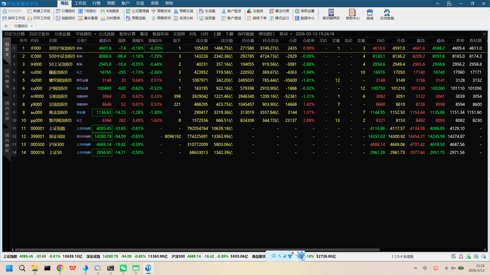
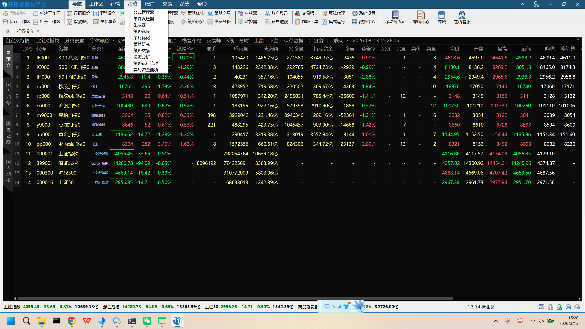
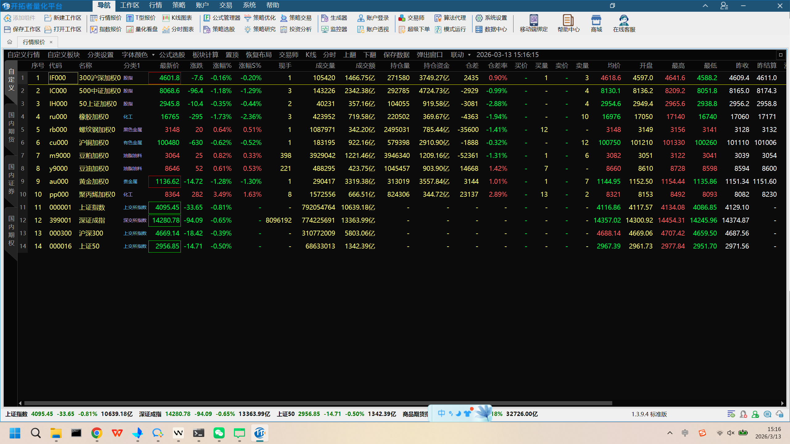
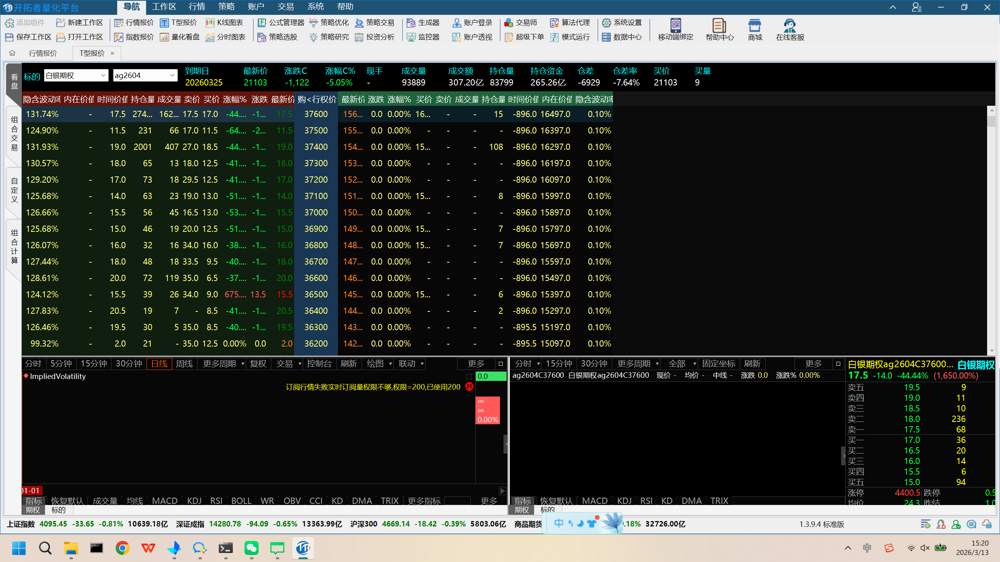
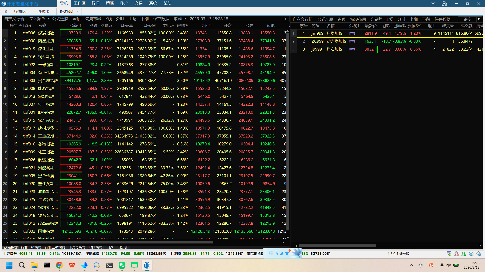
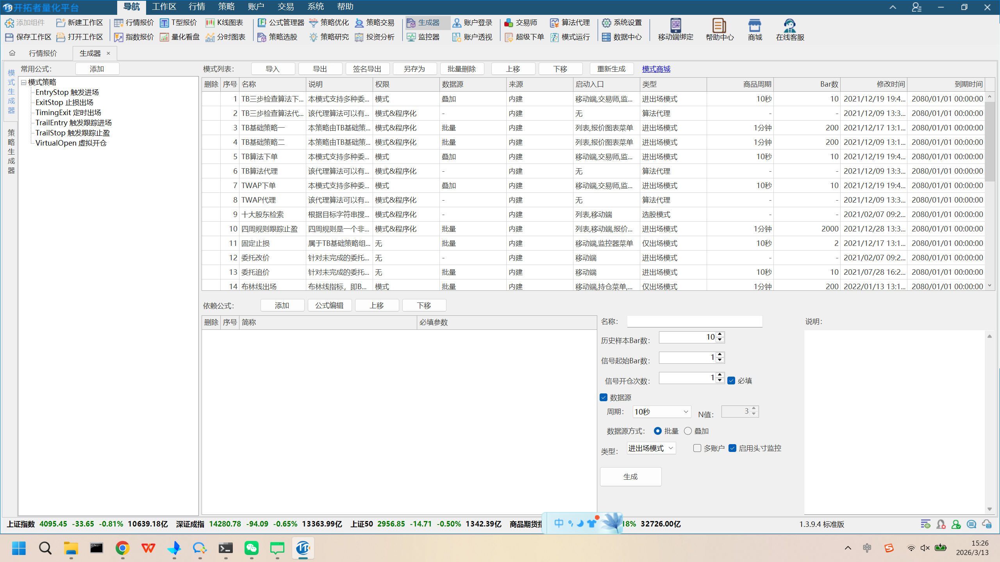
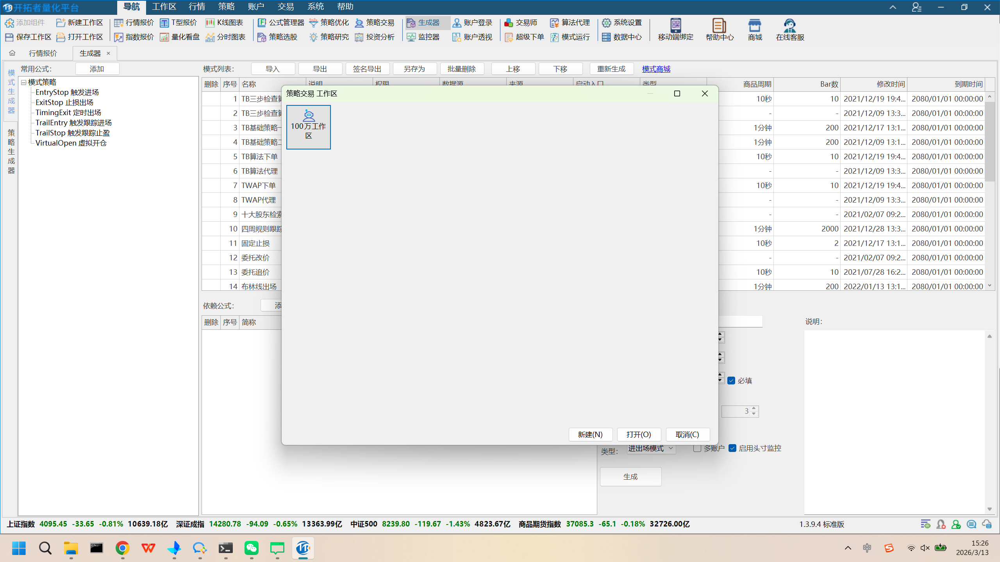

# TBQuant3 界面截图与功能分析

> 基于 TBQuant3 (v1.3.9.4) 实际运行界面截图的详细分析
> 分析日期: 2026-03-13
> 截图保存目录: `docs/tbquant_screenshots/`

---

## 一、整体界面结构

### 截图: 主界面 (行情报价)



### 1.1 顶部菜单栏

TBQuant3 采用 **菜单栏 + 双行工具栏 + Tab页** 三层顶部结构：

```
┌─────────────────────────────────────────────────────────────────────┐
│ [Logo] 开拓者量化平台  导航 工作区 行情 策略 账户 交易 系统 帮助      │ ← 菜单栏
├─────────────────────────────────────────────────────────────────────┤
│ 添加组件│新建工作区│行情报价│T型报价│K线图表│公式管理器│策略优化│    │ ← 工具栏1
│ 策略交易│生成器│账户登录│交易师│算法代理│系统设置                     │
├─────────────────────────────────────────────────────────────────────┤
│ 保存工作区│打开工作区│指数报价│量化看盘│分时图表│策略选股│策略研究│  │ ← 工具栏2
│ 投资分析│监控器│账户通讯│超级下单│模式运行│数据中心│移动端绑定│帮助│
├─────────────────────────────────────────────────────────────────────┤
│ [行情报价 x] [生成器 x] [指数报价 x]                                │ ← Tab标签页
└─────────────────────────────────────────────────────────────────────┘
```

### 1.2 菜单栏下拉菜单详情

#### 工作区菜单 (截图: 16_formula_manager.png)

| 菜单项 | 功能说明 |
|-------|---------|
| **打开** | 打开已保存的工作区布局 |
| **新建** | 创建新工作区 |
| **管理** | 管理已有工作区 |
| **添加组件** | 向当前工作区添加功能组件 |
| **已打开** | 查看当前已打开的工作区列表 |

#### 策略菜单 (截图: 17_strategy_trading.png)



| 菜单项 | 功能说明 | backtrader_web 对应 |
|-------|---------|-------------------|
| **公式管理器** | 管理所有公式/策略代码 | 策略编辑页 |
| **事件发送器** | 事件驱动策略触发 | 无 |
| **生成器** | 模式策略生成工具 | 无 |
| **策略选股** | 基于策略的选股功能 | 无 |
| **策略优化** | 参数优化引擎 | 参数优化页 |
| **策略研究** | 回测与策略研究 | 回测页 |
| **策略交易** | 实盘策略交易 | 实盘交易页 |
| **投资分析** | 投资组合分析 | 无 |
| **模式运行管理** | 策略运行监控管理 | 无 |
| **实时资金曲线** | 策略资金实时曲线 | 无 |

### 1.3 左侧分类导航

主界面左侧有垂直分类标签(从上到下)：

| 标签 | 说明 |
|-----|------|
| **自定义** | 用户自定义板块 |
| **国内期货** | 国内期货品种 |
| **国内证券** | A股证券 |

### 1.4 底部状态栏

实时滚动显示主要指数数据：
- 上证指数、深证成指、沪深300、上证50
- 商品期货指数
- 软件版本号 (1.3.9.4)

---

## 二、行情报价视图

### 截图: 行情报价主界面



### 2.1 数据表格

行情报价以表格形式展示，包含以下列：

| 列名 | 说明 |
|-----|------|
| 序号 | 品种编号 |
| 代码 | 合约代码 (IF000, IC000, IH000...) |
| 名称 | 品种名称 (300沪深加权, 500中证加权...) |
| 分类1 | 所属分类 (期货, 上交所指数...) |
| 最新价 | 当前价格 (绿色=下跌, 红色=上涨) |
| 涨跌 | 涨跌值 |
| 涨幅% | 涨跌幅百分比 |
| 涨幅S% | 涨幅比 |
| 现手 | 当前成交手数 |
| 成交量/成交额 | 当日成交量和金额 |
| 持仓量/持仓资金 | 持仓量和持仓资金 |
| 仓差/仓差率 | 持仓变化 |
| 买价/卖价/买量/卖量 | 买卖盘口数据 |
| 均价/开盘/最高/最低 | 价格统计 |
| 昨收/昨结算 | 昨日数据 |

### 2.2 数据区上方工具栏

```
自定义行情 | 自定义板块 | 分类设置 | 字体颜色 | 公式选股 | 板块计算 |
置顶 | 恢复布局 | 交易师 | K线 | 分时 | 上翻 | 下翻 |
保存数据 | 弹出窗口 | 联动 | 当前时间
```

### 2.3 配色方案

- **背景**: 深黑色 (#1A1A2E 或类似)
- **上涨**: 红色 (中国股市惯例)
- **下跌**: 绿色
- **选中行**: 深蓝色高亮
- **文字**: 白色/浅灰色
- **表头**: 深灰背景 + 浅色文字

---

## 三、T型报价视图 (期权链)

### 截图: T型报价



### 3.1 布局结构

```
┌───────────────────────┬───────────────────────────────────┬──────────┐
│    看涨期权数据        │    看跌期权数据                    │ 个股详情  │
│ (隐含波动率,内在价值,  │ (最新价,涨跌,涨幅,成交量...)      │          │
│  时间价值,持仓量...)   │                                   │ 买五/卖五 │
├───────────────────────┴───────────────────────────────────┤ 盘口数据  │
│  K线图区域                                                │          │
│  [分时|5分钟|15分钟|30分钟|日线|周线|更多周期]             │          │
│  [复权|交易|控制台|刷新|绘图|联动]                        │          │
├───────────────────────────────────────────────────────────┤          │
│  技术指标: ImpliedVolatility                              │          │
│  [指标|恢复默认|成交量|均线|MACD|KDJ|RSI|BOLL|WR|        │          │
│   OBV|CCI|KD|DMA|TRIX|更多指标]                          │          │
│  [期权|标的]                                              │          │
└───────────────────────────────────────────────────────────┴──────────┘
```

### 3.2 关键特性

- **期权链展示**: 看涨/看跌对称展示，中间为行权价
- **K线时间周期切换**: 支持分时、5/15/30分钟、日线、周线等
- **内置技术指标**: MACD, KDJ, RSI, BOLL, WR, OBV, CCI, KD, DMA, TRIX
- **隐含波动率**: 直接在期权链中显示 ImpliedVolatility
- **盘口数据**: 右侧面板显示买五/卖五深度数据

---

## 四、指数报价视图

### 截图: 指数报价



### 4.1 布局

- **左侧主表格**: 显示各类指数数据(煤炭指数, 商品期货指数, 煤化工期指, 钢铁期货指数 等)
- **右侧副表格**: 显示关联品种实时行情 (焦煤加权, 动力煤加权, 焦炭加权)
- **底部分类标签**: 商品指数 | 行业一级指数 | 行业二级指数 | 证监会分类 | 地区指数 | 指数 | 自选 | 自定义

### 4.2 数据列

主表格列包含: 序号, 代码, 名称, 最新价, 涨跌, 涨幅%, 成交量, 成交额, 换手比%, 震幅%, 均价, 开盘, 最高, 最低 等

---

## 五、生成器视图 (策略生成)

### 截图: 生成器界面



### 5.1 三栏布局

```
┌──────────────────┬──────────────────────────────┬────────────────────┐
│  左侧: 模式策略   │  中间: 公式列表                │ 右侧: 参数设置     │
│                  │                               │                    │
│ 模式策略          │ # | 名称         | 说明 | ... │ 名称: [____]       │
│ ├ EntryStop      │ 1  TB三步检查算法              │ 说明: [____]       │
│ ├ ExitStop       │ 2  TB三步检查算法              │                    │
│ ├ TimingExit     │ 3  TB基础策略                  │ 历史样本Bar数: [10]│
│ ├ TrailEntry     │ 4  TB基础策略                  │ 信号起始Bar数: [1] │
│ ├ TrailStop      │ 5  TB算法下单                  │ 信号开仓次数: [1]  │
│ └ VirtualOpen    │ 6  TB算法代理                  │                    │
│                  │ 7  TWAP下单                    │ 数据源: [勾选]     │
│  常用公式: [添加] │ 8  TWAP代理                    │ 周期: [10秒]       │
│                  │ 9  十大股东检索                 │ N值: [3]           │
│  [公式|生成|策略] │ 10 四周规则跟踪止盈            │ 数据源方式: 批量   │
│  [基础|生成器]   │ 11 固定止损                    │ 类型: 进出场模式   │
│                  │ 12 委托改价                    │                    │
│                  │ 13 委托追价                    │ [多账户] [头寸监控] │
│                  │ 14 布林线出场                  │                    │
│                  │                               │ [生成]              │
│                  ├──────────────────────────────┤                    │
│                  │ 依赖公式: [添加][公式编辑]    │                    │
│                  │          [上移][下移]         │                    │
│                  ├──────────────────────────────┤                    │
│                  │ 删除 | 序号 | 简称            │                    │
│                  │ (公式依赖关系表)              │                    │
└──────────────────┴──────────────────────────────┴────────────────────┘
```

### 5.2 功能特性

- **模式策略树**: 预设进出场策略模式 (EntryStop, ExitStop, TimingExit, TrailEntry, TrailStop, VirtualOpen)
- **公式列表管理**: 支持导入/导出、签名导出、批量操作、上移/下移排序
- **参数配置**: 每个策略支持配置历史样本数、信号起始Bar数、信号开仓次数等
- **数据源设置**: 支持批量/叠加模式，可配置周期和N值
- **公式依赖管理**: 显示公式间的依赖关系，支持编辑和排序
- **模式商城**: 提供模式策略市场 (右上角 "模式商城" 链接)

### 5.3 顶部工具栏 (生成器专属)

```
常用公式: [添加]  | 模式列表: [导入] [导出] [签名导出] [另存为] [批量删除] [上移] [下移] | [重新生成] [模式商城]
```

---

## 六、策略交易工作区

### 截图: 策略交易工作区选择



### 6.1 工作区管理

- TBQuant 使用 **工作区** 概念来管理不同的界面布局
- 策略交易和K线都有独立的工作区
- 工作区支持: 新建(N), 打开(O), 取消(C)
- 示例工作区: "100万工作区"

---

## 七、工具栏按钮功能总结

### 7.1 工具栏第一行 (快速功能入口)

| 按钮 | 功能 | backtrader_web 对应 | 优先级 |
|-----|------|-------------------|-------|
| 添加组件 | 向工作区添加组件面板 | 无 | 低 |
| 新建工作区 | 创建新的布局工作区 | 无 | 低 |
| **行情报价** | 行情数据表格视图 | Dashboard | 已有 |
| **T型报价** | 期权T型报价视图 | 无 | 低 |
| **K线图表** | K线图表视图 | K线图组件 | 已有(部分) |
| **公式管理器** | 策略代码管理和编辑 | 策略编辑页 | 已有(部分) |
| **策略优化** | 参数优化引擎 | 参数优化页 | 已有(部分) |
| **策略交易** | 实盘策略执行 | 实盘交易页 | 已有(部分) |
| 生成器 | 模式策略生成 | 无 | 中 |
| 账户登录 | 交易账户登录 | 无 | 中 |
| 交易师 | 手动交易工具 | 无 | 低 |
| 算法代理 | 算法交易代理 | 无 | 低 |
| **系统设置** | 系统参数配置 | 设置页 | 已有 |

### 7.2 工具栏第二行 (辅助功能)

| 按钮 | 功能 | backtrader_web 对应 | 优先级 |
|-----|------|-------------------|-------|
| 保存/打开工作区 | 工作区管理 | 无 | 低 |
| **指数报价** | 指数行情视图 | 无 | 中 |
| **量化看盘** | 量化分析看盘 | 无 | 中 |
| 分时图表 | 分时走势图 | 无 | 低 |
| **策略选股** | 基于策略选股 | 无 | 中 |
| **策略研究** | 策略回测研究 | 回测页 | 已有 |
| **投资分析** | 投资组合分析 | 无 | 中 |
| **监控器** | 策略运行监控 | 无 | 高 |
| 账户通讯 | 账户通讯管理 | 无 | 低 |
| 超级下单 | 快捷下单面板 | 无 | 低 |
| **模式运行** | 策略模式运行 | 无 | 高 |
| **数据中心** | 数据管理中心 | 数据管理页 | 已有(部分) |
| 移动端绑定 | 手机端绑定 | 无 | 低 |
| 帮助中心 | 在线帮助 | 无 | 低 |

---

## 八、backtrader_web 改进建议 (基于实际截图分析)

### 8.1 高优先级 - 缺失的核心功能

| 功能 | TBQuant3 实现 | backtrader_web 现状 | 建议 |
|-----|-------------|-------------------|------|
| **监控器** | 独立监控面板，实时监控策略状态 | 缺失 | 新增策略监控Dashboard |
| **实时资金曲线** | 策略菜单独立入口，WebSocket推送 | 缺失 | WebSocket + ECharts 实时图表 |
| **模式运行管理** | 策略运行调度和管理 | 缺失 | 新增策略调度管理页面 |
| **生成器/模式策略** | 可视化策略生成器 | 缺失 | 可考虑简化版可视化策略生成 |

### 8.2 中优先级 - 界面结构优化

| 改进项 | 描述 |
|-------|------|
| **双行工具栏** | 参考TBQuant双行工具栏设计，将常用功能放在工具栏快速访问 |
| **工作区/Tab管理** | 支持多Tab页并行工作，如同时查看行情和策略 |
| **数据区工具栏** | 在数据表上方添加字体颜色、公式选股、板块计算等快捷工具 |
| **底部状态栏** | 添加实时指数数据滚动显示 |
| **左侧分类导航** | 市场品种分类标签(期货/证券/自定义) |

### 8.3 界面布局对比

**TBQuant3 布局**:
```
┌───────────────────────────────────────────────────┐
│ 菜单栏: 导航│工作区│行情│策略│账户│交易│系统│帮助  │
├───────────────────────────────────────────────────┤
│ 工具栏1: [行情报价][K线图表][公式管理器][策略交易]  │
│ 工具栏2: [策略研究][投资分析][监控器][模式运行]     │
├──┬────────────────────────────────────────────────┤
│分│  Tab1: 行情报价 │ Tab2: K线图表 │ Tab3: ...    │
│类├────────────────────────────────────────────────┤
│导│                                                │
│航│  主数据区域 (表格/图表/编辑器)                   │
│  │                                                │
├──┴────────────────────────────────────────────────┤
│ 状态栏: 上证指数 深证成指 沪深300 商品期货 版本号   │
└───────────────────────────────────────────────────┘
```

**建议 backtrader_web 优化方向**:
```
┌───────────────────────────────────────────────────┐
│ Logo  [策略] [回测] [交易] [数据] [监控]   用户设置 │
├───────────────────────────────────────────────────┤
│ 快捷: [新建策略][运行回测][策略监控][数据导入]      │
├──┬────────────────────────────────────────────────┤
│  │  [策略列表] [回测结果] [实盘监控] [...]         │
│分├────────────────────────────────────────────────┤
│类│                                                │
│  │  主内容区域 (支持多面板)                         │
│  │                                                │
├──┴────────────────────────────────────────────────┤
│ 状态: 连接状态 | 策略运行数 | 最新信号 | 时间       │
└───────────────────────────────────────────────────┘
```

### 8.4 配色方案参考

TBQuant3 实际配色 (从截图提取):

| 元素 | 颜色值 | 说明 |
|-----|-------|------|
| 主背景 | `#0D0D1A` | 极深蓝黑 |
| 工具栏背景 | `#2D2D3D` | 深灰蓝 |
| 表头背景 | `#1A1A2E` | 深蓝灰 |
| 选中行 | `#0A3050` | 深蓝色高亮 |
| 上涨文字 | `#FF3333` | 红色 |
| 下跌文字 | `#33FF33` | 绿色 |
| 平盘文字 | `#CCCCCC` | 浅灰 |
| 指数背景 | `#993333` (跌) / `#339933` (涨) | 色块标记 |
| 菜单高亮 | `#CC3333` | 红色高亮(如"导航") |
| 边框 | `#333344` | 深灰蓝边框 |

---

## 九、截图文件索引

### 核心截图

| 文件名 | 内容 |
|-------|------|
| `01_main_interface.png` | 主界面 - 行情报价视图(完整工具栏) |
| `tbquant_main.png` | 主界面 - 最大化行情报价 |
| `toolbar_detail.png` | 工具栏详细截图(可看清所有按钮) |
| `17_strategy_trading.png` | 策略菜单下拉(10个子功能) |
| `16_formula_manager.png` | 工作区菜单下拉 |

### 功能视图截图

| 文件名 | 内容 |
|-------|------|
| `08_after_dialog.png` | T型报价 - 期权链视图 + K线 + 技术指标 |
| `19_data_center.png` | 生成器 - 模式策略生成界面 |
| `25_account_menu.png` | 指数报价视图(指数+关联品种) |
| `20_pattern_run.png` | 策略交易工作区选择 |
| `23_strategy_optimize.png` | 策略选股数据视图 |

### 其他参考截图

| 文件名 | 内容 |
|-------|------|
| `06_strategy_menu.png` | T型报价 + K线工作区对话框 |
| `12_toolbar_expanded.png` | 退出确认对话框(展示完整主界面) |
| `14_strategy_menu_dropdown.png` | 精简工具栏的行情报价视图 |

---

## 十、关键发现与总结

### 10.1 TBQuant3 的核心设计理念

1. **工作区驱动**: 每个功能视图(K线、策略交易、研究)都有独立的工作区，用户可保存和切换
2. **多Tab并行**: 支持多个Tab页同时工作，可以同时查看行情和编辑策略
3. **工具栏快捷访问**: 双行工具栏提供所有核心功能的一键访问
4. **深色专业主题**: 适合长时间盯盘的暗色主题
5. **实时数据流**: 底部状态栏持续滚动显示市场实时数据

### 10.2 backtrader_web 最需要补齐的功能

1. **策略监控面板**: TBQuant3 有独立的监控器和模式运行管理
2. **实时资金曲线**: 策略菜单的独立入口，运行中实时推送
3. **工作区/多Tab**: 支持用户自定义和保存界面布局
4. **生成器**: 可视化策略生成，降低策略开发门槛
5. **深色主题**: 专业量化软件标配

---

*文档版本: 2.0*
*更新日期: 2026-03-13*
*数据来源: TBQuant3 v1.3.9.4 实际运行界面截图*
