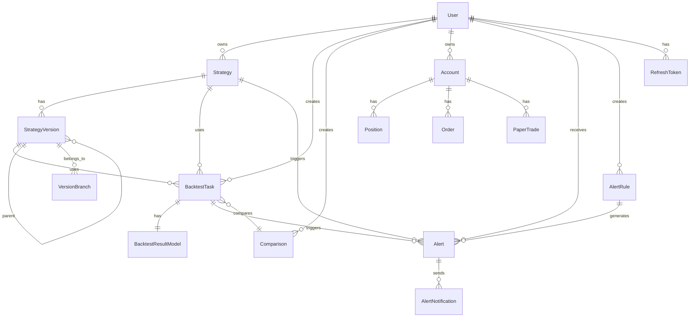

# Backtrader Web 量化交易管理平台 - 技术文档

## 目录

1. [系统功能概览](#1-系统功能概览)
2. [项目目录结构](#2-项目目录结构)
3. [技术栈](#3-技术栈)
4. [数据模型关系图](#4-数据模型关系图)
5. [API 模块详细文档](#5-api-模块详细文档)
6. [部署运维手册](#6-部署运维手册)

---

## 1. 系统功能概览

### 1.1 核心功能模块

| 模块 | 功能描述 | 状态 |
|------|---------|------|
| **策略管理** | 策略的增删改查、模板管理、分类管理 | 100% |
| **策略版本控制** | 版本创建、比较、回滚、分支管理 | 100% |
| **历史数据回测** | 基于 Backtrader 的回测引擎 | 100% |
| **参数优化** | 网格搜索优化策略参数 | 100% |
| **模拟交易** | 账户、订单、持仓、交易记录管理 | 100% |
| **实盘交易** | 实盘实例管理、启停控制 | 100% |
| **实时行情** | 实时行情订阅、WebSocket 推送 | 100% |
| **回测对比** | 多个回测结果对比分析 | 100% |
| **投资组合** | 多策略组合管理、汇总分析 | 100% |
| **监控告警** | 告警规则、告警通知、统计 | 100% |
| **用户认证** | JWT 认证、刷新令牌、密码管理 | 100% |
| **权限控制** | RBAC 角色权限管理 | 100% |

### 1.2 功能架构图

```
┌─────────────────────────────────────────────────────────────────┐
│                         前端 (Vue 3)                            │
│  策略管理 | 回测分析 | 模拟交易 | 实盘监控 | 投资组合 | 系统设置   │
└───────────────────────────┬─────────────────────────────────────┘
                            │ HTTP/WebSocket
┌───────────────────────────┴─────────────────────────────────────┐
│                      API 网关层 (FastAPI)                        │
├─────────────────────────────────────────────────────────────────┤
│ 认证中间件 │ 权限中间件 │ 限流中间件 │ 日志中间件 │ 异常处理      │
└───────────────────────────┬─────────────────────────────────────┘
                            │
┌───────────────────────────┴─────────────────────────────────────┐
│                         服务层 (Services)                        │
├──────────┬──────────┬──────────┬──────────┬──────────┬─────────┤
│Strategy  │Backtest  │Paper     │Live      │Monitor   │Data     │
│Service   │Service   │Trading   │Trading   │Service   │Service  │
└──────────┴──────────┴──────────┴──────────┴──────────┴─────────┘
                            │
┌───────────────────────────┴─────────────────────────────────────┐
│                         数据层 (Data)                            │
├────────────────────┬────────────────────┬───────────────────────┤
│   SQLite/PG/MySQL  │   Backtrader Engine │   策略模板目录        │
│   (用户/策略/回测)  │   (回测/实盘执行)   │   (100+ 策略)         │
└────────────────────┴────────────────────┴───────────────────────┘
```

---

## 2. 项目目录结构

> 📁 完整的标注源码树请参阅 **[source-tree-analysis.md](source-tree-analysis.md)**

项目采用 Multi-Part 架构：
- **`src/backend/`** — FastAPI 后端（15 个 API 模块 + 18 个 Service）
- **`src/frontend/`** — Vue 3 前端（12 个页面视图）
- **`strategies/`** — 118 个内置策略模板
- **`tests/`** — pytest 单元测试 + Playwright E2E 测试

---

## 3. 技术栈

### 3.1 后端技术栈

| 类别 | 技术 | 版本 | 说明 |
|------|------|------|------|
| Web 框架 | FastAPI | 0.109+ | 高性能异步 Web 框架 |
| ASGI 服务器 | Uvicorn | 0.27+ | 异步服务器 |
| 数据验证 | Pydantic | 2.5+ | 数据验证和序列化 |
| 配置管理 | pydantic-settings | 2.1+ | 配置管理 |
| ORM | SQLAlchemy | 2.0+ | Python SQL 工具包 |
| 数据库驱动 | aiosqlite/asyncpg/aiomysql | - | 异步数据库驱动 |
| 认证 | python-jose | 3.3+ | JWT 处理 |
| 密码加密 | passlib | 1.7+ | 密码哈希 |
| 日志 | loguru | 0.7+ | 日志库 |
| 回测引擎 | backtrader | 1.9.78+ | 量化回测框架 |
| 数据处理 | pandas | 2.1+ | 数据分析 |
| 数据源 | akshare | 1.12+ | A股数据 |
| 测试 | pytest | 8.0+ | 测试框架 |
| 限流 | slowapi | - | API 限流 |

### 3.2 前端技术栈

| 类别 | 技术 | 版本 | 说明 |
|------|------|------|------|
| 框架 | Vue | 3.4+ | 渐进式框架 |
| 语言 | TypeScript | 5+ | 类型安全 |
| 构建工具 | Vite | 5+ | 下一代前端构建工具 |
| UI 组件 | Element Plus | - | Vue 3 组件库 |
| 图表 | ECharts | - | 数据可视化 |
| 状态管理 | Pinia | - | Vue 状态管理 |
| 路由 | Vue Router | 4+ | 路由管理 |

---

## 4. 数据模型关系图

### 4.1 ER 图（Mermaid）



### 4.2 核心数据表

#### 用户表 (users)

| 字段 | 类型 | 说明 | 约束 |
|------|------|------|------|
| id | String(36) | 用户唯一标识 | PK |
| username | String(50) | 用户名 | UNIQUE, NOT NULL |
| email | String(100) | 邮箱 | UNIQUE, NOT NULL |
| hashed_password | String(128) | 哈希密码 | NOT NULL |
| is_active | Boolean | 是否激活 | DEFAULT TRUE |
| created_at | DateTime | 创建时间 | |
| updated_at | DateTime | 更新时间 | |

#### 策略表 (strategies)

| 字段 | 类型 | 说明 | 约束 |
|------|------|------|------|
| id | String(36) | 策略唯一标识 | PK |
| user_id | String(36) | 所属用户 | FK, NOT NULL |
| name | String(100) | 策略名称 | NOT NULL |
| description | Text | 策略描述 | |
| code | Text | 策略代码 | NOT NULL |
| params | JSON | 参数定义 | |
| category | String(50) | 分类 | DEFAULT "custom" |
| created_at | DateTime | 创建时间 | |
| updated_at | DateTime | 更新时间 | |

#### 回测任务表 (backtest_tasks)

| 字段 | 类型 | 说明 | 约束 |
|------|------|------|------|
| id | String(36) | 任务唯一标识 | PK |
| user_id | String(36) | 所属用户 | FK, NOT NULL |
| strategy_id | String(36) | 策略ID | |
| strategy_version_id | String(36) | 策略版本ID | FK |
| symbol | String(20) | 交易标的 | |
| status | String(20) | 任务状态 | pending/running/completed/failed/cancelled |
| request_data | JSON | 请求参数 | |
| error_message | Text | 错误信息 | |
| log_dir | Text | 日志目录 | |
| created_at | DateTime | 创建时间 | |
| updated_at | DateTime | 更新时间 | |

#### 回测结果表 (backtest_results)

| 字段 | 类型 | 说明 | 约束 |
|------|------|------|------|
| id | String(36) | 结果唯一标识 | PK |
| task_id | String(36) | 关联任务 | FK, UNIQUE |
| total_return | Float | 总收益率 | |
| annual_return | Float | 年化收益率 | |
| sharpe_ratio | Float | 夏普比率 | |
| max_drawdown | Float | 最大回撤 | |
| win_rate | Float | 胜率 | |
| metrics_source | String(20) | 指标来源 | manual/fincore |
| total_trades | Integer | 总交易次数 | |
| profitable_trades | Integer | 盈利交易数 | |
| losing_trades | Integer | 亏损交易数 | |
| equity_curve | JSON | 权益曲线 | |
| equity_dates | JSON | 权益日期 | |
| drawdown_curve | JSON | 回撤曲线 | |
| trades | JSON | 交易记录 | |
| created_at | DateTime | 创建时间 | |

#### 模拟交易账户表 (paper_trading_accounts)

| 字段 | 类型 | 说明 | 约束 |
|------|------|------|------|
| id | String(36) | 账户唯一标识 | PK |
| user_id | String(36) | 所属用户 | FK, NOT NULL |
| name | String(100) | 账户名称 | NOT NULL |
| initial_cash | Float | 初始资金 | DEFAULT 100000 |
| current_cash | Float | 当前资金 | |
| total_equity | Float | 总权益 | |
| profit_loss | Float | 盈亏金额 | |
| profit_loss_pct | Float | 盈亏比例 | |
| commission_rate | Float | 手续费率 | DEFAULT 0.001 |
| slippage_rate | Float | 滑点率 | DEFAULT 0.001 |
| is_active | Boolean | 是否激活 | DEFAULT TRUE |
| created_at | DateTime | 创建时间 | |
| updated_at | DateTime | 更新时间 | |

---

## 5. API 模块详细文档

> 📡 完整的 API 端点列表（15 个模块、80+ 端点）请参阅 **[API.md](API.md)**

本系统 API 按功能分为以下模块：

| # | 模块 | 前缀 | 端点数 |
|---|------|------|--------|
| 1 | Auth（认证） | `/auth` | 7 |
| 2 | Strategy（策略管理） | `/strategy` | 9 |
| 3 | Backtest（回测） | `/backtest` | 6 |
| 4 | Analytics（回测分析） | `/analytics` | 5 |
| 5 | Optimization（参数优化） | `/optimization` | 5 |
| 6 | Live Trading（实盘交易） | `/live-trading` | 11 |
| 7 | Portfolio（投资组合） | `/portfolio` | 5 |
| 8 | Enhanced Backtest（增强回测） | `/backtests` | 8 |
| 9 | Paper Trading（模拟交易） | `/paper-trading` | 7 |
| 10 | Comparison（策略对比） | `/comparisons` | 8 |
| 11 | Strategy Version（版本控制） | `/strategy-versions` | 11 |
| 12 | Realtime Data（实时数据） | `/realtime` | 6 |
| 13 | Monitoring（监控告警） | `/monitoring` | 13 |
| 14 | Market Data（行情数据） | `/data` | 1 |
| 15 | Crypto Trading（加密货币） | `/live-trading-crypto` | 6 |

WebSocket 端点共 6 个，覆盖回测进度、模拟账户、策略版本、实时行情、告警推送。

---

## 6. 部署运维

> 🚀 详细的部署和运维指南请参阅：
> - **[部署指南](DEPLOYMENT.md)** — 环境要求、配置清单、后端/前端部署、Nginx 配置
> - **[运维手册](OPERATIONS.md)** — 监控指标、日志管理、备份策略、健康检查
> - **[安装指南](INSTALLATION.md)** — 快速本地安装

快速启动命令：

```bash
# 后端
cd src/backend && pip install -r requirements.txt && uvicorn app.main:app --reload --port 8001

# 前端
cd src/frontend && npm install && npm run dev
```

---

## 附录

### A. 项目完成度

| 模块 | 完成度 | 测试覆盖率 |
|------|--------|------------|
| 后端架构 | 100% | 100% |
| API 路由 | 100% | 100% |
| 数据模型 | 100% | 100% |
| 服务层 | 100% | 100% |
| 前端 | 100% | - |

### B. 测试状态

```
1462+ 测试用例，100% 代码覆盖
```

### C. 许可证

MIT License

---

*文档生成日期: 2026-02-24*
*项目版本: v2.0.0*
