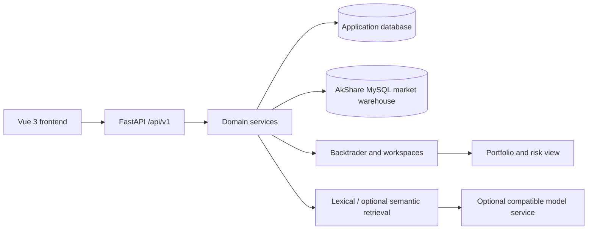

# Architecture

## Overview

## Key boundaries

| Boundary | Design |
| --- | --- |
| Frontend/backend | Vue pages call FastAPI through API clients; legacy page routes redirect to current domain entries. |
| API/services | Routes authenticate, validate, and map HTTP errors; services orchestrate domains and return expected failures predictably. |
| Application/market data | `DATABASE_URL` holds users, strategies, tasks, and workspaces; `AKSHARE_DATA_DATABASE_URL` is a separate market warehouse. |
| Local/online market data | The market page prefers the local warehouse; only an explicit query calls AkShare and failures retain local results. |
| Retrieval/models | RAG retrieves knowledge-base chunks first. Semantic vectors and generation models are optional and have readable fallback diagnostics. |
| Research/trading | Research workspaces retain hypotheses and validation; trading workspaces manage reviewed runtime units, and Portfolio aggregates only confirmable state. |
| Strategy safety | Strategy code runs in a constrained environment and may not overwrite trading methods such as `self.close()`. |

## Optional modules

Some routers depend on extras or deployment configuration. Startup registration state is available from `/api/v1/status/routers`; unavailable modules must report a diagnosable state rather than disappear silently.

## Observability and security

- JWT authenticates users; administrative configuration pages have an additional admin check.
- Logging, audit events, rate limiting, security headers, and optional OpenTelemetry are integrated at the application layer.
- Secrets, database credentials, and gateway information come only from environment variables/secrets services; errors are redacted.

See [Database and data boundaries](./database.md) for connection and persistence boundaries.
