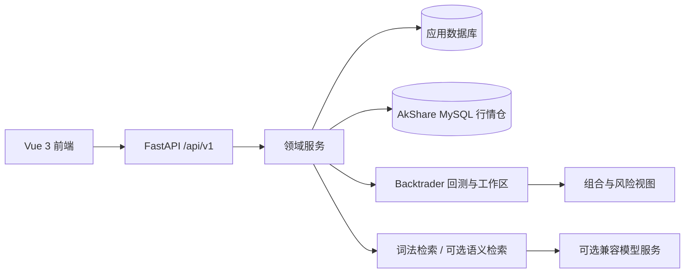

# 架构设计

## 概览

## 关键边界

| 边界 | 设计 |
| --- | --- |
| 前后端 | Vue 页面经 API 客户端访问 FastAPI；页面路由会将旧入口重定向到当前领域入口。 |
| API 与服务 | 路由负责认证、校验和 HTTP 错误；服务负责领域编排与可预期失败的返回值。 |
| 应用数据与行情数据 | `DATABASE_URL` 保存用户、策略、任务和工作区；`AKSHARE_DATA_DATABASE_URL` 是独立行情仓。 |
| 本地与在线行情 | 市场页本地仓优先；只有显式查询才请求 AkShare，并在失败时保留本地结果。 |
| 检索与模型 | RAG 先检索知识库文档块；语义向量与生成模型均可选，并提供可读降级诊断。 |
| 研究与交易 | 研究工作区保存假设与验证；交易工作区管理经审核运行单元，组合页只聚合可确认状态。 |
| 策略安全 | 策略代码在受限环境中运行，禁止覆盖 `self.close()` 等交易方法。 |

## 可选模块

部分路由依赖额外包或部署配置。启动时路由注册状态可从 `/api/v1/status/routers` 查看；不可用模块应报告可诊断状态，而不是悄然缺失。

## 可观测性与安全

- 认证使用 JWT，管理配置页另有管理员校验。
- 日志、审计、限流、安全响应头和可选 OpenTelemetry 在应用层统一接入。
- 密钥、数据库凭据和网关信息只经环境变量/密钥服务提供；错误信息应脱敏。

数据连接和持久化边界见[数据库与数据边界](./database.md)。
