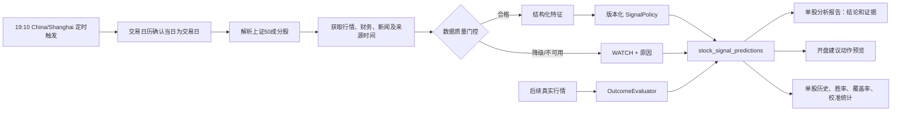

# 单股分析信号闭环与预测质量验证 Implementation Plan

> **For agentic workers:** REQUIRED SUB-SKILL: Use superpowers:subagent-driven-development (recommended) or superpowers:executing-plans to implement this plan task-by-task. Steps use checkbox (`- [ ]`) syntax for tracking.

**Goal:** 将单股分析从一次性、可能被 LLM 文本覆盖的“买入/卖出/观望”结论，升级为可复现、可追溯、可在未来行情上评分的信号系统；每天收盘后覆盖上证 50 成分股生成信号，并在单股页面展示历史预测和分项有效性。

**Architecture:** 以结构化数据和版本化确定性信号策略为唯一交易信号权威；LLM 仅解释已确定的证据和结论。夜间任务通过交易日历、上证 50 成分股清单和最新行情构造特征，经过数据质量门控后写入不可篡改的预测快照；后续独立评分器用实际下一交易日行情补齐结果并计算绩效。开盘动作只输出“建议动作”，不调用券商、模拟盘或订单接口。

**Tech Stack:** Python 3.10+、FastAPI、SQLAlchemy 2.0、Alembic、APScheduler、AkShare、pytest；Vue 3、TypeScript、Element Plus、Vitest。

## 本次实现基线与后续边界

本计划的 v1 核心已在本次迭代实现：预测/运行两张表、结构化 `BUY/SELL/WATCH` 策略、数据质量门控、前瞻收益评分、上证 50 夜间批次、只读开盘建议预览、单股历史与成绩单页面均已落地。调度器默认关闭，且只有显式配置成本与成功阈值后才允许启动。

尚未实施、也不应在本迭代验收中假定存在的能力包括：公共批次的管理员重试 API、真实/模拟账户接入、持仓写入、订单创建和成交回传。若要启用真实或模拟执行，应按第 6 节另立迭代。

## 全局约束

- 本迭代只产出研究信号、审计记录、统计和开盘建议动作；不创建订单、不读取或修改真实持仓、不连接券商或模拟盘执行接口。
- 对用户可见的信号只有 `BUY`（买入）、`SELL`（卖出）、`WATCH`（观望）三种。`WATCH` 不再被折叠为“持有”；是否持仓仅影响外部开盘建议动作。
- 预测生成时只能使用 `as_of_date` 当日收盘后可获得的数据。历史评分读取之后的真实行情，但绝不回写、重算或覆盖原始预测特征和信号。
- 数据缺失、停牌、过期或来源失败时不得用 `0`、`NEUTRAL` 或默认价格伪造特征；必须标记为降级或不可评分，并给出机器可读原因。
- 每一条预测必须同时保存数据快照哈希、特征版本、决策策略版本、模型版本、生成时间和可用时间。任何版本变化都产生一条新可审计记录。
- 定时器只是触发器；幂等、并发互斥和失败恢复由数据库中的运行记录保证。多个应用实例不能重复生成同一股票、同一日期、同一版本的预测。
- 定时任务默认关闭，启用前必须完成本计划的验收；默认运行时间为中国时区交易日 `19:10`，可通过配置调整，但不得早于收盘后数据可用的质量检查。
- 现有单股分析中的自然语言报告保留，但其最终交易标签必须来自结构化 `SignalDecision`，不得由 `analysis_engine.py` 或 `StockSignalExtractor` 的文本解析结果覆盖。

---

## 1. 现状、问题与边界

### 1.1 已确认的技术问题

当前 `src/backend/app/services/stock_analysis/pipeline.py` 用价格涨跌、财务字段和新闻词计数直接生成信号；`market_instrument.py` 尚未真正生成它所读取的 `momentum_5`、`volatility_5`、`reversal_1` 因子，缺失值会退化为 `0`。AkShare 新闻回退数据又被统一归为 `NEUTRAL/LOW`，中文新闻无法形成有效方向。随后 `analysis_engine.py` 可能让 LLM 重写最终结论，`signal.py` 还会把“观望”映射为“持有”。

这意味着当前结论既缺少可验证的特征来源，也没有版本、生成时点、未来结果和有效性统计，无法回答“过去给过什么预测、成功率是多少”。

### 1.2 本迭代的交付边界

| 在本迭代内 | 明确不在本迭代内 |
| --- | --- |
| 上证 50 夜间信号批次、单股按需信号、预测和评分表、接口、页面历史与绩效、调度与验收 | 自动下单、券商鉴权、真实/模拟持仓写入、资金和风控校验、执行成交回传 |
| 结构化因子、数据质量门控、确定性版本化策略、未来收益评分 | 声称策略已具备投资建议或稳定超额收益能力 |
| 开盘建议动作预览：空仓且 `BUY` 才建议买入；有仓且 `SELL` 才建议卖出 | 将建议动作直接转换为订单 |

### 1.3 非回填原则

本迭代上线前的旧报告没有保存当时可得的完整数据快照，因此不能将今天的数据倒灌后宣称为历史预测。页面应明确显示“可审计预测从启用日期开始”；如需研究历史策略，只能使用单独的、逐日重放且 point-in-time 数据完整的离线回测工程，不能与本表中的真实前瞻预测混合。

---

## 2. 目标架构与运行流程



### 2.1 时点定义

| 字段 | 定义 |
| --- | --- |
| `as_of_date` | 预测使用的最后一个已完成 A 股交易日。夜间 19:10 任务通常为当日；质量门控不通过时不伪造为当日。 |
| `available_at` | 预测成功持久化并可供开盘建议读取的时间。 |
| `next_trading_date` | 夜间批次生成时由交易日历得到严格晚于 `as_of_date` 的第一个交易日；按需手工分析可先为空，后续评分器再用同一日历补齐，绝不采用自然日。 |
| `entry_price` | 评分时使用 `next_trading_date` 的实际开盘价；没有开盘价则结果为 `unscorable`，不能回退为前收盘价。 |
| `horizon_1d/5d/20d` | 从实际入场日开盘价到第 1、5、20 个可交易日收盘价的前瞻收益。 |

### 2.2 开盘建议动作契约

`OpeningActionPlanner` 仅是纯函数和只读 API：输入某日已发布信号及外部传入的持仓标识，输出建议，不持有账户凭证。

| 是否持仓 | 当日信号 | 建议动作 |
| --- | --- | --- |
| 否 | `BUY` | `BUY_AT_OPEN`（建议下一交易日开盘买入） |
| 是 | `SELL` | `SELL_AT_OPEN`（建议下一交易日开盘卖出） |
| 其他任意组合 | 任意 | `NO_ACTION` |

这一定义刻意不包含加仓、反手做空、补仓、止损订单或仓位规模。后续独立的真实/模拟执行验证只能消费该只读契约，并自行承担账户、风控、成交和合规责任。

---

## 3. 数据契约与持久化设计

### 3.1 主表：`stock_signal_predictions`

该表是用户要求的“每日预测结果表”，也是所有历史展示和质量统计的唯一事实来源。使用 `owner_scope` 非空字段而不是可空用户 ID 参与唯一约束：夜间公共批次使用 `system`，按需手工分析使用 `user:<uuid>`，从而在 SQLite、MySQL、PostgreSQL 上保持一致的幂等语义。

| 字段组 | 字段 | 约束与用途 |
| --- | --- | --- |
| 主键与范围 | `id`, `run_id`, `owner_scope`, `source`, `universe_code`, `symbol`, `symbol_name`, `market_type` | `source` 为 `nightly_sse50` 或 `manual`；公共结果与个人手工结果隔离。 |
| 时点 | `as_of_date`, `as_of_at`, `available_at`, `next_trading_date`, `created_at`, `updated_at` | 统一保存中国时区语义；UTC 存储时由 DTO 明确转换。 |
| 预测 | `signal_action`, `confidence_score`, `buy_probability`, `sell_probability`, `watch_probability`, `expected_excess_return`, `risk_score` | `signal_action` 仅允许 `BUY/SELL/WATCH`；概率缺失必须为 `NULL` 而不是伪造数值。 |
| 可复现性 | `feature_version`, `decision_policy_version`, `model_version`, `feature_snapshot_json`, `policy_snapshot_json`, `source_snapshot_hash` | JSON 保存标准化输入、衍生特征、阈值和来源时间；哈希用于发现同版本同输入冲突。 |
| 数据质量 | `eligibility_status`, `quality_reasons_json`, `data_freshness_json` | 状态仅为 `eligible/degraded/rejected`；降级信号必须是 `WATCH`。 |
| 结果 | `outcome_status`, `entry_date`, `entry_price`, `horizon_1d_return`, `horizon_5d_return`, `horizon_20d_return`, `benchmark_1d_return`, `benchmark_5d_return`, `benchmark_20d_return`, `excess_1d_return`, `excess_5d_return`, `excess_20d_return`, `buy_is_correct_20d`, `sell_is_correct_20d`, `scored_at` | 只由评分器填充；初始为 `pending`，没有完整市场数据时为 `unscorable`，不得把未知算为失败或成功。 |
| 幂等 | `prediction_key` | `SHA-256(source|owner_scope|universe_code|symbol|as_of_date|feature_version|decision_policy_version|model_version)`，建立唯一索引。 |

必须建立以下查询索引：`(symbol, as_of_date)`、`(owner_scope, symbol, as_of_date)`、`(universe_code, as_of_date)`、`(outcome_status, next_trading_date)`、`(run_id)` 和唯一的 `prediction_key`。JSON 字段不得作为筛选条件；需要筛选的维度必须独立列化。

### 3.2 运行表：`stock_signal_runs`

主表不能替代批次审计和分布式互斥，因此新增运行表。字段包括 `id`、`run_key`（唯一）、`owner_scope`、`source`、`universe_code`、`as_of_date`、`scheduled_for_at`、`started_at`、`finished_at`、`status`、`expected_count`、`created_count`、`eligible_count`、`degraded_count`、`failed_count`、`config_snapshot_json`、`error_summary_json` 与时间戳。`run_key` 为 `nightly_sse50|system|as_of_date|feature_version|decision_policy_version|model_version` 的哈希。

任务开始时用数据库唯一约束领取运行记录；同一 `run_key` 的已完成运行直接返回统计，运行中的记录拒绝重复领取，失败记录只能通过显式的“同版本重试”状态转换继续，不能静默删除。

### 3.3 结果判定口径

默认展示 20 个交易日口径，同时提供 1 日、5 日、20 日明细。成本和边际阈值从每条预测保存的 `policy_snapshot_json` 读取，不能使用后来修改的全局配置重算旧胜率。

- `BUY` 成功：从下一交易日开盘持有至第 20 个交易日收盘的净收益，高于该预测快照中的 `buy_success_threshold_bps`；同时展示相对上证 50 的超额收益，方便区分市场 beta 与个股方向。
- `SELL` 成功：若继续持有该股票，从下一交易日开盘至第 20 个交易日收盘的净收益低于 `-sell_success_threshold_bps`。这是“规避下跌”的正确性，不把卖出错误地当作做空收益。
- `WATCH` 不进入“交易信号胜率”的分母；展示其覆盖率、可评分率和后续绝对/超额收益分布，避免用观望大量堆高表面准确率。
- `actioned_success_rate = (BUY 成功数 + SELL 成功数) / (BUY 可评分数 + SELL 可评分数)`，始终与按动作拆分的样本数一起显示；分母为零时返回 `null` 和“样本不足”，绝不返回 `0%`。

策略配置必须显式提供 `round_trip_cost_bps`、`buy_success_threshold_bps`、`sell_success_threshold_bps`。生产定时任务在配置未被完整设置时保持禁用；测试夹具固定为可重复的数值，避免将未批准的交易成本伪装为生产假设。

---

## 4. 代码结构与对外接口

### 4.1 新增和修改文件

```text
src/backend/
├── alembic/versions/20260801_stock_signal_predictions.py
├── app/models/stock_signal.py
├── app/schemas/stock_signal.py
├── app/services/stock_signal/
│   ├── __init__.py
│   ├── batch.py
│   ├── calendar.py
│   ├── decision_policy.py
│   ├── features.py
│   ├── outcomes.py
│   ├── performance.py
│   ├── quality.py
│   ├── scheduler.py
│   ├── service.py
│   ├── types.py
│   └── universe.py
├── app/startup/stock_signal.py
├── app/api/stock_analysis.py                         # 增加 signals 子资源
├── app/config.py
├── app/models/__init__.py
├── app/services/stock_analysis/pipeline.py
├── app/services/stock_analysis/signal.py
└── app/services/stock_analysis/report_builder.py

src/frontend/src/
├── api/stockAnalysis.ts
├── views/StockAnalysisPage.vue
├── components/stock-analysis/SignalHistoryPanel.vue
├── components/stock-analysis/SignalQualityPanel.vue
└── i18n/locales/{zh-CN,en-US}.ts
```

新服务不能将夜间 50 只股票依次送入完整 LLM 分析链路。批量信号只调用结构化收集器、特征和策略；LLM 解释仅在用户打开或主动请求单股报告时使用，并且只能引用已经持久化的 `SignalDecision`。

### 4.2 API 合同

| 方法与路径 | 权限与行为 |
| --- | --- |
| `GET /api/v1/stock-analysis/signals` | 已登录用户；读取 `system` 公共批次和当前用户自己的 `manual` 记录，支持 `symbol`、`source`、`limit`、`cursor`。 |
| `GET /api/v1/stock-analysis/signals/summary` | 已登录用户；按单股、信号动作和期限返回样本数、可评分数、胜率、平均/中位净收益、平均超额收益、覆盖率、校准分箱和最新数据质量状态。 |
| `GET /api/v1/stock-analysis/signals/runs/latest` | 已登录用户；只读最新公共批次状态、成分股覆盖数、失败与降级数量。 |
| `POST /api/v1/stock-analysis/signals/opening-actions/preview` | 已登录用户；传入只读 `held_symbols`，返回上节动作矩阵结果及对应预测 ID，不接收账户凭据、不保存持仓，也不创建订单。 |

接口响应必须返回 `signal_action`、中文显示名、`confidence_score`、`eligibility_status`、`quality_reasons`、版本号、结果成熟状态和预测 ID。不得返回来自其他用户 `owner_scope` 的手工分析数据。

### 4.3 配置合同

在 `app/config.py` 增加带类型和范围校验的配置：

```text
STOCK_SIGNAL_SCHEDULE_ENABLED=false
STOCK_SIGNAL_SCHEDULE_TIMEZONE=Asia/Shanghai
STOCK_SIGNAL_SCHEDULE_CRON=10 19 * * 1-5
STOCK_SIGNAL_UNIVERSE=sse50
STOCK_SIGNAL_MAX_CONCURRENCY=4
STOCK_SIGNAL_MIN_HISTORY_BARS=60
STOCK_SIGNAL_MAX_FINANCIAL_AGE_DAYS=210
STOCK_SIGNAL_MAX_NEWS_AGE_DAYS=7
STOCK_SIGNAL_ROUND_TRIP_COST_BPS=<显式部署配置>
STOCK_SIGNAL_BUY_SUCCESS_THRESHOLD_BPS=<显式部署配置>
STOCK_SIGNAL_SELL_SUCCESS_THRESHOLD_BPS=<显式部署配置>
```

启用定时器前验证数值配置完整、AkShare 数据能力可用且当前进程具备数据库迁移后的表结构；任一条件不满足则记录健康告警并不启动任务。

---

## 5. 实施任务

### 任务 1：建立不可变预测与运行审计存储

**涉及文件：** `src/backend/app/models/stock_signal.py`、`src/backend/app/models/__init__.py`、`src/backend/app/schemas/stock_signal.py`、`src/backend/alembic/versions/20260801_stock_signal_predictions.py`、`src/backend/tests/test_stock_signal_service.py`。

- [ ] 新建 `StockSignalRun` 和 `StockSignalPrediction` SQLAlchemy 模型，使用 Python `Enum` 或受控字符串枚举约束运行状态、信号动作、数据资格和结果状态。
- [ ] 为预测模型实现 `prediction_key`、运行模型实现 `run_key`，并用数据库唯一约束而非“先查询后插入”保障幂等。
- [ ] 在 Alembic 迁移中创建两张表、外键和所有第 3 节规定的索引；沿用现有 schema-aware 迁移方式，保证已有 SQLite/MySQL 数据库和新库均可安全升级。
- [ ] 将模型显式导入 `app/models/__init__.py`，确保 Alembic metadata 与测试数据库加载它们。
- [ ] 写出 Pydantic 请求/响应 DTO，不把原始 JSON 快照暴露为不可控的任意对象；为 JSON 字段定义最小可验证结构。
- [ ] 编写模型测试：枚举非法值被拒绝、相同 `prediction_key` 违反唯一性、不同策略版本可共存、`system` 与用户范围隔离、迁移 upgrade/downgrade 在测试数据库可运行。

运行：

```bash
cd src/backend && /Users/yunjinqi/opt/anaconda3/bin/conda run -n base pytest -q tests/test_stock_signal_service.py
cd src/backend && /Users/yunjinqi/opt/anaconda3/bin/conda run -n base alembic upgrade head
```

### 任务 2：实现交易日、上证 50、数据质量和真实特征层

**涉及文件：** `src/backend/app/services/stock_signal/calendar.py`、`universe.py`、`features.py`、`quality.py`、`types.py`、`src/backend/tests/test_stock_signal_calendar.py`、`test_stock_signal_universe.py`、`test_stock_signal_features.py`。

- [ ] 用 AkShare 交易日历建立 `TradingCalendar`，缓存日历但按日期边界刷新；实现 `is_trading_day()`、`next_trading_day()`，并在网络失败时返回明确的不可用状态而非自然日推断。
- [ ] 用中证指数官方成分数据接口解析 `000016`（上证 50）成分股，保存本批次成分清单和获取时间；去重、规范化 `symbol`，并对非 50 个或代码不合法的结果标记运行降级。
- [ ] 从已经标准化的 OHLCV 生成真实的 `return_1/5/20/60`、均线偏离、`RSI(14)`、`ATR(14)`、20 日实现波动率、成交量 z-score 和价格区间；每个特征保留观测期、缺失状态和计算来源。
- [ ] 删除或替换“未知因子返回 0”的调用路径；`_latest_factor` 如仍供旧报告使用，必须返回 `None` 和缺失原因，而不是将缺失伪装为中性。
- [ ] 建立 `DataQualityGate`：最近行情必须等于 `as_of_date`、至少有 60 根有效 K 线、价格和成交量为有效正数、财务与新闻按配置新鲜度标注。行情不合格为 `rejected`；新闻或财务不足为 `degraded`，不得把其情绪/基本面分数补成中性。
- [ ] 以固定 OHLCV、交易日历、停牌和空新闻夹具测试指标值、下一交易日边界、假期跳过、缺失原因、降级不产生 `BUY/SELL`。

运行：

```bash
cd src/backend && /Users/yunjinqi/opt/anaconda3/bin/conda run -n base pytest -q tests/test_stock_signal_calendar.py tests/test_stock_signal_universe.py tests/test_stock_signal_features.py
```

### 任务 3：建立版本化信号策略并解除 LLM 对交易标签的控制

**涉及文件：** `src/backend/app/services/stock_signal/decision_policy.py`、`types.py`、`src/backend/app/services/stock_analysis/pipeline.py`、`signal.py`、`analysis_engine.py`、`src/backend/tests/test_stock_signal_features.py`、`test_stock_signal_authority.py`。

- [ ] 定义不可变 `SignalDecision`：`action`、概率/置信度、风险、预期超额收益、证据、资格状态、质量原因、特征/策略/模型版本和策略快照。
- [ ] 实现 `SignalPolicy` 接口及首个 `baseline_v1` 确定性实现。它只能消费显式特征和阈值，所有输入、阈值、输出均可序列化；风险或资格不达标时强制 `WATCH`。
- [ ] 将 `BUY/SELL/WATCH` 判定与新闻文本、LLM 文本分离：中文新闻可作为已标注、可追溯的特征来源之一，但无可信中文情绪结果时只产生质量原因，不产生伪造方向。
- [ ] 为策略加入“拒绝权”：缺失关键行情、样本不足、数据过期、概率/风险不满足约束时输出 `WATCH`，并记录具体规则 ID。
- [ ] 改造单股 `pipeline.py`，使报告的 `final_trade_decision` 从持久化或实时生成的 `SignalDecision` 取得；LLM 只能补写解释文字和不确定性提示。
- [ ] 改造 `StockSignalExtractor` 的展示映射：`WATCH -> 观望`，不再转换为“持有”；若报告要表达已持仓管理，使用单独 `holding_guidance` 字段，绝不改变 action。
- [ ] 使用固定特征夹具测试买入、卖出、观望、风险否决、缺失否决、序列化稳定性；模拟 LLM 输出相反文字，断言最终 action 不会被覆盖。

运行：

```bash
cd src/backend && /Users/yunjinqi/opt/anaconda3/bin/conda run -n base pytest -q tests/test_stock_signal_features.py tests/test_stock_signal_authority.py
```

### 任务 4：实现预测生成、未来结果评分和绩效统计服务

**涉及文件：** `src/backend/app/services/stock_signal/service.py`、`outcomes.py`、`performance.py`、`src/backend/tests/test_stock_signal_service.py`、`test_stock_signal_outcomes.py`。

- [ ] 实现 `StockSignalService.create_prediction()`：收集数据、质量门控、提取特征、运行策略、生成快照哈希、以 `prediction_key` 原子写入，并在重复调用时返回原记录。
- [ ] 实现 `OutcomeEvaluator`：只处理到达 1/5/20 日期的记录，以真实下一交易日开盘价和对应收盘价计算收益、成本后收益、上证 50 基准收益和超额收益；缺价/停牌链路写 `unscorable` 原因，绝不替代价格。
- [ ] 将成本阈值从每行 `policy_snapshot_json` 读取，并分别计算 `buy_is_correct_20d` 与 `sell_is_correct_20d`；不创建一个混淆经济含义的统一“卖出收益”。
- [ ] 实现 `SignalPerformanceService.summary()`，按信号动作、期限、策略版本和数据资格提供样本数、可评分数、成功数、行动信号胜率、收益均值/中位数、超额收益、最大不利结果、覆盖率、结果成熟率和置信度分箱。
- [ ] 统计接口必须区分 `0`、`null` 和未成熟：无可评分样本返回 `null`，低样本状态返回显式文本键，前端不得把它渲染成 `0%` 成功率。
- [ ] 用时间序列夹具验证未来价格没有泄漏进预测快照、买入/卖出正确性、成本扣减、基准比较、停牌不可评分、重复评分幂等及 `WATCH` 不进入行动胜率分母。

运行：

```bash
cd src/backend && /Users/yunjinqi/opt/anaconda3/bin/conda run -n base pytest -q tests/test_stock_signal_service.py tests/test_stock_signal_outcomes.py
```

### 任务 5：实现上证 50 夜间批次、调度和安全的开盘建议预览

**涉及文件：** `src/backend/app/services/stock_signal/batch.py`、`scheduler.py`、`src/backend/app/startup/stock_signal.py`、`src/backend/app/config.py`、`src/backend/app/startup/__init__.py`、`src/backend/app/api/stock_analysis.py`、`src/backend/tests/test_stock_signal_batch.py`、`test_stock_signal_scheduler.py`、`test_stock_signal_api.py`。

- [ ] 实现 `Sse50SignalBatchRunner`：先领取 `StockSignalRun`，冻结成分清单与配置，再以受限并发（默认 4）处理每只股票；单股票失败不会中止其余股票，但必须计数、记录结构化错误并完成运行状态。
- [ ] 禁止批次调用 LLM、网页抓取式解释或任何订单/持仓服务；批次运行的每只股票均使用任务 4 的同一 `create_prediction()` 路径。
- [ ] 以 APScheduler `CronTrigger` 在 `Asia/Shanghai` 的 `19:10` 触发；启动前验证开关、配置、数据库表和 AkShare 能力。调度器的 `coalesce=True`、`max_instances=1` 只能减少本进程重复，数据库 `run_key` 才是跨进程保障。
- [ ] 在应用 startup/shutdown 中添加独立 `stock_signal` 钩子，不复用 AkShare 脚本调度器，不干扰现有编排、审计或 paper runtime 生命周期。
- [ ] 提供只读运行状态接口；普通用户只能查询公共批次和自己的手工预测，不能启动批次或读取他人手工预测。公共批次的受保护重试接口留待后续迭代。
- [ ] 实现 `OpeningActionPlanner` 和预览 API，严格按第 2.2 节矩阵返回 `BUY_AT_OPEN/SELL_AT_OPEN/NO_ACTION`，响应中声明 `execution_disabled=true`；代码库中不得出现经纪商下单调用。
- [ ] 用虚拟时钟和假服务测试：非交易日不跑、19:10 触发一次、第二实例重复领取被拒绝、50 只里局部失败仍结算、停启安全、预览矩阵、无订单副作用和权限边界。

运行：

```bash
cd src/backend && /Users/yunjinqi/opt/anaconda3/bin/conda run -n base pytest -q tests/test_stock_signal_batch.py tests/test_stock_signal_scheduler.py tests/test_stock_signal_api.py
```

### 任务 6：在单股分析中展示当前信号、历史预测和质量成绩单

**涉及文件：** `src/frontend/src/api/stockAnalysis.ts`（含严格类型）、`src/frontend/src/components/stock-analysis/SignalHistoryPanel.vue`、`SignalQualityPanel.vue`、`src/frontend/src/views/investment/StockAnalysisPage.vue`、`src/frontend/src/i18n/locales/{zh-CN,en-US}.ts`、相应 Vitest 文件。

- [ ] 为预测、运行状态、质量原因、未来结果、绩效摘要和开盘动作预览定义严格 TypeScript 类型；禁止用 `any` 接收后端 JSON。
- [ ] 在单股分析结论区域显示结构化 action、版本、生成/可用时间、数据资格和质量原因；报告文本与结构化信号冲突时以结构化信号为准并显示数据来源。
- [ ] 新建 `SignalHistoryPanel`：按日期倒序展示历史预测、当时动作、置信度、资格、20 日结果成熟状态、实际收益、相对上证 50 超额收益和策略版本；未启用前显示“尚无可审计预测”，而不是空白或编造历史。
- [ ] 新建 `SignalQualityPanel`：展示 `BUY` 和 `SELL` 分项可评分数/成功率、行动信号总体胜率、平均/中位收益、覆盖率、结果成熟率、置信度分箱；`WATCH` 只作为覆盖与收益分布展示，不混入胜率。
- [ ] 为 `null` 样本不足、`pending` 未成熟、`unscorable` 数据不可评分、`degraded` 数据降级、批次部分失败分别设计中文文案和可访问的说明，不用颜色单独表达状态。
- [ ] 在现有多语言结构中补齐中文键及派生 locale 所需的默认键，确保 locale completeness 测试继续通过。
- [ ] 用 API mock 测试成功历史、空历史、样本不足、混合动作统计、分页和 API 失败；使用 Vue 组件测试 action 映射永远显示“观望”而不是“持有”。

运行：

```bash
cd src/frontend && npm run typecheck
cd src/frontend && npm run test -- --run src/__tests__/api/stockAnalysis.test.ts src/__tests__/views/StockAnalysisPage.test.ts
```

### 任务 7：完成质量门禁、可观测性、文档和上线演练

**涉及文件：** `docs/iterations/迭代190-单股分析信号闭环与预测质量验证/ACCEPTANCE.md`、`docs/DEVELOPMENT.md` 或项目运维文档、日志/指标配置和全部相关测试。

- [ ] 为批次开始、领取冲突、成分股数量、每个数据来源新鲜度、eligible/degraded/rejected 数量、创建/去重/失败数量、评分成熟数和不可评分原因写结构化日志与指标；日志中不得写用户持仓、账户或密钥。
- [ ] 在开发文档记录迁移、启用开关、手工只读运行、禁用与恢复流程；明确上线前默认关闭和没有订单副作用。
- [ ] 用测试数据库、模拟 AkShare 和虚拟时钟演练一个完整 50 成分股批次，再用后续价格夹具运行评分器；保留命令输出、API 响应和页面截图作为验收证据。
- [ ] 跑后端目标测试、前端类型/单测、现有单股分析回归测试、迁移升级检查和静态检查；任何失败都先修复或明确阻塞，不以“批次能跑”替代完整验收。
- [ ] 对比计划与改动，确认未接入 broker/order/paper execution、未回填伪历史、未将 `WATCH` 计入交易胜率，然后按 `ACCEPTANCE.md` 逐项签收。

运行：

```bash
cd src/backend && /Users/yunjinqi/opt/anaconda3/bin/conda run -n base pytest -q tests/test_stock_signal_*.py tests/test_stock_analysis_data_collector.py tests/test_stock_analysis_tradingagents_compat.py
cd src/backend && /Users/yunjinqi/opt/anaconda3/bin/conda run -n base ruff check app tests
cd src/frontend && npm run typecheck && npm run test
git diff --check
```

---

## 6. 准确性改进路线与上线判定

本迭代首先解决“能否诚实地评估准确性”，而不是用未验证模型承诺准确率。`baseline_v1` 是可审计基线，允许在影子模式输出并积累真实前瞻样本；它不是自动交易资格。

在获得足够的、按预测日期冻结的样本后，后续模型升级必须另立迭代并满足以下约束：

1. 按时间顺序进行 walk-forward 切分，禁止随机打乱训练/验证集；
2. 用仅在当时可得的行情、财务、新闻与成分股历史构造样本；
3. 对概率做校准，并报告校准曲线、Brier/对数损失、覆盖率和置信区间，而不只报告方向胜率；
4. 同时报告 `BUY`、`SELL`、`WATCH`、不同市场状态、不同策略版本和成本假设下的结果；
5. 将候选模型以新 `model_version` 和完整配置快照并行影子运行，不能覆盖基线预测；
6. 若样本、稳定性或风险指标不达标，保持 `WATCH` 或继续影子运行，不提高自动化等级。

### 不属于本迭代的独立实证验证

真实或模拟开盘执行验证应在本迭代验收完成后单独立项。它可以读取 `opening-actions/preview` 的建议和预测 ID，记录实际可成交价格、持仓、订单状态、滑点和限制，但不能反向修改原始预测或本迭代的客观行情评分。该项目的最低输入是明确账户授权、仓位大小、风控限制、A 股交易规则、异常处置、审计与停止开关。

---

## 7. 完成定义与自检

本迭代完成的必要条件：

- [ ] 两张表及迁移在空库和已有测试库升级成功，预测记录具备版本、快照、唯一键和结果状态。
- [ ] 上证 50 批次可在模拟服务中按交易日夜间触发，正确处理重复、局部失败、缺失和降级，且不产生订单副作用。
- [ ] 单股分析的最终 `BUY/SELL/WATCH` 标签由结构化策略决定，LLM 文本和旧“观望→持有”映射均不能覆盖它。
- [ ] 后续真实行情能够按 1/5/20 日补齐预测结果；收益、成本、基准与胜率的分母定义经过夹具验证。
- [ ] 单股页面能展示历史预测、当前质量、按动作拆分的成功率和样本不足状态；用户不能读取其他用户的手工记录。
- [ ] 全部 `ACCEPTANCE.md` 强制项、目标后端/前端测试、迁移和静态检查通过。
- [ ] 文档明确真实下单与持仓验证不在本迭代范围，默认调度关闭，尚未声称策略有效或可自动交易。

计划自检：本计划已指定文件、接口、表字段、版本和唯一性、时间口径、评分定义、测试命令、权限和非目标；没有依赖“回填今天数据”制造历史成功率，也没有留下自动执行交易的隐性通路。

实施完成后，执行者应按 [ACCEPTANCE.md](ACCEPTANCE.md) 逐项提供可复现证据，再由需求方决定是否启用夜间影子任务。
