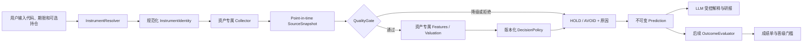

# AI 多资产分析总体架构设计

## 1. 架构目标

建立一个可扩展但不抹平资产差异的 `asset_research` 有界上下文。现有股票接口继续工作；新资产共享任务、快照、报告、历史和评分基础设施，各自拥有解析、数据、特征、决策、报告章节和结果评估插件。



## 2. 领域类型

### 2.1 规范化标识

```python
AssetType = Literal["stock", "bond", "fund", "futures", "option", "fx", "crypto"]
IdentityLevel = Literal["ASSET", "PRODUCT", "CONTRACT", "SERIES"]

class InstrumentIdentity(BaseModel):
    asset_type: AssetType
    identity_level: IdentityLevel
    canonical_id: str
    display_symbol: str
    name: str
    venue: str | None
    currency: str | None
    timezone: str
    identifier_type: str
    identifier_value: str
    product_type: str | None
    metadata_version: str
    details: IdentityDetails

class StockIdentityDetails(BaseModel):
    kind: Literal["STOCK"]
    exchange_symbol: str

class BondIdentityDetails(BaseModel):
    kind: Literal["BOND"]
    bond_identity_kind: Literal["ISSUE", "LISTING"]
    isin: str | None
    issuer_id: str
    maturity_date: date | None
    is_perpetual: bool | None
    settlement_calendar_id: str | None

class FundIdentityDetails(BaseModel):
    kind: Literal["FUND"]
    fund_identity_kind: Literal["SHARE_CLASS", "LISTING"]
    fund_id: str
    share_class_id: str
    nav_calendar_id: str | None
    official_benchmark_id: str | None
    dealing_frequency: str | None

class FuturesIdentityDetails(BaseModel):
    kind: Literal["FUTURES"]
    product_code: str
    contract_month: str | None
    underlying_id: str | None
    expiry_at: datetime | None
    contract_multiplier: Decimal | None
    trading_calendar_id: str
    mapped_contract_id: str | None

class OptionIdentityDetails(BaseModel):
    kind: Literal["OPTION"]
    underlying_id: str
    expiry_at: datetime
    strike: Decimal
    option_right: Literal["CALL", "PUT"]
    exercise_style: Literal["EUROPEAN", "AMERICAN", "OTHER"]
    contract_multiplier: Decimal
    settlement_type: str
    trading_calendar_id: str

class FxIdentityDetails(BaseModel):
    kind: Literal["FX"]
    base_currency: str
    quote_currency: str
    settlement_type: str
    value_date: date | None
    calendar_id: str
    price_convention: str

class CryptoAssetIdentityDetails(BaseModel):
    kind: Literal["CRYPTO_ASSET"]
    caip_asset_id: str
    chain_id: str
    contract_address_or_native_asset: str

class CryptoProductIdentityDetails(BaseModel):
    kind: Literal["CRYPTO_PRODUCT"]
    base_asset_id: str
    quote_asset_id: str
    settlement_asset_id: str | None
    market_type: Literal["SPOT", "PERPETUAL", "DELIVERY_FUTURE"]
    linear_or_inverse: Literal["LINEAR", "INVERSE", "NOT_APPLICABLE"]
    expiry_at: datetime | None

IdentityDetails = Annotated[
    StockIdentityDetails
    | BondIdentityDetails
    | FundIdentityDetails
    | FuturesIdentityDetails
    | OptionIdentityDetails
    | FxIdentityDetails
    | CryptoAssetIdentityDetails
    | CryptoProductIdentityDetails,
    Field(discriminator="kind"),
]
```

`BondIdentityDetails` 及各类完整字段由子迭代定义；公共层必须通过带
`kind` 的 discriminated union 保存和校验，不能把资产专属字段塞进无约束
`metadata`。`canonical_id` 由资产插件生成并保存，不允许仅用显示代码做数据库
唯一键。示例：

- 债券：`bond:listing:XSHG:019547:CNY`
- 基金：`fund:listing:XSHG:510300:ETF:CNY`
- 期货：`futures:CFFEX:IF2609:CNY`
- 期权：`option:SSE:10008156:CALL:2026-09-23:CNY`
- 外汇可执行产品：`fx:CFETS:USD/CNY:SPOT`
- 数字货币资产级：`crypto:asset:bip122:000000000019d6689c085ae165831e93:slip44-0`
- 数字货币产品级：`crypto:coinbase:BTC-USD:spot:bitcoin`

条件约束：

- `ASSET` 允许 `venue/currency/product_type` 为空，只能产生资产级研究；
- 普通开放式基金允许 `venue=null`；份额 ID 属于结构身份，NAV 日历、基准和交易机制
  可在门控前为空，但缺失时不能产生可行动建议；
- `PRODUCT/CONTRACT` 的结构身份字段按插件强制；来自外部数据的场所规则、日历、
  结算、期限或基准允许先以缺失 observation 持久化，再由质量门控拒绝；
- 期货连续序列使用 `SERIES`，必须冻结 point-in-time
  `mapped_contract_id`；建议、入场价和结果只能引用真实 `CONTRACT`；
- 期权到期使用带时区的 `expiry_at`，不能退化为不含行权时刻的日期；
- ECB 等参考汇率来源不是可执行 venue；参考身份不得通过可行动质量门控。

#### 2.1.1 主数据权威边界

`MarketInstrumentService` 只提供搜索发现，不能由显示代码、名称、交易所前缀或缓存行情
推演研究身份。候选只有在获批的主数据适配器附带完整、版本化的
`asset_research_identity` 后才能由 `InstrumentResolver` 确认；解析器还必须逐项校验
`asset_type`、`display_symbol` 和 `venue` 与发现候选一致。

因此 `IF2609` 不能凭代码猜测到期日或乘数，`BTC/USDT` 不能凭字符串切分猜测
base/quote asset，债券不能把未知发行人写成占位标识。适配器未接入、版本缺失、字段不完整
或候选不一致时返回 `INSTRUMENT_UNSUPPORTED`，不持久化身份、更不创建分析任务。数据源
capability 表示某类来源当前获准用于研究；它不替代上述主数据确认，也不承诺任意搜索候选
已经具备可解析的研究身份。

公共 `/capabilities` 只在 **来源 capability 与有效主数据目录同时就绪** 时返回
`research_enabled=true`。响应分别列出 `source_capability_enabled` 与
`instrument_catalog_ready`：前者为真而后者为假时返回
`INSTRUMENT_CATALOG_UNAVAILABLE`，页面必须继续关闭提交，不能把“已有许可”误展示为
“可分析任意代码”。

当前默认桥接只声明并读取本地 `akshare_data` 仓库，固定 `refresh_online=false`；它不因
其他来源的 registry 行获批而发起 AkShare 在线请求。`/capabilities`、task、schedule 和
retry 仅把**已安装适配器声明的来源**计作 capability；顶层或字段级 `source_id` 与声明值
不一致即拒绝。真实外部来源必须以独立的、来源专属的适配器接入，并在启用前满足第 10 节的
域名、超时、响应大小、并发和重试控制。结果 worker 也先复核预测冻结来源；许可失效时仅将
已到期 head 标为 `UNSCORABLE + COMMON.SOURCE_LICENSE_BLOCKED`，不采集新数据。

### 2.2 插件协议

```python
class AssetResearchPlugin(Protocol):
    asset_type: AssetType

    async def resolve_instrument(self, query: InstrumentQuery) -> InstrumentIdentity: ...
    async def collect_raw_snapshot(
        self, identity: InstrumentIdentity, request: AnalysisRequest
    ) -> RawAssetSnapshot: ...
    def assess_quality(self, snapshot: RawAssetSnapshot) -> QualityAssessment: ...
    def promote_snapshot(
        self, snapshot: RawAssetSnapshot, quality: QualityAssessment
    ) -> EligibleAssetSnapshot | None: ...
    def compute_features(self, snapshot: EligibleAssetSnapshot) -> FeatureSet: ...
    def make_decision(
        self, features: FeatureSet, quality: QualityAssessment, request: AnalysisRequest
    ) -> ResearchDecision: ...
    def build_report_sections(
        self, snapshot: RawAssetSnapshot, published_decision: ResearchDecision
    ) -> list[ReportSection]: ...
    def score_outcome(
        self,
        *,
        decision: ResearchDecision,
        horizon_code: str,
        as_of: datetime,
        snapshot: RawAssetSnapshot,
    ) -> list[OutcomeEvaluation]: ...
```

原始快照必须在质量门控前不可变持久化；门控只有在最小特征集合成立时才生成
`EligibleAssetSnapshot`。无法晋级的原始快照跳过特征和方向模型，由编排器直接生成
安全发布决定。`make_decision` 返回候选决定，发布门控生成同 Schema 的发布决定；
`build_report_sections` 只能接收发布决定。插件不得直接写数据库、调用 LLM 或创建
订单。`AssetResearchOrchestrator` 负责事务、幂等、发布门控、审计和错误状态。

公共价格统计只能作为经过声明的输入，不得把六类资产收敛为同一条价格动量规则。当前
`*-domain-features-v2` 分别冻结债券收益率/利差/carry、基金 NAV 相对基准与折溢价、
期货基差/carry/合约期限、期权标的与 IV/合约 edge、外汇 carry/估值差、数字货币
funding/basis/链上输入；缺失量保持 `null`，不能补 0。对应的
`asset-research-{features,policy,shadow}-v2`、`target-v2`、`scoreability-v2` 和
`*-outcome-v2` 与 v1 的通用价格规则是不同的不可变口径，不能共用 prediction、
head cohort 或模型晋级记录。

现有 `MarketInstrumentService` 只能位于插件适配器之后。适配器必须验证返回的
`asset_type/symbol/venue/product/contract` 与已确认 `InstrumentIdentity` 完全匹配；
底层查询未命中后返回的最近任意样本不得进入研究快照。身份不匹配固定返回
`INSTRUMENT_UNSUPPORTED` 或资产专属 mismatch 原因，不允许以“示例数据”继续分析。

### 2.3 建议契约

```python
class HorizonSpec(BaseModel):
    count: int
    unit: Literal[
        "TRADING_SESSION",
        "TRADING_DAY",
        "BOND_SESSION",
        "FUND_VALUATION_DAY",
        "FX_SESSION",
        "CALENDAR_HOUR",
        "CALENDAR_DAY",
    ]
    calendar_id: str
    entry_rule: str
    maturity_rule: str

class PredictionHead(BaseModel):
    head_code: str
    head_spec_hash: str
    target_definition: str
    target_spec_version: str
    scoreability_rule: str
    scoreability_rule_version: str
    labels: list[str]
    probabilities: dict[str, float]
    probability_model_version: str
    probability_artifact_hash: str
    calibration_version: str
    calibration_artifact_hash: str
    training_cutoff_at: datetime
    baseline_code: str
    baseline_version: str
    success_threshold: Decimal | None
    primary_for_promotion: bool

class OptionResearchDetails(BaseModel):
    kind: Literal["OPTION"]
    underlying_view: Literal["BULLISH", "BEARISH", "NEUTRAL", "INDETERMINATE"]
    volatility_view: Literal["VOL_UP", "VOL_DOWN", "NEUTRAL", "INDETERMINATE"]
    contract_edge: Literal["CHEAP", "FAIR", "RICH", "UNKNOWN"]

class BondResearchDetails(BaseModel):
    kind: Literal["BOND"]
    price_basis: Literal["EXECUTABLE", "OFFICIAL_VALUATION", "INDICATIVE"]
    yield_to_maturity: Decimal | None
    yield_to_worst: Decimal | None
    modified_duration: Decimal | None
    dv01: Decimal | None
    credit_spread_bps: Decimal | None
    liquidity_grade: Literal["HIGH", "MEDIUM", "LOW", "UNKNOWN"]

class FundResearchDetails(BaseModel):
    kind: Literal["FUND"]
    fund_type: Literal["ETF", "LOF", "OPEN_END", "MONEY_MARKET", "OTHER"]
    benchmark_code: str | None
    expense_ratio: Decimal | None
    tracking_error: Decimal | None
    nav_premium_discount: Decimal | None
    style_drift_score: Decimal | None
    liquidity_grade: Literal["HIGH", "MEDIUM", "LOW", "NOT_APPLICABLE", "UNKNOWN"]

class FuturesResearchDetails(BaseModel):
    kind: Literal["FUTURES"]
    contract_code: str
    mapped_from_series: bool
    days_to_expiry: int
    basis: Decimal | None
    annualized_carry: Decimal | None
    roll_state: Literal["NORMAL", "ROLL_WINDOW", "NEAR_EXPIRY", "UNKNOWN"]
    margin_ratio: Decimal | None

class FxResearchDetails(BaseModel):
    kind: Literal["FX"]
    base_currency: str
    quote_currency: str
    product_type: Literal["SPOT", "FORWARD", "NDF"]
    quote_kind: Literal["EXECUTABLE_PROXY", "INDICATIVE", "REFERENCE"]
    carry_estimate: Decimal | None
    valuation_gap: Decimal | None
    liquidity_grade: Literal["MAJOR", "MINOR", "EMERGING", "UNKNOWN"]

class CryptoResearchDetails(BaseModel):
    kind: Literal["CRYPTO"]
    network: str | None
    venue: str | None
    product_type: Literal["ASSET", "SPOT", "PERPETUAL", "DELIVERY_FUTURE"]
    quote_currency: str | None
    funding_rate: Decimal | None
    basis: Decimal | None
    onchain_regime: Literal["EXPANDING", "CONTRACTING", "MIXED", "UNAVAILABLE"]
    venue_risk_grade: Literal["LOW", "MEDIUM", "HIGH", "UNKNOWN"]

AssetResearchDetails = Annotated[
    BondResearchDetails
    | FundResearchDetails
    | FuturesResearchDetails
    | OptionResearchDetails
    | FxResearchDetails
    | CryptoResearchDetails,
    Field(discriminator="kind"),
]
```

上述字段是公共序列化的最小强类型骨架；各子迭代可以在自身 Schema 中增加经过版本化
定义的资产字段，但不得退化成无约束字典，也不得重复定义 recommendation、direction、
trade intent、概率或 actionability。无法取得的研究量保持 `null` 并由质量和原因码
解释，不能以 0 补值。`head_spec_hash` 由服务端根据 target、scoreability、labels、
baseline 和相应版本规范化计算，请求或插件不得自行提交任意值。

```python
class ResearchDecision(BaseModel):
    market_view: Literal["BULLISH", "BEARISH", "NEUTRAL", "INDETERMINATE"]
    recommendation: Literal["BUY", "SELL", "HOLD", "AVOID"]
    actionability: Literal[
        "ACTIONABLE", "RESEARCH_ONLY", "INSUFFICIENT_DATA", "REGION_RESTRICTED"
    ]
    normalized_direction: Literal["LONG", "SHORT", "NEUTRAL", "INDETERMINATE"]
    position_context: Literal["FLAT", "LONG", "SHORT", "UNKNOWN"]
    trade_intent: Literal["OPEN", "ADD", "REDUCE", "CLOSE", "KEEP", "NONE"]
    horizon_code: str
    horizon_spec: HorizonSpec
    confidence: float | None
    primary_head_code: str | None
    prediction_heads: list[PredictionHead]
    expected_return: float | None
    expected_risk: float | None
    quality_status: Literal["ELIGIBLE", "DEGRADED", "REJECTED"]
    reason_codes: list[str]
    thesis: list[EvidenceItem]
    counter_thesis: list[EvidenceItem]
    invalidation_conditions: list[str]
    asset_details: AssetResearchDetails | None
    execution_disabled: Literal[True]
```

`market_view` 是资产研究观点；`normalized_direction` 是跨资产统计使用的权威方向。
对于期权，买入 put 的合约方向仍是 `LONG`，标的看空保存在
`OptionResearchDetails.underlying_view=BEARISH`。资产扩展只保存研究轴或可由公共
字段推导的展示信息，不能再定义第二套权威动作枚举。

#### 2.3.1 权威动作真值表

以下是真实质量和发布资格均通过时的默认映射；`ADD/REDUCE` 只有在用户显式提供
持仓状态、资产策略返回强弱变化且资产验收另有规则时才允许，不作为默认推断。
`short_open_research_allowed` 来自服务端资产、产品、地区和租户 capability
快照，不能由请求体指定；它仅控制研究意图表达，本迭代仍不创建订单。

| `position_context` | `normalized_direction` | `recommendation` | `trade_intent` | 语义 |
| --- | --- | --- | --- | --- |
| `FLAT` | `LONG` | `BUY` | `OPEN` | 建立多头研究建议 |
| `FLAT` | `SHORT` | `SELL` | `OPEN` 或 `NONE` | `short_open_research_allowed=true` 时为 `OPEN`，否则只展示看空观点 |
| `FLAT` | `NEUTRAL` | `HOLD` | `NONE` | 空仓观望 |
| `FLAT` | `INDETERMINATE` | `AVOID` | `NONE` | 无法形成方向 |
| `LONG` | `LONG` | `HOLD` | `KEEP` | 维持多头 |
| `LONG` | `SHORT` | `SELL` | `CLOSE` | 平掉/减持多头 |
| `LONG` | `NEUTRAL` | `HOLD` | `KEEP` | 维持并提示风险管理 |
| `LONG` | `INDETERMINATE` | `AVOID` | `NONE` | 不生成账户动作 |
| `SHORT` | `LONG` | `BUY` | `CLOSE` | 平掉空头 |
| `SHORT` | `SHORT` | `HOLD` | `KEEP` | 维持空头研究观点 |
| `SHORT` | `NEUTRAL` | `HOLD` | `KEEP` | 维持并提示风险管理 |
| `SHORT` | `INDETERMINATE` | `AVOID` | `NONE` | 不生成账户动作 |
| `UNKNOWN` | `LONG` | `BUY` | `NONE` | 仅展示看多，不声称开仓 |
| `UNKNOWN` | `SHORT` | `SELL` | `NONE` | 仅展示看空，不声称开仓 |
| `UNKNOWN` | `NEUTRAL` | `HOLD` | `NONE` | 观望 |
| `UNKNOWN` | `INDETERMINATE` | `AVOID` | `NONE` | 无法形成方向 |

发布覆盖按以下优先级执行，高优先级不能被低优先级或 LLM 覆盖：

| 条件 | 发布决定 |
| --- | --- |
| 地区禁止 | `INDETERMINATE + AVOID + NONE + REGION_RESTRICTED` |
| 关键数据/许可/风险拒绝 | `INDETERMINATE + AVOID + NONE + INSUFFICIENT_DATA` |
| 模型未晋级 | `INDETERMINATE + HOLD + NONE + RESEARCH_ONLY` |
| 已晋级且质量合格 | 使用上方持仓真值表 |

期权 v1 的受限映射：

| 条件 | 公共权威字段 | 前端可推导文案 |
| --- | --- | --- |
| 空仓，合约具有正多头 edge | `LONG + BUY + OPEN` | 买入开仓 |
| 未知持仓，合约具有正多头 edge | `LONG + BUY + NONE` | 仅买入观点 |
| 已持有该精确合约多头，合约 edge 中性或转负 | `NEUTRAL + SELL + CLOSE` | 卖出平仓；退出多头不等于建立空头 |
| 已持有该精确合约多头，正 edge 延续 | `LONG + HOLD + KEEP` | 继续持有 |
| 空仓/未知持仓试图 `SHORT` 合约 | `INDETERMINATE + AVOID + NONE` | 禁止裸卖 |
| `position_context=SHORT` | `INDETERMINATE + AVOID + NONE` | v1 不支持期权空头上下文 |

该受限表是期权 v1 对上方通用真值表的显式窄化：对已持有的精确期权合约，
`LONG + NEUTRAL` 固定退出为 `SELL + CLOSE`，不允许同时存在
`HOLD + KEEP` 分支。

`OptionDecisionGuard` 必须接收完整 `ResearchDecision`、已解析的精确期权
`canonical_id` 和请求持仓上下文，而不是只检查 direction。Schema、服务和数据库
CHECK 共同拒绝 `normalized_direction=SHORT`、`SELL+OPEN`、SHORT 持仓上下文及
非 `position_context=LONG` 的 `CLOSE`；同时明确允许
`position_context=UNKNOWN + LONG + BUY + NONE`。本迭代不连接账户，所谓“已持有”
仅指用户对该精确 canonical contract 显式提供的研究上下文，不能表述为已验证账户仓位。

“买入开仓”“卖出平仓”“不参与”等只能由上述公共字段在 UI 派生，不能进入 API、
数据库 CHECK 或模型输出作为另一套动作状态。

#### 2.3.2 概率和发布约束

- `REJECTED` 必须得到 `INDETERMINATE + AVOID + NONE`；
- `DEGRADED` 默认只能得到 `HOLD/AVOID`，资产插件若要放开必须有单独验收规则；
- 模型未晋级时必须为 `RESEARCH_ONLY`；关键数据不足为 `INSUFFICIENT_DATA`；地区禁止为 `REGION_RESTRICTED`；
- 模型未晋级时，候选方向只写受限的 `candidate_decision_json` 供影子评分；若无更高优先级拒绝，普通用户 API 返回固定 `INDETERMINATE + HOLD + NONE`；
- 每个 `PredictionHead` 的 labels 必须互斥且覆盖其 `target_definition`，概率和误差不超过 `1e-6`；
- `PredictionHead.head_code` 与 `outcome_kind` 共用小写资产命名空间代码，如
  `option.underlying_direction`；禁止再定义大写下划线别名；
- `target_spec_version/scoreability_rule_version` 固定标签边界、价格口径、日历、
  缺失处理和成熟规则；`probability_model_version/probability_artifact_hash`、
  `calibration_version/calibration_artifact_hash/training_cutoff_at` 证明概率和校准器
  只使用预测时点前样本；
- 每个 head 必须登记同目标的 `baseline_code/baseline_version`；系统对上述字段和
  labels 计算 `head_spec_hash`，该哈希进入预测输入、结果 cohort 和模型证据，禁止
  将不同 spec 的样本混在同一 Brier、基线或晋级统计中；
- `prediction_heads` 非空时必须且只能有一个 `primary_for_promotion=true`，
  `primary_head_code` 必须指向它；无可评分 head 时两者分别为空列表和 `null`；
- `scoreability_rule` 冻结入预测，明确入退价格、期限、缺失数据和
  `UNSCORABLE/PARTIAL` 条件，评分器不得读取今天的新规则替换它；
- `confidence` 只能从 `primary_head_code` 指向的校准概率派生；没有已晋级校准器时为 `null`；
- 期权至少使用 `option.underlying_direction`、`option.iv_direction`、
  `option.exact_contract_net_profit`
  三个独立 head，不能把三组概率放进同一个分布求和；
- 未晋级、地区受限或许可受限时，普通用户 API 和导出删除候选
  `prediction_heads`，管理员/评估器权限才能读取；
- 置信度、概率、动作和数值均不得由 LLM 生成或修改。

## 3. 数据和时点模型

### 3.1 门控前后快照

采集层不得用严格业务 Schema 提前吞掉“缺关键数据”这一可审计事实。公共层区分：

```python
class RawObservation(BaseModel):
    value: Any | None
    unit: str | None
    source_id: str | None
    observed_at: datetime | None
    published_at: datetime | None
    available_at: datetime | None
    retrieved_at: datetime
    revision_id: str | None
    license_tag: str | None
    quality_flags: list[str]
    missing_reason: str | None

class RawAssetSnapshot(BaseModel):
    instrument_id: str
    cutoff_at: datetime
    fields: dict[str, RawObservation]
    content_hash: str

class EligibleAssetSnapshot(BaseModel):
    raw_snapshot_id: str
    validated_fields: AssetValidatedFields
    quality_status: Literal["ELIGIBLE", "DEGRADED"]
```

- `RawObservation.value` 可空，但来源、获取时点和缺失原因仍可记录；网络未返回字段不能
  伪造成 0、空字符串或中性值；
- 完成身份解析后先保存 `RawAssetSnapshot`，再执行质量门控；关键到期、NAV、基准、
  条款、费用或报价缺失时，任务仍能返回稳定 ReasonCode 和安全发布决定，而不是
  Pydantic `422` 或未处理 `500`；
- 只有门控通过最小字段合同后才构造 `EligibleAssetSnapshot`；估值、特征和方向模型
  只接收该收紧类型；
- 身份歧义或请求本身不合法仍在采集前返回请求错误，不创建伪快照。

### 3.2 来源字段

每个数据项保存：

```text
value
unit
source_id
source_url_or_endpoint
observed_at
published_at
available_at
retrieved_at
revision_id
license_tag
quality_flags
```

预测只能读取 `available_at <= analysis_cutoff_at` 的版本。`observed_at` 不等同于可用时间，例如 COT、基金定期持仓和宏观统计都存在发布滞后。

### 3.3 快照

- `source_snapshot_hash` 对排序和规范化后的全部输入计算 SHA-256；
- 原始响应大对象写对象存储或压缩 JSON，数据库保存 URI、哈希和许可；
- 快照不可变；来源修订产生新版本，不覆盖旧预测；
- 在线失败可读取满足新鲜度约束的缓存，报告必须显示缓存时间；
- 两个独立价格源偏差超过资产阈值时拒绝方向建议。

## 4. 持久化设计

### 4.1 公共状态和原因码

```python
TaskStatus = Literal["QUEUED", "RUNNING", "SUCCEEDED", "FAILED", "CANCELLED"]
RunStatus = Literal["PENDING", "RUNNING", "SUCCEEDED", "FAILED", "CANCELLED"]
OutcomeStatus = Literal["PENDING", "PARTIAL", "SCORED", "UNSCORABLE"]
MaturityReason = Literal[
    "HORIZON_REACHED",
    "EXPIRY",
    "MATURITY",
    "CALL",
    "REDEMPTION",
    "ROLL",
    "DELISTING",
    "LIQUIDATION",
    "EXERCISE",
]
ModelStatus = Literal["DRAFT", "SHADOW", "PROMOTED", "SUSPENDED", "RETIRED"]
OwnerScope = Literal["USER", "PUBLIC_SHADOW", "ADMIN_EVAL"]
RunPredictionLinkRole = Literal["CREATED", "REUSED"]
```

`MATURED`、`MATURED_AT_EXPIRY` 不是结果状态。期权到期结果应为
`status=SCORED|UNSCORABLE`、`maturity_reason=EXPIRY`。所有成熟原因与状态正交，
这样 `OutcomeStatus.PARTIAL` funding、提前赎回、展期和摘牌均可统一调度。

`reason_codes` 使用不可变的资产命名空间稳定码：

```text
COMMON.MODEL_NOT_PROMOTED
COMMON.DATA_STALE
COMMON.SOURCE_LICENSE_BLOCKED
BOND.PRICE_IDENTITY_MISMATCH
FUND.OFFICIAL_NAV_MISSING
FUTURES.CONTINUOUS_PRICE_NOT_TRADABLE
OPTION.NAKED_SHORT_BLOCKED
FX.PRICE_CONVENTION_UNKNOWN
CRYPTO.REGION_RESTRICTED
```

代码一旦进入生产或历史预测不得改义或复用；废弃后保留解析能力。HTTP
`error_code` 表示请求/任务失败，`reason_codes` 表示结构化决定的解释，
`maturity_reason` 表示结果为何成熟，三者不得混用。资产插件在注册时提交
reason code 清单，重复或未注册代码导致启动失败。

### 4.2 表和真实列

所有主键使用 UUID/ULID，时间使用带时区 UTC，金额和价格使用 `Decimal` 对应
数据库定点数。15 张最终表都必须实际创建公共生命周期列
`retention_class,retention_expires_at,legal_hold,tombstoned_at`；下表列出其余
表专属必需列，迁移必需列是“公共生命周期列 + 对应行专属列”的并集，不是 JSON 内别名。
其中 `retention_expires_at` 是内容保留时点，不能与持仓上下文业务有效期
`expires_at` 混用。

| 表 | 用途 | 必需列 |
| --- | --- | --- |
| `asset_instruments` | 版本化身份 | `id,canonical_id,asset_type,identity_level,venue,currency,product_type,identity_json,metadata_version,lifecycle_status,valid_from,valid_to,created_at` |
| `asset_analysis_tasks` | 用户分析任务 | `id,user_id,owner_scope,instrument_id,asset_type,canonical_id,identity_version,request_json,position_context,position_context_snapshot_id,horizon_code,status,progress,error_code,retry_of_task_id,trace_id,created_at,started_at,completed_at` |
| `asset_analysis_reports` | 结构化研报 | `id,task_id,prediction_id,report_version,sections_json,rendered_markdown,content_hash,created_at` |
| `asset_analysis_exports` | 异步导出审计 | `id,report_id,format,status,storage_uri,content_hash,error_code,requested_by,created_at,completed_at` |
| `asset_report_publications` | 知识库/工作区保存审计 | `id,report_id,target_type,target_ref,status,external_ref,content_hash,requested_by,error_code,created_at,completed_at` |
| `asset_position_context_snapshots` | 用户提供的 point-in-time 研究持仓上下文 | `id,owner_scope,user_id,instrument_id,asset_type,canonical_id,identity_version,position_context,long_quantity,short_quantity,as_of_at,available_at,expires_at,source_type,source_manifest_json,content_hash,created_at` |
| `asset_source_snapshots` | 门控前 point-in-time 原始快照 | `id,instrument_id,asset_type,canonical_id,identity_version,cutoff_at,raw_schema_version,raw_fields_json,raw_payload_uri,source_manifest_json,content_hash,license_tags_json,created_at` |
| `asset_schedule_manifests` | 获批静态系统调度的不可变配置证据 | `id,manifest_key,manifest_version,owner_scope,approval_reference,evidence_uri,evidence_content_hash,content_hash,approved_by,approved_at,status,idempotency_key,idempotency_request_hash,retired_by,retired_at,retirement_reason_codes_json,created_at` |
| `asset_signal_schedules` | 单资产定时影子运行 | `id,owner_scope,user_id,approved_manifest_id,manifest_entry_key,manifest_content_hash,system_target_key,instrument_id,asset_type,canonical_id,identity_version,horizon_code,horizon_spec_json,position_context,position_context_snapshot_id,cron_expression,timezone,cutoff_policy,cutoff_policy_version,misfire_policy,schedule_version,enabled,next_run_at,lease_token,lease_expires_at,last_attempt_at,last_error_code,retry_of_run_id,retry_not_before_at,retry_scheduled_fire_at,retry_cutoff_at,retry_schedule_version,retry_cutoff_policy_version,retry_schedule_config_json,retry_attempt,created_at,updated_at` |
| `asset_signal_runs` | 手工/定时/补跑审计及直接 prediction 审计关系 | `id,run_key,schedule_id,retry_of_run_id,attempt_number,task_id,schedule_version,schedule_config_json,cutoff_policy_version,owner_scope,user_id,run_type,asset_type,as_of_at,cutoff_at,policy_version,status,prediction_id,prediction_link_role,counts_json,trace_id,created_at,completed_at` |
| `asset_signal_predictions` | 不可变预测事实 | `id,prediction_key,decision_input_hash,owner_scope,user_id,instrument_id,asset_type,canonical_id,identity_version,as_of_at,horizon_code,horizon_spec_json,position_context,position_context_snapshot_id,position_context_snapshot_as_of_at,position_context_snapshot_available_at,position_context_snapshot_expires_at,candidate_decision_json,published_decision_json,actionability,quality_status,quality_json,snapshot_id,mapped_contract_id,head_spec_set_hash,feature_version,policy_version,model_version,calibration_version,capability_version,compliance_policy_version,cutoff_policy_version,cost_snapshot_json,outcome_lease_token,outcome_lease_expires_at,outcome_last_attempt_at,outcome_last_error_code,created_at` |
| `asset_signal_outcomes` | 多 head、可追加结果 | `id,prediction_id,outcome_kind,head_spec_hash,horizon_code,evaluator_version,status,maturity_reason,maturity_at,entry_at,entry_price,entry_price_basis,exit_at,exit_price,exit_price_basis,currency,gross_return,net_return,total_cost,benchmark_return,success_label,metrics_json,risk_json,reason_codes_json,scored_at` |
| `asset_model_registry` | 当前模型/规则晋级状态 | `id,promotion_scope_key,promotion_scope_type,asset_type,instrument_class,canonical_id_scope,venue_scope,product_type_scope,scope_parameters_json,signal_head,horizon_code,head_spec_hash,target_spec_version,scoreability_rule_version,baseline_version,policy_version,model_version,probability_artifact_hash,calibration_version,calibration_artifact_hash,training_cutoff_at,status,metrics_json,approval_set_json,evidence_uri,evidence_content_hash,approved_at,effective_from,effective_to,created_at` |
| `asset_model_status_events` | 追加式晋级审计 | `id,model_registry_id,from_status,to_status,reason_codes_json,metrics_snapshot_json,evidence_uri,evidence_content_hash,actor_id,created_at` |
| `asset_data_source_registry` | 来源、许可和新鲜度 | `source_id,asset_types,jurisdictions,license_status,allowed_uses,attribution_text,redistribution_policy,derived_data_policy,retention_policy,effective_from,effective_to,freshness_sla,enabled,updated_at` |

真实类型和外键约束：

- `retention_class` 使用版本化受控枚举，`retention_expires_at/tombstoned_at` 使用
  可空 `TIMESTAMPTZ`，`legal_hold` 使用非空布尔且默认 `false`；生命周期列不进入
  prediction/source/report 的内容哈希，只能由受权 retention/legal-hold 服务修改，
  每次变更写入现有追加式审计日志；
- `id/*_id` 使用 UUID，`*_at/valid_from/valid_to` 使用 `TIMESTAMPTZ`，
  金额/价格/回报使用足够精度的 `NUMERIC`，哈希使用 64 位十六进制 `CHAR(64)`，
  枚举列使用数据库 CHECK，结构化详情使用 JSON/JSONB；
- task、position context snapshot、source snapshot、schedule 和 prediction 的
  `instrument_id` 均外键到
  `asset_instruments.id ON DELETE RESTRICT`，同时保存 canonical ID 和 identity
  version 作为不可变审计副本；
- `asset_schedule_manifests` 只允许 `PUBLIC_SHADOW/ADMIN_EVAL`，以
  `(manifest_key,manifest_version)` 和 `(approved_by,idempotency_key)` 去重；其证据 URI 与
  hash 为数据库非空字段，`ACTIVE` 不允许退役字段、`RETIRED` 必须记录退役主体与时点；
- 系统 schedule 必须外键到 active manifest，并冻结 manifest entry/hash；启用时有唯一
  `system_target_key`，禁用/退役时清空该 key。`USER` schedule 则必须全部为空，不能借
  系统 manifest 伪造用户调度；
- task、position context snapshot、schedule、run 和 prediction 的 `user_id` 均外键到应用用户表
  `ON DELETE RESTRICT`；`owner_scope=USER` 时 `user_id` 必填，系统级
  `PUBLIC_SHADOW/ADMIN_EVAL` 时必须为空，二者共同组成访问主体；
- report 的 `task_id/prediction_id` 分别外键到 task/prediction，
  export/publication 的 `report_id` 外键到 report，全部 `ON DELETE RESTRICT`；
- run 的可空 `schedule_id/task_id` 分别外键到 schedule/task，`prediction_id` 外键到
  prediction；task、schedule 和
  prediction 的可空 `position_context_snapshot_id` 外键到 position context
  snapshot；prediction 的 `snapshot_id` 外键到 source snapshot，outcome 的
  `prediction_id` 外键到 prediction，全部 `ON DELETE RESTRICT`；
- position context snapshot 是用户显式提供的不可变研究输入，不是账户连接证明。
  服务层对 task/schedule/prediction 复核其 `owner_scope/user_id`、canonical ID、identity
  version 与 instrument；prediction 额外以 `(snapshot_id,owner_scope,user_id,instrument_id,
  position_context)` 组合外键绑定同一 context row，并冻结其
  `as_of_at/available_at/expires_at` 后以第二个组合外键回指。过期、跨用户或跨合约
  快照只能归一为 `position_context=UNKNOWN`，不能授权 `CLOSE`；
- run 必须且只能关联一个来源：task 或 schedule；其 `owner_scope/user_id` 必须与
  来源行完全一致，手工任务、重试、定时、手工触发 schedule 和补跑都不得创建
  无主体的孤立 run；
- task 来源 run 的 `schedule_id/schedule_version/schedule_config_json` 为空，
  schedule 来源 run 则三者必填并冻结；两类 run 都必须具有明确
  `cutoff_policy_version/policy_version`；
- schedule 的有效租约必须成对保存 `lease_token/lease_expires_at`；失败补跑上下文要么
  全部为空且 `retry_attempt=0`，要么同时冻结原失败 run、原触发时点、原 cutoff、版本和
  配置，禁止用后来编辑过的 schedule 重建失败运行。retry run 通过
  `retry_of_run_id/attempt_number` 追加审计，不覆盖原失败 run；
- run 的可空 `prediction_id` 外键到 prediction，`prediction_link_role` 只允许
  `CREATED/REUSED`。`ck_asset_run_prediction_terminal` 固定 run 状态基数为
  `PENDING/RUNNING/FAILED/CANCELLED=0` 个直接 prediction、`SUCCEEDED=1` 个直接
  prediction，v1 不允许 `PARTIAL` run；创建或复用 prediction、写直接字段和把 run
  标为成功在同一事务提交。该行级 CHECK 与 FK 不依赖触发器，允许多个成功 run 以
  `REUSED` 引用同一不可变 prediction。若决定已经落库，该 run 必须提交为
  `SUCCEEDED`；后续研报、导出或发布失败写入各自资源状态，不能反向把 run 改为
  `FAILED`；
- 期权 `published_decision_json.trade_intent=CLOSE` 的 prediction 必须引用 cutoff
  时仍有效、同访问主体、同 canonical contract 且
  `position_context=LONG,long_quantity>0,short_quantity=0` 的 position context
  snapshot。`20260810` 通过两个组合外键和
  `ck_asset_option_long_context_window` 将同主体/同 instrument/同 LONG snapshot 与
  `snapshot.as_of_at <= prediction.as_of_at`、`snapshot.available_at <= prediction.as_of_at`
  及 `prediction.as_of_at < snapshot.expires_at` 固化到数据库；snapshot 自身的数量 CHECK
  保证 LONG 为纯多头。该跨表不变量仍需在 MySQL 9.4.0 受控升级后执行实库约束合同；
- prediction 的可空 `mapped_contract_id` 外键到
  `asset_instruments.id ON DELETE RESTRICT`，目标必须为 `identity_level=CONTRACT`；
- prediction 的 `outcome_lease_token/outcome_lease_expires_at` 是成对的操作协调元数据，
  只允许同 token 的 outcome worker 释放。它们不属于 decision input、prediction 内容
  哈希或经济事实；一个 prediction 的多个成熟 head 必须由同一租约收集一份合法观察快照，
  然后在同一 worker 内评分，防止多进程重复取数和并发改写；
- model status event 的 `model_registry_id` 外键到 model registry
  `ON DELETE RESTRICT`；`retry_of_task_id` 是 task 自外键 `ON DELETE RESTRICT`；
- 审计事实表不使用级联删除。用户删除请求通过去标识化、许可保留策略和 tombstone
  处理；对象存储内容清理由受审计的 retention job 执行，不能留下悬空数据库引用。
  `legal_hold=true` 时忽略 `retention_expires_at` 的清理资格但保留计划到期日；
  解除 legal hold 后重新评估，不允许直接级联删除。

### 4.3 幂等、唯一性与索引

先对下列对象做字段排序、Decimal/时间规范化和 UTF-8 canonical JSON，再计算：

```text
position_context_snapshot_hash = position_context_snapshot.content_hash | null
decision_input_hash = SHA-256({
  canonical_identity_and_metadata_version,
  resolved_contract_or_product,
  analysis_cutoff_at,
  horizon_spec,
  position_context,
  position_context_snapshot_hash,
  normalized_asset_request_options,
  asset_risk_scenario_snapshot_hash,
  source_snapshot_hash,
  cost_snapshot,
  head_spec_set_hash,
  cutoff_policy_version,
  capability_snapshot_and_version,
  compliance_policy_version,
  feature_version,
  policy_version,
  model_version,
  calibration_version
})

access_principal = owner_scope | coalesce(user_id, "SYSTEM")
prediction_key = SHA-256(access_principal | decision_input_hash)
run_key = SHA-256(
  schedule_id_or_manual_scope_with_access_principal
  | schedule_version
  | scheduled_fire_at
  | cutoff_at
  | cutoff_policy_version
  | policy_version
)
```

因此同一持仓上下文和冻结输入的重复请求复用预测；持仓、price basis、bar mode、
连续合约映射、风险情景、head spec、数据快照或任一版本变化都会产生新预测。
手工 scope 必须包含访问主体、task 和 Idempotency-Key；重试始终新增 task/run。
若 `decision_input_hash` 不变，新 run 在自身行写入 `prediction_id` 和 `REUSED` 引用既有预测；
若在线刷新导致快照改变则新增 prediction 并写 `CREATED`。预测事实本身
永不为重试改写。

唯一约束：

- `asset_instruments(canonical_id, metadata_version)`；
- `asset_signal_runs.run_key`；
- `asset_signal_predictions.prediction_key`；
- `asset_signal_runs.prediction_id` 作为受 FK 保护的可空直接引用；终态 CHECK 确保每次
  run 至多且在成功时恰好关联一条 prediction；
- `asset_signal_outcomes(prediction_id, horizon_code, outcome_kind, evaluator_version)`；
- `asset_model_registry(promotion_scope_key, signal_head, horizon_code, head_spec_hash,
  policy_version, model_version, calibration_version)`。

`outcome_kind` 与 `PredictionHead.head_code` 使用同一稳定命名空间，例如
`option.underlying_direction`、`option.iv_direction`、`option.exact_contract_net_profit`、
`futures.contract_pnl`、`futures.roll_aware_pnl`、`futures.close_avoided_loss`、
`bond.executable_total_return` 和 `bond.valuation_total_return`。插件一次评分返回多个
`OutcomeEvaluation`，公共层分别幂等追加。

实际索引：

- predictions：`(asset_type,canonical_id,as_of_at DESC)`、
  `(owner_scope,user_id,as_of_at DESC)`、
  `(owner_scope,canonical_id,as_of_at DESC)`、
  `(actionability,quality_status,as_of_at DESC)`、
  `(model_version,policy_version,horizon_code)`；
- outcomes：`(status,maturity_at)`、`(outcome_kind,head_spec_hash,status,scored_at)`、
  `(prediction_id,horizon_code)`；
- tasks/runs：`(user_id,status,created_at)`、`(owner_scope,user_id,status,as_of_at)`、
  `(schedule_id,status,as_of_at)`；
- runs 的 prediction 审计：`(prediction_id,created_at)`；
- position context snapshots：`(owner_scope,user_id,canonical_id,as_of_at DESC)`、
  `(expires_at)`；
- schedules：`(enabled,next_run_at)`、`(retry_not_before_at)`；
- model registry：`(asset_type,instrument_class,signal_head,horizon_code,status)`。

JSON 只保存不可平铺的快照和资产专属详情；权限、游标分页、列表筛选、成熟调度、
模型晋级和成绩单分组字段必须列化。

### 4.4 每日影子调度

- v1 schedule 只绑定一个已确认的 `canonical_id`；管理员仅可通过带 approval reference、
  evidence URI/hash 的版本化 `asset_schedule_manifests` 在**配置阶段**展开多条精确
  schedule。创建前逐条重验已获批 source capability 和有效精确身份，运行时绝不发现、
  切换主力/近月或扫描全部市场；
- 同一 `system_target_key` 只能存在一条启用系统 schedule；新 manifest 版本必须先退役旧
  active manifest，且无租约/补跑时才能禁用其未来 fire。worker 在采集前再次核验 manifest
  仍为 `ACTIVE`、scope/hash/entry 一致，并把这些字段冻结进 run config；
- `cutoff_policy` 由资产插件解析：债券/基金使用各自估值日，期货使用夜盘/日盘
  合约日历，外汇使用完成 session，数字货币使用 UTC 完成 bar；
- cron 只表示触发检查时间，真正 `cutoff_at`、下一可交易窗口和成熟时间由
  `HorizonSpec + calendar_id` 决定，不能统一套用“19:00 后次日开盘”；
- 对 `BOND_SESSION/FUND_VALUATION_DAY/TRADING_SESSION/FX_SESSION`，快照必须冻结
  `raw_fields.calendar={calendar_id,sessions}`：`calendar_id` 与 `HorizonSpec` 完全相同，
  `sessions` 是来源提供的未来 session close 时间戳。系统只取第 N 个严格晚于
  `as_of` 的 session，绝不以周一至周五推断。缺失、ID 不匹配或覆盖不足时 outcome 保持
  `PENDING` 且 `maturity_at=null`、`COMMON.CALENDAR_UNAVAILABLE`，不能由手工 evaluator
  越过；只有 `CALENDAR_DAY/HOUR` 的连续 UTC 产品可直接以时间增量解析；
- 每次修改 schedule 必须原子递增 `schedule_version`；run 冻结
  `schedule_config_json/schedule_version/cutoff_policy_version`，历史运行不读取今天的
  schedule 行重建配置；
- `run_key`、数据库唯一约束和租约锁共同防止重复运行；`misfire_policy` 明确
  `SKIP/RUN_ONCE/BACKFILL`，补跑仍只能读取当时可用的 point-in-time 数据；
- worker 只在超过配置的 misfire grace 后解释 `misfire_policy`：`SKIP` 记录稳定原因码并
  原子推进到严格的下一 fire，不生成 prediction；`RUN_ONCE` 只运行截至当前的最新一个
  完成 fire；`BACKFILL` 每个受限 poll 只补一个原 fire，下一 poll 再继续，避免一次长停机
  穷尽 worker/来源配额。失败 retry 永远重放其冻结 fire，不被这三种策略重解释；
- APScheduler 只负责唤醒有限批次的数据库轮询器，不能充当分布式互斥锁。worker 必须以
  `enabled + due + no-valid-lease` 为条件原子抢占，且只允许持有同一 `lease_token` 的
  worker 释放或更新该租约；进程崩溃后只能在租约过期后接手；
- 首次定时运行使用冻结的 scheduled fire、cutoff 和 schedule 配置生成 `run_key`。
  失败后按退避时间建立新的 retry run，并从失败 run 的冻结副本重放；重试 key 必须包含
  原失败 run ID，保证其是新的审计事实而不会复用或改写失败记录。活跃租约或待补跑时
  禁止修改 schedule，避免“编辑后的配置”污染历史信号；
- 独立 outcome evaluator 只扫描已成熟的 `PENDING` head，并以 prediction 为单位取得
  短租约；一次观察快照可评分该 prediction 的所有成熟 head。来源、许可或数据库失败时
  保持原 outcome 证据为 `PENDING`、记录稳定错误码并释放/过期租约以便下一次合法重试，
  不把失败改写成中性命中率；
- 定时任务默认 `position_context=UNKNOWN`，只生成影子候选和发布决定，不读取账户、
  不推断持仓、不创建订单；
- 调度失败记录独立 run 和稳定错误码，不覆盖上一次成功预测。

### 4.5 股票兼容迁移

迁移采用 expand-migrate-contract，完整运行手册见
[数据库与股票兼容迁移计划](./MIGRATION_PLAN.md)：

1. 第一阶段保留 `stock_analysis_*` 和 `stock_signal_*` 表，以执行迁移时的真实
   Alembic head 作为新线性迁移的 `down_revision`；没有迁移分支时不设置
   `depends_on`；
2. expand 阶段创建本架构定义的最终 15 张通用表和约束；历史 foundation 的第 15 张
   run-prediction 关联表已由 `20260806` 回填为直接 run 外键并删除，`20260807` 的
   `asset_schedule_manifests` 是当前最终 schema 的第 15 张。不删除、重命名或批量改写旧表；
3. 新增只读 `stock-compat` 路由通过 `StockResearchCompatibilityAdapter` 映射旧信号；
   旧股票 API 继续是权威读写路径。兼容路由不执行新读或双写，后续任何 cohort 开关和
   双写必须经过单独发布审批并可回退；
4. 旧 `BUY/SELL/WATCH` 映射以 compatibility version 保存原动作、模型版本与结果，
   但对无法证明的 canonical identity、来源 manifest、持仓和 outcome head 显式标为
   legacy-unresolved。对账比较可证明的动作、原因和结果语义，不比较不同域的哈希，也不
   要求 LLM 文本逐字一致；
5. 空库、现存库、失败恢复、downgrade 和真实方言演练通过，且连续两个发布版本结构化
   语义无未解释差异后，才可单独评审 contract 阶段；本迭代不执行旧表 contract。

## 5. API 设计

基础前缀：`/api/v1/asset-research`

| 方法与路径 | 行为 |
| --- | --- |
| `GET /capabilities` | 返回来源许可与有效主数据目录的双门禁、资产、reason code 和模型晋级状态 |
| `GET /stock-compat/signals` | 只读返回旧股票信号的版本化兼容映射，不创建通用 prediction 或订单 |
| `GET /instruments/search` | 按 `asset_type/query/venue/identity_level` 搜索并返回候选身份 |
| `POST /instruments/resolve` | 将候选确认成带 `metadata_version` 的唯一 `InstrumentIdentity` |
| `POST /position-contexts` | 为当前访问主体创建不可变的用户声明研究持仓快照；不连接或验证账户 |
| `GET /position-contexts/{snapshot_id}` | 读取当前用户有权访问的快照元数据和哈希 |
| `POST /tasks` | 创建分析，要求 `asset_type/canonical_id/horizon_code`；非 `UNKNOWN` 持仓引用快照 ID |
| `GET /tasks/{task_id}` | 返回任务、进度、质量和错误 |
| `GET /tasks/{task_id}/result` | 返回发布决定和报告；普通用户永不返回受限候选字段 |
| `POST /tasks/{task_id}/cancel` | 只取消未完成任务 |
| `POST /tasks/{task_id}/retry` | 创建新 task/run；输入哈希相同则通过 run 的直接 prediction 引用复用不可变预测 |
| `GET /reports/latest` | 按资产/标识读取当前用户最新报告 |
| `GET /reports/{report_id}` | 读取当前用户有权访问的结构化报告 |
| `POST /reports/{report_id}/exports` | 创建 Markdown/PDF 导出任务 |
| `GET /exports/{export_id}` | 读取导出状态、哈希和授权下载地址，不产生写副作用 |
| `POST /reports/{report_id}/publications` | 保存到知识库/工作区并创建审计记录 |
| `GET /publications/{publication_id}` | 读取保存状态和外部引用，不泄露外部凭证 |
| `POST /schedules` | 为一个已确认资产建立定时影子运行 |
| `GET /schedules` | 游标分页读取当前用户/owner scope 的调度 |
| `PATCH /schedules/{schedule_id}` | 修改未来运行参数或禁用；不改写历史运行 |
| `POST /schedules/{schedule_id}/run` | 手工触发一次幂等影子运行 |
| `POST /admin/schedule-manifests` | 管理员以审批证据创建版本化静态清单，并展开精确系统 schedule |
| `GET /admin/schedule-manifests` | 管理员读取清单版本及其已持久化 entry，不执行市场扫描 |
| `GET /admin/schedule-manifests/{manifest_id}` | 管理员读取一个清单的审计证据和调度状态 |
| `POST /admin/schedule-manifests/{manifest_id}/retire` | 管理员禁用未来系统 fire，保留 manifest/schedule/run 审计事实 |
| `GET /signals` | 游标分页历史发布预测；普通用户不返回 candidate 字段 |
| `GET /signals/summary?head_spec_hash=` | 返回一个主 `head_spec_hash` 的成绩单 cohort；若存在多个 spec 且未显式选择，不聚合且返回可选 cohort 清单 |
| `GET /signals/{prediction_id}/evidence` | 返回来源清单、版本和原因，不泄露受限原始数据 |
| `GET /signals/{prediction_id}/outcomes` | 返回多个 `outcome_kind` 的成熟结果 |
| `GET /admin/signals/{prediction_id}/candidate` | 仅管理员/评估器读取 `PUBLIC_SHADOW/ADMIN_EVAL` 中公开结论仍为 `RESEARCH_ONLY` 的候选决定；不读取 `USER` 记录 |
| `GET /admin/model-scopes` | 读取当前晋级 scope、head、指标和证据，并返回 scope hash 是否可复算 |
| `POST /admin/model-scopes/{registry_id}/transitions` | 只接受目标状态和原因码；在同一事务更新当前状态投影并追加不可变事件，禁止原地覆盖 scope、指标、审批或证据 |

创建资源的 POST（包括 `POST /admin/schedule-manifests`）接受 `Idempotency-Key`；相同 key
和相同请求体返回既有资源，相同 key 配不同请求体返回 `409 IDEMPOTENCY_CONFLICT`。清单
退役以 `manifest_id` 为幂等目标状态，重复调用只返回同一已退役审计行，不能改写最初的退役原因。
创建导出和知识库
保存不得使用 GET。持仓上下文、报告、导出、发布、任务、调度和预测均按
`owner_scope + user_id` 校验；`USER` scope 的查询由服务端强制使用认证用户 ID，
不能接受请求参数替换。`POST /tasks` 未提供快照时只允许
`position_context=UNKNOWN`；提供时服务端从快照数量和身份推导上下文，拒绝请求体
另传冲突状态。v1 schedule 固定使用 `UNKNOWN`，其
`position_context_snapshot_id` 必须为空。
普通用户只能读取自己的 `USER` 数据和明确公开的 `PUBLIC_SHADOW`
`published_decision_json`，不能读取 `ADMIN_EVAL` 或任何 candidate 字段；跨用户 ID
统一返回 `403` 或防枚举 `404`。管理员权限也必须留下审计事件。

模型治理转换遵循第 9.4 节的有限状态机。`SHADOW -> PROMOTED` 请求必须包含
`COMMON.T2_GATE_PASSED` 原因码，并在写入前以已持久化的 scope、五方审批、证据 URI/hash、
`effective_from` 和完整 T2 指标复核；接口不能代写或替换上述证据。候选读取仅服务于
系统影子/评估记录，管理员也不能借此读取用户私有候选。

错误代码必须稳定：

```text
IDEMPOTENCY_CONFLICT
INSTRUMENT_AMBIGUOUS
INSTRUMENT_UNSUPPORTED
INSTRUMENT_VERSION_STALE
SOURCE_UNAVAILABLE
SOURCE_LICENSE_BLOCKED
DATA_STALE
DATA_INCONSISTENT
INSUFFICIENT_HISTORY
CONTRACT_NEAR_EXPIRY
ACTION_MAPPING_INVALID
POSITION_CONTEXT_INVALID
SCHEDULE_INVALID
SCHEDULE_CONFLICT
MODEL_NOT_PROMOTED
PREDICTION_CANDIDATE_NOT_FOUND
PREDICTION_CANDIDATE_INVALID
MODEL_SCOPE_NOT_FOUND
MODEL_SCOPE_INVALID
MODEL_STATUS_TRANSITION_INVALID
MODEL_TRANSITION_ACTOR_INVALID
MODEL_PROMOTION_REASON_REQUIRED
MODEL_PROMOTION_EVIDENCE_INCOMPLETE
REGION_RESTRICTED
RISK_NOT_MEASURABLE
EXPORT_FAILED
PUBLICATION_FAILED
```

资产专属失败使用同一命名空间规范，例如 `OPTION.NAKED_SHORT_BLOCKED`；HTTP 状态、
`error_code`、可重试性和用户安全文案由公共错误目录统一映射。

## 6. 服务和文件结构

```text
src/backend/
├── alembic/versions/20260802_asset_research_foundation.py
├── app/api/asset_research.py
├── app/models/asset_research.py
├── app/schemas/asset_research.py
├── app/services/asset_research/
│   ├── orchestrator.py
│   ├── registry.py
│   ├── identity.py
│   ├── quality.py
│   ├── reports.py
│   ├── exports.py
│   ├── publications.py
│   ├── schedules.py
│   ├── outcomes.py
│   ├── performance.py
│   ├── promotions.py
│   ├── compliance.py
│   ├── reason_codes.py
│   ├── types.py
│   └── plugins/
│       ├── stock.py
│       ├── bond/
│       ├── fund/
│       ├── futures/
│       ├── option/
│       ├── fx/
│       └── crypto/
└── tests/asset_research/

src/frontend/src/
├── api/assetResearch.ts
├── views/investment/AssetAnalysisPage.vue
├── composables/useAssetAnalysisTask.ts
├── components/asset-analysis/
│   ├── AssetSearchPanel.vue
│   ├── InstrumentIdentityCard.vue
│   ├── AnalysisControlPanel.vue
│   ├── ResearchDecisionCard.vue
│   ├── EvidenceQualityPanel.vue
│   ├── ResearchReportViewer.vue
│   ├── SignalHistoryPanel.vue
│   ├── SignalQualityPanel.vue
│   ├── SignalSchedulePanel.vue
│   └── panels/{Bond,Fund,Futures,Option,Fx,Crypto}Panel.vue
└── __tests__/asset-analysis/
```

## 7. 前端交互

### 7.1 路由与导航

- 主路由：`/investment/ai-assets/:assetType`；
- 支持值：`bond/fund/futures/option/fx/crypto`，股票后续可接入 `stock`；
- `/investment/stock-analysis` 保持兼容；
- capability 分为 `investment.aiBond` 等六项，并返回
  `capability_version/short_open_research_allowed`；地区或许可不允许时显示原因，
  不静默隐藏关键限制。

### 7.2 页面顺序

1. 资产类型和代码搜索；
2. 候选身份确认，展示场所、币种、到期/网络等关键字段；
3. 选择分析期限和可选持仓上下文；
4. 显示数据来源、新鲜度和质量；
5. 显示方向、建议、概率、适用条件和否决原因；
6. 展示资产专属估值/风险面板；
7. 展示完整研报、历史预测和成绩单；
8. 可选建立单资产影子调度；
9. 创建导出任务或保存到知识库/工作区。

页面不能在任务未完成时残留上一资产的建议，不能把 `null` 渲染为 0，不能将
`AVOID` 翻译为“持有”。未晋级候选方向、概率和报告文字不得通过页面状态、网络
响应、导出或知识库保存泄露给普通用户。

### 7.3 前端任务状态和并发

- `useAssetAnalysisTask` 从现有 `useStockAnalysisTask` 泛化，作为任务轮询、取消、
  重试、错误和终态的唯一实现；页面不得另写 `setInterval` 形成第三套生命周期；
- 前端工作流只允许
  `IDLE -> RESOLVING -> READY -> SUBMITTING -> QUEUED -> RUNNING ->
  SUCCEEDED|FAILED|CANCELLED`；其中 `QUEUED/RUNNING/终态` 映射后端 task 状态，
  retry 从 `FAILED/CANCELLED` 进入 `SUBMITTING` 并创建新 task，不能将终态对象
  原地改回运行态；
- 轮询间隔默认 2-5 秒并可由服务端 retry hint 调整；进入终态、组件卸载或取消后停止，
  页面隐藏时暂停，恢复可见时先做一次立即读取再恢复周期；
- 切换资产、canonical ID 或创建新任务时，先清空旧发布决定和报告；每个请求携带
  generation token 或 `AbortController`，晚到的旧响应不得覆盖新任务；
- 搜索候选、任务结果、历史/成绩单分别维护 loading/empty/error 状态。是否引入
  Pinia 由跨路由共享和缓存范围决定，不强制预设三个 store；
- 前端支持的任务状态、错误码和 capability 必须由 API 类型生成或契约测试约束；
  浏览器刷新只能恢复当前用户有权读取的 task，不从本地缓存恢复候选决定。

## 8. 决策和 LLM 边界

1. `DecisionPolicy` 输入必须是冻结的 `FeatureSet`、`QualityAssessment`、
   capability/compliance 快照和规范化请求；
2. 规则或模型先输出 `candidate_decision` 的 head、方向和理由代码；
3. 质量、风险、合规和模型晋级门控按固定优先级生成 `published_decision`；
4. `candidate_decision_json` 与 `published_decision_json` 在同一事务先持久化，普通
   用户序列化器只能读取后者；
5. LLM prompt 只包含有权发布的结构化事实和 `published_decision`，不含影子候选、
   账户密钥或未脱敏用户信息；
6. LLM 返回严格 Schema，引用的数值必须映射证据 ID；
7. `ReportConsistencyValidator` 检查建议、数值、期限、动作真值表和风险是否与
   `published_decision` 一致；
8. 校验失败时返回基于发布决定的结构化报告模板，不允许 LLM 文本覆盖决定。

## 9. 结果评分和模型治理

### 9.1 多 outcome head

- 每个资产插件一次返回 `list[OutcomeEvaluation]`；`outcome_kind` 必须对应一个
  `PredictionHead.head_code` 或预先注册的经济结果 head；
- outcome 的 `head_spec_hash` 必须匹配预测中该 `head_code` 冻结的 spec；非概率
  经济结果 head 也必须预注册 target/scoreability spec 后才能写入；
- 原始预测不可变，同一预测可追加多个 outcome kind、期限和 evaluator version；
- `PENDING` 表示未到 `maturity_at`，`PARTIAL` 表示已获得部分真实数据但不能完成
  全口径，`SCORED` 表示完整评分，`UNSCORABLE` 表示按冻结规则无法取得合法结果；
- 到期、赎回、call、展期或清算通过 `maturity_reason` 表达，不创建新的状态；
- 修改当前费用或评分代码不重算旧行；新规则使用新 `evaluator_version` 追加结果；
- 可执行债券总回报和数字货币现货/衍生品 P&L 使用冻结的 `ask -> bid` 或
  `bid -> ask` 边；债券官方估值 head 只使用 official valuation。期权
`option.underlying_direction` 从标的价格标签，`option.iv_direction` 从 IV 标签，
  两者不得用期权合约 P&L 替代；`option.exact_contract_net_profit` 才使用合约双边价格和
  成本；
- `maturity_at` 是冻结的 target 边界，`exit_at/scored_at` 是后来观察/完成时间；评分不得
  用观察到达时间覆盖成熟边界；
- `HOLD/AVOID` 不进入行动精确率分母，但必须进入覆盖率、弃权率和后续分布；
- 期权三个 head、期货合同/roll/规避损失、债券估值/可执行结果、数字货币
  现货/衍生品结果不得互相替代或汇总成一个“成功率”。

### 9.2 晋级作用域

```python
PromotionScopeType = Literal["POOLED", "INSTRUMENT_SPECIFIC", "VENUE_PRODUCT"]

class PromotionScope(BaseModel):
    scope_type: PromotionScopeType
    asset_type: AssetType
    instrument_class: str
    canonical_id: str | None
    venue: str | None
    product_type: str | None
    quote_or_settlement_asset: str | None
    signal_head: str
    horizon_code: str
    scope_parameters: dict[str, str]
```

`scope_parameters` 由资产插件的强类型 Schema 校验后转为排序字典，例如债券的
久期/信用桶、基金的基准族或期权的 DTE/delta/IV 桶；不得放任任意键静默扩大或缩小
晋级范围。`promotion_scope_key` 是规范化 `PromotionScope` 的哈希，策略、模型和
校准版本不重复塞入 scope，而作为注册表唯一键的独立列；`head_spec_hash` 及目标、
可评分规则、基线版本同样由注册表冻结。每个 signal head 独立晋级：

运行时必须从注册表列和冻结 JSON 重建 `PromotionScope`，再复算
`promotion_scope_key`；哈希不一致、JSON 不是字符串映射、范围模式与必填字段矛盾，
或出现双重表示的范围字段时均 fail-closed。`VENUE_PRODUCT` 不只比较 venue 和
product，还要比较由精确身份得到的 quote/settlement 资产；同一场所的 `BTC/USDT`
模型不得用于 `BTC/USDC`。这是一项应用层语义校验，复用既有列和
`scope_parameters_json`，不增加数据库迁移。

- `POOLED` 适用于跨品种共享模型，至少 200 条成熟行动信号，任一品种不超过
  40%，并报告品种外推表现；
- `INSTRUMENT_SPECIFIC` 适用于明确按债券、基金、货币对或合约族独立的模型，40% 集中度
  规则不适用，改为至少 200 条成熟历史/前瞻观测、足够独立日期、三个市场状态和
  至少 60 个交易日前瞻影子日；
- `VENUE_PRODUCT` 适用于数字货币等场所、产品和 quote 会改变 P&L 的模型，必须
  固定 venue/product/quote，并满足对应地区法律 Gate 和 90 个自然日影子验证；
- 期权以 `option.exact_contract_net_profit` 为主要晋级 head；标的方向或 IV
  head 单独通过不能开放合约 BUY/SELL；
- 对每个 scope 明确朴素基线、成功标签、成本模型和 primary metric，不能拿另一个
  scope 的样本补足门槛。

### 9.3 统计门槛

- 时间顺序 walk-forward，重叠标签执行 purge/embargo，修订数据按 vintage；
- 概率 head 报告 Brier Score、相对同一 target 的 Brier Skill、可靠性图、ECE 和
  样本量；无互斥完备标签的指标不得计算 Brier；
- 任一 `head_spec_hash/target_spec_version/scoreability_rule_version/baseline_version`
  不同的记录必须分 cohort，聚合器遇到 mixed spec 默认拒绝而不是事后重贴标签；
- 经济主指标为 `delta_net_utility = model_net_utility - baseline_net_utility`，
  平均模型净效用必须为正，95% 依赖感知 moving-block bootstrap 区间下界必须
  `>= 0`；
- block 长度至少覆盖最大标签重叠期；期货展期、基金估值日和 24×7 资产分别按
  自己的日历生成 block；
- 所有尝试版本进入试验清单；多次筛选模型时报告选择规则和多重比较控制，不能只
  提交最佳一次结果；
- 覆盖至少三个波动/利率/趋势状态，尾部损失、最大回撤、覆盖率和数据失败率不得
  相比基线出现未批准恶化；
- 样本不足时返回 `null + COMMON.INSUFFICIENT_SAMPLE`，不显示 0% 或伪精确区间。

### 9.4 状态、审批和自动暂停

- 状态只能沿 `DRAFT -> SHADOW -> PROMOTED -> SUSPENDED/RETIRED` 转换；
  `SUSPENDED -> SHADOW` 需重新验证，禁止直接恢复 `PROMOTED`；
- 每次转换同时写 `asset_model_status_events`，包含 actor、前后状态、指标快照、
  evidence URI、原因码和时间；`asset_model_registry.status` 是当前投影视图；
- `PROMOTED` 需要模型质量、产品、合规、数据许可和安全审批人齐全，审批证据 URI
  内容哈希进入证据包；
- 数据漂移、覆盖率骤降、成本模型失真、许可过期或连续表现低于基线时，监控器追加
  `SUSPENDED` 事件；不能只原地修改 registry 行；
- 发布门控按预测 `as_of_at` 查询当时有效 registry 和合规策略版本。未晋级或暂停时
  候选继续供受限影子评分；普通页面、API、导出和知识库保存回退到
  `INDETERMINATE + HOLD + NONE`，若同时命中更高优先级的数据、许可、风险或地区
  拒绝则按 2.3.1 返回 `AVOID`。
- 运行时不得仅因 registry 投影视图的 `status=PROMOTED` 发布方向结论。它必须在预测
  `as_of_at` 以前同时验证：精确 `SHADOW -> PROMOTED` 不可变事件、事件与 registry 相同的
  指标快照和 evidence URI/hash、五方审批、训练截止时点，以及完整 T2 指标。T2 指标至少
  覆盖样本/独立日期/三个市场状态、时间顺序 walk-forward、purge/embargo、vintage、重叠
  block、Brier/Brier Skill/ECE/可靠性审查、正净效用及 bootstrap 下界、尾部/回撤/覆盖率/
  数据失败率审查、尝试清单和前瞻影子期；`POOLED` 还验证 40% 集中度及品种外推审查，期货
  `INSTRUMENT_SPECIFIC` 还验证至少三个合约月份，期权同类 scope 还验证多个到期和行权价。
  任一 JSON 字段缺失、非有限、相互矛盾或事件不匹配均 fail-closed。

## 10. 安全、合规和可观测性

本节只规定架构边界；可量化阈值、测试环境、数据生命周期和告警处置见
[非功能需求与运行基线](./NON_FUNCTIONAL_REQUIREMENTS.md)。

- 所有外部数据调用限制域名、超时、大小、并发和重试，防止 SSRF 与资源耗尽；默认
  warehouse-only bridge 不触发在线调用，新增真实来源前不得绕过这一独立 Gate；
- 公共行情适配器不能持有交易权限；数字货币适配器不接受私钥或私有 API key；
- 报告导出和知识库保存先执行同一发布/许可过滤，再进行 HTML/Markdown 清洗、
  路径隔离和内容哈希；受限原文、影子候选和未授权归属不得进入外部目标；
- 每次运行记录 trace ID、来源延迟、缓存命中、质量原因、策略/模型/capability/
  合规版本和 token 成本；
- 复用现有 OTLP tracing、`/metrics`、AI 调用统计、慢请求日志和
  `MonitoringService`，新增资产维度的任务成功率/延迟、队列年龄、来源可用率与
  freshness、schedule lateness、评分积压、LLM token/降级和契约不变量指标；
- dashboard 和告警必须能按 `asset_type/provider/environment` 聚合，禁止用
  canonical ID、用户 ID 或原始查询作为无界指标 label；阈值越界关联 runbook 和 owner；
- 影子批处理默认不生成完整 LLM 研报；交互报告设置 token 目标/硬上限和租户预算，
  达到预算阈值时按策略降级到较小模型或确定性模板，结构化预测和评分不受影响；
- 合规模式由服务端决定，前端参数不能绕过；
- 来源注册表按地区和有效期明确 `research_only/display/derived/commercial`、
  归属、缓存、保留、派生和再分发权限；许可未知、过期或超出用途时默认拒绝；
- 任务、报告、预测、调度、导出和发布执行 owner-scope 行级授权；管理员读取影子
  候选和晋级证据也写审计日志；
- 定时任务和重试复用服务端 capability/compliance 门控，不能通过保存旧请求绕过
  后续地区禁用、许可过期或模型暂停；
- 日志、错误和证据清单不得包含私钥、账户密钥、外部知识库 token 或未脱敏用户信息。
