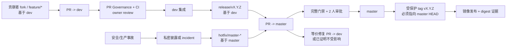

# 迭代195：社区 PR 治理与双分支协作正式迭代计划

> 计划日期：2026-08-23
> 最近验收：2026-08-24
> 状态：**已验收 / 实施中**（Task 0 已完成；D4、D7 仍阻塞；D3、D6 为有到期日的例外）
> 适用仓库：`cloudQuant/backtrader_web`
> 目标分支模型：`master`（发布主干）与 `dev`（日常集成）
> 计划边界：本文件只定义治理、文档、GitHub 配置与相关自动化的交付方案；不实施业务功能、不修改远端设置、不推送、不合并。

> **For Codex:** REQUIRED SUB-SKILL: Use `superpowers:executing-plans` to implement this plan task-by-task. Each task must remain on an implementation branch targeting `dev`; external GitHub/Gitee settings are applied only after the designated decision gate is signed and the repository change has been reviewed.

**Goal:** 建立可审计的社区 PR 路由、评审、CI、发布和双远端镜像治理，使普通贡献稳定进入 `dev`，而 `master` 只接收经过完整证据验证的 release promotion 或紧急 hotfix。

**Architecture:** 将不可变的分支保护、审批数量与 required checks 放在 GitHub Ruleset；将目标分支、来源分支命名、路径风险和证据完整性放在一个始终产出同名结果的 `PR Governance` 聚合门禁；将人工不可替代的 owner、例外和发布授权留在可追溯的 PR/issue/决策记录中。GitHub 是 PR 与治理设置的权威，Gitee 仅在 D1 签署后作为受监控镜像。

**Tech Stack:** GitHub Rulesets、GitHub Actions、GitHub CLI、Git、YAML/JSON、Python 标准库脚本、pytest、MkDocs、Vue/Node 与 FastAPI 现有质量门禁。

---

## 0. 本次完善结论与范围边界

原稿方向正确，但不宜直接实施。以下问题已在 2026-08-23 以仓库与 GitHub 只读证据复核，并已在本计划中纠正：

1. 标题误写为“迭代183”，现统一为“迭代195”。
2. `.github/CODEOWNERS` **已存在**，但当前仅保护 iteration 193 的 ratchet 基线文件；不能再将“没有 CODEOWNERS”当作基线，也不能在其上覆盖式重建。
3. `master` 与 `dev` 当前都没有 Branch Protection 或 Ruleset；GitHub Ruleset 列表为空。计划须先建立可验证的 desired-state manifest，再由有权限的管理员执行外部设置。
4. `pr-check.yml` 同时监听 `pull_request` 与 `pull_request_target`，且会 checkout、安装和执行 PR 代码，同时工作流声明 `pull-requests: write`。这在面向 fork 的社区工作流中是 P0 安全风险，必须早于“自动贴标签/自动 merge-ready”类便利功能处理。后续如保留 `pull_request_target`，只能用于只读元数据与**base SHA** 的受信任脚本，绝不 checkout 或执行 PR head。
5. `deploy-preview.yml` 只构建前端 artifact，却评论一个未实际部署的 URL；它不是可验收的 preview 环境。计划改为默认“预览构建产物”，真实托管预览须另有已签署的平台与凭据设计。
6. `docker-publish.yml` 对任意 `v*` tag 和手动输入 tag 都可发布镜像，未验证 tag 指向 `master` 当前 HEAD。仅写“由 master tag 触发”不足以实现该约束。
7. GitHub 与 Gitee 的 `dev` 在本次快照中同 SHA，但 `master` 已不同 SHA；监控不得把当前漂移误报为“已一致”，更不得由 CI 自动 force-push 修复。
8. 原稿中的 `dags/` 与 `tests/unit/scripts/` 不是当前仓库路径；风险映射、CODEOWNERS 和测试位置改为当前真实目录，未来新增 Airflow/DAG 根目录时再通过单独 PR 扩展。
9. `CONTRIBUTING.md` 中的 `YOUR_USERNAME/backtrader_web.git` 是 fork 克隆占位符，不是错误仓库名；应补充替换说明和 `upstream` 配置，而不是改成所有贡献者都克隆上游。
10. Task 3 与 D4/Task 4 原有循环依赖已拆开：先交付不含猜测 check context 的 risk map 和 Ruleset 草案，再由 Task 4 实际 PR 演练解除 D4，最后回填并应用 required checks。
11. D6 所称“受保护版本 tag”必须有独立的 tag Ruleset desired state；不能只靠 Docker workflow 内的 SHA 判断冒充服务器端 tag 保护。
12. 验证命令已收敛到各任务 owned paths；可选例外文件、非 PR checker 和 release 演练均提供不会误失败或误触发生产发布的执行方式。

本计划与仓库中已存在的“跨平台产品发布”迭代195草案是**两个独立范围**。本计划不修改其文件、产品运行时、Compose、数据库迁移或跨平台发布承诺；实施前应在 issue/项目看板中为本计划使用唯一的治理工作流标识，避免同一迭代编号被误当作同一交付物。

## 1. 已核验基线与证据纪律

下表是本计划编制时的事实快照，不是未来实施完成的声明。每次实际落地前必须重新采集，并把结果保存为本迭代证据。

2026-08-24 验收时再次执行第 1.1 节只读查询，默认分支、Ruleset/Protection、CODEOWNERS errors 以及四个远端 ref SHA 均与 2026-08-23 已提交的 `preflight.md` 一致；本次验收未修改任何远端设置。

| 项目 | 2026-08-23 只读结论 | 证据与影响 |
|---|---|---|
| 默认分支 | GitHub API 返回 `master` | 新 fork/新 PR 默认基线会偏向 `master`；D0 必须决定保持它还是切换为 `dev`，且两种选择都要有防误投机制。 |
| 分支保护 | `master` 与 `dev` 的传统 Branch Protection API 均返回未保护；Ruleset 列表为空 | 未经配置前，任何文档承诺都不能阻止直接 push、删除或 force push。 |
| CODEOWNERS | 文件存在、GitHub `codeowners/errors` 返回空；当前只覆盖 ratchet 相关文件 | 必须在保留既有条目的前提下增加领域覆盖；不可用未验证团队名或占位符合入。 |
| PR 自动化 | `pr-check.yml` 具有 `pull_request_target` 与写权限，并执行 checkout/install | 先消除特权执行不受信任代码，再加入新的治理检查。 |
| preview | 工作流只产出 `src/frontend/dist/` artifact，却宣称已部署 | 默认改名为 build artifact；不得向贡献者提供虚构 URL。 |
| 镜像发布 | 现有工作流接受任意 `v*` tag 与手动 tag 输入 | 必须验证 tag 解析出的提交等于 `origin/master` 当前 HEAD，并把镜像 digest 留为发行证据。 |
| 双远端 | `dev` SHA 一致；GitHub/Gitee 的 `master` SHA 不同 | D1 前先登记并分类现有漂移；监控只报告，不自动同步或覆盖任一远端。 |
| 仓库布局 | 交易适配目录是 `src/bt_api_py/`；根 `dags/` 与 `tests/unit/scripts/` 不存在 | 计划中的目录匹配、测试与 CODEOWNERS 均使用现有路径。 |

### 1.1 基线采集命令

以下命令仅用于采集。输出不得包含 token、环境变量、私有 URL、issue 私密内容或 secrets 值。实施者把时间、命令、摘要、HTTP 状态和 SHA 写入 `docs/iterations/迭代195-社区PR治理与双分支协作/evidence/preflight.md`，原始敏感响应不提交。

```bash
gh repo view cloudQuant/backtrader_web --json defaultBranchRef,visibility
gh api repos/cloudQuant/backtrader_web/rulesets --paginate
gh api repos/cloudQuant/backtrader_web/branches/master/protection || true
gh api repos/cloudQuant/backtrader_web/branches/dev/protection || true
gh api repos/cloudQuant/backtrader_web/codeowners/errors
gh label list --repo cloudQuant/backtrader_web --limit 100
git ls-remote --heads https://github.com/cloudQuant/backtrader_web.git master dev
git ls-remote --heads https://gitee.com/yunjinqi/backtrader_web.git master dev
```

传统 Branch Protection 的 `404 Branch not protected` 是本次基线的有效证据；Ruleset 应始终以 Rulesets API/界面记录为主，传统 API 仅作补充。若 GitHub API 权限不足，记录为阻塞项，而不是以本地 `.github` 文件替代远端设置证据。

## 2. 必须签署的决策门

没有决策记录，不得将任何规则切为阻塞状态。所有决策应记录决策人、日期、理由、链接和到期日；“稍后再说”不是已通过。

| 门 | 决策与推荐值 | 决策人 | 通过证据 | 未通过时的处理 |
|---|---|---|---|---|
| D0 | **默认分支与双分支语义。** 推荐暂保留 `master` 为默认，保持稳定克隆/发布入口；同时由 `PR Governance` 阻断普通 PR 目标为 `master`。因 `pull_request_target` 的工作流定义取自默认分支，保留 `master` 时须先通过受审的 `release/governance-bootstrap` PR 将安全的治理 workflow、它调用的标准库脚本和治理 manifest 一并提升到 `master`，绝不直接 push。若改为 `dev`，须同步 README、Docs、Pages/Release 链接和 downstream 指引。 | 仓库管理员 + 核心维护者 | 书面决议、一个 fork 草稿 PR 的默认 base 截图/链接、bootstrap PR 记录（如适用） | 仅更新文档草案，不能启用目标分支阻断。 |
| D1 | **远端权威与当前漂移处置。** 推荐 GitHub 为唯一 PR/发布权威，Gitee 为只读镜像；先对两端 `master` 差异创建 incident，确定保留哪一个历史与有权限的人工同步方案。 | 仓库管理员 | D1 记录、当前漂移 issue、镜像责任人与通知渠道 | 不部署同步脚本，也不把 SHA 差异定义为失败。 |
| D2 | **真实 owner 与审批池。** 每个受保护域至少一位有仓库权限的真实 GitHub 用户；R2/R3 与 `master` 两人审批前必须确认足够的独立维护者。 | 核心维护者 | owner 矩阵、成员可访问性复核、备用 owner | 不添加 `@<owner>` 或不存在的团队；不启用 code-owner required review。 |
| D3 | **Ruleset 能力与 bypass。** 确认仓库可用的 Ruleset 字段、是否支持 evaluate、required workflow/check 和 code-owner review；常规 bypass 为零，紧急 bypass 需 incident、理由和 24 小时复盘。 | 仓库管理员 | 沙盒/观察期验证、manifest 与 API 读回对比 | 使用非阻塞 shadow gate；不得假设某套餐能力存在。 |
| D4 | **required-check 合同。** 从真实草稿 PR 的 Checks API/界面记录确切 context 名称；禁止以 YAML job id 猜测 required check 名。 | CI owner | 三类草稿 PR 的 check 清单与稳定聚合 check 名 | Ruleset 不配置 required checks。 |
| D5 | **preview 产品边界。** 推荐本迭代只保留无 secrets 的“Preview Build Artifact”；真实 URL、托管商、cleanup、环境保护和 fork 策略另立方案。 | 发布/平台 owner | 承诺的模式、环境/secret 边界说明 | 删除虚构部署文字，不宣称 preview 已上线。 |
| D6 | **release tag 与镜像权限。** 仅允许经 `master` promotion 后、指向 `master` 当前 HEAD 的受保护版本 tag；Docker Hub 凭据绑定受保护环境。 | 发布负责人 + 仓库管理员 | tag 规则、environment 审批规则、演练记录 | 保持发布工作流非生产状态；不可用手动输入 tag 绕过。 |
| D7 | **安全披露通道与响应承诺。** 使用已验证的 GitHub Security Advisory、受监控邮箱或工单系统；不要填 `security@`、维护者私信或 72h SLA 等猜测值。 | 安全负责人 | 可访问的通道、支持版本、响应 SLA 书面确认 | 不发布 `SECURITY.md` 中的承诺。 |

## 3. 目标治理合同

### 3.1 双分支流向



| 情况 | 起始分支与目标 | 进入条件 | 合并后动作 |
|---|---|---|---|
| 文档、测试、普通功能、普通修复、策略或常规适配器变更 | `feature/*` 或 `fix/*` 基于 `dev`，PR → `dev` | 分级测试、治理门禁、所需 review | 进入下次 release 候选。 |
| R2 核心路径变更 | 基于 `dev`，PR → `dev` | 最低风险不能靠 label 下调；owner review、额外证据与受影响测试 | release 清单列为高风险项。 |
| 生产/Security hotfix | `hotfix/master-*` 基于 `master`，PR → `master` | 私密披露/incident、最小复现、回归、兼容性与回滚说明 | 创建前移 issue；在 `dev` 完成等价修复或记录“不受影响”理由后关闭。 |
| release promotion | `release/vX.Y.Z` 基于 `dev`，PR → `master` | release checklist、完整验证、版本/变更日志、回滚点 | 合并后在 `master` HEAD 创建版本 tag，再发布镜像。 |
| 两分支语义不同的修复 | 两个独立 PR | 分别实现、分别测试、互相链接 | 禁止将 cherry-pick 或 merge 本身当作完成证据。 |

规则：不允许日常功能直接 PR 到 `master`；不允许直接 push 到任一长期分支；不允许“CI 绿”“merge-ready 标签”或大量 mock 测试替代审批、风险判断与发布证据。

### 3.2 风险分类与不可下调规则

| 等级 | 当前路径/情形（任一命中即取最高等级） | 最低人工审查 | 最低自动化与证据 |
|---|---|---|---|
| R0 | `docs/**`、`README*`、纯注释、非行为性说明 | 1 位维护者 | 格式、链接/文档构建；不要求无关 e2e。 |
| R1 | 常规 backend service/schema、普通 Vue 组件、策略与常规脚本 | 1 位模块维护者 | 受影响单元/集成测试、快速 CI。 |
| R2 | `src/backend/app/api/auth*`、认证/会话中间件、`src/backend/app/db/**`、`src/backend/app/models/**`、`src/frontend/src/router/**`、`src/frontend/src/stores/**`、`src/bt_api_py/**` | 对应 owner；D2 通过后再要求第二独立维护者 | 全量受影响测试；认证/资金/交易路径提供最小复现和明确的模拟或纸面验证边界。 |
| R3 | `.github/workflows/**`、`.github/governance/**`、`docker/**`、Dockerfile、`scripts/ops/release.sh`、依赖/lock 文件、`.env.example`、`SECURITY.md`、release/hotfix PR | 核心维护者；`master` 需两位独立批准 | 安全扫描、完整相关测试、配置/镜像验证、回滚/发行证据。 |

分类器只可将贡献提升到更高风险，不能因为 PR 作者的 label、短小 diff、`merge-ready` 状态或自述而降低从路径得出的最低等级。任何人工覆盖必须记录“原分类、目标分类、理由、批准人、到期日”；覆盖只允许升高风险，降低风险需单独安全例外。

### 3.3 执行面分工

| 约束 | 主执行面 | 说明 |
|---|---|---|
| 禁止 force push/删除、要求 PR、静态审批数、解决 conversation、静态 required check、code owner review | GitHub Ruleset | 这些是不可由仓库 YAML 假装实现的服务器端边界。 |
| `master` 只接受 `release/*`/`hotfix/master-*`、风险分类、PR 正文证据、动态 R2/R3 审查、错误目标分支提示 | `PR Governance` 工作流 | Ruleset 不应被假定能按 PR label 或 head branch 动态改变规则；工作流只读取 PR metadata，并只执行以 base SHA checkout 的受信任脚本。 |
| owner 覆盖、例外、紧急 bypass、hotfix 前移、release 批准 | 人工 PR/issue/决策记录 | 自动化只能提示/阻断，不可把权限或业务判断委托给 PR 作者。 |
| GitHub/Gitee ref 一致性 | 夜间只读检查 + incident | 检查脚本不执行 fetch、push、merge、rebase 或 force push。 |

## 4. 交付队列、所有权与并行边界

所有仓库内变更先进入 `feature/iteration-195-pr-governance-*` 分支并 PR → `dev`。外部设置只在对应仓库 PR 合并且 D 门签署后由管理员执行。每个提交使用显式路径 allowlist；禁止 `git add .`、清理他人改动或把外部设置截图当作代码提交。所有 `git diff --check`、lint 和暂存命令也必须限制在当前任务 owned paths；若 index 已有他人暂存内容，使用显式 pathspec/`git commit --only` 隔离本任务提交，并在提交后确认原有 index 状态未被改变。

| 工作包 | 主责 | 允许改动的主路径 | 与其他工作包的边界 |
|---|---|---|---|
| A：决策与基线 | 治理负责人 + 仓库管理员 | `docs/iterations/迭代195-社区PR治理与双分支协作/evidence/**`、`.github/governance/decisions/**` | 先于所有 blocking enforcement；不改 workflow。 |
| B：贡献入口与文档 | 文档/社区 owner | `CONTRIBUTING.md`、`README*`、`AGENTS.md`、`docs/docs/**`、`docs/mkdocs.yml`、Issue/PR 模板、`SECURITY.md` | 不改 Ruleset manifest 或 workflow。 |
| C：安全工作流与治理门禁 | CI/Security owner | `.github/workflows/pr-check.yml`、`.github/workflows/pr-governance.yml`、`scripts/ci/**`、`scripts/ci/tests/**` | 单一负责人修改 workflow；不改 Docker 发布策略。 |
| D：所有权与 Ruleset desired state | 仓库管理员 + 领域 owner | `.github/CODEOWNERS`、`.github/governance/**` | 不替换既有 ratchet owner 条目；外部 settings 由管理员单独操作。 |
| E：发布、preview 与镜像同步 | 发布/平台 owner | `docker-publish.yml`、`deploy-preview.yml`、`nightly.yml`、`scripts/ci/check_remote_sync.py` | 不创建真实 preview 平台；不自动同步远端。 |
| F：演练、度量与收口 | 治理负责人 + QA | 本迭代 `evidence/**`、指标说明 | 不为了获得绿灯降低规则或删除证据。 |

## 5. 可交接的实施任务

### Task 0：冻结基线、签署决策并登记现有漂移

**Owner:** 治理负责人 + 仓库管理员
**前置:** 无
**Files:**

- Create: `docs/iterations/迭代195-社区PR治理与双分支协作/evidence/preflight.md`
- Create: `.github/governance/decisions/iteration-195.md`
- Create: `.github/governance/decisions/remote-sync-incident.md`（仅当 D1 把当前 `master` 差异认定为需跟踪的镜像事件）

**Step 1: 记录可复现的只读快照**

运行第 1.1 节命令，并记录 UTC/本地时间、执行者角色、默认分支、Ruleset/Protection 结果、CODEOWNERS errors、labels 和四个远端 ref SHA。不得把 gh token、`.env`、webhook、私密 advisory 内容或完整 API 原文写进证据文件。

**Step 2: 填写 D0-D7**

每个门必须写出 `状态（通过/阻塞/有到期日的例外）`、责任人、证据链接和下一步。D2 必须列出真实 GitHub 用户，不能用 `@<auth-owner>`、不存在的组织 team 或通用邮箱取代。

**Step 3: 处置当前双远端差异**

只登记 GitHub/Gitee `master` 的不同 SHA、差异发现时间、权威端、人工修复方案和复核日期。此步骤明确禁止由 CI、脚本或执行者自动 force-push、覆盖或删除任一远端历史。

**Step 4: 验证**

```bash
rg -n 'D[0-7].*(通过|阻塞|例外)' .github/governance/decisions/iteration-195.md
git diff --check -- .github/governance/decisions/iteration-195.md \
  .github/governance/decisions/remote-sync-incident.md \
  docs/iterations/迭代195-社区PR治理与双分支协作/evidence/preflight.md
```

**退出条件:** D0-D7 均有明确状态；D1/D2/D3/D4/D6/D7 未通过时，后续相应任务只能准备草案，不得启用阻塞规则或发布路径。

**Commit / handoff:**

```bash
git add docs/iterations/迭代195-社区PR治理与双分支协作/evidence/preflight.md \
  .github/governance/decisions/iteration-195.md
if test -f .github/governance/decisions/remote-sync-incident.md; then
  git add .github/governance/decisions/remote-sync-incident.md
fi
git commit -m "docs(governance): record iteration 195 decisions and baseline"
```

若 remote incident 不适用，必须从 allowlist 中移除该文件，而不是创建空文件。

### Task 1：收敛贡献入口、文档和披露说明

**Owner:** 文档/社区 owner
**前置:** D0；`SECURITY.md` 另需 D7
**Files:**

- Modify: `CONTRIBUTING.md`
- Modify: `README.md`
- Modify: `README.en.md`
- Modify: `AGENTS.md`
- Create: `docs/docs/zh/development/contributing.md`
- Create: `docs/docs/en/development/contributing.md`
- Modify: `docs/docs/zh/development/index.md`
- Modify: `docs/docs/en/development/index.md`
- Modify: `docs/mkdocs.yml`
- Modify: `.github/PULL_REQUEST_TEMPLATE.md`
- Modify: `scripts/ci/check_pr_template.py`
- Create: `scripts/ci/tests/test_pr_template_contract.py`
- Create: `.github/ISSUE_TEMPLATE/bug_report.yml`
- Create: `.github/ISSUE_TEMPLATE/feature_request.yml`
- Modify: `.github/ISSUE_TEMPLATE/config.yml`
- Delete: `.github/ISSUE_TEMPLATE/bug_report.md`
- Delete: `.github/ISSUE_TEMPLATE/feature_request.md`
- Delete: `.github/ISSUE_TEMPLATE/question.md`
- Create: `SECURITY.md`（仅 D7 已通过）

**Step 1: 先写文档与模板契约测试**

新增 `scripts/ci/tests/test_pr_template_contract.py`，以 PR 正文 fixture 验证：普通 PR、R2 PR、`master` hotfix、`master` release 四种模板的必填区块分别被接受/拒绝；既有 i18n manifest 在 locale 变更时仍不可缺失。实际 base/head 分支和 review 状态的验证属于 Task 4。测试应调用 `check_pr_template.py` 的可复用函数或 subprocess，不依赖 GitHub API。

**Step 2: 运行失败测试**

```bash
/Users/yunjinqi/opt/anaconda3/bin/conda run -n base python -m pytest \
  scripts/ci/tests/test_pr_template_contract.py -q
```

预期：在新增治理字段和 checker 逻辑前，缺少字段/错误目标分支的 fixture 至少有一个失败。

**Step 3: 最小实现**

1. `CONTRIBUTING.md` 明确 fork 后将 `YOUR_USERNAME` 替换成自己的用户名，添加 `git remote add upstream https://github.com/cloudQuant/backtrader_web.git`，并写明 feature/fix 基于 `dev`、release/hotfix 的专用起点与目标。
2. 中英文在线文档使用 `docs/docs/{zh,en}/development/contributing.md`，并在 `mkdocs.yml` 的双语 Development 导航中加入该页；根 README 只保留简短、互相一致的入口。
3. `AGENTS.md` 增加“常规仓库变更 PR → `dev`；不得直接向 `master` 提交”的协作边界，但不复制整份发布手册。
4. PR 模板增加稳定标题：`## Governance declaration`、目标分支理由、自动/人工风险等级、测试证据、以及仅 `master` 可见的 hotfix 前移或 release 清单。保留现有 i18n 和 bundle-size 区块，不改其语义。
5. 将 Issue Template 转为 Issue Forms：bug form 采集版本/环境/最小复现/期望与实际；feature form 采集问题、用户、范围与替代方案；`config.yml` 将一般问题指向 Discussions。只有 D7 已通过时才加入已验证的私密安全通道；D7 阻塞期间不得写候选 URL、猜测邮箱或公开 issue 替代路径。
6. 仅在 D7 通过后新增根 `SECURITY.md`，写实际报告渠道、支持版本、确认时限和不在公开 issue 披露漏洞的说明。不得凭空承诺邮箱、私信或 SLA。

**Step 4: 验证**

```bash
/Users/yunjinqi/opt/anaconda3/bin/conda run -n base python -m pytest \
  scripts/ci/tests/test_pr_template_contract.py -q
/Users/yunjinqi/opt/anaconda3/bin/conda run -n base ruff check \
  scripts/ci/check_pr_template.py scripts/ci/tests/test_pr_template_contract.py
(
  export PR_BODY=$'## Governance declaration\n- 目标分支: dev\n- 风险等级: R1\n- 测试证据: pytest contract'
  export CHANGED_FILES='README.md'
  export GOVERNANCE_PR_KIND='normal'
  /Users/yunjinqi/opt/anaconda3/bin/conda run -n base python \
    scripts/ci/check_pr_template.py
)
DOCS_ITER195_SITE_DIR="$(mktemp -d)"
(
  cd docs && /Users/yunjinqi/opt/anaconda3/bin/conda run -n base \
    mkdocs build --strict --site-dir "$DOCS_ITER195_SITE_DIR"
)
git diff --check -- CONTRIBUTING.md README.md README.en.md AGENTS.md SECURITY.md \
  docs/docs/zh/development/contributing.md docs/docs/en/development/contributing.md \
  docs/docs/zh/development/index.md docs/docs/en/development/index.md docs/mkdocs.yml \
  .github/PULL_REQUEST_TEMPLATE.md .github/ISSUE_TEMPLATE/config.yml \
  .github/ISSUE_TEMPLATE/bug_report.yml .github/ISSUE_TEMPLATE/feature_request.yml \
  .github/ISSUE_TEMPLATE/bug_report.md .github/ISSUE_TEMPLATE/feature_request.md \
  .github/ISSUE_TEMPLATE/question.md scripts/ci/check_pr_template.py \
  scripts/ci/tests/test_pr_template_contract.py
```

`check_pr_template.py` 在非 PR 环境可保持其既有“未提供 PR_BODY”退出码 2；该路径不是通过证据。上面的 smoke 命令和 pytest fixture 必须显式传入 `PR_BODY`/`CHANGED_FILES`，并以退出码 0 证明有效正文被接受。

**退出条件:** 双语文档、README、CONTRIBUTING、AGENTS 和模板对分支语义一致；Issue Forms 在 GitHub UI 演练可用；安全说明不含虚构联系信息；既有 i18n 模板验证未回归。

**Commit / handoff:**

```bash
git add CONTRIBUTING.md README.md README.en.md AGENTS.md \
  docs/docs/zh/development/contributing.md docs/docs/en/development/contributing.md \
  docs/docs/zh/development/index.md docs/docs/en/development/index.md docs/mkdocs.yml \
  .github/PULL_REQUEST_TEMPLATE.md .github/ISSUE_TEMPLATE/config.yml \
  .github/ISSUE_TEMPLATE/bug_report.yml .github/ISSUE_TEMPLATE/feature_request.yml \
  .github/ISSUE_TEMPLATE/bug_report.md .github/ISSUE_TEMPLATE/feature_request.md \
  .github/ISSUE_TEMPLATE/question.md scripts/ci/check_pr_template.py \
  scripts/ci/tests/test_pr_template_contract.py
if test -f SECURITY.md; then git add SECURITY.md; fi
git commit -m "docs(governance): clarify contribution and disclosure flow"
```

### Task 2：先消除 fork PR 的特权执行路径

**Owner:** CI/Security owner
**前置:** Task 0；不依赖 Ruleset
**Files:**

- Modify: `.github/workflows/pr-check.yml`
- Create: `.github/workflows/pr-governance.yml`
- Create: `scripts/ci/tests/test_workflow_governance_contract.py`
- Modify: `.github/workflows/ci.yml`（仅在最小 `permissions` 声明经 dry-run 验证后）

**Step 1: 写失败的工作流安全契约测试**

测试以文本/结构解析检查以下不变量：

- `pr-check.yml` 不再声明 `pull_request_target`；
- 执行 PR 代码的 workflow 只由 `pull_request` 触发，默认只读权限；
- `PR Governance` 若使用 `pull_request_target`，只能 checkout `github.event.pull_request.base.sha`，并设置 `persist-credentials: false`；不得 checkout/执行 PR head、安装依赖或读取 secrets；
- workflow 不再自动赋予 `merge-ready` 来暗示可合并；
- 新增/修改的 action 使用不可变 SHA，并在注释中标注人类可读版本。

**Step 2: 运行失败测试**

```bash
/Users/yunjinqi/opt/anaconda3/bin/conda run -n base python -m pytest \
  scripts/ci/tests/test_workflow_governance_contract.py -q
```

预期：现有 `pull_request_target`、写权限和自动贴 label 行为使测试失败。

**Step 3: 最小安全重构**

1. 从 `pr-check.yml` 移除 `pull_request_target`，并将工作流顶层权限收紧为执行现有检查所需的最小只读集合。删除或禁用自动评论、自动标签和 `merge-ready` 副作用；它们不得成为合并资格的来源。
2. 保持 smoke/build 等会执行 PR 代码的步骤在 `pull_request` 上运行；来自 fork 的 token/secrets 约束以 GitHub 默认安全模型为准，不通过 `pull_request_target` 绕过。
3. 新建 `pr-governance.yml`。它可以使用 `pull_request_target` 取得对 fork 也稳定的 metadata 事件，但顶层权限只能是 `contents: read`、`pull-requests: read`，不使用 secrets、不写 label/comment。若需运行 `scripts/ci/check_pr_governance.py`，只 checkout `github.event.pull_request.base.sha` 的受信任基线配置，设置 `persist-credentials: false`，且脚本只能使用 Python 标准库；绝不 checkout、import、安装或执行 PR head。
4. 对 `ci.yml` 增加最小 `permissions` 前，先用内部 PR 和 fork PR 各做一次 shadow run。任何 job 缺权限时只补充该 job 的最小权限并记录原因，不能恢复全局写权限。
5. 若 D0 保持 `master` 为默认分支，标记此工作流为“待 bootstrap”：它在 `dev` 合入后不能假定会被 `pull_request_target` 采用。仅在 `release/governance-bootstrap` PR 将同一 workflow、它调用的标准库脚本和 manifest 一并提升到 `master` 后，才开始 GitHub 上的 fork shadow 演练。

**Step 4: 验证**

```bash
/Users/yunjinqi/opt/anaconda3/bin/conda run -n base python -m pytest \
  scripts/ci/tests/test_workflow_governance_contract.py -q
git diff --check -- .github/workflows/pr-check.yml \
  .github/workflows/pr-governance.yml .github/workflows/ci.yml \
  scripts/ci/tests/test_workflow_governance_contract.py
```

在 GitHub 中至少用一个 fork 草稿 PR 验证：不受信任 head 的代码仍能在 `pull_request` 门禁中被测试；若治理工作流使用 `pull_request_target`，其日志只显示 base SHA checkout，且不存在写权限、secrets 或 PR head 执行路径。

**退出条件:** P0 特权执行风险已消除；`merge-ready` 即使保留为历史 label，也不再由 CI 自动写入或作为规则前提；所有变更 workflow 的安全性质由测试和草稿 PR 双重证明。

**Commit / handoff:**

```bash
git add .github/workflows/pr-check.yml .github/workflows/pr-governance.yml \
  .github/workflows/ci.yml scripts/ci/tests/test_workflow_governance_contract.py
git commit -m "fix(ci): remove privileged execution from fork PR checks"
```

若 `ci.yml` 在本任务未改动，必须从 allowlist 中移除它。

### Task 3：建立可审计的 owner、风险与 Ruleset desired state

**Owner:** 仓库管理员 + 领域 owner
**前置:** D1/D2 已有决策记录、Task 2 通过；D3 若仍是有效例外，只能交付 desired state 和 shadow verifier。D4 **不是**本任务草案阶段的前置，未解除前不得填入或启用 required-check context。
**Files:**

- Modify: `.github/CODEOWNERS`
- Create: `.github/governance/README.md`
- Create: `.github/governance/risk-paths.json`
- Create: `.github/governance/rulesets/dev.json`
- Create: `.github/governance/rulesets/master.json`
- Create: `.github/governance/rulesets/release-tags.json`
- Create: `scripts/ci/governance_contract.py`
- Create: `scripts/ci/verify_github_governance.py`
- Create: `scripts/ci/tests/test_governance_contract.py`
- Create: `scripts/ci/tests/test_verify_github_governance.py`
- Create: `scripts/ci/tests/fixtures/github-rulesets.json`

**Step 1: 写纯函数测试**

为 `governance_contract.py` 写 fixture 驱动测试，至少覆盖：

- R0/R1/R2/R3 路径取最高风险；
- PR label 不能把 `.github/workflows/**`、认证、DB、router/store 或 `src/bt_api_py/**` 降级；
- `master` 的 `feature/*` 被拒绝，`release/vX.Y.Z` 与 `hotfix/master-*` 被按不同证据契约处理；
- manifest 缺少 `dev`、`master` 或 release tag 任一目标、错误 enforcement、遗漏已确认的 required check 或无效 bypass actor 时产生可读 diff；
- GitHub API fixture 的无关字段顺序、时间戳和 ID 变化不会造成假漂移。

**Step 2: 运行失败测试**

```bash
/Users/yunjinqi/opt/anaconda3/bin/conda run -n base python -m pytest \
  scripts/ci/tests/test_governance_contract.py \
  scripts/ci/tests/test_verify_github_governance.py -q
```

预期：在 risk map、manifest 和 verifier 尚未实现时失败。

**Step 3: 最小实现与文件规则**

1. 保留 `.github/CODEOWNERS` 的 iteration 193 ratchet 条目，在其后新增经过 D2 确认的真实 owner 覆盖。规则从宽到窄排列，至少覆盖 `.github/**`、`scripts/ci/**`、认证/会话/DB/models、frontend router/stores、`src/bt_api_py/**`、Docker/发布脚本和依赖/lock 文件。现有仓库不存在根 `dags/`，本迭代不得添加虚假的 `dags/` owner 规则。
2. `risk-paths.json` 是风险路由的唯一事实来源，内容包含 `version`、R2/R3 glob 列表、默认 R1、R0 文档规则和“取最高等级”的声明。新增目录只有在同一 PR 同时更新 map、CODEOWNERS、测试与文档时才可降为已治理。
3. 三个 Ruleset JSON 是**归一化的 desired state**，不复制 GitHub API 返回中的 ID、时间戳、actor 数据或 secrets。`dev.json` 与 `master.json` 必须包含 target ref、enforcement、bypass 原则、PR 审批、conversation resolution、force/delete 防护、code-owner review 与 required-check 占位来源；`release-tags.json` 覆盖 D6 确认的 `refs/tags/v*` 版本格式，限制 tag 创建、更新和删除，并把可授权主体留给 D3/D6 的真实能力验证。required check 名称只能在 D4 的真实 Check Run 证据得到后填写，actor ID 只能来自 API 读回，不能猜测。
4. `verify_github_governance.py` 只读 GitHub API 或本地 fixture，归一化后比较 manifest，机器输出 JSON、人工输出差异摘要；漂移退出非零。它不创建、更新、删除 Ruleset，也不需要管理员 token。
5. `dev` 静态规则的目标是：PR、至少一位批准、解决 conversation、受覆盖文件的 code-owner review、禁止 force/delete、稳定 required checks。`master` 在此基础上要求两位独立批准和更强的 release checks。R2/R3 的动态审查数由 Task 4 的治理门禁加固，不能假装 Ruleset 会随 label 变化。

**Step 4: 验证**

```bash
/Users/yunjinqi/opt/anaconda3/bin/conda run -n base python -m pytest \
  scripts/ci/tests/test_governance_contract.py \
  scripts/ci/tests/test_verify_github_governance.py -q
/Users/yunjinqi/opt/anaconda3/bin/conda run -n base ruff check \
  scripts/ci/governance_contract.py scripts/ci/verify_github_governance.py \
  scripts/ci/tests/test_governance_contract.py \
  scripts/ci/tests/test_verify_github_governance.py
/Users/yunjinqi/opt/anaconda3/bin/conda run -n base python \
  scripts/ci/verify_github_governance.py --fixture \
  scripts/ci/tests/fixtures/github-rulesets.json --manifest-dir .github/governance/rulesets
git diff --check -- .github/CODEOWNERS .github/governance/README.md \
  .github/governance/risk-paths.json .github/governance/rulesets/dev.json \
  .github/governance/rulesets/master.json \
  .github/governance/rulesets/release-tags.json scripts/ci/governance_contract.py \
  scripts/ci/verify_github_governance.py scripts/ci/tests/test_governance_contract.py \
  scripts/ci/tests/test_verify_github_governance.py \
  scripts/ci/tests/fixtures/github-rulesets.json
```

**Step 5: 分阶段应用外部 Ruleset**

本步骤明确延后到 Task 4 的真实 PR 演练解除 D4 之后。先由 D4 决策人根据演练证据签署实际 check context，再由本任务 owner 回填 `dev.json`/`master.json` 并重新运行 fixture verifier；禁止在 D4 阻塞时猜名称。随后让 `PR Governance` report-only shadow 运行 10 个工作日。若 GitHub 支持 evaluate，则可同步 evaluate；若不支持，禁止把“无 evaluate”当作跳过观察期的理由。观察期无未解释阻断后，由 D3 指定管理员按 manifest 在 GitHub UI/API 应用 `dev`，再用 verifier/API 读回。`master` 只在三类演练完成后应用；`release-tags` 还必须等待 D6 的 tag 权限与 release environment 条件满足。外部设置的截图/API 摘要写入本迭代 evidence，不混入 JSON manifest。

**退出条件:** `CODEOWNERS` 无 GitHub errors、无占位 owner；manifest 和实际 Ruleset 的归一化比较为零差异或有批准且未过期的例外；启用前已验证真实 required check context。

**Commit / handoff:**

```bash
git add .github/CODEOWNERS .github/governance/README.md \
  .github/governance/risk-paths.json .github/governance/rulesets/dev.json \
  .github/governance/rulesets/master.json .github/governance/rulesets/release-tags.json \
  scripts/ci/governance_contract.py \
  scripts/ci/verify_github_governance.py scripts/ci/tests/test_governance_contract.py \
  scripts/ci/tests/test_verify_github_governance.py \
  scripts/ci/tests/fixtures/github-rulesets.json
git commit -m "feat(governance): define owners and ruleset desired state"
```

D4 解除后的 context 回填必须使用独立 allowlist 提交（仅两个分支 manifest、D4 决策记录和对应 evidence），建议提交信息：`chore(governance): bind verified required check contexts`。tag Ruleset 不承载 PR check context。

### Task 4：实现稳定的 PR Governance 聚合门禁

**Owner:** CI owner
**前置:** Task 2、Task 3 的 risk map 和 manifest 可用
**Files:**

- Modify: `.github/workflows/pr-governance.yml`
- Create: `scripts/ci/classify_pr_risk.py`
- Create: `scripts/ci/check_pr_governance.py`
- Create: `scripts/ci/tests/test_classify_pr_risk.py`
- Create: `scripts/ci/tests/test_check_pr_governance.py`
- Modify: `scripts/ci/tests/test_workflow_governance_contract.py`
- Create: `docs/iterations/迭代195-社区PR治理与双分支协作/evidence/dry-run-matrix.md`（本任务先记录 D4 所需演练；Task 6 继续补全）

**Step 1: 写失败测试和 event fixtures**

测试必须使用脱敏的 GitHub event/changed-files fixtures，不请求网络。最低案例：

1. 普通 `feature/*` → `dev`，R1，PR body 具备测试证据；
2. `feature/*` → `master`，被明确阻断并给出正确改投路径；
3. R2 auth/router/store 变更，自动提升风险并要求 owner/额外证据；
4. R3 workflow/lock/release 变更，自动提升风险且不能靠 label 下调；
5. `hotfix/master-*` → `master` 缺 incident/前移字段时失败；
6. `release/vX.Y.Z` → `master` 缺 release 清单时失败；
7. 任意事件类型（PR 打开、同步、编辑、标签变化、review 提交/撤回）都生成同一个 `Governance Gate` check，而不是被条件跳过。

**Step 2: 运行失败测试**

```bash
/Users/yunjinqi/opt/anaconda3/bin/conda run -n base python -m pytest \
  scripts/ci/tests/test_classify_pr_risk.py \
  scripts/ci/tests/test_check_pr_governance.py -q
```

**Step 3: 最小实现**

1. `classify_pr_risk.py` 只接收 changed-files 清单和 `.github/governance/risk-paths.json`；输出建议风险、命中规则和不可下调说明。它不从 PR label 读取风险结论。
2. `check_pr_governance.py` 校验 base/head、PR 正文治理区块、风险证据、owner/review 状态和 hotfix/release 附加契约。失败信息必须可以让贡献者修正，不能只输出“blocked”。
3. `pr-governance.yml` 监听 `pull_request_target` 的 opened/synchronize/reopened/edited/ready_for_review/labeled/unlabeled 事件和 `pull_request_review` 的 submitted/edited/dismissed 事件。它只读取 GitHub API metadata 与以 base SHA checkout 的受信任基线配置，始终生成稳定命名的 `Governance Gate` 结果；不得触碰 PR head。若默认分支仍是 `master`，必须先完成 D0 的 `release/governance-bootstrap` PR，否则 `pull_request_target` 不会使用 `dev` 中刚合入的 workflow、脚本和 manifest。
4. 阴影期只发布结果/摘要，不把它设为 Ruleset required check。启用后，只有这个始终运行的聚合结果可被设为 required；不可将可能被 paths/if 跳过的 job 直接设为 required。
5. 现有 `e2e.yml` 在本阶段保持当前覆盖范围。若未来要把 R0/R1 的 e2e 改成条件执行，必须先设计一个始终报告的 `E2E Gate` 聚合 job，并用新的独立变更证明 required check 不会缺失；本迭代不得在未证明前靠 paths filter 缩减门禁。

**Step 4: 验证**

```bash
/Users/yunjinqi/opt/anaconda3/bin/conda run -n base python -m pytest \
  scripts/ci/tests/test_classify_pr_risk.py \
  scripts/ci/tests/test_check_pr_governance.py \
  scripts/ci/tests/test_workflow_governance_contract.py -q
/Users/yunjinqi/opt/anaconda3/bin/conda run -n base ruff check \
  scripts/ci/classify_pr_risk.py scripts/ci/check_pr_governance.py \
  scripts/ci/tests/test_classify_pr_risk.py \
  scripts/ci/tests/test_check_pr_governance.py \
  scripts/ci/tests/test_workflow_governance_contract.py
git diff --check -- .github/workflows/pr-governance.yml \
  scripts/ci/classify_pr_risk.py scripts/ci/check_pr_governance.py \
  scripts/ci/tests/test_classify_pr_risk.py \
  scripts/ci/tests/test_check_pr_governance.py \
  scripts/ci/tests/test_workflow_governance_contract.py \
  docs/iterations/迭代195-社区PR治理与双分支协作/evidence/dry-run-matrix.md
```

在内部草稿 PR 中演练 3 个情形：普通 R1 → `dev`、R2 → `dev`、`hotfix/master-*` → `master`。把 PR URL、commit SHA、实际 check display name、事件重跑行为、所请求的 review 与可读阻断消息写入 `evidence/dry-run-matrix.md`。D4 决策人据此解除或继续阻塞 D4；只有解除后才能返回 Task 3 Step 5 回填并应用 required checks。

**退出条件:** 没有 PR 因 skipped check 永久等待；目标分支和风险分级不能靠作者字段绕过；fork PR 不需写 token 或 secrets 即可获得治理反馈。

**Commit / handoff:**

```bash
git add .github/workflows/pr-governance.yml scripts/ci/classify_pr_risk.py \
  scripts/ci/check_pr_governance.py scripts/ci/tests/test_classify_pr_risk.py \
  scripts/ci/tests/test_check_pr_governance.py \
  scripts/ci/tests/test_workflow_governance_contract.py \
  docs/iterations/迭代195-社区PR治理与双分支协作/evidence/dry-run-matrix.md
git commit -m "feat(ci): add stable pull request governance gate"
```

### Task 5：收紧 release、如实处理 preview，并监控镜像同步

**Owner:** 发布/平台 owner
**前置:** D1、D5 已通过，D6 已记录明确状态；D6 若仍是有效例外，只能实现 contract、dry-run 与默认禁用的生产 job，不得取得或使用生产发布凭据。Task 2 已消除 fork 特权路径。
**Files:**

- Modify: `.github/workflows/docker-publish.yml`
- Modify: `.github/workflows/deploy-preview.yml`
- Modify: `.github/workflows/nightly.yml`
- Create: `scripts/ci/check_remote_sync.py`
- Create: `scripts/ci/tests/test_check_remote_sync.py`
- Create: `scripts/ci/tests/test_release_workflow_contract.py`
- Create: `.github/governance/remote-sync-exceptions.json`（仅 D1 批准且存在有到期日的当前漂移例外时）

**Step 1: 写失败测试**

release workflow contract 至少验证：

- 版本 tag 解析出的 commit 必须等于完整 fetch 后的 `origin/master` HEAD；
- 删除或严格禁用带任意 `image_tag` 的手动发布入口；失败重跑使用 GitHub re-run，而不是新输入覆盖 tag；
- 发布凭据只在受保护的 release environment job 中使用；
- build 输出的两个 image digest、tag 与 commit SHA 被写入 release metadata artifact；
- preview workflow 不再输出“Deployed”或虚构 URL，且不需要 `pull-requests: write`。

remote sync 测试至少覆盖：完全一致、未列入例外的差异失败、列入 owner/issue/expires_at 的未过期例外为 warning、过期例外失败。测试传入伪造的 `git ls-remote` 输出，绝不访问真实远端。

**Step 2: 运行失败测试**

```bash
/Users/yunjinqi/opt/anaconda3/bin/conda run -n base python -m pytest \
  scripts/ci/tests/test_release_workflow_contract.py \
  scripts/ci/tests/test_check_remote_sync.py -q
```

**Step 3: 最小实现**

1. `docker-publish.yml` 仅响应受保护版本 tag；checkout 必须获得完整历史，使用 tag 解析出的 commit 与 `origin/master` HEAD 做**相等**比较，而不只比较“是其祖先”。未通过时在 Docker login 前失败。手动 `image_tag` 发布入口删除；如保留 `workflow_dispatch` 用于诊断，必须不能 push 且明确标为 dry-run。
2. 构建后保存 `commit_sha`、`tag`、backend digest、frontend digest 的 JSON artifact 和 job summary。由受保护发布流程/人工 release manager 将该 artifact 附到 GitHub Release；不可伪造 digest，也不可用 `latest` 取代不可变 digest。
3. 将 `deploy-preview.yml` 改名为“Preview Build Artifact”，删除 URL 生成、部署宣称和 PR 评论写权限。它只在 D5 承认的路径上构建、上传可下载 artifact 并说明“非托管预览”；真实环境部署单独立项。
4. `check_remote_sync.py` 只调用 `git ls-remote --heads` 比较 D1 指定的 source/mirror 的 `master`、`dev`；输出机器 JSON 与人工摘要，不能改变 refs。`nightly.yml` 仅在 D1 已提供可达通知路径时将失败通知责任人；否则失败状态本身和 artifact 是可见证据，不得宣称已告警。
5. 已存在的 `master` 差异只能由 `.github/governance/remote-sync-exceptions.json` 中带 issue、owner、原因、创建时间和 `expires_at` 的条目临时解释。例外不是永久白名单。

**Step 4: 验证**

```bash
/Users/yunjinqi/opt/anaconda3/bin/conda run -n base python -m pytest \
  scripts/ci/tests/test_release_workflow_contract.py \
  scripts/ci/tests/test_check_remote_sync.py -q
/Users/yunjinqi/opt/anaconda3/bin/conda run -n base ruff check \
  scripts/ci/check_remote_sync.py scripts/ci/tests/test_check_remote_sync.py \
  scripts/ci/tests/test_release_workflow_contract.py
REMOTE_SYNC_EXCEPTION_ARGS=()
if test -f .github/governance/remote-sync-exceptions.json; then
  REMOTE_SYNC_EXCEPTION_ARGS=(
    --exceptions .github/governance/remote-sync-exceptions.json
  )
fi
/Users/yunjinqi/opt/anaconda3/bin/conda run -n base python \
  scripts/ci/check_remote_sync.py --source https://github.com/cloudQuant/backtrader_web.git \
  --mirror https://gitee.com/yunjinqi/backtrader_web.git --branches master dev \
  "${REMOTE_SYNC_EXCEPTION_ARGS[@]}"
git diff --check -- .github/workflows/docker-publish.yml \
  .github/workflows/deploy-preview.yml .github/workflows/nightly.yml \
  .github/governance/remote-sync-exceptions.json scripts/ci/check_remote_sync.py \
  scripts/ci/tests/test_check_remote_sync.py \
  scripts/ci/tests/test_release_workflow_contract.py
```

默认演练使用本地 fixture 和不可 push 的 `workflow_dispatch` dry-run，分别模拟 tag 不在 `master` HEAD（必须在 Docker login 前失败）与 tag 正确（只生成 metadata/build artifact，不登录、不发布）；**不得**在 `cloudQuant/backtrader_web` 创建或推送演练 tag。只有 D6 记录了独立 staging 仓库、受保护 staging environment 和明确授权时，才可在该仓库用符合生产格式的测试 tag 做端到端演练。生产正向证据来自下一次真实、已批准的 release，不为验收伪造版本或 digest。

**退出条件:** 镜像只能基于 `master` 当前 HEAD 的受保护 tag 产生；preview 不再虚假部署；镜像远端偏移有可读、可过期、不可自动修复的证据链。

**Commit / handoff:**

```bash
git add .github/workflows/docker-publish.yml .github/workflows/deploy-preview.yml \
  .github/workflows/nightly.yml scripts/ci/check_remote_sync.py \
  scripts/ci/tests/test_check_remote_sync.py \
  scripts/ci/tests/test_release_workflow_contract.py
if test -f .github/governance/remote-sync-exceptions.json; then
  git add .github/governance/remote-sync-exceptions.json
fi
git commit -m "fix(release): verify tag provenance and mirror drift"
```

### Task 6：灰度启用、演练、度量与回滚证据

**Owner:** 治理负责人 + QA + 仓库管理员
**前置:** Task 1-5 已合并到 `dev`；D0-D7 状态有效
**Files:**

- Create or Modify: `docs/iterations/迭代195-社区PR治理与双分支协作/evidence/dry-run-matrix.md`
- Create: `docs/iterations/迭代195-社区PR治理与双分支协作/evidence/ruleset-readback.md`
- Create: `docs/iterations/迭代195-社区PR治理与双分支协作/evidence/weekly-metrics-schema.md`
- Create: `docs/iterations/迭代195-社区PR治理与双分支协作/evidence/rollback-runbook.md`

**Step 1: 完成 10 个工作日 shadow period**

`PR Governance` 只报告不阻断。每日审阅错误分类、遗漏/重复 check、fork PR 反馈、误投 `master`、owner 请求是否成功以及执行时间。任何未解释的 P0/P1 误阻塞都重开相应 Task，不进入 active。

**Step 2: 演练三类 PR**

| 演练 | 必须证明 |
|---|---|
| R1 普通 PR → `dev` | 默认路径、稳定 checks、一个维护者审批、无不必要重型阻断。 |
| R2 核心路径 PR → `dev` | 路径自动升为 R2、owner 请求、额外测试/证据与审批记录。 |
| `hotfix/master-*` 或 `release/vX.Y.Z` → `master` | 来源命名、证据、两人审批、完整 checks、前移或 release metadata；不能用直接 push 替代。 |

草稿 PR 不得修改生产凭据、不能合并未审代码；记录 PR URL、commit SHA、实际 check display name、review 状态与结果，不复制私人评论或 token。

**Step 3: 激活并读回 Ruleset**

先激活 `dev`，复验一轮普通/R2 PR；再激活 `master`。D6 的 tag 权限和 release environment 均满足后，最后激活 `release-tags` Ruleset。每次外部设置后立即运行：

```bash
gh api repos/cloudQuant/backtrader_web/rulesets --paginate
gh api repos/cloudQuant/backtrader_web/codeowners/errors
/Users/yunjinqi/opt/anaconda3/bin/conda run -n base python \
  scripts/ci/verify_github_governance.py --live \
  --repo cloudQuant/backtrader_web --manifest-dir .github/governance/rulesets
```

**Step 4: 运行四周度量**

每周记录总 PR 数、目标分支误投率、首次实质评审时间、合并周期、治理门禁误报/漏报、R2/R3 owner 覆盖、热修复前移完成率、remote sync 延迟与 bypass 数。度量分母、数据提取日期和排除规则必须写在 `weekly-metrics-schema.md`；无样本时写 `N/A`，不得伪造 100%。

**Step 5: 可回滚但可审计**

`rollback-runbook.md` 必须区分：

- workflow/doc 回滚：通过 PR revert，保留失败证据；
- Ruleset 误阻塞：管理员将对应规则改回 evaluate（若平台支持）或暂时停用，并记录 incident、影响 PR、负责人、恢复条件；
- CODEOWNERS 错误：修正 owner 后再重新启用 code-owner required review；
- 镜像/远端异常：停止发布/创建 incident，不自动覆盖远端。

**Step 6: 文档证据校验**

```bash
git diff --check -- \
  docs/iterations/迭代195-社区PR治理与双分支协作/evidence/dry-run-matrix.md \
  docs/iterations/迭代195-社区PR治理与双分支协作/evidence/ruleset-readback.md \
  docs/iterations/迭代195-社区PR治理与双分支协作/evidence/weekly-metrics-schema.md \
  docs/iterations/迭代195-社区PR治理与双分支协作/evidence/rollback-runbook.md
```

**退出条件:** 观察期无未解释 P0/P1 误阻塞；三类 PR 端到端演练成功；Ruleset 读回与 manifest 一致；四周度量已开始且能复现；所有临时例外有到期日。

**Commit / handoff:**

```bash
git add docs/iterations/迭代195-社区PR治理与双分支协作/evidence/dry-run-matrix.md \
  docs/iterations/迭代195-社区PR治理与双分支协作/evidence/ruleset-readback.md \
  docs/iterations/迭代195-社区PR治理与双分支协作/evidence/weekly-metrics-schema.md \
  docs/iterations/迭代195-社区PR治理与双分支协作/evidence/rollback-runbook.md
git commit -m "docs(governance): record rollout evidence and rollback runbook"
```

## 6. Required-check 与验收矩阵

required check 的最终字符串必须来自 Task 4 演练的实际 Check Run，以下为角色合同而非可直接填入 GitHub UI 的猜测名称。

| 目标分支 | 必须始终报告的角色 | 何时转为 required | 不可接受的替代 |
|---|---|---|---|
| `dev` | 快速 CI 汇总、`Governance Gate` | shadow 通过、D4 记录 exact context、Ruleset 读回成功 | 将可跳过的 paths job、`merge-ready` label 或单个局部测试设为唯一门禁。 |
| `master` | `dev` 的门禁 + 完整 e2e/release 验证汇总 | release/hotfix 演练证明均稳定报告 | 只看 tag 格式、只看 Docker build 成功或让管理员常规 bypass。 |
| 发行 tag | tag provenance、受保护 environment、digest metadata | D6 通过且 tag 指向 `master` HEAD | 手动输入 image tag、任意分支先打 tag 后补审批、`latest`。 |

| 验收维度 | 必须保存的证据 | 通过标准 |
|---|---|---|
| 基线与决策 | `preflight.md`、D0-D7 | 事实与后续设置可追溯；阻塞项未被假装解决。 |
| 分支语义 | 双语文档、CONTRIBUTING、AGENTS、PR 模板、三类 PR 演练 | 所有入口一致说明 `dev` 常规、`master` release/hotfix。 |
| 安全 | workflow 契约测试、fork 草稿 PR、权限 diff | 没有特权 `pull_request_target` 执行 PR 代码；没有以 bot label 代替审核。 |
| 所有权 | CODEOWNERS errors API、owner 矩阵、review request | 受保护域有真实可用 owner；既有 ratchet owner 仍被保留。 |
| Ruleset | desired manifest、API/界面读回、verifier 输出 | `master`、`dev` 与 release tag 都由对应 active 规则覆盖，或未启用原因有时限记录。 |
| CI | 三类 PR check 记录 | 所有 required context 稳定报告；R2/R3 只能升级而不能降级。 |
| 发布 | tag 反例/正例、release metadata artifact、environment 记录 | 非 `master` HEAD tag 被阻断；成功发行含 SHA/tag/digest。 |
| 远端镜像 | `check_remote_sync.py` JSON、incident/例外 | 一致或存在未过期、有人负责的显式差异；无自动覆写。 |
| 运行治理 | 四周周报、bypass/rollback 记录 | 指标分母清楚、例外可解释、没有以“CI 绿”替代人工审查。 |

## 7. 失败模式与防误伤措施

| 失败模式 | 预防 | 恢复方式 |
|---|---|---|
| 新 Ruleset 让所有 PR 卡住 | 先 shadow、再 `dev`、最后 `master`；required check 只选始终运行的聚合结果 | 按 runbook 暂停/回退规则，保留 incident 和 affected PR 列表。 |
| fork PR 借 `pull_request_target` 获得写权限/执行权限 | 删除特权执行；治理工作流仅可只读、以 base SHA checkout 并执行标准库脚本，绝不安装依赖/使用 secrets/读取 head | 立即停用工作流、轮换可能暴露凭据、审查 workflow run 和审计日志。 |
| owner 缺席或无权限 | D2 前不启用 code-owner requirement；指定备用 owner | 修复 CODEOWNERS 后再激活，不使用全局管理员常规绕过。 |
| label 被用来伪造低风险 | 路径最高风险不可下降；覆盖留痕且需批准 | 移除违规 label/覆盖，按计算结果重新跑治理门禁。 |
| 条件 job 不产生 required check | 聚合 gate 始终运行；实际草稿 PR 验证 context | 从 Ruleset 移除不稳定 context，修正 workflow 后再重新启用。 |
| preview 假成功 | 默认只称 build artifact；真实托管另立项 | 删除错误评论，向受影响 PR 说明没有实际环境。 |
| tag 从错误提交发布镜像 | 强制 tag commit 与 `origin/master` HEAD 相等 | 停止发布、撤回/标记错误 tag，按发布 incident 处理。 |
| GitHub/Gitee 漂移被 CI 自动覆盖 | 检查只读；例外有 expiry；D1 指定人工方案 | 暂停镜像、创建 incident，由授权管理员执行明确同步。 |
| 计划与其他“迭代195”草案混淆 | 在 issue/看板使用唯一治理工作流 ID；提交仅含本计划路径 | 停止交叉改动，拆分 PR 并明确对应验收矩阵。 |

## 8. 完成定义

本迭代只能在以下条件全部满足时标记完成：

1. 本计划标题、范围和证据与实际仓库一致，且 D0-D7 均已通过或有明确、未过期的阻塞/例外记录；
2. 贡献者可以从文档、Issue/PR 入口和治理检查一致地得出正确目标分支；
3. fork PR 不再通过具有写权限的 `pull_request_target` 执行不受信任代码；
4. `CODEOWNERS` 既保留现有 ratchet 保护，又覆盖已确认的核心域，且 GitHub API 无 errors；
5. 当默认分支为 `master` 时，安全的治理工作流骨架已先经 `release/governance-bootstrap` PR 进入默认分支；`dev`、`master` 与 release tag 的 active Ruleset 已由 API 读回并与 desired manifest 比对，或外部能力/人员阻塞被如实保留；
6. 普通 R1、核心 R2 和 `master` hotfix/release 三类草稿 PR 均有端到端证据；
7. 镜像仅由指向 `master` 当前 HEAD 的受保护 tag 发布，成功记录 SHA/tag/digest，preview 不再虚构部署；
8. GitHub/Gitee 的 ref 一致性有可查询证据，任何差异均有 owner、incident 和到期日期；
9. 四周治理度量已启动，且没有使用“CI 绿色”“自动标签”或“测试数量”替代人工授权与风险判断。

在满足上述条件前，本文件仍是实施中的治理计划，不能宣称仓库已具备可规模化、可审计的社区 PR 治理能力。
