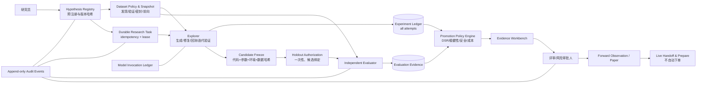
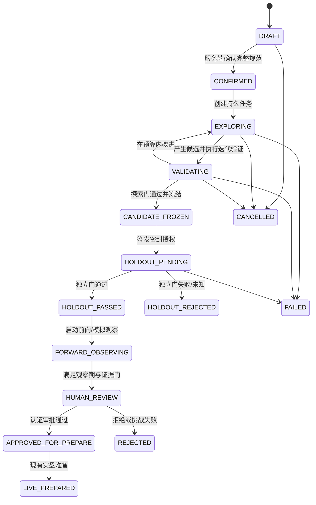

# 迭代 196 设计文档：可信 AI 策略研究流程

> 状态：目标合同 head 为 `20260908_ai_research_approval_authority`；当前回归状态须等待 `REGRESSION_6_WORKERS_20260908.md` 生成及 [IMPLEMENTATION_STATUS.md](IMPLEMENTATION_STATUS.md) 同步更新。未冻结前不使用 2026-09-07 数字声称目标 head PASS。
> 需求基线：[REQUIREMENTS.md](REQUIREMENTS.md)
> 验收基线：[ACCEPTANCE.md](ACCEPTANCE.md)
> 当前事实：[CURRENT_STATE_AUDIT.md](CURRENT_STATE_AUDIT.md)

## 1. 设计摘要

本设计在现有 AI 策略研究能力上增加五个可信性边界：

1. **不可变研究身份**：已确认假设、数据策略、搜索空间、主指标和成本假设形成内容哈希；
2. **探索/评估权限分离**：Explorer 只访问发现/迭代验证数据，Independent Evaluator 独占密封留出；
3. **追加式实验账本**：全量记录成功与失败，并用真实试验数执行 DSR 等选择偏差修正；
4. **持久状态机**：数据库 task + lease + heartbeat + stage cursor 取代进程内状态权威；
5. **证据化晋级**：服务端门禁、独立挑战和认证身份审批共同决定是否进入模拟/实盘准备。

设计不删除当前研究、模拟盘或实盘准备入口。v2 在功能旗标下与旧流程并行，旧产物只读显示为 `LEGACY_UNSEALED`，完成双写/影子校验后再切换默认入口。

## 2. 现状架构与设计依据

### 2.1 当前实现应保留的能力

| 能力 | 当前主要位置 | 设计处理 |
| --- | --- | --- |
| AI 研究页面 | `src/frontend/src/views/StrategyPage.vue` | 拆成独立证据工作台组件，保留路由与用户入口 |
| 页面状态/轮询 | `src/frontend/src/views/strategy/useStrategyPage.ts` | 拆成 domain store、表单、任务、证据与晋级 composable |
| API client/types | `src/frontend/src/api/strategy.ts`、`src/frontend/src/types/strategy.ts` | 增加 v2 类型、幂等头和结构化错误，不在组件拼装证据 |
| 现有研究 API | `src/backend/app/api/strategy/base.py` | 兼容旧端点；将 v2 路由拆到 `api/strategy/research.py` |
| 研究编排 | `src/backend/app/services/ai_strategy_research_service.py` | 收缩为兼容 facade；阶段职责下沉到领域服务 |
| 生成与谱系 | `src/backend/app/services/research/generation.py` | 扩展调用清单、哈希、实际模型版本和工具边界 |
| 稳健性/改进 | `src/backend/app/services/research/robustness.py` | 将旧 OOS 明确为迭代验证；禁止密封结果进入 improvement |
| 事件与晋级审计 | `src/backend/app/services/research/pipeline_audit.py` | 写入不可变 gate/evidence 引用，不只保存 JSON 摘要 |
| AI 研究模型 | `src/backend/app/models/ai_research.py` | 保留旧表并增加 v2 关系表/冻结字段 |
| 统计基础 | `src/backend/app/services/asset_research/evaluation.py` | 复用 `WalkForwardSplit`、purge/embargo、DSR |
| 严格晋级模式 | `src/backend/app/services/asset_research/promotion.py` | 复用 fail-closed 模式，阈值另建策略研究政策 |
| 持久任务模式 | `src/backend/app/models/asset_research.py`、`services/asset_research/task_runner.py` | 复用 idempotency + lease + heartbeat + CAS，不复用资产专属字段 |
| 现有大测试集 | `src/backend/tests/test_ai_strategy_research_service.py`、前端 StrategyPage 测试 | 保留回归；新增边界/失败注入/用户行为测试 |

### 2.2 当前关键问题的代码级解释

- 现有流程在每轮回测后执行 OOS，并将验证指标合并到下一轮改进上下文；因此它是可见的迭代验证，不是独立密封证据。
- `InvestmentMandate` 默认状态为 `confirmed`，而页面“确认”主要是本地状态；确认身份和确认内容没有形成稳定的服务端事实。
- 运行记录主要通过 workspace settings 保存有限 JSON，异步任务以进程内字典/协程为主体；恢复语义不足以保证关键副作用恰好一次。
- 当前质量分是门禁分数的聚合展示，尚未将完整搜索次数、多重检验与证据缺失作为晋级核心语义。
- 默认无知识库路径会返回确定性模板，但运行事件仍可能统一标记为 `ai_initial_draft`；来源标签不能证明实际调用过模型。
- 目标优化/改稿路径直接使用模型路由，尚未统一复用现有 AIChatService 的 budget、Prompt Registry、prompt hash 与 call log。
- legacy `workflow_steps` 过去只进入提示和摘要，未成为服务端执行图。本迭代保留兼容字段，但将其固化为 `prompt_display_only`：请求 schema、运行摘要、生成目标与 UI 都明确它只影响提示/展示，实际阶段以服务端运行记录为准；它不能作为 v2 执行编排输入。
- Docker/AST 等能力主要覆盖代码预检；正式研究回测仍可通过普通 `subprocess.Popen` 在当前解释器与宿主环境中执行，超时路径也不能证明完整进程树已终止。
- 生产 guard 主要强制 robustness；日期/OOS、完整数据覆盖和交易成本缺失仍可能以 skipped/warning 继续。
- 当前执行模型已有部分手续费/保证金支持，但滑点、成交量限制、停牌、价格限制和冲击并未形成统一、可证据化的研究门。
- `asset_research.evaluation.deflated_sharpe` 已接入 `purgedcv`，但当前把单条 returns 的方差传给依赖的 `var_sharpe`；依赖合同要求跨 trial Sharpe 方差，现有测试只断言结果非空，不能直接作为 P0 门禁。
- 前端预检虽然显示“阻断”，启动条件并未完整绑定预检证据；确认一致性也没有覆盖日期、成本和全部门禁字段。
- 取消/卸载不会完整终止旧轮询；历史 run 的异步 artifact 加载也可能因迟到响应覆盖新选择。
- 实盘批准请求可由浏览器固定填写审批者和多个确认布尔值；这不能构成独立责任证据。
- 配置档案快照可能包含 gateway JSON；必须改为密钥引用和服务端字段白名单。

## 3. 目标架构



### 3.1 信任边界

| 区域 | 可读 | 可写 | 明确禁止 |
| --- | --- | --- | --- |
| Browser | 当前用户可见的脱敏假设/证据/状态 | 用户草稿、操作意图、审批输入 | 自行声明审批身份、读取密钥、决定服务端硬门 |
| API | 认证用户资源、政策与证据摘要 | 规范化命令、审计事件 | 信任客户端 `approver`、`passed=true` 或未校验对象 ID |
| Explorer | 发现/迭代验证快照、批准工具 | candidate/trial/model invocation | 密封原始数据、留出结果反馈、审批和 live 操作 |
| Evaluator | 冻结候选、一次性留出授权、评估政策 | evaluation/gate evidence | 修改候选、生成代码、选择变体、调用 Explorer |
| Credential Vault/Profile | 密钥引用与最小公开元数据 | 管理员授权的引用 | 把 secret 放入 profile、日志、模型输入或证据包 |
| Approval | 只读证据包、认证角色、挑战记录 | 不可变 human decision | 修改证据、绕过硬门、由 AI 或前端伪造 actor |

### 3.2 Independent Evaluator 部署与凭据拓扑

逻辑拆分类不足以满足密封要求。v2 必须采用以下部署边界：

- API 只向专用 sealed-evaluation queue 写入不含原始留出位置的命令；API 不接触一次性原始 token；
- Explorer worker 使用 `ai_research_explorer` 服务身份，其数据访问 role/credential 不能读取密封 snapshot/authorization secret，对象存储 IAM 不能读取 sealed bucket/prefix；默认无通向 evaluator 内部接口的网络路由；
- Evaluator 是独立进程/worker pool，使用 `ai_research_evaluator` 身份，只能读取冻结 candidate artifact、指定 sealed snapshot，消费授权并 INSERT evaluation/gate evidence；不能读取 prompt/credential、调用 LLM gateway、写 candidate 或消费 Explorer queue；
- sealed queue、DB role、对象存储 credential、KMS key 与网络策略分别配置和轮换；任何共享应用超级凭据都使 AC-SEAL-001 失败；
- evaluator 容器默认无外网，仅允许受控 DB/queue/object-store；运行回执保存 worker identity、image digest 和 policy version；
- 本地开发可在同一宿主启动两个进程，但仍必须使用不同角色/凭据并通过拒绝测试；单进程函数调用仅可做 unit test，不能作为 T1 隔离证据。

### 3.3 Deployment Capability Registry

数据库类型不能单独证明或否定密封隔离。系统为每个部署保存签名的 capability profile，并在运行时绑定其版本：

| Profile | 默认能力 | 密封策略 |
| --- | --- | --- |
| `dev-single-process` | migration、schema、纯函数和 facade 测试 | `BLOCKED_TOPOLOGY_CAPABILITY`；不得签发真实授权 |
| `single-node-isolated-services` | 独立 Explorer/Evaluator/Sandbox 进程、独立队列与存储 credential；可使用同一宿主 | 只有进程、文件/DB、网络、queue 和 secret 拒绝测试全部通过才允许 |
| `multi-service` | 独立服务身份、DB/storage role、网络策略、KMS/secret、队列和对象存储 | 目标生产候选；仍须拒绝测试，不能因使用 PostgreSQL/MySQL/MariaDB 自动 PASS |

Registry 保存 `profile_id/version/topology/actor_mode/db_engine/service_identities/storage_boundaries/queue/network/sandbox/approval_capabilities/evidence_hash/verified_at/expires_at`。API、task、evaluation receipt 和 evidence package 都绑定该 profile；证据过期或缺能力时 fail-closed。

当前生产 Compose 基线没有独立 evaluator worker、sealed queue、对象存储/KMS 或 Explorer/Evaluator 分权凭据，因此只能作为待改造基线，不能被文档推定为已满足 profile。Sandbox 应作为独立 runner/service 交付；禁止为方便从 API/backend 容器直接挂载宿主 `/var/run/docker.sock`，因为这会扩大为宿主级权限。

## 4. 领域状态机与事务所有权

### 4.1 用户可见的派生生命周期

下图用于 UI 导航和解释，不是单表、单事务或权威持久化状态机。其节点来自 hypothesis、run/task、candidate/evaluation 和 promotion 四个聚合的只读投影；UI 不得直接把投影状态写回任一聚合。



### 4.2 四个权威聚合状态机

#### 4.2.1 Hypothesis（owner：Hypothesis Registry）

`DRAFT → CONFIRMED → SUPERSEDED`

- DRAFT 可修改；CONFIRMED 内容不可变；修改创建子版本并把旧版本投影为 SUPERSEDED；
- 只有 Registry 在数据库事务中推进状态和 confirmation audit；task/API 不能代写确认。

#### 4.2.2 Task/Run（owner：Durable Task Runner）

Task：`QUEUED → RUNNING → SUCCEEDED | FAILED | CANCELLED | TIMED_OUT`
Run stage：`CLARIFY/FREEZE_SPEC/GENERATE/VALIDATE/FREEZE_CANDIDATE/REQUEST_HOLDOUT/ASSEMBLE_EVIDENCE`

- `cancel_requested_at` 是 task 的持久意图；取消 hypothesis 或 candidate 没有意义；
- 接管只发生在 lease 到期后，通过 compare-and-swap 更新 lease token；
- 阶段输出先落不可变 artifact，再在事务中推进 stage cursor；
- 重试创建 stage attempt 或新 task（按失败类型），保留 `retry_of`；恢复次数不等于市场试验数。

#### 4.2.3 Candidate/Evaluation（owner：Candidate Registry + Independent Evaluator）

Candidate：`MUTABLE → FROZEN`；FROZEN 不可回退。
Evaluation：`PENDING → RUNNING → PASSED | REJECTED | FAILED | EXPIRED`。

- Candidate Registry 是唯一可执行 freeze 的服务；它核对内容 hash 和 epoch；
- Evaluator 只消费 FROZEN candidate 和有效授权；评价终态不可回退，技术重试写新的 attempt；
- `REJECTED` 不把 candidate 改回 MUTABLE，也不能触发同 epoch 继续调参。

#### 4.2.4 Promotion/Approval（owner：Promotion Service）

`INELIGIBLE → RESEARCH_ELIGIBLE → FORWARD_OBSERVING → HUMAN_REVIEW → APPROVED | REJECTED | EXPIRED → LIVE_PREPARED`

- Promotion 状态来自不可变 gate/evaluation/forward/human decision 引用；缺证保持 INELIGIBLE/BLOCKED；
- APPROVED 后证据 hash 或 policy 改变产生 EXPIRED，不删除旧决定；
- `LIVE_PREPARED` 只表示锁定环境已准备，不表示 deployed/running，更不表示已下单。
- approval request 自身使用 `PENDING → DECIDED | EXPIRED | REVOKED`；`EXPIRED` 由数据库时钟和持久 `expires_at` 派生，不依赖浏览器倒计时。上下文 DTO 分开 `can_decide` 与更严格的 `can_approve`；后者在 request/grant/profile/decision 过期、拒绝围栏存在、主体非 HUMAN 或证据非当前时必为 false。这些布尔值只是安全投影，decision command 仍在同一事务内重验所有权威事实。

### 4.3 跨聚合不变量与协调

| 不变量 | 强制位置 |
| --- | --- |
| 未 CONFIRMED hypothesis 不能创建 run | task submit command handler |
| run 只能引用一个不可变 hypothesis version/experiment epoch | run FK + request hash unique |
| 未 FROZEN candidate 不能创建 holdout authorization | Candidate Registry/Evaluator transaction |
| 同 epoch 揭盲后不能生成新的可复用 holdout candidate | Experiment Epoch policy + unique/lock |
| evaluation 不能修改 candidate；Explorer 不能写 evaluation | DB role + service API + ownership check |
| hard gate 未全 PASS 不能创建 human approval | Promotion Service transaction |
| approval 的 evidence hash 改变后不能 prepare | prepare precondition/ETag |

跨聚合流转通过 transactional outbox + 幂等 command 协调；每个 command 保存 source entity/version、expected state、idempotency key 和 trace ID。外部计算不跨数据库事务；失败重放同一 command 只返回既有结果。不存在一个“万能 orchestrator”直接 UPDATE 四类状态。

### 4.4 已实施的工作流版本与发现提交边界（2026-09-06）

实现按持久 `workflow_version` 分步交付：`generation-v1` 保留旧 CLARIFY→GENERATE 图，`discovery-v1` 增加 VALIDATE_DISCOVERY；这不是删减 S3/S3b/S5 的完整研究目标。版本由服务端新任务设置选择，API 客户端和模型均无权指定 successor；队列领取/恢复按版本隔离，幂等重发保留原图。

GENERATE 只接受 typed materialization proposal；发现阶段只接受持久 execution ID。发现 trial、工件/binding、journal 关联、stage 状态/完成事件由 StageAttemptService 在同一数据库事务提交，task/run 最终收口可在之后独立完成；重启只读采纳完整成功 checkpoint，不能重新发起市场计算。取消后与未知结果的受控对账仍是独立待完成路径，不允许自动释放/归零试验预算。

事务写锁统一遵循 epoch→task→run→attempt；数据库降级若存在新图/未知图必须拒绝，不能 drop 版本后借默认值把新图重新解释为旧图。部署接线、已执行证据及剩余范围见 [版本化发现工作流](DISCOVERY_WORKFLOW_20260906.md)。

## 5. 数据模型

建议新增以下 v2 表；具体 Alembic revision 在实施时基于实时 head 生成，建议文件路径为 `src/backend/alembic/versions/<revision>_ai_strategy_research_trust.py`，不得手写一个可能与现有 head 冲突的 revision。物理命名政策为：已有表保留兼容名称（例如 `ai_strategy_research_versions`），所有新增 v2 表统一使用 `ai_research_` 前缀；不得仅为命名一致性重命名历史表。

### 5.1 `ai_research_hypothesis_versions`

| 字段 | 约束/说明 |
| --- | --- |
| `id`, `user_id`, `workspace_id` | UUID；所有权与租户索引 |
| `version_no`, `parent_version_id` | 同一 hypothesis 递增且唯一 |
| `status` | `DRAFT/CONFIRMED/SUPERSEDED` |
| `canonical_payload` | 规范化研究问题、资产、时间、成本、主指标、失效条件、搜索空间 |
| `content_hash` | SHA-256，用户/服务端共同显示；同一版本不可变 |
| `source_mandate_id` | 可选，指向旧 `InvestmentMandate` 以兼容迁移 |
| `confirmed_by`, `confirmed_at` | 只由服务端认证上下文写入 |
| `created_at` | 审计时间 |

确认后禁止 UPDATE `canonical_payload/content_hash`；修改创建子版本。

### 5.2 `ai_research_experiment_epochs`

保存 `hypothesis_family_hash/search_budget/dataset_policy_version/holdout_budget/status/selected_candidate_id/parent_epoch_id/opened_at/disclosed_at/closed_at`。family hash 由预注册问题、资产/时间、主指标和搜索空间规范化得到，不能通过客户端换 candidate ID 改写。candidate 和留出授权都必须属于一个 epoch；揭盲前锁定唯一 `selected_candidate_id`，第一次有效留出揭盲后按 policy 关闭整个 epoch，后续轻微变体不能复用同一密封证据。需要继续研究时，创建子 epoch，并绑定新的自然前向窗口或由数据策略选择的未揭盲快照；不能由研究员挑选最有利留出。

### 5.3 `ai_research_dataset_snapshots`

历史 snapshot 除 `dataset_policy_version`、Discovery/Iteration Validation/Sealed 边界、instrument identity、provider/source manifest、frequency/timezone、adjustment/continuous-contract policy、PIT cutoff、vintage、fold manifest、purge/embargo、`content_hash`、license tags 与创建时间外，还必须保存由服务器对象解析器签发的 `object_receipt_id/object_logical_id/object_version/object_digest/object_size_bytes/integrity_status/integrity_checked_at/integrity_receipt_hash/snapshot_identity_hash`。浏览器只提交不透明 `object_receipt_id`；不得提交 URI、version、digest 或 size。解析器以受控对象身份重建这些字段，严格路径重验签名快照；历史 `storage_uri` 写入兼容快照一律标记 `LEGACY_UNVERIFIED`，不能启动、物化、冻结、评估、出证据包或晋级。密封对象实际位置仍是受控引用，普通 API 不返回。

Forward Observation 在运行开始时只保存 `forward_observation_policy`（来源、开始条件、最小天数/事件数、允许延迟和质量门）。候选冻结后按到达时间追加 `ai_research_forward_observation_epochs/snapshots`；每条追加只能引用新的不透明对象 receipt，由同一事务生成经证明的 dataset snapshot，并保存 event-time、ingest/as-of、candidate freeze time 与身份哈希。不得把冻结前已经存在的历史区间重命名为 forward；任何关联 snapshot 的完整性失效都令 epoch 保持阻断。

### 5.4 `ai_research_runs`

将 workspace JSON 中的运行摘要升级为数据库权威记录：`id/user/workspace/hypothesis_version/dataset_snapshot/protocol_version/status/stage_cursor/promotion_policy_version/trace_id/created/started/completed`。摘要可缓存，但不能以“最近 20 条 JSON”代替权威历史。

### 5.5 `ai_research_tasks`

复用 `AssetAnalysisTask` 模式：

- `idempotency_key + idempotency_request_hash`；
- `lease_token/lease_expires_at/lease_heartbeat_at` 成对约束；
- `attempt_count/retry_of_task_id/cancel_requested_at`；
- `stage_cursor/request_json/error_code/trace_id`；
- `status/progress/created/started/completed`；
- 索引：`user,status,created_at` 与 `status,lease_expires_at,created_at`。

长轮询只能由部署拥有的 Explorer worker 进程显式调用
`run_research_protocol_worker(worker, stop_event, poll_interval_seconds)`；API 进程不提供默认
startup hook 或默认 executor factory。进入轮询前，worker 必须已经注入完整的 v2 核心图
`CLARIFY/GENERATE` 执行器；否则以 `RESEARCH_WORKER_EXECUTORS_INCOMPLETE` 在恢复或领取任务前
失败。这样，缺部署配置不会把排队中的用户任务逐个转成“执行器不可用”的伪运行失败。

worker 读取到当前 `RUNNING` lease 后、调用任何 stage executor 前启动 CAS heartbeat，并持续覆盖
外部执行和 checkpoint 提交；默认 cadence 为 `min(lease_ttl / 3, 60s)`（实现下限 0.1 秒）。续租
失败不授权旧 worker 继续提交：后续 checkpoint/finalize 仍由 lease token CAS 拒绝，外部结果不明
的任务走既有的保守 expiry/reconciliation 路径，不能因为本地 worker 仍在运行而假定副作用未发生。

### 5.6 扩展 `ai_strategy_research_versions`

现有 `AIStrategyResearchVersion` 增加：

- `candidate_hash`、`environment_hash`、`dataset_snapshot_id`；
- `freeze_status/frozen_at/frozen_by`；
- `hypothesis_version_id`、`parent_version_id`；
- `legacy_evidence_class`；
- 禁止冻结后修改 code/params/依赖/数据绑定。

代码正文可继续保存在表中或迁移到内容寻址对象存储；无论位置如何，数据库保存内容哈希和 URI。

### 5.7 `ai_research_trials`

| 字段组 | 内容 |
| --- | --- |
| Identity | `id/run_id/candidate_id/parent_trial_id/ordinal/idempotency_key` |
| Inputs | code/params/dataset/fold/cost model/metric definition/random seed hashes |
| Lifecycle | state、stage、started/completed、error code、cancel/timeout reason |
| Metrics | 结构化摘要 + 返回序列 artifact hash/URI |
| Counting | `observed_market_performance`、`counts_as_market_trial`、计数理由 |
| Provenance | model invocation IDs、executor/build/environment hash |

禁止硬删除；纠错事件引用原 trial。

### 5.8 `ai_research_model_invocations`

保存 provider、requested model、resolved model/revision、provider request ID、prompt template/version、system/input/output hash、采样参数、token/费用、工具清单、origin、transformation chain、fallback chain、知识截止声明、started/completed/error。敏感原文单独受控存储；常规 API 只返回脱敏摘要和哈希。来源、转换和 fallback 是独立可组合维度，不使用一个互斥标签丢失谱系。

实际生成 adapter 的 `resolved_model` 表示部署配置 pin，另用可空 `provider_reported_model` 保存供应商响应 `model`，不混为一个事实。严格生成 gateway 要求两者精确匹配；缺失/不匹配均失败关闭，旧 invocation 观察字段保持 NULL，不能回填 pin 冒充实际型号。出站输入的携密键在 dispatch claim 前拒绝；合法正整数 `max_tokens` 保留数值，其他凭据仍脱敏。实际 HTTP 边界、未知 usage 及费用限制见 [生成部署合同](GENERATION_PROVIDER_DEPLOYMENT_20260905.md)。

### 5.9 `ai_research_evaluations`

保存 `experiment_epoch_id/candidate_id/dataset_snapshot_id/evaluation_type/evaluator_identity/evaluator_version/authorization_id/returns_artifact_hash/metrics/gate_inputs/status/started/completed`。`SEALED_HOLDOUT` 对 `(experiment_epoch_id, dataset_snapshot_id, policy_version)` 设置唯一有效约束，并校验 candidate 等于 epoch 的预先锁定选择；不能靠新 candidate ID 重复消费。

### 5.10 `ai_research_holdout_authorizations`

保存 experiment epoch/候选/数据/政策绑定、opaque token hash、状态 `ISSUED/CONSUMED/EXPIRED/REVOKED`、issued/consumed/expiry、issuer 和 evaluator identity。原始 token 不落普通日志。

### 5.11 `ai_research_gate_decisions`、`ai_research_human_decisions` 与 `ai_research_governance_decisions`

- Gate：`gate_code/policy_version/input_evidence_hash/status/reason/executor_version/evaluated_at`；
- Human：`decision/actor_id/domain_permissions/approval_mode/single_actor/requested_at/eligible_at/decided_at/comment/challenge_records/risk_ack/evidence_package_hash/idempotency_key/expires_at`；approval request 与 decision 分两步，服务端验证 actor mode、冷却期和 policy；
- Governance：`deviation_id/target_requirement_or_gate/original_status/reason/risk/compensating_controls/actor/scope/effective_at/expires_at/revoked_at`；只记录偏差，不改写原研究门禁状态；
- 人工批准只能在所有 hard gate PASS 时创建；证据包变化使旧决定失效，但不删除旧决定。

#### 5.11.1 终态命令证据与审批权威（2026-09-08 加固）

审批权威不再以 candidate-wide manifest 或“最近一条决定”推断，而是沿一条精确、可重新计算的命令图解析：

```text
candidate-freeze receipt
  → holdout evaluation command
  → one-time authorization + evaluation
  → deterministic execution operation/journal
  → controlled artifact binding + terminal access audit
  → command-scoped evidence package v2 + 13 current gates
  → approval request
  → immutable human decision
      ├─ APPROVED: currentness revalidation
      └─ REJECTED/REQUESTED_CHANGES: immutable denial fence
```

持久模型与核心约束如下：

| 模型/表 | 权威材料与约束 |
| --- | --- |
| `ai_research_holdout_evaluation_commands` | 唯一 command ID、owner/run/candidate/freeze/snapshot/policy/request hash；公开轮询只返回安全状态，不返回内部 evaluation ID 或 bearer。 |
| `ai_research_holdout_executions` | 确定性 operation ID、canonical command hash、lease generation、dispatch/inspect/terminal receipt；`UNKNOWN/RECONCILING` 先读回，禁止换 operation 重发。 |
| artifact binding / terminal access audit | 精确绑定 command、evaluation、authorization、operation、artifact 摘要和终态；附近 artifact 或仅 candidate 级清单不合格。 |
| `ai_research_evidence_packages` v2 | 每个 terminal command 最多一个 `ACTIVE` 包；manifest、approval binding hash、13 门输入与状态可重算；仅允许受控 `ACTIVE → WITHDRAWN`，withdraw 后审批立即不可用。 |
| `users.principal_kind` | 服务端身份事实；限 `HUMAN/SERVICE/UNKNOWN`、`NOT NULL`。受控交互式注册路径可显式写 `HUMAN`，数据库 server default 与存量迁移回填均为 `UNKNOWN`；不从 role/session 猜测。 |
| `ai_research_approval_grants` | 仅允许 active `principal_kind=HUMAN` subject/issuer，精确绑定 run/workspace/permission 和 DB-clock TTL；签发和撤销只能经 `research:manage-approval-grants`，默认产品角色不继承。 |
| `ai_research_approval_grant_audits` | 每次 `ISSUED/REVOKED` 的 policy/material/command/reason hash、actor、scope 与幂等键；只追加。一个有效 grant 必须恰好存在一条与 grant 全材料一致的 `ISSUED` audit；grant 已撤销时还必须恰好存在一条与 grant/revoker/scope/reason/material/revoked_at 一致的 `REVOKED` audit。孤儿、重复、篡改或错绑都不可作为权威来源。 |
| `ai_research_approval_requests` | owner 发起，绑定唯一 evidence package、gate input、approval policy/material hash、mode、DB-clock `eligible_at/expires_at` 与完整 server-side request material hash。到期请求投影 `EXPIRED`，不再使 `can_approve` 为 true。 |
| `ai_research_human_decisions` | 每个 request 最多一个决定；actor/grant/challenge/risk/reason/evidence/policy 全材料 hash 绑定；另返回只含浏览器已知语义的 `decision_intent_hash`，允许 reason 被安全显示为 `[REDACTED]` 时仍精确对账；读取当前批准时在 candidate 锁内先查精确 denial fence，再重新选取并验证决定。 |
| `ai_research_approval_denial_fences` | `REJECTED/REQUESTED_CHANGES` 与决定同事务建立，scope 包含 candidate、package、gate、promotion/approval policy material；同 scope 换 key/请求也不能批准。fence 的存在性先于决定时间/ID 排序，同一 DB timestamp 也不存在排序绕过。 |

Capability Profile 的 `approval_capabilities` 必须与服务端不可变 policy catalog 的完整 material hash 一致；profile 行追加式保护，任何同 version 内容漂移、过期、issuer/subject 非活跃或 grant 歧义均 fail-closed。四眼审批仍属于 `FR-GATE-009 / DEFERRED_P1`，本设计不把 multi-actor 的单个 grant 冒充四眼完成。

grant 的当前权威解析锁定 grant 及其唯一 `ISSUED` audit，重验 principal/issuer/subject/scope/permission/policy/material 和 DB-clock TTL。issue/revoke 的 commit ACK 不明时，只能用原幂等键和全材料 hash 查找唯一 audit 读回；结果不唯一、无法匹配，或读回自身发生 DB/解析/超时异常时，service 必须捕获并安全收口为 UNKNOWN/失败关闭，不改换 operation、不重发、不向 API 复制原异常。历史 decision replay 仍要求当时的唯一 `ISSUED` audit 精确，且必须同时满足 `issued_at <= decided_at < expires_at` 以及 `revoked_at IS NULL OR decided_at < revoked_at`；若 `revoked_at` 非空，还要求恰有一条与撤销事实全材料匹配的 `REVOKED` audit。`decided_at == revoked_at` 无法证明决定先于撤销，必须 fail-closed；决定后的合法撤销或当前到期只使“当前批准”失效，不篡改可验证的历史事实。

denial fence 的精确 20 路竞争采用两层证据，但共享同一 P0 语义断言：1 个 `REJECTED` 与 19 个 `APPROVED` 并发后只能留下一个不可变 fence、零个 current approval，预先存在的 pending request 也不能绕过。

- **`LOCAL_T1` / SQLite**：在同一进程内启动 20 个真实 `ApprovalService` 调用；每个调用在进入决定操作、竞争 `_operation_lock` 前到达 barrier 并报告 ready，由同一 release signal 释放。该层证明 service 入口到事务结果的进程内线性化与 denial-fence 语义；若负向调用在其余调用释放前已经完成，则只是顺序拒绝，不能计入该层。它不证明数据库的跨进程锁或 commit 竞争，也不得被描述成 20 个独立连接已经同时到达提交点。
- **真实 online DB lane**：PostgreSQL、MySQL、MariaDB 必须分别启动 20 个独立 process 与独立 connection；各竞争者完成初始化并在尝试数据库候选锁/行锁或 commit 前报告 ready，再由同一 signal 放行 1 个 `REJECTED` 与 19 个 `APPROVED`。保存 engine/version、process/connection identity、ready/release、锁/commit 结果和最终 fence/current-approval 读回；SQLite、`_operation_lock` 或本地六 worker 结果不能替代。三个 lane 当前均为 `NOT_RUN_CURRENT_HEAD`，取得真实 online 原始证据后才可分别裁决。

`ai-research-human-decision-intent/v1` 的规范化是跨语言协议：reason、每个 challenge answer 与 residual-risk text 先按 Python `str.strip()` 的码点集剥除首尾，即 `U+0009–U+000D`、`U+001C–U+001F`、`U+0020`、`U+0085`、`U+00A0`、`U+1680`、`U+2000–U+200A`、`U+2028`、`U+2029`、`U+202F`、`U+205F`、`U+3000`；`U+FEFF` 必须保留。challenge records 依服务端 policy key 顺序组装，字符串只以 SHA-256 身份进入最终 material；最终使用字典 key 排序、紧凑分隔符、不 ASCII escape 的 canonical JSON UTF-8 bytes 取 SHA-256。浏览器不得用 JavaScript `trim()` 近似代替。

human-text 安全 DTO 在服务端执行以下不可交换的顺序：①对未脱敏的原始 reason/challenge/risk 执行上述规范化并计算/持久化 `decision_intent_hash`；②仅从明确字段白名单构建 public service DTO，禁止 ORM/domain `dict()` 透传；③对每个可公开的 human-text 递归执行 deny policy，任意 RFC `scheme://`、带 userinfo/凭据 URI、POSIX 绝对路径、Windows drive 或 UNC 绝对路径、sealed/raw 内容命中时不返回部分原文，而是整字段投影为稳定 `[REDACTED]`；④gate reason 只从版本化稳定 code registry 选取，未登记值为 `RESEARCH_GATE_REASON_REDACTED`，未登记 API error 为 `RESEARCH_APPROVAL_OPERATION_FAILED` 且不复制原 `message/details`。所有外部 hash 输入/读回在 service 层必须是预定长度的小写十六进制字符串；bytes、number、list/object 或任意其他类型不隐式 `str()`，而是以稳定通用错误 fail-closed。必须先计算原始语义 intent 再做公开投影；从脱敏文本重算 hash 或依赖前端拦截均不合格。

### 5.12 `ai_research_stage_attempts` 与 `ai_research_artifacts`

- Stage attempt 保存 `run/task/stage/attempt/status/lease_token/input_hash/output_artifact_id/error/started/completed`，用于安全检查点和重启恢复；
- 成功回执与 task/run 的 `stage_cursor` 向服务端批准后继阶段的推进必须在同一事务提交。租约接管时，新 lease 只能查询并原子采纳同一 task/stage 的既有 `SUCCEEDED` 回执；旧 lease token 保留为审计事实，不能被新 worker 复写，也不能因游标尚未来得及推进而重放外部副作用；
- **每个 `SUCCEEDED` 必须有 output receipt**：由 broker 对本地 bytes/text 自行计算 hash、大小和 `controlled://local-stage-output/<hash>` URI，写入 `artifact content + owner/run/task/attempt binding` 后才能完成；完成和恢复均重验 binding、SHA-256 与长度。无工件、旧无绑定 checkpoint、篡改 blob、编码路径分隔符或不匹配的 run/request hash 必须 fail-closed。已终态 attempt 的 idempotent retry 只读/验证，不能再次改变 cursor；
- v2 当前可执行核心图由服务端固定为 `CLARIFY → GENERATE → terminal`。执行器回报的 `next_stage` 必须等于该图的唯一后继，否则记为 `RESEARCH_STAGE_TRANSITION_INVALID`；新增实际阶段前必须先扩展并验收该图，不能由客户端或执行器自由跳转；
- `GENERATE` 的正向路径只接受 typed `ProposedGeneration`；服务器在同一数据库事务内重验 run/task/attempt/request binding、受证明数据 snapshot 和调用输出哈希，然后创建可变 candidate、代码/参数/依赖/模型谱系 manifest、artifact binding、materialization receipt 与阶段结果。任一校验失败或同逻辑对象的版本/摘要漂移必须失败关闭且不留下 candidate；没有对象解析器时同样拒绝物化。generic terminal success 即使带有绑定工件仍以 `RESEARCH_GENERATION_CONTRACT_UNAVAILABLE` 收口。该合同仅表示 `MATERIALIZED_NOT_EXECUTED`：生成 executor 可调用配置的 Provider，materializer 本身不再次调用模型；二者都不调用 Sandbox、backtest、Evaluator、审批或市场试验，也不能证明策略有效。当前生成 factory 的公开 worker 链路只有本地 HTTP transport seam 验收，非真实供应商验收。
- stage、物化与 artifact 新写入在数据库当前 UTC 下复核未过期 lease，包括对象重验之后的最后一道检查；应用时钟/审计 `now=` 不提供授权。终态完全相同的只读 replay 不复活 lease，也不重写游标。
- Artifact 保存 `kind/content_hash/storage_uri/size/media_type/schema_version/producer_identity/container_image_digest/created_at`；普通 API 不暴露受控 URI；
- 同一 stage 的技术重试可以产生多个 attempt，但通过幂等键只提交一个有效输出；
- code、returns、fold manifest、模型输入输出、evaluation 和 evidence package 都通过 artifact identity 关联，而不是散落在易被覆盖的 JSON。

### 5.13 追加事件

保留 `ResearchPipelineEvent` 作为兼容事件源，并为 v2 增加 `event_type/entity_type/entity_id/sequence_no/previous_event_hash/event_hash/trace_id`。如果暂不实现哈希链，至少保证数据库权限下的 append-only 和纠错事件语义；不能将普通 SHA-256 描述为防数据库管理员篡改的密码学账本。

### 5.14 保留、删除与证据失效

P1 Retention/Privacy Policy 预定义可删除字段、最小墓碑、密钥销毁、artifact/evidence 引用失效和导出排除。任何依赖已删除原始证据的历史 PASS 在只读投影中变为 `WITHDRAWN/UNVERIFIABLE`，但原决定和删除事件的非敏感墓碑仍追加保留；物理擦除不得静默留下仍显示有效的晋级结论。

### 5.15 `ai_research_quota_buckets` 与 `ai_research_quota_reservations`

预算硬门必须是数据库中的预留合同，不能以“读取历史成本后再调用”的非原子检查实现。

`ai_research_quota_buckets` 保存：

| 字段组 | 内容 |
| --- | --- |
| Identity | `id/scope_type/scope_id/policy_version/resource_type/window_start/window_end`；同一 scope、资源、窗口唯一 |
| Limit | `hard_limit/concurrency_limit`，单位由 `resource_type` 固定（token、金额、backtest CPU-second 或 slot） |
| Aggregate | `reserved_amount/settled_amount/active_reservations/status/reconcile_reason`；数值不得小于 0 或超过 policy 允许边界，`status` 至少含 `ACTIVE/BLOCKED_UNKNOWN` |
| Concurrency | `version/next_fencing_token/updated_at`，支持行锁或带 version 的条件更新 |

`ai_research_quota_reservations` 保存：

| 字段组 | 内容 |
| --- | --- |
| Identity | `id/bucket_id/task_id/stage_attempt_id/idempotency_key/resource_type`；`(bucket_id, resource_type, idempotency_key)` 唯一 |
| Amount | `reserved_amount/settled_amount/unit`；实际可能超过预留时必须先增量预留，不能事后透支 |
| Lifecycle | `RESERVED/IN_FLIGHT/RECONCILING/SETTLED/RELEASED/EXPIRED/BLOCKED_UNKNOWN`、`lease_expires_at/fencing_token/created_at/settled_at/released_at` |
| Evidence | `policy_version/request_hash/provider_or_runner_operation_id/reason/trace_id`；模型联合预算另存 nullable `reservation_context`，包含原 run request hash、实际出站 body hash、政策快照/hash、输入/输出上界和金额上界；历史 NULL 不按现价回填 |

原子算法：

1. 在调用 provider/runner 前开启事务，锁定 bucket（PostgreSQL/MySQL 行锁；SQLite 使用短时串行写事务）或用 `version` CAS；一个 stage 需要多种资源时，按稳定的 `(scope, resource_type, window)` 顺序锁定，并在同一事务全部预留或全部回滚，禁止部分成功；
2. 在同一事务内校验 `hard_limit`、`concurrency_limit` 与窗口，插入唯一 reservation，更新 bucket aggregate；失败返回 `BLOCKED_BUDGET/QUOTA`，不得启动外部副作用；
3. worker 只能持匹配的 reservation ID、lease 与 fencing token 执行；重试同一 idempotency key 返回原 reservation，不能重复占额。调用前先把客户端生成或 provider 返回的 operation/idempotency ID 持久化并转为 `IN_FLIGHT`；
4. 完成后用 CAS 结算，只有已证明未执行/未计费的取消才可用 CAS 释放；旧 token、重复 settle/release 和跨 task 使用均拒绝并留痕；
5. lease 过期只证明旧 worker 不能提交本地结果，不证明外部 provider 没有执行。reconciler 先推进 fencing token，再把外部结果不明的 reservation 转为 `RECONCILING`：若 provider 支持 operation 查询/幂等读回，则按终态和实际 usage 结算；无法确认未执行时不得释放，必须保留预留、按 policy 以最大预留保守结算，或把 reservation/bucket 标为 `BLOCKED_UNKNOWN` 等待人工对账；
6. 仅对能证明已停止且不会继续消耗的内部 runner，完成 fencing、进程组终止和 operation read-back 后，才允许将未使用 reservation 标为 `EXPIRED` 并回收 aggregate。禁止只按墙钟回收后让接管 worker 再次消费；
7. 每个目标数据库均执行真实多连接并发、崩溃接管、外部响应丢失和 reconciliation 测试。SQLite 通过只允许一个配额写事务提供 core 正确性，但不能据此声明多服务隔离能力。

bucket aggregate 与 reservation 明细必须可对账；差异、负数、超限或未知外部结果使 quota profile `BLOCKED`，由审计修复流程处理，不能静默调平。

模型联合预算实现契约见 [MODEL_BUDGET_BUNDLE_20260905.md](MODEL_BUDGET_BUNDLE_20260905.md)。纯文本生成只接受受审、版本固定的 all-inclusive 计费合同；Token 上界覆盖输入与输出，金额使用 `model_cost_microusd/microusd` 整数，并对输入/输出分别向上取整。严格结算必须取得两个独立计数，保守费用以 `CONSERVATIVE_TARIFF_BOUND` 标注，不伪装成已核对的供应商发票。quote 与发送使用同一不可变 bytes；联合 claim/settle 不准退化为逐项提交。审核 hash 只证明绑定，不能替代供应商收费上界、价格和有效期的 T2 外部证据。

## 6. 数据切分与统计设计

### 6.1 三个历史分区 + 前瞻观察策略

```text
运行创建时已有历史数据：
|  Discovery  | Iteration Validation | Sealed Holdout |
     AI 可见           AI 可见             AI 不可见

candidate_freeze_at ───────────> Forward Observation Epoch 1 ──> Epoch 2 ...
                                  只接收冻结后自然到达事件
```

- 时间序列 fold 必须保持时序，按标签/持有期执行 purge，并按政策执行 embargo；
- 数据 snapshot 在运行开始前形成或绑定，不能在结果出现后静默换数；
- 默认不允许用随机 K-fold 替代时间序列切分；
- 简单留出本身不充分，因此探索验证还要执行 walk-forward/状态分层，最终统计还要考虑搜索次数；
- 数据供应商修订必须创建新的 vintage/snapshot，不覆盖历史。
- forward observation 的 event-time 和 as-of 必须晚于 candidate freeze（允许的供应延迟由 policy 显式规定）；运行开始时只能冻结观察政策，不能预造未来证据。

### 6.2 搜索计数

- `attempt_count_total`：每个已提交 trial；用于运行与成本分析；
- `market_trial_count`：所有已观察市场性能的独特候选—数据—评估组合，作为 P0 DSR 的保守搜索次数；
- worker 技术重试如读取同一已持久 artifact 且未重新计算市场结果，不增加市场试验数；重新运行且观察新结果则增加；
- P1 的 `effective_trial_count` 仅作为补充；必须展示算法版本、相关性依据和保守下界。

### 6.3 DSR 与门禁

服务端复用现有 `purgedcv.deflated_sharpe_ratio` 依赖，并升级 `asset_research.evaluation.deflated_sharpe` 的适配合同。输入必须来自账本：

- 完整且有序的策略净收益序列；
- 收益频率/年化约定；
- `market_trial_count`；
- 所有计数 trial 的 Sharpe 及其同单位方差（不是候选 returns 的方差）；
- 从 trial 账本派生 benchmark 所需的输入/方法版本，以及独立配置的最小 DSR probability 阈值；
- 成本与滑点已经计入的证据。

建议将 wrapper 改为显式接收 `trial_sharpe_variance`（或完整 trial Sharpes 并由一个版本化函数计算），同时保留频率单位转换。SR*/benchmark 必须由 `n_trials + trial Sharpe distribution + implementation version` 派生，不能开放任意数值覆盖；可版本化配置的是最低 DSR probability、适用 scope 和输入/年化合同。迁移前对现有调用者做影响审计，不能静默改变历史门禁数值。返回 `value/probability/inputs_hash/implementation_version/status/reason`。缺少输入直接 `UNKNOWN/BLOCKED`。

当前 `purgedcv` 仅属于 dev 依赖；实现 S2 时必须把批准版本加入生产 extra/lock，验证目标生产镜像可 import，并对版本升级做 oracle 回归。开发环境存在依赖不能作为生产统计门可执行证据。

### 6.4 其他独立门

- 数据/PIT/vintage/purge/embargo；
- 预注册主指标与最小样本；
- drawdown、交易数、换手、成本/滑点、容量；
- 参数敏感性、market regime、极端路径；
- 沙箱、静态安全和回测/模拟执行语义一致性；
- 密封留出；
- 前向/模拟盘观察；
- 人工挑战与审批。

任何一项硬门不能被综合分数抵消。综合分仅用于排序/导航，并必须同时显示各门状态和未知项。

## 7. 后端组件设计

### 7.1 新增服务（建议精确路径）

| 文件 | 责任 |
| --- | --- |
| `src/backend/app/services/research/hypothesis_registry.py` | 规范化、hash、草稿/确认/版本差异 |
| `src/backend/app/services/research/dataset_policy.py` | 三个历史分区、forward policy、PIT snapshot、fold manifest、授权前检查 |
| `src/backend/app/services/research/dataset_integrity.py`、`dataset_registry.py` | 服务器受控对象 receipt、快照身份哈希、重验和 legacy 未验证快照拒绝 |
| `src/backend/app/services/research/experiment_ledger.py` | trial/attempt 追加、计数规则、返回 artifact 引用 |
| `src/backend/app/services/research/candidate_registry.py` | candidate identity、冻结和不可变校验 |
| `src/backend/app/services/research/generation_materialization.py` | typed `GENERATE` proposal 的原子 candidate/manifest/artifact materialization；仅生成候选，不执行研究 |
| `src/backend/app/services/research/independent_evaluator.py` | 消费留出授权并产生不可变 evaluation |
| `src/backend/app/services/research/holdout_finalize.py` | 重验 authorization/evaluation/lease，原子提交 artifact、终态访问审计和 command 结果 |
| `src/backend/app/services/research/holdout_execution_contract.py`、`holdout_execution_journal.py` | 确定性 operation、wire/result receipt、dispatch/inspect 与 UNKNOWN 对账 |
| `src/backend/app/services/research/holdout_worker.py`、`holdout_worker_process.py` | 默认关闭的独立 holdout poll/heartbeat/recovery 组合根与受限 factory bootstrap |
| `src/backend/app/services/research/http_holdout_executor.py` | HTTPS evaluator seam；TLS/身份/真实部署仍需 T2/T3 证据 |
| `src/backend/app/services/research/promotion_policy.py` | 策略研究专属 hard gates、DSR、证据 hash |
| `src/backend/app/services/research/task_runner.py` | DB lease/heartbeat/CAS/stage cursor/cancel |
| `src/backend/app/services/research/workflow_worker.py` | 固定 server-owned stage 图、阶段 checkpoint、执行中 heartbeat，以及仅供独立 Explorer 进程调用的显式 poll loop |
| `src/backend/app/services/research/worker_process.py`、`src/backend/scripts/run_ai_research_v2_worker.py` | API 生命周期外的 Explorer bootstrap/CLI；双 flag、受限镜像内 factory namespace、返回类型和完整 executor map 均在首次 recover/claim 前失败关闭 |
| `docker/compose/trusted-research-explorer.yml` | 默认不启动的 Explorer compose overlay；无 host port/volume、非 root/read-only/drop capabilities；仅为启动契约，不能证明 sealed Evaluator 或 Sandbox capability |
| `src/backend/app/services/research/quota_reservation.py` | LLM/回测预算原子预留、结算、释放与并发硬上限 |
| `src/backend/app/services/research/evidence_package.py` | 构建、脱敏、hash、冷重放清单 |
| `src/backend/app/services/research/llm_gateway.py` | 适配现有 AIChatService：Prompt Registry、预算、调用日志、typed response、污点/脱敏 |
| `src/backend/app/services/research/deployment_capabilities.py` | topology/actor capability profile、证据有效期和 fail-closed 判定 |
| `src/backend/app/services/research/approval.py`、`approval_authority.py` | evidence/request/decision/denial fence、服务端 policy/material、grant 签发撤销、single/multi actor 与 DB-clock 冷却期 |
| `src/backend/app/services/research/governance.py` | 服务器 allowlist、追加式偏差记录、actor/scope 绑定、幂等与撤销；只能保留原 FAIL/BLOCKED/NOT_RUN，不能制造 PASS |
| `src/backend/app/api/strategy/research.py` | v2 HTTP 边界、认证/所有权/幂等 |

### 7.2 修改现有文件

| 文件 | 设计修改 |
| --- | --- |
| `src/backend/app/models/ai_research.py` | 增加 v2 ORM；旧模型保留兼容读取 |
| `src/backend/app/models/user.py` | 增加服务端所有 `principal_kind`；应用默认只用于受控交互式注册，DB default/存量回填为 `UNKNOWN` |
| `src/backend/app/models/__init__.py` | 注册新模型 |
| `src/backend/app/schemas/ai_strategy_research.py` | v2 command/evidence/state schemas；旧 schema 保持兼容 |
| `src/backend/app/api/strategy/base.py` | include v2 router；旧 endpoint 标记协议版本 |
| `src/backend/app/services/ai_strategy_research_service.py` | 兼容 facade；移除密封结果进入 improve 的路径 |
| `src/backend/app/services/ai_strategy_research_task_manager.py` | 变为 DB runner facade；不再以内存字典为权威 |
| `src/backend/app/services/research/generation.py` | 完整 model invocation 与工具权限清单 |
| `src/backend/app/services/research/robustness.py` | 旧 OOS 改名 iteration validation；DSR 输入来自 ledger |
| `src/backend/app/services/research/pipeline_audit.py` | 事件与 gate evidence 引用 |
| `src/backend/app/services/research/run_records.py` | 从 workspace JSON 迁到 DB，保留只读 fallback |
| `src/backend/pyproject.toml`、`requirements-prod.lock`、`requirements-dev.lock` | 将批准的 DSR 依赖纳入生产锁，并保持 dev/prod 版本一致 |
| `docker/compose/prod.yml`、部署 secret/network/queue 配置 | 增加独立 Explorer/Evaluator/Sandbox 身份和最小权限资源；禁止 backend 共享超级凭据或 Docker socket |

### 7.3 事务与副作用顺序

每个阶段采用“准备—执行—提交”模式：

1. 在数据库事务中校验 lease、stage cursor、取消意图和 idempotency；创建 `STARTED` 或 `PREPARED` journal；
2. 为外部调用持久化唯一 operation ID 和 command hash；首次执行走 dispatch，ACK/结果不明走同 operation inspect；
3. 在事务外执行受控调用并把 `OBSERVED/UNKNOWN` receipt 追加到 journal；UNKNOWN 不重新 dispatch；
4. 大 artifact 写入内容寻址存储；在新事务中再次校验 lease，把 artifact binding、terminal access audit、evaluation finalize 与 command 终态原子提交；
5. 只从该 terminal command 构建 evidence package v2，完成 manifest/binding 重验后将 operation `SETTLED`；
6. approval request/decision 在后续事务锁定同 candidate/package/policy；决定 actor 必须是服务端 `principal_kind=HUMAN`，grant 必须有唯一精确 `ISSUED` audit；负向决定与 denial fence 同事务提交，解析当前批准时在 candidate 锁内先查 fence 再选决定；
7. 若提交结果已存在，按完整材料 hash 返回既有结果；不能重复签发留出、换 operation 重跑、重复批准或重复创建模拟/实盘单元。

worker lifecycle 不属于 HTTP 请求生命周期。部署进程在完整 executor map 注入成功后才进入 poll loop；
stop signal 只在本次 poll 返回后停止下一次领取。执行中的 heartbeat 失败或 lease token 失效时，
worker 不得把迟到结果写入新的 lease，必须依赖 checkpoint/finalize 的 CAS 与未知外部结果处理收口。

外部 API uncertain outcome 使用 operation ID。超时后先查询同一 operation，再决定是否重试，不能盲目重复 POST。

## 8. API 设计

### 8.1 兼容策略

- 现有 `/strategy/ai-research/...` 路径保留；v2 请求/响应包含 `research_protocol_version: 2`；
- v1 新建入口在灰度后返回 deprecation 提示，但不破坏历史读取；
- 所有 mutating API 接受 `Idempotency-Key`，服务端保存请求 hash；同 key 不同 payload 返回 `409`；
- 所有资源读取按认证 user/workspace 检查，不能只依赖客户端 workspace query；
- 列表使用 cursor + limit，并返回 `next_cursor`。

### 8.2 新增/调整端点

| 方法与路径 | 目的 | 关键合同 |
| --- | --- | --- |
| `POST /strategy/ai-research/hypotheses` | 创建/解析草稿 | 返回 canonical payload、unknowns、content hash，不自动确认 |
| `POST /strategy/ai-research/hypotheses/{id}/confirm` | 持久确认版本 | server actor；需 expected hash/If-Match |
| `GET /strategy/ai-research/capabilities` | 当前部署/actor 能力 | 返回 profile/version/evidence expiry 和每项 PASS/BLOCKED；不暴露 credential |
| `POST /strategy/ai-research/data-prechecks` | 创建可引用预检证据 | 返回 input hash、snapshot、expiry、PASS/FAIL |
| `POST /strategy/ai-research/tasks` | 提交 v2 任务 | hypothesis version、precheck evidence、dataset policy、Idempotency-Key |
| `GET /strategy/ai-research/v2/tasks` | 分页读取当前用户的 v2 任务 | cursor + limit；仅返回 task/run/status/current stage/错误码/trace 与时间戳等安全摘要，响应为 `items + next_cursor` |
| `GET /strategy/ai-research/v2/tasks/{id}` | 读取单个 v2 任务 | 必须验证资源归属；不存在或无权访问不泄露跨用户信息；不返回原始 prompt、租约、工件正文或凭据引用 |
| `GET /strategy/ai-research/v2/tasks/{id}/events` | 断点续读任务事件 | cursor + limit；响应为 `items + next_cursor + resume_cursor`；事件仅含 task/run/sequence/stage/status/error/stage-attempt/trace/时间等 allowlist 字段 |
| `POST /strategy/ai-research/tasks/{id}/cancel` | 幂等取消 | operation ID；返回 cancel intent/terminal state |
| `POST /strategy/ai-research/candidates/{id}/freeze` | 冻结候选 | expected candidate hash；账本完整性检查 |
| `POST /strategy/ai-research/candidates/{id}/holdout-evaluation` | 请求独立评估 | 用户请求不返回原始授权；内部 evaluator 消费 |
| `GET /strategy/ai-research/v2/holdout-evaluations/{command_id}` | 轮询 holdout command | owner-scoped 安全状态；不返回 bearer、内部 evaluation ID、密封值或 executor receipt |
| `GET /strategy/ai-research/runs/{id}/evidence` | 证据工作台摘要 | 五区块、gate status、unknowns、hashes |
| `GET /strategy/ai-research/runs/{id}/trials` | 分页实验账本 | 包含失败/取消/超时；敏感字段脱敏 |
| `GET /strategy/ai-research/candidates/{id}/evaluations` | 评估证据 | 清晰区分 iteration/holdout/forward |
| `POST /strategy/ai-research/runs/{id}/paper-trading` | 启动模拟 | hard gate + idempotency；原 endpoint 增强 |
| `GET /strategy/ai-research/v2/runs/{id}/candidates/{candidate_id}/approval-context` | 审批安全上下文 | 服务端选择唯一当前 ACTIVE 包并重验13门；仅返回安全 service DTO、`can_request/can_decide/can_approve` 与封闭阻断 code。过期 request/grant/profile/decision 按 DB clock 投影 `EXPIRED`、`can_approve=false` |
| `POST /strategy/ai-research/v2/runs/{id}/candidates/{candidate_id}/approval-requests` | 创建审批请求 | 锁定 evidence hash、approval mode、policy material 和 DB-clock `eligible_at`；不接收权威 approver |
| `POST /strategy/ai-research/v2/runs/{id}/candidates/{candidate_id}/approval-decisions` | 提交人工决定 | actor/domain permission/grant 来自服务端；校验 challenge、冷却期、single-actor residual risk 与 denial fence |
| `POST /strategy/ai-research/v2/runs/{id}/approval-grants` | 管理员签发 run-scoped grant | 仅显式 `research:manage-approval-grants`；human subject、受限 TTL、幂等审计；响应不返回 hash/issuer |
| `POST /strategy/ai-research/v2/runs/{id}/approval-grants/{grant_id}/revoke` | 管理员撤销 grant | DB-clock 单向撤销、reason hash 与幂等审计；不删除历史决定 |
| `POST /strategy/ai-research/governance-deviations` | 记录偏差决定 | 只对可豁免项；保留原 gate 状态、scope 与 expiry，不产生假 PASS |
| `POST /strategy/ai-research/governance-deviations/{id}/revoke` | 追加撤销时间 | 仅记录原 actor 的撤销；保留原状态、理由、风险与补偿控制，不删除历史记录 |
| `POST /strategy/ai-research/runs/{id}/live-trading/prepare` | 实盘准备 | approval + evidence ETag + idempotency，不执行交易 |
| `GET /strategy/ai-research/operations/{id}` | uncertain outcome 查询 | 返回同一 operation 的权威结果 |

### 8.3 错误合同

统一返回：

```json
{
  "error": {
    "code": "AI_RESEARCH_PRECHECK_STALE",
    "message": "数据预检与当前研究请求不匹配",
    "request_id": "...",
    "trace_id": "...",
    "entity_id": "...",
    "retryable": false,
    "details": {"expected_hash": "...", "actual_hash": "..."}
  }
}
```

页面只展示一次错误，保留 request/task/run/trace ID 和复制诊断入口。全局 interceptor 不再与页面重复 toast 同一错误。

审批路由更严格的公开错误投影覆盖：前后端不各自维护相似列表，而从同一版本化权威 manifest 生成或在构建时校验 public error catalog，集合与 catalog material hash 必须精确相等。服务端不能用 `code.startswith("APPROVAL_")` 作为安全边界，而必须使用该单一、有版本、测试锁定的精确 allowlist。内部 `APPROVAL_CHALLENGE_INCOMPLETE:<keys>` 只能归一为 `APPROVAL_CHALLENGE_INCOMPLETE`；任意未登记 code（例如 `APPROVAL_FAILURE:file:///...`）统一为 `RESEARCH_APPROVAL_OPERATION_FAILED`，`message/details` 不复制原异常。gate 理由只返回已登记稳定 reason code，其他内容为 `RESEARCH_GATE_REASON_REDACTED`。reason/challenge/risk 必须使用 5.11.1 已在原始规范化文本上计算的 intent hash，再通过字段白名单和 RFC scheme、userinfo、POSIX/Windows/UNC 绝对路径、raw/sealed deny policy 构建 public DTO；错误处理不得绕过该 service boundary。前端仍对上述投影做第二道封闭解析，但它不是脱敏/授权权威；三个 v2 approval API 可抑制全局原文 toast，但 `401` 清理 token/认证过期事件不得被抑制，普通 API 不得因此全局静默。

## 9. 前端设计

### 9.1 页面结构

```text
StrategyResearchPage.vue
├── ResearchBriefPanel.vue          # 假设草稿、差异、确认
├── DatasetSealPanel.vue            # 预检、三个历史分区、forward policy、密封状态
├── ResearchTaskProgress.vue        # task FSM、预算、取消/恢复
├── ExperimentLedgerPanel.vue       # 全部尝试、失败、试验计数
├── ResearchEvidencePanel.vue       # 数据/统计/稳健性/安全/反证
├── CandidateVersionPanel.vue       # lineage、diff、冻结、fork draft
├── GateDecisionPanel.vue           # hard gates、unknown、下一动作
├── PromotionWorkflowPanel.vue      # 模拟、挑战、人工审批、实盘准备
└── RunHistoryPanel.vue             # 分页历史、协议与证据等级
```

建议精确路径为 `src/frontend/src/views/strategy/components/`。`StrategyPage.vue` 在迁移期只负责根据路由装配研究页和普通策略管理页，最终再拆成两个 route component。

### 9.2 状态层

新增：

- `src/frontend/src/stores/aiStrategyResearch.ts`：按 `task_id/run_id/candidate_id` 归一化状态；
- `src/frontend/src/views/strategy/useResearchForm.ts`：规范化表单、dirty/hash、预检和确认；
- `src/frontend/src/views/strategy/useResearchTaskRuntime.ts`：FSM、poll、AbortController、generation token；
- `src/frontend/src/views/strategy/useResearchArtifacts.ts`：timeline/version/evidence 的 request sequence 与缓存；
- `src/frontend/src/views/strategy/usePromotionWorkflow.ts`：模拟、挑战、审批和 prepare。

服务端状态是权威；前端 FSM 只用于限制不合法操作和避免竞态。

### 9.3 竞态与生命周期

- 每个 task poll 绑定 `taskId + pollGeneration + AbortSignal`；新任务、取消、路由切换和 unmount 都先 abort；
- 任务列表与事件流使用彼此独立的 controller、timer 与 in-flight 标记；任一请求同一时刻至多一条，事件优先使用服务端 `resume_cursor` 续读；
- 响应写入前再次检查 task ID 和 generation，迟到响应直接丢弃；
- 选择 run/candidate 的 artifact 请求使用同样的 sequence/abort 模式；
- reset 必须清空 best iteration、result、error、continuation、timeline、versions 和 gate summary；
- watch `route.query.run_id/candidate_id`，同组件复用时也执行选择；
- AI 路由不加载普通策略列表/模板；历史默认 20 条并分页/虚拟化。

### 9.4 确认、档案与审批 UX

- 确认对话框显示完整 canonical diff 和 content hash；任何受控字段变化立即标记 dirty；
- 数据预检显示快照、执行时间、expiry、input hash；过期/不匹配时禁用运行；
- profile payload 按字段 allowlist 构造，只保存 `gateway_profile_id/credential_ref`；YAML 导入导出拒绝秘密字段；不显示服务器绝对文件路径；
- 页面显示 capability profile 与缺失能力；BLOCKED 原因必须可定位，不能通过隐藏按钮伪装为不适用；
- 审批使用逐项挑战表单，显示候选/交接包/evidence hash；actor 只读来自当前登录身份；single actor 明示残余风险和 eligible time，不能显示“独立审批”；
- 浏览器以 `ai-research-human-decision-intent/v1` 规范化 reason、按服务端 policy key 顺序排列的 challenge answer hash、residual-risk hash、request/package/gate/decision 后重算 SHA-256；正常 2xx 与 read-back 都必须匹配该值，不能用脱敏 reason、challenge keys 或风险布尔值近似确认；
- 上述文本规范化使用 5.11.1 锁定的 Python `str.strip()` Unicode 码点集；不剥除 `U+FEFF`，但剥除 `U+0085`。Python/TypeScript 共享固定向量必须作为协议回归，不得只测 ASCII 文本；
- 前端只消费服务端字段白名单 DTO，对所有可见 human-text 再次拒绝任意 RFC scheme、userinfo/凭据 URI、POSIX/Windows/UNC 绝对路径与 raw/sealed 文本，并把未登记 gate/API 理由投影为稳定通用码；该检查仅是纵深防御，不得用来弥补服务端原始 intent hash 或安全 DTO 缺失；
- 三个 v2 approval API 抑制共享 Axios 拦截器对任意服务端原文的全局 toast，错误只经本地 allowlist/i18n 投影；`401` 的 token 清理与认证过期事件仍执行，普通 API 保持既有提示行为；
- 前端 approval error catalog 必须由 8.3 的同一权威 manifest 生成或用同一 material hash 校验，与服务端 public code 集合精确相等；未知值只显示 `RESEARCH_APPROVAL_OPERATION_FAILED`，不得引入前端私有的额外透传码；
- 审批按钮不能仅根据“存在 pending request”或 `can_decide` 启用；正向 `APPROVED` 还必须要求服务端 `can_approve=true`。到期投影要显示稳定 `EXPIRED`/阻断 code，浏览器倒计时只供展示；绕过 UI 直接提交仍由服务端拒绝；
- “已准备”“已部署”“运行中”用不同术语，页面不把 prepare 描述为 live running；
- 允许从 AI 版本 `Fork Draft → 编辑 → 静态/安全检查 → smoke backtest → 保存不可变版本 → 重跑门禁`，未经重验的草稿不能晋级。

### 9.5 无障碍与国际化

- 任务区域使用 `aria-busy`，进度使用可读 `role=progressbar` 或 Element Plus 等价语义；终态/错误使用节制的 `aria-live`；
- 对话框打开/关闭、取消和错误后恢复焦点；所有图标按钮有名称；状态不只用颜色；
- `/investment/strategies` 单独加入 axe 场景；
- stage、研究门禁、发布 Gate、按钮、空态和错误码进入 i18n/error catalog，不在 composable 硬编码中英文；未知错误仍显示稳定 code 与 trace ID。

## 10. 安全设计

### 10.1 生成代码

- 静态 AST/导入 allowlist 只是第一门；执行仍在受限容器/沙箱；
- 默认无网络、无宿主文件系统写入、无环境凭据；CPU/内存/进程/时间有上限；
- 数据以只读、候选授权挂载；Explorer 的服务账户根本没有密封对象权限；
- 产物经过大小、内容类型、路径和序列化检查后才出沙箱。
- 各阶段可使用不同的最小权限签名镜像，但必须执行同一 code hash、dependency lock、Backtrader/execution semantics 版本；镜像映射由 policy 固定，所有 digest 进入证据包。
- 正式研究执行由独立 Sandbox Runner 承担；API/backend 不拥有宿主 Docker socket。Runner 只接受内容寻址 artifact 和受限执行合同，返回经过路径、大小、类型和 hash 校验的产物。

### 10.2 提示注入与不可信资料

- 外部文章、网页、新闻、知识库和策略注释作为 data block，不与系统指令拼接；
- tool broker 使用 server-side allowlist 和参数 schema；文本中的“忽略规则/读取密钥/访问测试集”不能改变权限；
- 记录工具清单和实际调用；异常请求产生安全事件；
- challenge Agent 使用与 Explorer 同等级或更低权限，绝不获得审批、密封原始数据或 live 工具。

### 10.3 密钥与隐私

- 只持久化 vault reference，不持久化 gateway secret JSON；
- 模型/事件/错误/导出前使用结构化字段分类 + redaction，不只靠正则；
- 输入输出原文如为重放必需，存入访问受控、加密、有限保留的对象，普通 UI 只显示 hash/脱敏摘要；
- 所有资源查询同时校验 user、workspace/tenant 与对象链归属，防 IDOR。
- 领域审批权限不直接等同现有 `guest/user/premium/admin` 名称；通过版本化权限映射授予 reviewer/risk-approver/auditor，默认最小权限。
- `principal_kind` 是应用内部的 fail-closed 身份事实，不是真实 IAM/workload identity 或自然人身份的生产证明。本地 SQLite/模拟用户的 HUMAN/SERVICE/UNKNOWN 拒绝测试只能证明 service 合同；真实多主体 RBAC、IAM 与身份分类读回仍属 T2/T3 或部署验收。

## 11. 可观测性与证据包

### 11.1 关联键

所有日志、指标、事件和错误至少携带适用的 `request_id/trace_id/task_id/run_id/hypothesis_version_id/candidate_id/trial_id/evaluation_id`。禁止把秘密或密封授权 token 放入标签。

### 11.2 指标

- task queued/running/terminal、lease reclaim、heartbeat lag；
- stage latency、重试、取消响应时间；
- trial total/market trial、失败类型、预算使用；
- holdout auth issued/consumed/rejected/expired 和重复阻断；
- model call provider/model/revision/token/cost/fallback；
- budget reserved/settled/released、quota blocked 和 capability profile/version/expiry；
- gate PASS/FAIL/UNKNOWN/BLOCKED；
- stale precheck、hash mismatch、unauthorized access、redaction count；
- poll abort/late response discarded；
- evidence package build/replay success。

### 11.3 可重放证据包清单

`manifest.json` 至少引用：假设版本、政策版本、deployment capability profile、数据 snapshot/fold、全部 trial、返回序列 artifact、候选代码/参数、依赖环境、模型调用、评估、门禁、人工/偏差决定、流水线事件、构建 SHA 和内容哈希。默认导出脱敏；密封原始数据不随普通包导出，只保留受控引用和 hash。冷重放对象是冻结候选及证据链；LLM 生成调用只要求输入/输出 hash、provider request 和实际模型谱系可追踪，不要求第三方模型逐字节再生成相同文本。

## 12. 迁移、灰度与回滚

### 12.1 迁移阶段

1. **Schema only**：创建新表/索引，不改变旧读取；为 `users` 增加 `principal_kind` `NOT NULL`/check，DB default 与存量回填为 `UNKNOWN`，并在最终 schema re-read 验证；验证 SQLite/PostgreSQL/MySQL/MariaDB upgrade/downgrade；
2. **Dual write**：旧流程运行时影子写 run/task/trial/event；按预注册差异政策分类，BLOCKING 差异阻断 v2，NON_BLOCKING 差异也必须记录样例、容差与决定；
3. **Shadow v2**：不签发真实密封门，比较状态、计数和证据完整性；
4. **Opt-in v2**：内部用户功能旗标；v2 证据不回填旧运行；
5. **Default v2**：Implementation Accepted 且 G5 Protocol Production Enablement 在明确 scope 内通过后，新研究才默认 v2，v1 只读/受控 fallback；
6. **Retire write path**：另立迭代并生成显式 retirement decision；只有读取兼容、留存与回滚窗口全部满足且迁移对账完成后才删除旧写入。本迭代必须保留受 feature flag 控制的 v1 写路径和回滚 smoke，禁止把清理旧代码混入 v2 实现。

目标 head 的迁移验收必须以数据库真实反射为权威：SQLite、PostgreSQL、MySQL、MariaDB 是四个独立 lane，MariaDB 不复用 MySQL 结论。PostgreSQL/MySQL/MariaDB 逐对区分 unique constraint 与 unique index，核对对象类型、名称、列集/顺序和底层配对；MySQL/MariaDB 还必须各自从 `information_schema` 读回 index type 与 visibility。partial re-entry 对每个目标列比对 type/nullability/server default/computed/identity，不得仅以“列已存在”继续：状态/身份列须为声明长度的 `VARCHAR`（不接受 `TEXT`/原生 ENUM 代替）；PostgreSQL 时区时间列须为未显式覆盖 precision 的 `TIMESTAMP WITH TIME ZONE`/`timestamptz` 默认 precision；MySQL 和 MariaDB 须各自为 `DATETIME` 且 `fsp=None`；SQLite 须从 DDL/PRAGMA 精确区分目标 `DATETIME`、`VARCHAR` 与大文本 `TEXT`，不得仅用 affinity 认定等价。CHECK 表达式的规范化比较必须 quote-aware，可忽略安全等价的结构空白/括号差异，但不得改写单引号、双引号或 dialect 字符串字面量内容。历史 decision 迁移/重放同样执行 5.11.1 的唯一 `ISSUED` audit 与时序合同。离线 SQL、catalog mock、SQLite 或六 worker 本地绿灯不能代替真实 online PostgreSQL/MySQL/MariaDB 的独立验收；未执行的引擎保持 `NOT_RUN_CURRENT_HEAD`。

### 12.2 旧数据策略

- `InvestmentMandate/ResearchPipelineEvent/AIStrategyResearchVersion` 继续可读；
- workspace settings 中的 run JSON 可按需惰性映射为只读 DTO，不批量伪造 v2 trial/evaluation；
- 旧 OOS 标记为 `LEGACY_UNSEALED`；
- 旧审批显示原始证据等级，不能自动满足 v2 approval；
- profile 迁移只允许白名单字段，疑似 secret 丢弃并告警；旧 YAML 没有 owner 时进入 quarantine，经管理员或用户显式认领后才写入 user/workspace scoped DB，禁止自动归给当前迁移请求者。

### 12.3 回滚

- 关闭 `AI_RESEARCH_PROTOCOL_V2` 与 v2 worker；
- 停止新任务领取，等待/取消当前 lease，保留新表和事件；
- UI 回到 v1 读取入口，但已产生的 v2 运行只读可见；
- 不删除新表、不逆向改写历史、不把 v2 密封结果喂给 v1 生成器；
- 数据库 downgrade 只在没有 v2 数据或完成可验证归档后使用，不作为首选运行回滚。

## 13. 实施切片（可委派计划）

### S0：语义与测试护栏

**修改**：`schemas/ai_strategy_research.py`、`research/robustness.py`、前端 types/labels、命名政策、capability/actor profile 合同与 feature flags。
**测试**：现有 OOS 被标为 iteration validation；禁止出现 sealed pass；profile 缺能力返回结构化 BLOCKED。
**退出**：旧功能不变，但所有 UI/API/文档不再把可反馈数据称为密封 OOS；容量、owner、目标拓扑、暂停判据和预签裁剪顺序已形成 G0 证据。

### S1：假设、数据与候选身份

**新增/修改**：ORM + migration、`hypothesis_registry.py`、`dataset_policy.py`、`candidate_registry.py`、API/schemas；前端 brief/seal panel。
**测试**：完整 hash、确认失效、快照与 PIT、freeze 不可变、所有权。
**退出**：每个 v2 task 绑定不可变 hypothesis/dataset/candidate identity。

### S2：实验账本与统计门

**新增/修改**：`experiment_ledger.py`、`promotion_policy.py`、model invocation；修正 asset evaluation adapter，并把 DSR 依赖加入生产锁/镜像。
**测试**：失败/取消/超时留痕、试验数、DSR oracle、生产镜像 import smoke、缺证 fail-closed、policy version。
**退出**：任何 PASS 都能回溯到完整 trial 和输入证据。

### S3：独立留出评估

**新增/修改**：authorization/evaluation 模型、`independent_evaluator.py`、capability registry、compose/queue/object-store/secret/network 与内部 worker 权限。
**测试**：Explorer 403、授权一次性、结果不进 prompt、冻结后修改拒绝、并发只消费一次、共享超级凭据与 backend Docker socket 均被拒绝。
**退出**：0 条生成路径可见密封原始数据或结果反馈。

### S3b：受限策略执行与 Sandbox Runner

**Owner**：Security/Backtest（执行政策与恶意样例）+ Platform（runner、镜像、网络、资源和部署），共享 artifact contract 由 S1 的单一 owner 签署。
**依赖**：S1 的 immutable code/dependency/execution-model artifact identity；可与 S2/S4 开发并行，但进入 Cut A 前必须接入 S4 task lease、quota reservation 和 stage receipt。
**新增/修改**：独立 Sandbox Runner/service、分阶段签名镜像与 allowlist、只读输入挂载、默认断网、CPU/memory/PID/wall/output 限制、进程组清理、artifact broker、执行回执和 capability probe。API/backend 不挂 Docker socket，也不得在隔离不可用时回退到宿主进程执行。
**测试**：`AC-SBX-001～005`、`AC-DEP-002`，覆盖真实网络、文件/secret、socket、fork、超时、资源耗尽、恶意产物、镜像/工件语义以及任务取消/lease 失效。
**退出**：目标 capability profile 上五项 Sandbox AC 全部 PASS；每次执行回执绑定 candidate/artifact/image/policy/quota/fencing hash；超时或取消后残留容器与子孙进程为 0，普通 API 无宿主 URI。
**回滚**：关闭 sandbox execution flag、停止新领取、撤销 runner queue/storage credential 并保留 task/attempt/artifact 审计；既有 v2 运行只读或 BLOCKED，禁止退回 backend 本地执行来维持功能可用。

### S4：持久任务

**新增/修改**：task model/runner、quota bucket/reservation/reconciler、当前 task manager facade、API idempotency。
**测试**：崩溃/lease 过期/fencing/CAS、取消、uncertain outcome、stage checkpoint、副作用幂等、SQLite/PostgreSQL/MySQL/MariaDB 四个目标 lane 并发预算不超卖；MariaDB 单独运行。
**退出**：进程内对象不再是任务权威。

### S5：证据工作台与可信晋级

**新增/修改**：前端 store/composables/components、API errors/i18n catalog、领域权限、single/multi actor 审批 schema/service、governance decision。治理偏差在工作台仅显示目标、原状态、生效/到期/撤销和“不能改变硬门”的限制说明；理由、风险和补偿控制只经结构化脱敏的 owner-scoped 响应传递，普通工作台不将其插入 DOM。
**测试**：用户行为、竞态、secret payload、RBAC/actor、single-actor BLOCKED/残余风险、偏差不改写 gate、a11y/i18n、路由深链、分页。
**退出**：P0 用户旅程可完成，页面不显示误导性证据。

### S6：实现验收、协议启用与候选晋级

**新增/修改**：feature flag、dual-write auditor、runbooks/evidence templates。
**测试**：多 DB migration、影子差异、回滚、T2 新鲜运行、T3 模拟/环境证据。
**退出**：先以 G0～G4 完成实现验收；再用代表性 T2/T3、灰度与回滚完成 G5 协议启用；每个真实 candidate 仍走独立 promotion decision。

### 13.1 Owner、相对容量与并行边界

实际人员与迭代容量需要团队确认；下表只给出责任角色和相对规模，不能当作承诺工期。S0 必须为每行补齐 named owner、可用人日、关键前置、最大并行度和默认至少 25% 风险缓冲；采用其他缓冲须记录依据与批准。缺任一项即 `AC-GOV-001 BLOCKED`，不能进入 S1。

| 工作流 | 建议 owner | 相对规模 | 可并行条件 |
| --- | --- | --- | --- |
| S0 语义/兼容 | Research Backend + QA | S | 第一项，阻断所有后续合同 |
| S1 身份/数据/migration | Data/Backend | L | schema 与 canonical hash 先评审；前端可并行做只读 mock |
| S2 账本/DSR/promotion | Quant/Backend + Model QA | L | 依赖 S1 identity；可与 S4、S3b 分支并行 |
| S3 evaluator/密封 IAM | Security/Backend + Platform | XL | 依赖 S1/S2；DB role、queue、object store、network 必须联合验收 |
| S4 durable task | Backend/Platform | L | 依赖 S1 run identity；可与 S2 并行，不能同时编辑同一 facade 而无 owner |
| S3b Sandbox/执行语义 | Security/Backtest + Platform | XL | S1 code artifact contract 后可与 S2/S4 并行；Cut A 前接入 S4 |
| S5 前端工作台 | Frontend + UX/A11y | XL | S1 API 后分批接入；promotion UI 依赖 S2/S3/S3b/S4 |
| S6 验收/灰度 | QA/SRE/Model QA/Product Risk | L + 观察窗口 | G0～G4 实现验收先行；G5 与 candidate 观察独立排期 |

最大安全并行建议为三条主线：`S2 统计/账本`、`S4 任务/迁移`、`S3b Sandbox/前端基础`；S3 集成这些产物后才能签发真实密封授权。共享文件 `ai_strategy_research_service.py`、schemas、ORM 和 API router 必须有单一 merge owner，其他工作流通过新增模块和明确接口减少冲突。

暂停/重切分触发器：关键 owner 缺失；目标 capability profile 无法在计划内提供；预估工作超过已确认容量或风险缓冲；S1/S2 合同发生破坏性变化；任何不可豁免安全门需要降级才能继续。触发后停止扩大实现范围，保留证据并重新签署波次，不允许见结果后降低验收。

### 13.2 Release cut line

- **Foundation Checkpoint（非发布决定）**：S0 + S1 + S2 + S4 和最小只读证据视图完成；只可声明可审计/可恢复探索，v2 协议 OFF，sealed/paper/live 全部 BLOCKED；
- **Cut A（实现候选）**：S0～S5（显式包含 S3b）的 P0、G0～G4 通过；v2 默认 OFF/内部用户，允许合并但不宣称生产可信研究；
- **Cut B（协议生产启用）**：S6 的代表性 T2/T3、真实 evaluator/sandbox、灰度和回滚通过；只对批准 scope 开启；
- **Cut C（候选晋级）**：每个 candidate 独立等待自己的 sealed/forward/paper/审批证据，不阻塞其他 candidate 或实现验收。

预签裁剪顺序：P1 → S5 非核心展示/导出 → S6 自动化程度 → 批准资产/频率/用户范围。若容量不足，不能从 Cut A 删除最小证据五区块、密封、tenant、secret、真实 sandbox、审计、服务端硬门或 durable task P0 后仍称“可信 v2”；应停在 Foundation Checkpoint、正式拆后续波次或保持功能旗标关闭。

## 14. 测试文件建议

| 层 | 建议文件 |
| --- | --- |
| Backend unit | `src/backend/tests/research/test_hypothesis_registry.py`、`test_experiment_ledger.py`、`test_promotion_policy.py`、`test_holdout_isolation.py` |
| Backend task | `src/backend/tests/research/test_ai_research_task_runner.py` |
| Backend API | `src/backend/tests/api/test_ai_research_v2.py`、`test_ai_research_approval_security.py` |
| Backend approval authority | approval grant/decision/context/API 测试；覆盖 principal kind、唯一 `ISSUED` audit、DB-clock expiry、ACK-loss read-back、denial fence 与安全 DTO |
| Backend integration | `src/backend/tests/integration/test_ai_research_trust_pipeline.py` |
| Frontend store/composable | `src/frontend/src/__tests__/stores/aiStrategyResearch.test.ts`、`src/frontend/src/__tests__/composables/useResearchTaskRuntime.test.ts` |
| Frontend view/API | 扩展 `src/frontend/src/__tests__/views/StrategyPage.test.ts` 与 `src/frontend/src/__tests__/api/strategy.test.ts`，逐步迁到 `StrategyResearchPage.test.ts` |
| E2E | `src/frontend/e2e/tests/ai_strategy_research.spec.ts`、`src/frontend/e2e/a11y/ai_strategy_research.spec.ts` |

现有主页面单测必须补齐 `el-timeline/el-timeline-item` stub 或使用真实组件，测试期间 console warning 为 0；否则绿灯不能证明时间线 DOM 已验证。

## 15. 实施验证命令模板

后端命令必须使用项目指定的 Anaconda 环境：

```bash
cd src/backend
OPENBLAS_NUM_THREADS=1 OMP_NUM_THREADS=1 MKL_NUM_THREADS=1 \
NUMEXPR_NUM_THREADS=1 VECLIB_MAXIMUM_THREADS=1 BLIS_NUM_THREADS=1 \
/Users/yunjinqi/opt/anaconda3/bin/conda run --no-capture-output -n base \
  python -m pytest -p no:rerunfailures -q --tb=short \
  -n 6 --dist load --maxschedchunk=8 -m "not performance" tests

# 绝对性能阈值不与 xdist 并行，在同一冻结来源上串行执行
OPENBLAS_NUM_THREADS=1 OMP_NUM_THREADS=1 MKL_NUM_THREADS=1 \
NUMEXPR_NUM_THREADS=1 VECLIB_MAXIMUM_THREADS=1 BLIS_NUM_THREADS=1 \
/Users/yunjinqi/opt/anaconda3/bin/conda run --no-capture-output -n base \
  python -m pytest -p no:rerunfailures -q --tb=short -m performance tests

/Users/yunjinqi/opt/anaconda3/bin/conda run -n base python -m ruff check app tests alembic scripts
/Users/yunjinqi/opt/anaconda3/bin/conda run -n base python -m ruff format --check app tests alembic scripts
```

前端：

```bash
cd src/frontend
npm run typecheck
npm test -- --run --minWorkers=6 --maxWorkers=6
npm run build
npm run test:e2e
```

迁移、性能、失败注入和 T2/T3 运行命令见 [ACCEPTANCE.md](ACCEPTANCE.md)。六个 pytest/Vitest worker 是并行调度合同，不是 CPU affinity 或性能通过证明；后端与前端的 CPU 密集套件不同时运行。命令通过只证明对应层级，不能把 local/SQLite/mock green 写成真实 IAM、online 四数据库 lane 或 T2/T3 验收。目标 head `20260908_ai_research_approval_authority` 的当前结果只能由待生成的 `REGRESSION_6_WORKERS_20260908.md` 与同步更新的 `IMPLEMENTATION_STATUS.md` 回填；在此之前不引用 2026-09-07 数字作为当前 PASS。

## 16. 组件—需求映射

| 组件 | 主要需求 |
| --- | --- |
| Hypothesis Registry | FR-HYP-001～008 |
| Dataset Policy/Snapshot/Evaluator boundary | FR-DATA-001～014、FR-HYP-007 |
| Experiment Ledger/LLM Gateway | FR-LEDGER-001～010、FR-PIPE-001～003、FR-PIPE-010～012 |
| Candidate Registry/Evaluator/Aggregate FSM | FR-PIPE-004～009、FR-PIPE-013～014、FR-DATA-004～008 |
| Task Runner/Quota Reservation/Holdout Execution Journal | FR-TASK-001～012、FR-PIPE-010；quota 持久模型见 5.15 |
| Promotion Policy/Human/Governance Decision/Approval Authority | FR-GATE-001～015 |
| Evidence Workbench/i18n Catalog/Approval Safe DTO | FR-UI-001～015 |
| Sandbox/Redaction/Ownership | FR-SEC-001～011 |
| Deployment Capability Registry | FR-DEP-001～003、FR-DATA-013、NFR-PORT-001 |
| Retention/Privacy Policy | FR-PRIV-001、NFR-DR-001 |
| Migration/Feature Flags | MIG-001～006、NFR-COMP-001 |

逐项验收案例与证据格式见 [ACCEPTANCE.md](ACCEPTANCE.md)，完整逐 ID 映射见 [TRACEABILITY_MATRIX.md](TRACEABILITY_MATRIX.md)。

## 17. 主要取舍与风险

| 决策 | 取舍/风险 | 缓解 |
| --- | --- | --- |
| 双通道而非单流程 | 计算、存储和实现复杂度提高 | 先复用统计/task 基础；按切片灰度 |
| 密封结果不反馈 | 研究员不能在同一候选上“修复测试失败” | 明确新候选/新纪元规则，避免测试集训练化 |
| 全量失败留痕 | 存储量与隐私面增加 | 指标结构化、artifact 内容寻址、分级保留/脱敏 |
| 保守 market trial count | 初期可能压低晋级率 | 透明显示；P1 再增加版本化 effective count，绝不隐藏 raw count |
| 服务端硬门 | 降低前端灵活性 | versioned policy + 明确 exception 流程；生产禁止无审计绕过 |
| v1/v2 并行 | 双写差异和维护成本 | 短灰度窗口、差异指标、明确 retire 条件 |
| 人工审批 | 人也可能犯错/走形式 | 结构化挑战、职责分离、证据 hash、理由和失效时间 |

本设计追求的是“可以诚实地拒绝一个漂亮回测”，而不是提高漂亮回测的产量。
