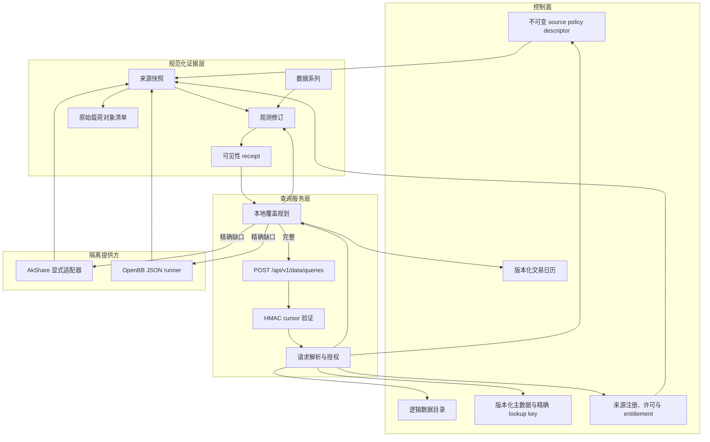
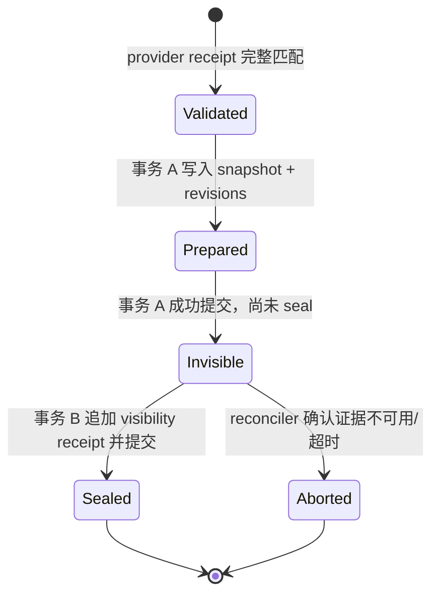
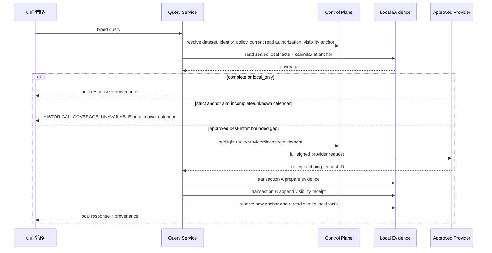

# 迭代 197 设计文档：本地优先市场数据中台

> 状态：候选实现与本地验收已完成；未生产发布。
> 本文描述目标架构，所有表名、接口名和组件名均为实施规格，不代表已上线或已通过真实数据验证。

## 1. 架构决策

### 1.1 决策摘要

| 决策 | 结论 | 原因 |
| --- | --- | --- |
| 数据中台形态 | 采用“控制面 + 规范化证据层 + 查询服务层”，而不是继续给每个页面增加 AkShare 缓存。 | 数据集、身份、许可、日历和来源需要统一治理。 |
| 本地存储 | 首批以关系型 canonical store 保存元数据、来源回执和观测修订；原始大载荷保存对象存储清单；后续再导出到分析型仓库。 | 先保证可追溯和 PIT，再优化分析吞吐。 |
| provider 集成 | AkShare 为显式 adapter；OpenBB 为独立 runner；都不能由请求参数动态选择函数/扩展。 | 防止任意网络调用、隐性许可绕过和身份漂移。 |
| PIT 语义 | 使用两阶段可见性 receipt，而不是把 provider 时间或事务内 receipt 时间称为“已提交”。 | 只有已 seal 的本地事实可参与严格回放。 |
| 分页 | 使用带 HMAC 的主体绑定 cursor。 | Base64 可读不等于可信，不能由客户端决定 PIT anchor。 |
| 196 关系 | 先独立设计/实现基础，后合并迁移与页面。 | 196 的工件和迁移仍在变化。 |

### 1.2 分层结构



控制面决定“能否请求、能否保存、能否读取”；证据层只保存可复核事实；查询服务不能从遗留表名、provider 名、样例数据或用户输入猜测控制面事实。

## 1.3 从 OpenBB 参考仓库采用的边界

本方案借鉴 OpenBB 的平台分层，而不把 OpenBB 当成无治理的数据源代理：

| 参考观察 | 197 的采用方式 | 明确不采用的方式 |
| --- | --- | --- |
| OpenBB Platform 的 provider/extension 与标准模型边界 | 每个 route 有明确 adapter、capability、provider request ID 和版本。 | 由客户端自由填写 provider 函数、extension 或 endpoint。 |
| ODP 文档的多消费面思路 | 同一 sealed canonical evidence 供页面、研究、回测和未来 agent 消费。 | 各页面各自缓存一份未经来源治理的数据。 |
| `agents-for-openbb` 的 raw data/引用分离 | UI/agent 只消费 `MarketDataQueryProvenance` 中的本地证据。 | 让 AI 或页面的文字解释替代数据来源回执。 |
| OpenBB 社区的分仓生态 | runner、provider 配置、页面适配和研究工件按独立版本/验收治理。 | 因为本机有 checkout 就默认导入、运行或授权任何 extension。 |

本地参考基线见 [README](README.md#openbb-参考输入)。真正实施时，OpenBB checkout、文档和社区仓库都只能作为开发输入；可部署 provider 仍需要本项目的安全、许可、版本锁定和验收。

## 2. 核心术语和时间语义

| 术语 | 定义 |
| --- | --- |
| query fingerprint | 公共业务查询的稳定语义哈希，不包含分页、等待、principal 或 provider route。 |
| provider request ID | 服务端为一次获准 fetch attempt 生成的不可变、不可猜测 ID；provider receipt 必须原样回显它。完整 outbound DTO（含该 ID、route/provider、精确身份、窗口、字段、语义轴和 policy version）另计算 `provider_request_fingerprint_sha256`。 |
| provider-observed time | 上游自报的获取/发布/可用时间，只作来源 metadata。 |
| local receipt time | 应用收齐并验证 provider 响应的可信本地时钟。 |
| prepared evidence | 已在事务 A 写入，但尚未拥有可见性 receipt 的来源快照和观测。严格读取不得看见。 |
| visibility boundary | 事务 A 成功后追加的不可变 receipt 所声明的系统逻辑可见时间；它与 sequence 组成全序 anchor。 |
| visibility sequence | canonical store 为每个 sealed receipt 分配的全局单调顺序号，且 `visible_at` 对 sequence 非递减；同一时间戳内用它提供确定性先后次序。 |
| knowledge cutoff at | strict 初始请求提供的带时区时间上界。 |
| visibility anchor | 初始解析一次性冻结的 `(knowledge_cutoff_at, max_visibility_sequence_at_or_before_cutoff)`；PIT 读取、分页、缓存和重放以完整二元组为准。 |
| provenance manifest hash | 不含派生 hash 字段的完整 `MarketDataQueryProvenance` body 的 RFC 8785 canonical JSON SHA-256。 |
| artifact fingerprint | `artifact_schema_id`、`artifact_schema_version`、`provenance_manifest_sha256` 与持久化工件载荷 SHA-256 的 canonical manifest SHA-256。 |

任何实现不得把 `provider-observed time`、`local receipt time` 或 ORM `created_at` 自动解释为“物理数据库已提交”。若产品要宣称物理提交时间，必须提供目标数据库可证明的 commit-time 能力；首批统一采用可审计的**系统逻辑可见性**语义。

## 3. 控制面设计

### 3.1 数据目录和存储绑定

沿用并扩展治理目录：

- `dg_datasets`：逻辑数据产品，例如 `market.stock_daily`；包含 canonical schema、主键、域、保留策略引用。
- `dg_storage_targets`：已注册物理存储。
- `dg_dataset_storages`：数据集到存储的绑定；每个活动数据集恰有一个活动 primary canonical binding。

解析器只接受 active、无歧义的绑定，并向后续组件传递 server-resolved `dataset_id` 和 `dataset_code`。`target_table`、旧 AkShare 表名、URL 参数和 provider endpoint 不能成为新版存储身份。

推荐实施顺序是先使用 PostgreSQL/MySQL 的 canonical relational store；原始大对象写入受控对象存储并以内容哈希/URI 清单引用；只有在量级与查询画像证明必要时，再由不可变导出任务写入 ClickHouse/Parquet 等 serving/analytics 层。后者不是首批权威来源。

### 3.2 主数据和 exact lookup key

`asset_instruments` 是身份权威；`md_instrument_lookup_keys` 是精确 `(asset_type, market, symbol)` 的物化投影。每次解析必须：

1. 完整精确匹配三元组，不 lower-case、trim 后猜测、分词或别名回退；
2. 校验 lookup key 的 canonical ID、instrument ID、metadata version、有效期和 active scope；
3. 对 strict 查询同时要求 **instrument 与 lookup key 的 created/known 时间均不晚于 cutoff**；
4. 拒绝重叠版本、相同当前三元组的多个活动映射和窗口跨越 identity 版本的请求。

这条第 3 点避免“旧 instrument 在历史上有效、但 lookup key 在未来才回填”被误用于过去的严格回放。

### 3.3 不可变 source policy descriptor

source policy 不能只是内存中的 provider 列表。实施时应持久化或以受版本控制的配置登记下列不可变 descriptor：

| 字段 | 要求 |
| --- | --- |
| `policy_id`, `policy_version`, `descriptor_hash` | 标识和冻结 policy 内容。 |
| `dataset_ids` / `dataset_codes` | route 必须精确绑定；实际执行时以 resolved dataset ID 复核。 |
| 语义 capability | asset type、data kind、market、`frequency_semantics`、adjustment、price basis、currency、unit 的显式集合。`bars` 只允许六种 bars 粒度；快照类只允许 `snapshot`；未来事件型数据只在目录显式登记后使用 `event`。`None` 只表示未声明，不代表通配。 |
| route | adapter、请求 provider、预期 receipt provider ID、route ID、窗口/并发/重试上限。 |
| `source_registry_id` | 指向许可证、allowed use、有效期、保留与再分发规则的权威登记。 |
| `allowed_purposes` | display/research/backtest/export 等历史采集和工件创建用途授权。 |
| `local_read_rules` | 当前读取主体所需 entitlement、有效期、再分发和用途约束；历史 descriptor 不能把采集授权提升为永续读授权。 |
| `online_fetch_enabled` | 与历史可读性分开；退役 policy 可保留 descriptor 但禁用新网络请求。 |
| effective/retired 状态 | 生效窗口、替代关系和审计原因。 |

在线 route 只有在全部 capability、数据集、用途、来源注册、principal entitlement 和当前有效期匹配时才可运行。`DgProvider.is_active` 只是其中一个前提，不能替代许可证批准。

已生成事实引用的 policy descriptor 不能因新版本部署而消失。对于 retired descriptor，`local_only` 与符合其历史用途授权、且当前 principal/tenant 仍满足 `local_read_rules` 的 strict replay 继续可读；任何需要外部补齐的模式返回 `SOURCE_POLICY_ONLINE_DISABLED` 或更具体拒绝码。

### 3.4 来源许可与主体授权

来源注册应复用或扩展 `AssetDataSourceRegistry`，最少验证：`enabled`、asset type、license status、allowed uses、effective window、jurisdiction、retention 和 redistribution policy。市场数据专用 authorizer 还须把 `purpose` 映射到允许用途，并返回冻结的采集授权决定：

```text
MarketDataSourceAuthorization = {
  source_registry_id,
  registry_version_or_updated_at,
  license_status,
  allowed_uses,
  effective_window,
  decision: ALLOW | DENY,
  principal_scope,
  entitlement_revision
}
```

在线 preflight 在 adapter 之前执行。`DENY`、未知 license、过期、未启用或主体无 entitlement 都必须零网络、零新证据。成功的授权决定及 descriptor hash 写入来源快照 provenance；不能在日后依赖当前注册表状态重建它。

本地查询、strict replay 和 196 工件消费在读取任何 sealed 事实前另行执行 `MarketDataReadAuthorization`。它以当前 principal/tenant、当前 entitlement revision、用途、local-read rules、有效期和再分发限制决策；它不复用来源快照里的历史采集决定。读取拒绝必须发生在 store、coverage 和任何 provider 之前，并且零网络、零写入。历史决定仍保存在 provenance 中，用来解释当时为何可采集/创建，而不是绕过后来的权限撤销。

### 3.5 页面范围清单

`MD-197-SCOPE-MANIFEST` 是与 196 冻结基线分开的版本化治理工件。它由页面路由、前端类型、后端 DTO 和已批准数据目录交叉生成；每一行至少包含消费方（`/data/market` 或 `/investment/strategies`）、`asset_type`、`data_kind`、字段组、`frequency_semantics`、市场/复权/价格口径/币种/单位等语义轴、数据集、预期 route 状态和来源证据。清单的版本、生成输入 commit、schema hash 与行 hash 都写入 197 验收记录。

清单不按 provider 当前能力裁剪。页面支持而暂无线下或线上安全 route 的组合保留一行，并以 `NOT_CONFIGURED` 或 `UNSUPPORTED` 结案；只有页面/DTO 本身删除该组合且 196 基线更新后，才可经变更记录移除。当前市场 UI 的 `daily`/`weekly`/`monthly` 在清单中显式映射为 `1d`/`1w`/`1mo`；coverage UI 和策略 UI 暴露的 `1h`/`30m`/`5m` 逐行记录为“UI 声明”与“已验证 route capability”两列，不能把前者当成后者。底层 trust schema 中但两个页面未支持的 `commodity` 不进入首批清单。

## 4. 规范化证据模型

### 4.1 逻辑实体

| 实体 | 关键字段 | 规则 |
| --- | --- | --- |
| `md_data_series` | dataset ID、canonical ID、metadata version、data kind、frequency semantics、semantic axes、policy descriptor hash | 表示经济含义一致的序列；`bars` 使用六种 bars 粒度，快照类使用 `snapshot`；不含请求窗口/字段投影。 |
| `md_ingestion_batches` | logical ingestion key、provider request ID、provider request fingerprint、lease owner、fencing token、状态、重试/完成摘要 | 为单次缺口补齐或 refresh intent 记录幂等与所有权；同一 intent 的重试不可另建可见事实。 |
| `md_source_snapshots` | provider receipt、provider request ID、provider request fingerprint、query fingerprint、raw payload hash/manifest、adapter/endpoint version、policy/authorization provenance | 一次外部回执，append-only。 |
| `md_observation_revisions` | series ID、event time、fields hash、quality、source snapshot ID、normalization version、`revision_ordinal` | 每次修正追加 revision，永不覆盖；同一 `(series ID, event time)` 的 ordinal 单调增加。 |
| `md_visibility_receipts` | source snapshot/batch ID、visibility boundary、`visibility_sequence`、seal actor/version | 只可追加一次；sequence 全局单调、`visible_at` 非递减，是严格读取的可见性闸门。 |
| `md_calendar_snapshots/events` | calendar snapshot ID、版本、完整覆盖窗口、session 事件、来源和 visibility receipt | 不从周末/空表推断交易日。 |
| `md_instrument_lookup_keys` | exact 三元组、instrument、metadata version、有效期、known time | 受同一 PIT 规则约束。 |

`md_source_snapshots.provider_request_id` 必须存 receipt 回显的 provider request ID，`provider_request_fingerprint_sha256` 必须存完整 outbound DTO 的规范化 hash；二者都不能由公共 `query_fingerprint` 替代。查询级 `query_fingerprint` 单列或放入结构化 request/provenance 字段。这样同一公共查询尝试两条 fallback route 时，两个来源快照仍能证明不同的 outbound request。

### 4.2 可见性状态机



读取规则：

```text
eligible revisions are those where
  revision.event_at is in the requested half-open window
  AND revision.quality is acceptable
  AND one revision contains every requested field
  AND source_snapshot has exactly one sealed visibility receipt
  AND (receipt.visible_at, receipt.visibility_sequence) <= visibility_anchor

for each (data_series_id, event_at), choose the eligible revision with the
largest (receipt.visibility_sequence, revision.revision_ordinal, revision_id).
If equal ordering keys have different fields hashes, fail as EVIDENCE_CONFLICT.
```

`Prepared` 和 `Invisible` 不能出现在 API、覆盖判断、策略工件或 strict replay 中。reconciler 必须有受限 lease、超时阈值、幂等 seal/abort、审计事件与人工处置；不能悄悄把未 seal 事实当作成功。`available_at` 不是首批 evidence schema 的 PIT 字段，任何实现不得临时以它或 `created_at` 加入读取谓词。

日历和主数据若承诺 strict replay，也必须采用相同 visibility model 或明确声明其可见性来源；不得只依赖可变 `created_at`。

### 4.3 覆盖规划

`CoveragePlanner` 是无 I/O 的纯函数，输入为冻结日历、已 sealed observations、字段集、质量门槛、查询身份和完整 visibility anchor，输出：

- `complete`：每个预期事件都有合格、字段齐全、可见的 revision；
- `incomplete`：头/中间/尾部缺口及拒绝原因；
- `unknown_calendar`：没有一个唯一且覆盖完整窗口的冻结日历。

仅对未冻结的 `best_effort` 请求，日历未知时才允许为一个有界窗口尝试 approved provider；即使返回行数很多也不能声称 complete。具有 strict anchor 的请求遇到日历未知或数据缺口时必须返回 `unknown_calendar` 或 `HISTORICAL_COVERAGE_UNAVAILABLE`，不进入 provider。

## 5. 查询、分页和写入流程

### 5.1 首屏 local-first 流程



对 `research/backtest` 的已冻结 visibility anchor，互动式在线抓取**必须拒绝**：`local_first` 的缺口返回 `HISTORICAL_COVERAGE_UNAVAILABLE` 或 `unknown_calendar`，`refresh` 返回 `STRICT_FETCH_FORBIDDEN`，三种结果都零网络。若需要针对新数据形成 strict 工件，先执行独立 ingestion，得到新的 sealed anchor，再发起一个新的 strict query；它不能修补已冻结历史视图。能够证明历史可见性的历史导入另行走审计流程，不能复用交互 provider 的当前时间。

### 5.2 HMAC cursor

cursor 使用两段 URL-safe token：`base64url(canonical_payload) + '.' + base64url(HMAC-SHA-256(payload))`。签名 key 由服务器 secret 派生并带 domain separation；支持 key ID 和密钥轮换。payload 至少包括：

```json
{
  "version": 1,
  "query_fingerprint": "...",
  "policy_descriptor_hash": "...",
  "principal_scope": "user-or-tenant-id",
  "entitlement_revision": "...",
  "visibility_anchor": {
    "knowledge_cutoff_at": "UTC timestamp",
    "max_visibility_sequence_at_or_before_cutoff": "integer"
  },
  "event_at": "UTC timestamp",
  "revision_id": "...",
  "issued_at": "UTC timestamp"
}
```

验证顺序固定为：格式/长度 → key ID → HMAC `compare_digest` → payload schema → principal/entitlement → query/policy 一致性 → 完整 anchor/排序锚点。任何失败发生在 identity resolver、本地 store 或 adapter 调用之前。后续页不可在线补齐；它只读首屏完整 visibility anchor 下的事实。

### 5.3 `MarketDataQueryProvenance`

响应与 196 工件共享一个不可变 provenance envelope。先对不含派生 hash 的 body 使用 RFC 8785 canonical JSON 计算 `provenance_manifest_sha256`；持久化工件载荷也必须在不含其外层 hash 字段的情况下计算 `artifact_payload_sha256`，避免自引用：

```text
MarketDataQueryProvenanceBody = {
  query_fingerprint,
  canonical_id,
  instrument_metadata_version,
  dataset_id, dataset_code,
  data_series_id,
  calendar_snapshot_id, calendar_version,
  policy_id, policy_version, policy_descriptor_hash,
  source_authorization_decisions,
  knowledge_cutoff_at, visibility_anchor, visibility_receipt_ids,
  source_snapshot_ids, observation_revision_ids,
  field_hashes, normalization_versions
}

MarketDataQueryProvenance = {
  body: MarketDataQueryProvenanceBody,
  provenance_manifest_sha256
}

MarketDataArtifactIntegrity = {
  artifact_schema_id, artifact_schema_version,
  artifact_payload_sha256,
  artifact_fingerprint = SHA256(canonical({
    artifact_schema_id, artifact_schema_version,
    provenance_manifest_sha256, artifact_payload_sha256
  }))
}
```

每一页可以返回分页子集，但工件必须保存完整已消费 revision 集合或确定性 manifest；不能仅保存一个 policy ID，不能依赖日后数据库反查来补足谱系。每次工件写入、读取和 strict replay 都必须重新验证 manifest、schema、payload 和 artifact fingerprint；缺失或任一不匹配即拒绝工件。

### 5.4 并发、幂等和缓存隔离

`CoveragePlanner` 仍保持无 I/O；它发现精确缺口后，`IngestionCoordinator` 才用 `(dataset_id, canonical_id, data_kind, frequency_semantics, semantic axes, window, policy_descriptor_hash, refresh_intent)` 建立 `logical_ingestion_key`。同一请求的 HTTP 重试复用同一 `refresh_intent`；并发相同缺口加入同一活动 batch，等待其 seal/abort 后重新执行本地读取。新的用户显式 refresh 产生新的 intent，因而可以受控地生成新修订。

batch lease 必须携带单调 fencing token。只有当前 token 的 owner 可以 prepare、seal 或 abort；过期 worker、重复 receipt 和重试不得创建第二个 sealed source snapshot 或重复 revision。任何本地/响应缓存的 key 至少包含 dataset、principal/tenant 或已审计的共享可见性范围、entitlement revision、policy descriptor hash、query fingerprint、完整 visibility anchor 和字段投影；缓存命中后仍必须先通过 current read authorization。

## 6. 提供方适配器

### 6.1 AkShare

AkShare adapter 使用小而显式的 route registry。每条 route 必须声明 SDK 函数、参数构造、市场验证、时间列、返回身份验证、半开窗口裁剪、频率、语义 capability、最大行数、超时和并发上限。SDK 阻塞调用隔离到受限线程池。

股票、期货、债券、基金、外汇、期权、加密资产均需要显式 route 决定；“没有 route”不是自由回退信号，而是稳定 `AKSHARE_ROUTE_UNSUPPORTED`。高频、期权链和所有未知口径在有真实、许可且可验证的 route 前保持未配置。

### 6.2 OpenBB

OpenBB adapter 只向运维配置的 JSON runner 发送结构化 stdin/stdout。runner 运行于隔离环境：最小网络/文件权限、无主应用数据库凭据、固定 provider/extension allowlist、独立依赖锁和版本清单。

默认不注册 OpenBB route。启用前必须同时满足：明确 `provider`、批准市场白名单、对应 `dataset_id`/policy descriptor、source registry 授权、runner 健康检查、数据许可和小窗口验收。若 runner 不做复权、汇率、单位或价格口径转换，则 route 只能声明原生未转换语义，不能让请求假定它已经转换。

## 7. API、授权和开关

拟议公共端点为 `POST /api/v1/data/queries`，避免复杂语义被拆散到 GET 参数。请求/响应使用严格 DTO，拒绝未知字段。v2 开关默认关闭：

```text
MARKET_DATA_QUERY_V2_ENABLED=false
MARKET_DATA_ONLINE_FETCH_ENABLED=false
MARKET_DATA_OPENBB_ALLOWED_MARKETS=""
```

认证是必要但不充分的条件。API 必须将 principal/tenant scope、entitlement revision、rate-limit bucket 传给 query service；不能认证后丢弃用户对象。任何本地读、strict replay 和工件消费均先作当前 read authorization；受限/付费来源使用专属 policy 和 entitlement，公共 display route 也要有按用户和全局的速率/预算保护。

DTO validation 在 resolver 之前验证 selector 唯一性、UTC 半开窗口、`data_kind` 与 `frequency_semantics` 的组合、字段/页大小/窗口上限，以及不允许客户端提供或覆盖 `query_fingerprint`、provider request ID、authorization 决定或 cursor 签名。strict 初始请求只提交 `knowledge_cutoff_at`，由服务器解析完整 anchor；分页/重放只能携带已签名 cursor 或已验证 provenance 中的 anchor，不能直接指定 sequence。任何无效请求在读取 store、生成 provider intent 或写入前拒绝。

错误响应只暴露稳定机器码，如 `SOURCE_POLICY_NO_ELIGIBLE_PROVIDER`、`SOURCE_LICENSE_DENIED`、`CURSOR_INVALID_SIGNATURE`、`VISIBILITY_NOT_SEALED`、`HISTORICAL_COVERAGE_UNAVAILABLE`、`STRICT_FETCH_FORBIDDEN`；诊断细节留在受控日志和审计事件中。

### 7.1 页面迁移和遗留兼容 facade

部署 v2 前保留既有 `GET /data/market-instruments/options`、`lookup`、coverage/precheck/trust 端点；其返回 shape 不得被 197 静默修改。灰度打开后，facade 将 legacy selector 转为 typed query，并保留兼容期的响应投影：

| 现有输入/行为 | v2 规范化处理 | 禁止事项 |
| --- | --- | --- |
| `asset_type`、`symbol`、期货 `market`、日期区间 | 解析为 exact identity 和半开 UTC 窗口。 | 代码/市场模糊猜测、跨资产 fallback。 |
| `daily`/`weekly`/`monthly` | 映射到 `1d`/`1w`/`1mo`；legacy `1m` 仅在原端点上下文映射为 `1mo`。 | 在 v2 接受含糊的裸 `1m`。 |
| 默认 lookup | display 的未冻结 `best_effort` 查询使用 `local_first`；本地充分时零网络，本地不足时按 policy 精确补齐。 | 把 UI 首次渲染的空缓存当作完整，或返回未 seal 的 adapter payload。 |
| 手动 `refresh_online=true` | 仅在未冻结 `best_effort`、feature flag、route、license 和 entitlement 都通过时转换为 `refresh`。 | 因旧参数绕过来源策略，或在 strict anchor 下触网/只返回内存中的在线结果。 |

strategy facade 必须先把 `symbol`、`timeframe`、`timeframe_n` 和日期范围解析为 typed `MarketDataQuery`，并把 `data_config` 中现有非类型化字段变为受校验的受限输入。现有策略页仅对部分资产做推断，且 option 没有完整推断规则；因此策略 facade 在 identity、asset type、data kind、frequency、adjustment、provider 和 series 不能完全解析时 fail closed，不能推测性地调用 AkShare/OpenBB 或复用其它资产的 series。

若页面或策略请求带有 strict anchor，facade 不得把 legacy `refresh_online` 或任何隐式缺口逻辑转为 provider 调用；它只能返回已 sealed 的本地数据或 `HISTORICAL_COVERAGE_UNAVAILABLE`/`unknown_calendar`。这条规则也适用于由已有研究工件触发的重新查询。

### 7.2 当前候选的 family、质量和宽表边界

候选把七类资产的 21 个页面数据族编入只读 `query-bundle`。每个可执行的 product contract 都有稳定的 `family_id` 和 `family_contract_version`；两项必须成对出现在 symbol-specific query contract、公共查询请求、query fingerprint 和分页响应中。服务端在 catalog 和精确身份解析后再次核对 family 的数据集、data kind、频率、字段集和 source policy，因而客户端不能把一个相似的 bars 数据集替换为另一张 family 卡片。

当前 `ready` 只表示 `market.bars` 的日线/周线/月线 K 线兼容桥。页面必须显示其 bars/frequency 语义，不能把 close、event time 或 available time 标为实时 quote。其余 quote、option chain、风险面、报告和 reference family 均是已登记但 `NOT_CONFIGURED` 的产品。`VITE_MARKET_DATA_QUERY_BUNDLE_ENABLED` 默认关闭；关闭时保留无 family binding 的旧通用 bars 兼容查询，正式 family-control-plane 验收只在开关开启后进行，且不得把兼容路径当成未配置 family 已经可执行的证明。

宽表来源只允许经 schedule/shadow collector 捕获后交给纯导入器；导入器没有 HTTP fetch、没有 request-time route，也不从本地时钟制造 upstream time。snapshot 的显示新鲜度由 server-owned `source_policy_version` 解析，过期 observation 不进入产品响应。统一 `typed-field-quality-v2` 策略在新写入前规范化/拒绝无效数值、日期和时间字段；读取遗留 revision 时再次评估。不能满足当前必需字段或不是 `PASS` 的记录只能用于 coverage rejection diagnostics，不能返回给 API 或页面。

## 8. 与迭代 196 的并行实施和迁移

### 8.1 可并行阶段

1. 在独立工作树定义 DTO、目录、证据模型、policy descriptor、authorizer、adapter contract、coverage/PIT/cursor 测试。
2. 在隔离测试数据库验证 migration 链、prepared/sealed/reconciler、严格 replay 和拒绝路径。
3. 在不接入页面、不启用在线开关的前提下构建 AkShare/OpenBB provider harness。

### 8.2 必须等待 196 的闸门

1. 196 冻结研究、策略和回测输入输出与工件 schema。
2. 合并 196/197 Alembic 链，`alembic heads` 恰好一个 head，并在可恢复副本升级演练。
3. 将 `MarketDataQueryProvenance` 写入 196 工件，完成历史重放比对。
4. 先灰度 `/data/market`，再灰度 `/investment/strategies`；两者均需 API、浏览器和数据库三方证据。

不允许在 196 尚未冻结时，修改其未提交工作树、假设其 `data_config` 形状、或把 197 新表写入其生产读取路径。

解除任一 IG-196 闸门前，应在 197 证据包中固定 196 commit/ref、研究/回测工件 schema ID/version/hash、计划的 Alembic 起始/目标 head、部署环境身份和兼容范围。特别是，196 必须明确接受策略页 seven-type typed query 的处理位置；不能继续依赖当前非类型化 `data_config` 和不完整 asset inference。任一值缺失、漂移或 IG 未通过时，v2 页面切换、策略工件消费和线上 fetch 开关必须保持关闭。

### 8.3 共享迁移和部署互斥协议

197 可以在自己的分支和可销毁测试数据库中验证独立 migration 链，但不得把它当作 196/197 的共享库部署证明。两者整合时执行器必须遵守以下协议：

1. 生成候选 migration manifest，明确预期起始 revision、目标 revision、schema compatibility window、证据表不可逆约束和恢复步骤。
2. 仅允许一个具名 schema-migration lease holder 执行 DDL；第二个 196 或 197 执行器拿不到 lease 时必须在任何 DDL 前失败退出。
3. 获得 lease 后重新读取当前 revision；若与 manifest 预期起始 revision 不一致，停止并记录审计事件，不尝试自动 rebase、merge 或继续升级。
4. 采用 expand/migrate/contract：兼容窗口内旧版和新版应用都能运行；删除列、重命名或收紧影响旧版的约束必须等旧版应用排空后另行发布。
5. 任何失败保持服务在明确的兼容状态，优先向前修复或从已验证备份恢复；不得用 downgrade 静默删除 source snapshot、revision、calendar 或 visibility receipt。
6. 共享库演练须分别证明互斥、错误起始 revision fail-closed、跨版本兼容、失败恢复和最终单一 head，且在 196 冻结前始终为 `BLOCKED`。

候选中的 shared-dataset-binding migration 还有一层执行围栏。离线 `alembic --sql` 必须明确拒绝，避免把反射状态当作可审计的 DDL 计划。MySQL 线上运行前，发布 runbook 必须先在外部停止 API、collector 和 bootstrap writer，确认 writer 已排空后才可由授权执行器设置 `MARKET_DATA_SHARED_BINDING_MAINTENANCE_FENCE=confirmed`。该环境变量只是已完成排空的人工/编排证明，代码本身不能证明 writer 已停止。随后 migration 取得具名 MySQL lock，并把 `lock_wait_timeout` 限为 5 秒；PostgreSQL 在事务内设定 `SET LOCAL lock_timeout = '5s'`。upgrade 和 downgrade 都受同一围栏约束。任何拒绝、锁竞争或起始 revision 漂移都必须在 DDL 前退出；真实数据库尚未执行这条候选 migration。

## 9. 运维、观测和数据生命周期

必须有下列无敏感值指标和审计事件：本地命中率、未知日历率、exact route 命中/拒绝、dataset mismatch、许可证/entitlement（在线与本地读取）拒绝、provider/receipt mismatch、外部延迟/失败、prepared/sealed/aborted 计数和滞留时间、lease/fencing 拒绝、cursor 篡改/过期、质量拒绝、原始载荷大小及策略退役后的 local replay。每个事件至少带候选版本、数据集、policy hash、稳定原因码、匿名化主体范围和关联 ID；不得记录密钥、完整未授权载荷或可反推的跨租户缓存内容。对 lease 滞留、receipt mismatch、未来事实泄露、授权绕过和 migration lock 竞争应定义可操作的告警阈值及值班处置记录。

原始载荷遵循来源策略的保留和再分发限制。删除、归档或再规范化必须产生新的治理事件，不可原地篡改 source snapshot、revision、calendar snapshot 或 visibility receipt。审计日志不得记录密钥、完整未授权原始数据或用户私有账户信息。

## 10. 延后事项

以下不阻塞设计冻结，但在启用付费 provider 或高并发生产流量前必须另立实施/验收任务：跨实例 single-flight、cache-miss 合并、`wait_ms` 的精确定义、provider 成本预算、历史回填调度、对象存储归档、analytics serving 导出，以及每一类资产的真实 route/许可验证。
