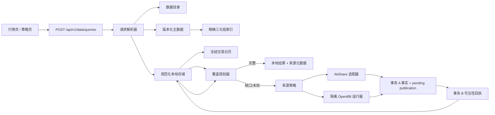

# 迭代 197 设计文档

> 实现快照：本文记录 `codex/iteration-197-data-platform` 中已出现的 197 源码契约；它不把未冻结工作树、离线替身或局部测试解释为发布验收。真实 OpenBB 网络、MySQL/PostgreSQL、跨进程写入和 196 整合仍以验收文档中的 `NOT_RUN` / `BLOCKED` 为准。

## 1. 架构概览

新链路与遗留 AkShare 仓库并行。页面迁移前，旧接口保持原路径和返回形状；新接口从第一天起使用明确 DTO，不调用旧 `MarketInstrumentService`。

## 2. 请求解析与身份

### 2.1 公共 DTO

`app.schemas.market_data_platform.MarketDataQueryRequest` 是唯一公共请求边界。它拒绝额外字段，并负责：

- canonical ID 与完整三元组的异或选择；
- UTC、半开区间和直接请求窗口限制；
- 无歧义频率；
- 必需字段去重和排序；
- `research/backtest → strict + knowledge_cutoff`；
- 请求语义哈希，排除分页、游标和等待等传输字段。

`MarketDataQueryResolver` 将请求绑定为 `ResolvedMarketDataQueryContext`：逻辑数据集、主数据版本、物理存储登记和覆盖身份都由服务端生成。它不会从资产类型、提供方名或遗留表名猜测数据集。

### 2.2 主数据索引

`asset_instruments` 是更广泛研究域的身份权威，但 v2 市场数据查询不把它的可变行或单独的 lookup key 当作严格 PIT 证据。`MdInstrumentIdentityRevision` 保存经过校验的完整 identity JSON、canonical ID、精确三元组、metadata version、有效期、递增 revision 和内容 hash；它与一条 pending `MdPublication` 在同一事务写入，只有第二事务写入 `published_at` 后才对 v2 resolver 可见。

`md_instrument_lookup_keys` 仍是确定性回填和精确索引的物化投影，但当前严格 resolver 从已发布的 `MdInstrumentIdentityRevision` 读取。未来若将 lookup key 接入严格读取，也必须让它引用同一冻结 revision 和同一 publication receipt，不能回退到可变 authority 行。

| 字段 | 作用 |
| --- | --- |
| `asset_type, market, symbol` | 冻结 projection 的精确三元组；不做大小写、空格或别名归一化。 |
| `instrument_id, canonical_id, metadata_version` | 反向校验 projection 没有改变权威身份。 |
| `valid_from, valid_to, revision_number, published_at` | 先按可见性回执过滤，再按有效期和最新已发布 revision 解析。 |

一条 authority identity 的每次可见状态变化追加一个 frozen revision；历史 projection 允许同一代码在不同 canonical identity 的不重叠有效期中复用。resolver 仅载入已发布候选，严格请求还要求 `published_at <= knowledge_cutoff`，再校验完整 identity JSON、冗余列、有效期和版本重叠，因此晚回填 identity 或 lookup key 不能穿越 cutoff，也不会因为同一交易所有数千标的而扫描全市场。

`MarketDataIdentityProjectionWriter` 在调用方业务事务中 stage projection 和 publication，调用方提交后才调用 `publish_staged()`。事务 A 和事务 B 之间进程中断时，projection 已 durable 但不可解析。`MarketDataLookupKeyMaterializer` 与 `scripts/backfill_market_data_lookup_keys.py` 仍只做确定性、有上限的回填；它们不修复损坏身份，也不猜测代码。

## 3. 数据目录与规范化存储

### 3.1 数据目录

`dg_datasets` 定义逻辑数据产品，`dg_storage_targets` 定义注册存储，`dg_dataset_storages` 定义唯一主物化。`DataCatalogResolver` 仅接受活动且无歧义的主绑定。`target_table` 等遗留端点字段不能成为新版读取依据。

### 3.2 事实与证据模型

| 表 | 职责 |
| --- | --- |
| `md_data_series` | 一个完整语义数据系列；哈希包含数据集、canonical identity、主数据版本、数据种类、频率、来源策略和口径，不包含请求时间窗或字段投影。 |
| `md_source_snapshots` | 一次来源请求的不可变回执：提供方、适配器、端点版本、请求/载荷哈希、有界原始载荷封套或受控引用、来源元数据。 |
| `md_observation_revisions` | 每个事件的不可变规范化修订：字段、字段哈希、质量、应用收据时间、来源自报可用时间、来源回执和规范化版本。 |
| `md_publications` | 每个来源 snapshot、calendar snapshot 或 identity revision 的 pending / post-commit visibility receipt；`entity_sha256` 绑定实体，`published_at` 是唯一严格读取闸门。 |
| `md_calendar_snapshots` / `md_calendar_events` | 版本化、显式覆盖范围与频率网格的交易日历和事件，不按周末规则或其它粒度推断。 |

`MdDataSeries`、来源回执、观测修订、calendar facts 和 identity projections 通过 ORM 禁止更新/删除。修正以新增修订表达；`MdPublication.published_at` 是仅限事务 B 的受保护状态转换。

PIT 使用**两事务 publication protocol**，而不是把 Python `created_at`、flush 时间或应用收到响应的时刻称为“已提交”：

1. **事务 A**：校验结果后，在一个事务/保存点写入 source snapshot、observation revisions 与同 hash 的 pending `MdPublication`；随后提交事务 A。
2. **事务 B**：仅在 A 已提交且 session 无活动事务时，以可信本地时钟写入不可变的 post-commit `published_at`。若时钟不晚于收据下界，向前推进一个可表达时间单位，避免 `<=` cutoff 的等值歧义。
3. **读取**：只 join hash 匹配且 `published_at IS NOT NULL AND published_at <= knowledge_cutoff` 的 receipt。source self-reported availability 仅保存为 provenance；规范化 observation 的 `available_at` 是本地收据时间，不能由上游时间回填。A 成功、B 尚未完成的事实是 durable-but-hidden，不能被 coverage、API、策略或 strict replay 读取。

`published_at` 表示可审计的系统逻辑可见性，不声称取得了目标数据库的物理 commit timestamp。MySQL/PostgreSQL 的真实跨连接时区与 PIT 语义仍未验证。

数据系列的语义身份故意不包含调用方的字段投影。因此读取器对每一个 event 在截止点内按修订新旧顺序检查本次的必需字段和质量门槛，选择**最新的可用修订**。它不会只因修订号更新就隐藏仍满足宽字段请求的旧修订，也不会把来自两个来源回执或两个修订的字段拼接为一条行。若没有单个修订满足请求，覆盖规划器把该 event 记为字段或质量缺口，并由 `local_first` 决定是否可以走受控补齐。

### 3.3 滚动日历分段和导入锁

每个 calendar manifest 声明非空 UTC 半开覆盖窗口和逐 `(data_kind, frequency)` 的 event grid。相同 version 与相同 manifest hash 可复用；不同 version 的重叠窗口拒绝，首尾相接的窗口允许作为连续分段。读取没有指定 version 时，只能把已发布、时区一致、无重叠且其并集连续覆盖请求窗口的 segments 组合为一个 `KNOWN` 日历；出现孔洞、重叠、重复 event key、完整性错误或缺少请求 frequency grid 时返回 typed unknown，而不是猜测。

`md_calendar_import_locks` 为每个 `calendar_code` 保留一个 durable sentinel。导入器先锁定该行，再检查 version 和覆盖窗口；PostgreSQL/MySQL 使用行锁，SQLite 由数据库写锁串行化，首次创建 sentinel 的竞争通过 nested insert 后的加锁重读处理。calendar snapshot、events 和 pending publication 写入事务 A，提交后再由事务 B 发布。因此此锁只序列化 calendar import；它不构成通用的多进程 observation writer lease。

### 3.4 覆盖判定

`CoveragePlanner` 是无 I/O 的纯函数。它接受冻结日历、查询身份、候选观测、字段集、质量门槛和截止点，返回：

- `complete`：每个预期事件都有可用、合格、字段齐全的观测；
- `incomplete`：返回头/中间/尾部缺口和拒绝原因；
- `unknown_calendar`：日历不存在或声明范围不覆盖请求。

日历未知不等于零交易日。只有一个已知、范围明确、事件集合完整的日历才可以证明空窗口或完整覆盖。

对按事件判断完整性的 `bars` 请求，日历的“完整”还必须针对请求的粒度成立。每个可用于覆盖的交易 session 在 `event_payload_json.coverage` 中带严格的 `{data_kind, frequency}` 描述符，物化为 `coverage_event_key = "{data_kind}:{frequency}@{UTC event_start}"`；日历快照的 `calendar_code` 是其市场维度。`1d`、`1w`、`1mo` 各自需要独立事件，不能因为同日存在日线 event 就推断周线或月线 event。若将来启用 `5min`、`30min` 或 `1h`，审核清单必须逐一给出该频率的每个 bar timestamp 与对齐规则，不能把整个交易 session 当作一个分钟 bar。没有与请求 `(market, data_kind, frequency)` 对应的有效网格，读取器返回 `unknown_calendar` / `CALENDAR_GRID_UNAVAILABLE`，而不是猜测零事件或完整覆盖。

## 4. 读写流程

### 4.1 本地读取

1. 验证公共请求。
2. 解析逻辑数据集和主数据版本。
3. 用解析后的语义查找 `md_data_series`。
4. 读取截止点前的观测修订与适用日历。
5. 执行覆盖规划，返回本地行、质量、来源和缺口。

### 4.2 缺口补齐

1. 解析服务器维护的来源策略，确认 policy 允许本次 `purpose`，并从精确资产、市场、频率、字段口径中选择显式 capable route；没有路由返回稳定拒绝码，绝不猜测 provider 或扩展。
2. `local_first` 只在覆盖不完整或未知时补齐；`local_only` 永远不触网；`refresh` 对完整窗口请求新修订并另行报告 `fresh_complete`、`fresh_incomplete` 或 `fresh_unknown_calendar`。严格请求已有 `knowledge_cutoff` 时不能进行交互式在线补齐。
3. 在发送网络请求前，逐个验证 route 预期的 receipt provider 已在治理目录注册且处于活动状态。构造包含精确 canonical identity、显示代码、市场、频率、时间窗、字段、口径、source policy 和 query fingerprint 的 provider 请求。
4. 适配器必须回显同一个不可变请求；编排层和存储层分别校验 receipt 与 route/context 的所有身份、窗口和语义维度。错配、越界、重复事件、超大载荷或不可序列化字段一律不落库。
5. 存储层在事务 A 写入回执、观测和 pending publication；A 提交后，事务 B 才追加 post-commit visibility receipt。提供方自报时间仅作为 provenance，不允许它改变 PIT 可见性。
6. 重新从已发布的本地证据读出并计算覆盖，响应永远以已写入且已发布的数据为准；提供方内存结果不会直接返回。

### 4.3 同进程缺口合并

当前 HTTP 层对等价的、没有 `knowledge_cutoff` 的交互式请求，以 `(event loop identity, query_fingerprint)` 建立 singleflight。leader 在其请求作用域内执行来源获取；只要确有 fetch，它在完成后提交来源回执和观测修订。follower 等待 leader 的完成信号后，先结束自身可能由认证读取建立的只读事务，再通过自己的数据库会话重新执行本地读取；这避免 MySQL `REPEATABLE READ` 沿用 leader 提交前的快照，也不会把 leader 的内存对象当作自己的结果。

这是**同一 Web 进程、同一事件循环**的优化和局部一致性措施，不是分布式锁。多 worker、多个 Uvicorn/Gunicorn 进程、多个 pod 或 leader 异常后的接管不共享该表；它们仍可能对同一缺口同时访问提供方，甚至并发进入事实写入路径。当前版本没有数据库 lease、writer ownership/fencing、租约过期、跨进程通知或多 worker 故障注入验收。唯一约束和数据库冲突码不等于跨进程写入协议；启用多 worker 的生产灰度前必须另行实现并验证这些机制，在此之前不能以 singleflight 证明全局网络去重或单写入者。

### 4.4 分页与稳定回放

游标在任何本地或网络读取前解析，并绑定 query fingerprint、事件排序键和首次读取的 `knowledge_cutoff`。后续页面用该 cutoff 同时冻结主数据身份和本地观测可见性，不再进行 provider 调用；`local_first` 会返回 `CURSOR_FROZEN_LOCAL_ONLY` 提示。游标不包含可变 provider 配置，换查询语义或试图提供不同 cutoff 都会被拒绝。

游标载荷以运维管理的 `MARKET_DATA_CURSOR_SIGNING_KEY` 做 HMAC-SHA256 签名；v2 开关开启时该 key 必须存在且至少 32 bytes。签名篡改或 key 轮换后的旧 token 在任何本地读取、provider 调用或写入前以 `CURSOR_SIGNATURE_INVALID` 拒绝。签名 key 不进入日志、响应、文档样例或 runner 环境。

## 5. 提供方适配器

### 5.1 AkShare

`AkShareMarketDataProvider` 使用显式 `AkShareRoute` 注册表，调用阻塞 SDK 时用 `asyncio.to_thread`。注册表显式列出当前七种资产类型：股票、期货、债券、基金和外汇具有已审核的有界 `bars` 路由；期权只允许 CFFEX `IO`、`HO`、`MO` 的精确合约日线端点，不做主力、期权链或附近合约回退；加密资产明确标为不支持。默认 source policy 还会再次限制可用市场、频率、复权、价格口径、币种和单位。它不调用任何旧市场查询服务。

### 5.2 OpenBB

`OpenBBSubprocessProvider` 只执行运维配置的命令，不通过 shell 拼接。协议包含版本、关联请求 ID 和完整请求 DTO；运行器必须回显它们。Web 进程对超时、非零退出、超大输出、无效 JSON、错配 ID、重复/越界事件全部拒绝。

父进程创建子进程时只转交运行所需的基础环境变量、`OPENBB_ALLOWED_PROVIDERS` 和可选 `HOME=OPENBB_RUNNER_HOME`；不会把数据库 URL、JWT/session 密钥、代理凭据、Python import path 或主应用 `HOME` 直接传给 runner。子进程 `cwd` 使用绝对且存在的 `OPENBB_RUNNER_WORKDIR`，未配置时退到系统临时目录，配置非法时失败为 `OPENBB_RUNNER_WORKDIR_INVALID`。这只能避免继承当前工作树与大量环境变量，不能阻止同一操作系统账户读取可访问的文件。

`scripts/openbb_market_data_runner.py` 在 runner 环境中导入 `openbb`。它返回有大小上限的预规范化原始 records 封套（`format=openbb-records-pre-normalization-v1`）和其 SHA-256；父进程使用稳定 JSON 重新计算哈希，任何缺失、非映射载荷或哈希不一致的响应均拒绝，不进入 `md_source_snapshots`。默认 API 不注册 OpenBB route；只有运维明确配置 `MARKET_DATA_OPENBB_ALLOWED_MARKETS` 后，才会为该白名单市场加入指定 provider 的 fallback。首批 runner 不做复权、币种、单位或价格口径转换，因而仅接受这些语义为未声明的原生结果；任何声明转换要求都会失败关闭。

当前 runner 对 `yfinance` 只批准日对齐的 `1d`、`1w`、`1mo`：平台频率分别显式映射到 provider `1d`、`1W`、`1M`；分钟频率和非 UTC 午夜窗口返回稳定不支持码。为维持父请求的 `[start, end)`，runner 将 provider end date 转为 `end - 1 microsecond` 所在日期，并在接收记录后再次按父窗口裁剪。OpenBB `OBBject.to_df()` 的默认 `index="date"` 会在 `orient="records"` 时丢失事件时间，因此 runner 强制 `to_df(index=None)`，从 `event_at`、`date`、`datetime` 或 `timestamp` 保留并规范化 event field。这些是离线协议与转换逻辑，非真实网络验证。

生产部署仍必须把 runner 放在独立的 service account 或容器中：运行账户不可读主应用数据库凭据，不挂载项目工作树、应用 `.env`、数据库 socket/volume 或其它应用密钥，并保留运行镜像、扩展版本、允许 provider 和挂载清单。现有环境白名单、受控 `cwd` 与临时 runner 测试不构成这项操作系统级隔离的 `PASS`；它是独立的 `NOT_RUN` 部署验收项。实际扩展可用性、上游账号和许可也不能由单元测试假定。

## 6. API 与页面迁移

新接口使用 `POST /api/v1/data/queries`，避免把复杂、语义化的请求塞进 GET 查询参数。它返回固定响应模型，包括：

- `query_id` 与状态；
- 规范化行与分页游标；
- canonical ID、数据集、频率、主数据版本和来源策略；
- 覆盖状态、缺口、拒绝统计、读取来源和警告；
- 可回溯的来源回执/数据系列标识。

接口由功能开关保护，`MARKET_DATA_QUERY_V2_ENABLED=false` 和 `MARKET_DATA_ONLINE_FETCH_ENABLED=false` 是默认值。目录、身份、日历、活动 provider 和来源策略未就绪时保持关闭或失败关闭；启用在线获取也不会自动启用 OpenBB，后者仍要求明确市场白名单。默认公开策略只在已认证传输边界内允许 `display`、`research`、`backtest` 三种用途；付费/许可来源必须另建服务器维护的策略并完成 entitlement 审查。

行情页实现了受控 v2 尝试：先通过只读 contract 解析精确已导入 identity 与活动 dataset，成功时请求 v2；`MARKET_DATA_QUERY_V2_DISABLED` 等已定义 fallback 错误才回到 legacy lookup。v2 响应的 pagination helper 会持续请求至 `next_cursor=null`，不以 500 条或固定页数截断；它验证每页 `query_id` 与 `knowledge_cutoff` 不变，并对重复 cursor 或 revision fail closed。当前前端回归以 17 页、516 条观察验证该收集逻辑，但这不是浏览器灰度或 196 策略页整合证据。策略页仍须等待 196 的研究与回测契约冻结后，才可把解析后的数据工件写进请求和结果记录。

## 7. 迁移与运维

### 7.1 迭代 196/197 迁移整合

当前 197 目录修订 `20260908_market_data_catalog` 的 `down_revision` 是 `20260811_asset_research_task_leases`；196 的 `20260904_ai_research_protocol_v2` 也从该 revision 分叉，并继续到 `20260908_ai_research_approval_authority`。因此两个候选同时进入一个版本图时，天然出现两个 head。独立 197 工作树中的单链检查不能替代联合检查。

196 冻结后，只能选择以下一种受审查路径：把 197 重基到 196 的冻结 head，或在集成分支创建带两个 `down_revision` 的 Alembic merge revision。不得任选一个 head、`stamp` 掉另一个分支或直接对生产库运行独立链。候选发布必须先在空数据库执行 `alembic heads`（恰一个 head）和 `alembic upgrade head`，再在可恢复的 MySQL/PostgreSQL 副本做同样演练；详情和证据格式见 [验收文档](ACCEPTANCE.md#7-数据库迁移与灾备验收)。

### 7.2 发布前操作顺序

1. 冻结 196 的研究/回测工件契约，建立 196/197 集成候选并完成单 head 迁移修订；记录候选 SHA、`git status --short`、`alembic heads` 和备份标识。
2. 在空库和经批准的可恢复副本执行 `alembic upgrade head`；审计 `dg_*`/`md_*` 的列、索引、外键、检查约束、时间字段与遗留 AkShare 表的行数/校验和。MySQL/PostgreSQL 必须验证每个应用连接的 UTC session time zone 与跨连接 PIT 读取。
3. 在维护窗口依次运行 `bootstrap_market_data_platform.py` 的 dry-run 和 `--apply`，注册逻辑数据集、唯一主存储和活动 provider；未注册或已停用的 provider 在网络请求前即被拒绝。
4. 对审核过的主数据 manifest 运行 `import_market_data_master_data.py` 的 dry-run 和 `--apply`，再对既有权威身份使用 `backfill_market_data_lookup_keys.py` 的受限批次 dry-run/`--apply`。导入器不创建猜测 identity。
5. 按每个已启用 `(market, data_kind, frequency)` 导入版本化日历 manifest。日线、周线、月线和任何分钟频率都要分别提供完整显式网格；只导入市场交易日而没有相应频率 grid 时不得启用该请求组合。
6. 保持 `MARKET_DATA_QUERY_V2_ENABLED=false` 与 `MARKET_DATA_ONLINE_FETCH_ENABLED=false`，先以 `local_only` 验证身份、网格、PIT 和来源链。完成受控小窗口的真实来源演练后，才对少量 identity 打开 `local_first`。
7. OpenBB 路由还需要独立的运行器 service account/container、批准的 provider/市场白名单、版本/许可清单和原始载荷 hash 演练。196 的全部整合闸门解除后，才按页面灰度顺序迁移 `/data/market`，再迁移 `/investment/strategies`。

降级不能在已有不可变证据的数据库上静默删除表。迁移会阻止有数据的降级，要求先导出或明确治理处置。

## 8. 可观测性

必须记录但不暴露敏感值的指标包括：本地命中率、按 `(market, data_kind, frequency)` 分组的日历未知率和 `CALENDAR_GRID_UNAVAILABLE`、每提供方请求/失败/延迟、写入行数、质量拒绝原因、因字段集选择旧但完整修订的数量、索引回填进度、来源策略或用途拒绝、provider 活动预检拒绝、receipt/request 错配、冻结游标读取、singleflight leader/follower 数量，以及 OpenBB 协议、原始载荷 hash 和受控工作目录失败。数据质量告警以稳定机器码聚合，而不是解析异常文本。
