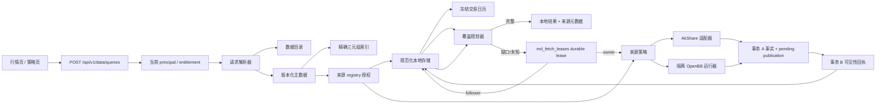

# 迭代 197 设计文档

> 实现快照：本文记录已接入迭代 196 冻结基线的 197 集成候选源码契约；它不把离线替身、fork 构件候选或局部测试解释为发布验收。OpenBB yfinance fork `24d06a7657ab9e19d07b5ba4f801394a440287a1` / `openbb-yfinance 1.6.3.post1` 仅定义待封装的 daily end-bound 修正，未形成运行许可、镜像或网络证据。真实 OpenBB 网络、MySQL/PostgreSQL、跨进程写入、真实 provider 数据和页面灰度仍以验收文档中的 `NOT_RUN` / `BLOCKED` 为准。

## 1. 架构概览

新链路与遗留 AkShare 仓库并行。页面迁移前，旧接口保持原路径和返回形状；新接口从第一天起使用明确 DTO，不调用旧 `MarketInstrumentService`。

### 1.1 当前读取授权

`MarketDataAccessAuthorizer` 在 API 层从数据库当前角色构建不可变的 `MarketDataPrincipal`。principal scope、tenant scope 和 entitlement revision 会进入 v2 分页的签名绑定；scope 在 token 内以摘要形式出现，避免泄露用户标识或使 token 因过长的原始 scope 失效。没有 `Permission.READ_DATA` 的调用在进入 anchor、identity、calendar、observation 或 provider 查询前拒绝。

同一 gate 也适用于返回家族合同的 `query-bundle` 和读取目录/主数据生成模板的 `query-contract`；它们是市场数据控制面，不因自身不返回 observation 而只要求登录。遗留兼容路由保持原有授权契约，直到单独的迁移验收批准变更。

identity 解析只提供准确 asset/market，随后 query service 使用同一个 principal 对 server-owned policy 的 eligible routes 执行 `AssetDataSourceRegistry` 授权。它是允许读取事实、计算覆盖和访问 provider 的最后前置条件。授权结果同时产生两类证据：

- `authorized_source_registry_ids` 被传给 observation 和 calendar 读取 SQL，限定 `MdSourceSnapshot.source_id` 与 `MdCalendarSnapshot.source_registry_id`，所以旧本地事实或日历不会绕过当前许可证或用途状态；
- 每个成功 route 的 `MarketDataSourceAuthorization` 被保存到 receipt provenance，记录采集当时的 registry、许可证、用途、时间窗、辖区、保留/再分发规则和 entitlement 摘要。

calendar 导入时同样冻结其 `source_registry_id`、治理 descriptor 和 `VERIFIED` 状态；没有该 provenance 的兼容/历史 calendar 只能保留审计，不能进入 v2 `KNOWN` 覆盖。calendar 的来源可以是经审核的平台维护源，但它仍必须有明确 registry 记录；不能把空来源当作永久可信。

`research_cache_fill` 使用研究许可证集合，但与 `research`/`backtest` 的 strict/PIT 读取保持不同用途。它只对用户明确触发的策略页缓存补齐开放，并要求 `local_first + display`、无 cutoff、无 cursor；默认 source policy 只有在 `MARKET_DATA_RESEARCH_CACHE_FILL_ENABLED=true` 时才注册该用途。关闭时 HTTP 边界先返回 `MARKET_DATA_RESEARCH_CACHE_FILL_DISABLED`，即使浏览器绕过自己的灰度开关也不能写入。成功的 `MdSourceSnapshot` 冻结该 purpose，随后 strict research 读取仍以自己的当前授权和 PIT cutoff 重新评估，不能继承缓存补齐的收集许可。

source-policy 配置摘要与 access grant 摘要是不同维度：前者描述服务器批准的 route 配置，后者还包含当前 principal 和 registry 判断。cursor 同时绑定两者；续页先验证签名、principal/tenant/entitlement 与静态 policy，再在 identity 解析后重新计算当前 grant，且必须在任何事实/日历/provider I/O 前匹配。因而角色、来源启用状态或许可变化会使旧 cursor 失败关闭，而不会利用第一次请求的授权结果。

## 2. 请求解析与身份

### 2.1 公共 DTO

`MarketDataQueryRequest` 是规范化的基础/内部 DTO，允许受控导入和迁移工具在家族合同签发前描述工作；HTTP `POST /queries` 则只接受其子类 `PublicMarketDataQueryRequest`。后者拒绝额外字段，并将 `family_id` 和 `family_contract_version` 设为必填，因此未绑定请求会在服务、目录、主数据或 provider 工作之前被 FastAPI 以 HTTP 422 拒绝。两种 DTO 共同负责：

- canonical ID 与完整三元组的异或选择；
- UTC、半开区间和直接请求窗口限制；
- 无歧义频率；
- 必需字段去重和排序；
- `research/backtest → strict + knowledge_cutoff`；
- `research_cache_fill → local_first + display + no knowledge_cutoff + no cursor`；
- 请求语义哈希，排除分页、游标和等待等传输字段。

`MarketDataQueryResolver` 将请求绑定为 `ResolvedMarketDataQueryContext`：逻辑数据集、主数据版本、物理存储登记和覆盖身份都由服务端生成。它不会从资产类型、提供方名或遗留表名猜测数据集。

### 2.2 主数据索引

`asset_instruments` 是更广泛研究域的身份权威，但 v2 市场数据查询不把它的可变行或单独的 lookup key 当作严格 PIT 证据。`MdInstrumentIdentityRevision` 保存经过校验的完整 identity JSON、canonical ID、精确三元组、metadata version、有效期、递增 revision 和内容 hash；它与一条 pending `MdPublication` 在同一事务写入，只有第二事务写入 `published_at` 后才对 v2 resolver 可见。

`md_instrument_lookup_keys` 仍是确定性回填和精确索引的物化投影，但当前严格 resolver 从已发布的 `MdInstrumentIdentityRevision` 读取。未来若将 lookup key 接入严格读取，也必须让它引用同一冻结 revision 和同一 publication receipt，不能回退到可变 authority 行。

权威 `asset_instruments.canonical_id` 以及这两张投影表的 `canonical_id`、`asset_type`、`market` 和 `symbol` 都是字节级协议字段：模型为 SQLite 明确声明 `BINARY`、MySQL 声明 `utf8mb4_bin`、PostgreSQL 声明 `C` collation。`20260909_market_data_exact_identity_collation` 对已有服务器表执行同一转换；MySQL 迁移要求先停止 market-data writer 并设置维护 fence。这样 authority 的 `(canonical_id, metadata_version)` 唯一索引也允许两个合法的 case-distinct canonical ID，而不会在投影写入前错误冲突。legacy bridge 的 lookup 查询同时取回原始 asset type/symbol，以 Python 逐字符过滤，再把返回 canonical ID 解析为已发布 frozen identity 并再次比较 display symbol。数据库层与服务层任一层不满足精确条件均不签发 contract；因此 `RB0` 和 `rb0` 可以作为两个已登记标识分别解析，但错误大小写不能借默认 `_ci` collation 得到另一个标识的 contract。

| 字段 | 作用 |
| --- | --- |
| `asset_type, market, symbol` | 冻结 projection 的精确三元组；不做大小写、空格或别名归一化。 |
| `instrument_id, canonical_id, metadata_version` | 反向校验 projection 没有改变权威身份。 |
| `valid_from, valid_to, revision_number, published_at` | 先按可见性回执过滤，再按有效期和最新已发布 revision 解析。 |

一条 authority identity 的每次可见状态变化追加一个 frozen revision；历史 projection 允许同一代码在不同 canonical identity 的不重叠有效期中复用。resolver 仅载入已发布候选，严格请求还要求 `published_at <= knowledge_cutoff`，再校验完整 identity JSON、冗余列、有效期和版本重叠，因此晚回填 identity 或 lookup key 不能穿越 cutoff，也不会因为同一交易所有数千标的而扫描全市场。

`MarketDataIdentityProjectionWriter` 在调用方业务事务中 stage projection 和 publication，调用方提交后才调用 `publish_staged()`。事务 A 和事务 B 之间进程中断时，projection 已 durable 但不可解析。`MarketDataLookupKeyMaterializer` 与 `scripts/backfill_market_data_lookup_keys.py` 仍只做确定性、有上限的回填；它们不修复损坏身份，也不猜测代码。

## 3. 数据目录与规范化存储

### 3.1 数据目录

`dg_datasets` 定义逻辑数据产品，`dg_storage_targets` 定义注册存储，`dg_dataset_storages` 定义唯一主物化。`DataCatalogResolver` 仅接受活动且无歧义的主绑定。`target_table` 等遗留端点字段不能成为新版读取依据。

### 3.2 事实与证据模型

| 表 | 职责 |
| --- | --- |
| `md_data_series` | 一个完整语义数据系列；哈希包含数据集、canonical identity、主数据版本、数据种类、频率、来源策略和口径，不包含请求时间窗或字段投影。 |
| `md_source_snapshots` | 一次来源请求的不可变回执：公共 query fingerprint、一次性 provider request ID、完整 provider DTO hash、载荷 hash、提供方、适配器、端点版本、有界原始载荷封套或受控引用、来源授权 provenance。 |
| `md_observation_revisions` | 每个事件的不可变规范化修订：字段、字段哈希、质量、应用收据时间、来源自报可用时间、来源回执和规范化版本。 |
| `md_publications` | 每个来源 snapshot、calendar snapshot 或 identity revision 的 pending / post-commit visibility receipt；`entity_sha256` 绑定实体，`published_at` 是唯一严格读取闸门。 |
| `md_calendar_snapshots` / `md_calendar_events` | 版本化、显式覆盖范围与频率网格的交易日历和事件，不按周末规则或其它粒度推断。 |

`MdDataSeries`、来源回执、观测修订、calendar facts 和 identity projections 通过 ORM 禁止更新/删除。修正以新增修订表达；`MdPublication.published_at` 是仅限事务 B 的受保护状态转换。

PIT 使用**两事务 publication protocol**，而不是把 Python `created_at`、flush 时间或应用收到响应的时刻称为“已提交”：

1. **事务 A**：校验结果后，在一个事务/保存点写入 source snapshot、observation revisions 与同 hash 的 pending `MdPublication`；随后提交事务 A。
2. **事务 B**：仅在 A 已提交且 session 无活动事务时，以可信本地时钟写入不可变的 post-commit `published_at`。若时钟不晚于收据下界，向前推进一个可表达时间单位，避免 `<=` cutoff 的等值歧义。
3. **读取**：先冻结完整 anchor `(visible_at=knowledge_cutoff, max_visibility_sequence)`，再只 join hash 匹配、`published_at IS NOT NULL` 且同时满足 `published_at <= visible_at AND visibility_sequence <= max_visibility_sequence` 的 receipt。两项条件是合取关系，不能将 timestamp/sequence 作词典序替代。source self-reported availability 仅保存为 provenance；规范化 observation 的 `available_at` 是本地收据时间，不能由上游时间回填。A 成功、B 尚未完成的事实是 durable-but-hidden，不能被 coverage、API、策略或 strict replay 读取。

`published_at` 表示可审计的系统逻辑可见性，不声称取得了目标数据库的物理 commit timestamp。MySQL/PostgreSQL 的真实跨连接时区与 PIT 语义仍未验证。

数据系列的语义身份故意不包含调用方的字段投影。因此读取器对每一个 event 在截止点内按修订新旧顺序检查本次的必需字段和质量门槛，选择**最新的可用修订**。它不会只因修订号更新就隐藏仍满足宽字段请求的旧修订，也不会把来自两个来源回执或两个修订的字段拼接为一条行。若没有单个修订满足请求，覆盖规划器把该 event 记为字段或质量缺口，并由 `local_first` 决定是否可以走受控补齐。

#### 3.2.1 多记录产品 NO-GO

当前 `md_observation_revisions` 的确定性选择、覆盖与 event-key 语义以一个系列中的单一 `event_time` 为中心，不能安全表示同一 snapshot/report date 下按 expiry、strike、right、reporting entity、rank 等维度并存的多条事实。模型中的 `source_record_key` 字段本身不足以解除该限制：它尚未成为 revision writer、唯一约束、读取选择、分页游标或 provenance identity 的一部分。

因此当前候选可执行九个单记录家族：六个 `*.realtime` 的 `market.bars` 家族、`stock.liquidity` 与 `fund.liquidity` 的 `reference_series + 1d`，以及 `fx.range` 的完整 OHLC 日线。后面三项各自拥有精确 family binding；股票/ETF 流动性只能选取 `unadjusted + close + CNY + share` 的独立 AkShare route ID，外汇区间复用已审核的精确 FX 日线 route，且绑定为 `unadjusted + close + null + null`。四个语义轴必须显式通过请求；这里的 `null` 是精确值，省略或变更任一轴会在 provider I/O 前以 `DATA_FAMILY_QUERY_CONTRACT_MISMATCH` 失败关闭。它们必须经页面显式选择才进入 v2 查询，不能因 bundle 顺序、同资产 bars 或相近 provider route 自动启用。`option_chain`、`option_risk_surface`、`position_report`、`inventory_report` 和其它未开通的 B1/snapshot 产品继续为 `unconfigured`。公共 v2 的 HTTP DTO 会在目录/identity 前以 HTTP 422 拒绝缺少 family binding 的请求（含 `bars`）；仅内部编排 DTO 若抵达默认 resolver，才返回 `DATA_FAMILY_BINDING_REQUIRED`。带有未配置 family 的请求返回 `DATA_FAMILY_UNCONFIGURED`。预 bundle 的 `query-contract` 兼容桥只保留旧输入形状，服务端为精确 asset type 推导并验证 `<asset_type>.realtime` 后才签发完整 binding，因此不能形成未绑定 `bars` 或新增产品的旁路。

目录已预注册 `market.valuation`、`market.liquidity`、`market.settlement`、`market.bond_reference`、`market.fund_nav` 与 `market.fx_reference`，并与已有 `market.bars`、`market.quote_snapshot` 共用不可变 revision 存储绑定。family DTO 只允许已审核的单记录 calendar-grid 或 snapshot-freshness 形状，registry 继续以有限白名单核对 family、dataset、kind、频率、必需字段和 coverage model；所以更改一个 UI 卡片或 DTO 不能把尚未开通的 B1/B2 产品变成可执行请求。B2 多记录产品仍需新的 record-key、唯一性和 slice/report completeness 模型，不能沿用这条单记录路径。

启用任何上述家族前，必须同时具备：

1. 服务端维护、可重放的维度/record key，覆盖每一行的业务身份；
2. 将该 key 纳入事实写入、唯一约束、修订选择、来源 provenance、稳定分页和 cursor 绑定的迁移与实现；
3. 冻结 expected dimensions 的 `slice_completeness` 或 `report_completeness` 规划器，不能把“同一时间有一行”推断为完整；
4. 已批准且 `ready` 的 source policy/family contract，以及“provider → store → PIT replay”覆盖同一 snapshot/report date 多行的端到端测试。

### 3.3 滚动日历分段和导入锁

每个 calendar manifest 声明非空 UTC 半开覆盖窗口和逐 `(data_kind, frequency)` 的 event grid。相同 version 与相同 manifest hash 可复用；不同 version 的重叠窗口拒绝，首尾相接的窗口允许作为连续分段。读取没有指定 version 时，只能把已发布、时区一致、无重叠且其并集连续覆盖请求窗口的 segments 组合为一个 `KNOWN` 日历；出现孔洞、重叠、重复 event key、完整性错误或缺少请求 frequency grid 时返回 typed unknown，而不是猜测。

`md_calendar_import_locks` 为每个 `calendar_code` 保留一个 durable sentinel。导入器先锁定该行，再检查 version 和覆盖窗口；PostgreSQL/MySQL 使用行锁，SQLite 由数据库写锁串行化，首次创建 sentinel 的竞争通过 nested insert 后的加锁重读处理。calendar snapshot、events 和 pending publication 写入事务 A，提交后再由事务 B 发布。因此此锁只序列化 calendar import；它不构成通用的多进程 observation writer lease。

### 3.4 覆盖判定

`CoveragePlanner` 是无 I/O 的纯函数。它接受冻结日历、查询身份、候选观测、字段集、质量门槛和截止点，返回：

- `complete`：每个预期事件都有可用、合格、字段齐全的观测；
- `incomplete`：返回头/中间/尾部缺口和拒绝原因；
- `unknown_calendar`：日历不存在或声明范围不覆盖请求。

日历未知不等于零交易日。只有一个已知、范围明确、事件集合完整的日历才可以证明空窗口或完整覆盖。

对按事件判断完整性的 `bars` 或 `reference_series` 请求，日历的“完整”还必须针对请求的粒度成立。每条可用于覆盖的交易 session 事实在 `event_payload_json.coverage` 中带严格的 `{data_kind, frequency}` 描述符，物化为 `coverage_event_key = "{data_kind}:{frequency}@{UTC event_start}"`；日历快照的 `calendar_code` 是其市场维度。同一时点若声明多个数据种类或频率，清单必须产生各自独立的 session 事实和覆盖键，不能覆盖或复用另一条事实。`bars` 的 `1d`、`1w`、`1mo` 各自需要独立事件，不能因为同日存在日线 event 就推断周线或月线 event；当前 `reference_series` importer 只接受受审核的 `1d`。若将来启用 `5min`、`30min` 或 `1h`，审核清单必须逐一给出该频率的每个 bar timestamp 与对齐规则，不能把整个交易 session 当作一个分钟 bar。没有与请求 `(market, data_kind, frequency)` 对应的有效网格，读取器返回 `unknown_calendar` / `CALENDAR_GRID_UNAVAILABLE`，而不是猜测零事件或完整覆盖。

## 4. 读写流程

### 4.1 本地读取

1. 验证公共请求，并从当前认证用户建立 principal、tenant 和 entitlement revision；没有 `data:read` 时在任何数据控制面读取前拒绝。
2. 解析逻辑数据集和主数据版本，得到精确 asset/market。
3. 对 source policy 的 eligible routes 重新评估当前 `AssetDataSourceRegistry`，得到允许 route 与 `authorized_source_registry_ids`；此时尚未读取 observation/calendar 或执行 provider。
4. 用解析后的语义查找 `md_data_series`，并仅从 `MdSourceSnapshot.source_id IN authorized_source_registry_ids` 的已发布修订读取观测和适用日历。
5. 执行覆盖规划，返回本地行、质量、来源和缺口。

### 4.2 缺口补齐

1. 解析服务器维护的来源策略，确认 policy 允许本次 `purpose`，并从精确资产、市场、频率、字段口径中选择显式 capable route；没有路由返回稳定拒绝码，绝不猜测 provider 或扩展。
2. `local_first` 只在覆盖不完整或未知时补齐；`local_only` 永远不触网；`refresh` 对完整窗口请求新修订并另行报告 `fresh_complete`、`fresh_incomplete` 或 `fresh_unknown_calendar`。严格请求已有 `knowledge_cutoff` 时不能进行交互式在线补齐。
3. 在发送网络请求前，逐个验证 route 预期的 receipt provider 已在治理目录注册且处于活动状态。构造包含精确 canonical identity、显示代码、市场、频率、时间窗、字段、口径、source policy、query fingerprint、一次性 request ID 和当前 access-grant 摘要的 provider 请求。
4. 适配器必须回显同一个不可变请求；编排层和存储层分别校验 receipt 与 route/context 的所有身份、窗口和语义维度，并由存储层重算完整 provider DTO hash。错配、越界、重复事件、超大载荷、错误 request ID/DTO hash 或不可序列化字段一律不落库。
5. 存储层在事务 A 写入回执、观测和 pending publication 前，再以当前 registry 复核冻结的 `MarketDataSourceAuthorization`；授权已变化、未注册或 descriptor 不一致时拒绝写入。A 提交后，事务 B 才追加 post-commit visibility receipt。提供方自报时间仅作为 provenance，不允许它改变 PIT 可见性。
6. 重新从已发布的本地证据读出并计算覆盖，响应永远以已写入且已发布的数据为准；提供方内存结果不会直接返回。

策略页的非交互输入校验固定为 `local_only + research + strict`，因此不会因输入、去抖或定时检查启动 provider。用户点击预检时，页面先保留迭代 196 预检的原结果，再异步发出一次上述 `research_cache_fill` 请求；它使用同一个 server-issued exact contract、覆盖规划、lease、receipt 和本地重读路径。响应含 fetch receipt 时只显示“已补齐并持久化”，无 fetch 的完整本地命中显示“本地优先”。任何 503、授权、覆盖不完整或取消都不修改 196 的 precheck、研究、回测或审批状态。

### 4.3 同进程合并与跨 worker durable lease

当前 HTTP 层对等价的、没有 `knowledge_cutoff` 的交互式请求，以 `(event loop identity, query_fingerprint, principal scope, tenant scope, entitlement revision)` 建立 singleflight。leader 在其请求作用域内执行来源获取；只要确有 fetch，它在完成后提交来源回执和观测修订。follower 等待 leader 的完成信号后，先结束自身可能由认证读取建立的只读事务，再通过自己的数据库会话重新执行本地读取并重新评估当前来源授权；这避免 MySQL `REPEATABLE READ` 沿用 leader 提交前的快照，也不会把 leader 的内存对象当作自己的结果或跨主体共享许可结果。

leader 不会在网络 I/O 期间持有用户或 registry 锁。provider 返回后，它在 receipt 写入前对用户、角色和 route registry 执行短的 locking/current read，并要求 entitlement 与 source authorization descriptor 与 preflight 完全相同；变化或撤销返回稳定拒绝，内存结果不落库。follower rollback 后也重新读取 principal；若角色已改变，会以新 access 执行或被拒绝，不复用等待前的 access context。

同进程 singleflight 只能消除一个 event loop 内的重复工作。跨 worker 使用 `md_fetch_leases`：一个 key 对应一个已解析 coverage gap，行中持有 owner UUID、单调递增 fence token、expiry、release 时间和维护索引。owner/follower 的 acquire 在短数据库事务中完成；新行的并发插入重试、到期接管和 SQLite 的无效 `FOR UPDATE` 路径均依赖 compare-and-swap predicate，行不删除以保留单调 generation，避免 ABA。

lease key 对 canonical identity、dataset、metadata version、asset/market、产品 family ID/contract version、kind/frequency、字段和口径、source policy、模式、精确 gap、policy descriptor hash 与 access-grant descriptor hash 做规范 JSON 后 SHA-256。因而产品契约、授权或策略变化不会把不同的在线工作合并。follower 在 acquire 未取得 owner 时不调用任何 primary/fallback route；它 rollback 旧读事务、重新建立 visibility anchor 并本地复读。owner 的外部 provider I/O 永远发生在数据库事务外；事实事务 A 和 publication 事务 B 均以 `(key, owner, fence, expires_at > database UTC now)` 的条件更新作 fence guard。任何到期接管后的旧 owner 即使仍拿到 provider 返回，也不能提交事实或将 pending receipt 变为可见。

事实事务 A 的 source receipt provenance 还绑定其 lease generation。通用 pending-publication recovery 一律跳过这种 source receipt；只有仍持有 exact owner/fence 的协调发布路径可以完成事务 B。这样 recovery 不需要解释 worker 崩溃后的身份，也不能把旧 owner 的事实在新 owner 发布后赋予更大的 visibility sequence。calendar、identity 等非 source-fenced publication 使用原有恢复语义；它们不能借此绕过 source receipt 的 fence。

默认 TTL 为五分钟，当前 AkShare/OpenBB 的调用方等待超时为 30 秒。它为正常返回的校验、事实和 publication 留出余量，但不是上游副作用的硬上界：AkShare 通过 `asyncio.to_thread` 执行同步 SDK，超时取消等待并不能杀死已开始的线程。若线程仍在执行时 lease 到期或被释放，后续 worker 可能再次发起相同外部调用；fence 仍会阻止陈旧 owner 落盘，但不能证明零重复 AkShare I/O。除非使用可终止 runner，或以独立数据库会话保活/心跳租约到线程结束，真实 AkShare 多 worker 零重复调用保持 `NO-GO`。这个实现仍不是 E-197-08 的 `PASS`：真实 MySQL/PostgreSQL、多进程 provider 调用计数、时钟偏移、崩溃接管和部署拓扑必须另行演练。calendar import lock 仅保护 calendar manifest，不替代此租约。

### 4.4 分页与稳定回放

游标在任何本地或网络读取前解析，并绑定 query fingerprint、事件排序键、首次读取的完整 visibility anchor、principal/tenant/entitlement 的摘要和静态 source-policy 摘要。后续页面用该 anchor 同时冻结主数据身份和本地观测可见性，不再进行 provider 调用；`local_first` 会返回 `CURSOR_FROZEN_LOCAL_ONLY` 提示。identity 解析后会重新计算当前 access-grant 摘要；它与 token 中的摘要不一致时，在 observation/calendar/provider I/O 前拒绝。游标不包含可变 provider 配置，换查询语义或试图提供不同 cutoff 都会被拒绝。

游标载荷以运维管理的 `MARKET_DATA_CURSOR_SIGNING_KEY` 做 HMAC-SHA256 签名；v2 开关开启时该 key 必须存在且至少 32 bytes。签名篡改或 key 轮换后的旧 token 在任何本地读取、provider 调用或写入前以 `CURSOR_SIGNATURE_INVALID` 拒绝。签名 key 不进入日志、响应、文档样例或 runner 环境。

## 5. 提供方适配器

### 5.1 AkShare

`AkShareMarketDataProvider` 使用显式 `AkShareRoute` 注册表，调用阻塞 SDK 时用 `asyncio.to_thread`。注册表显式列出当前七种资产类型：股票、期货、债券、基金和外汇具有已审核的有界 `bars` 路由；期权只允许 CFFEX `IO`、`HO`、`MO` 的精确合约日线端点，不做主力、期权链或附近合约回退；加密资产明确标为不支持。默认 source policy 还会再次限制可用市场、频率、复权、价格口径、币种和单位。它不调用任何旧市场查询服务。

### 5.1.1 CFFEX 日结内部批采集候选

`CffexSettlementCollector` 不注册到 `AkShareMarketDataProvider`、source-policy route 或公开 `futures.settlement` 查询链。它仅供未来经审核的 scheduler 以已解析的 `CffexSettlementCollectionTarget` 调用；默认 CLI 不导入 AkShare、不打开数据库、不发起网络请求，`--live` 也不具备调度参数时只返回 `CFFEX_SETTLEMENT_LIVE_SCHEDULER_WIRING_REQUIRED`。

每次采集固定一个 UTC 交易日和一组精确 CFFEX futures contracts。`_prepare_collection` 在外部 I/O 前逐项校验 family/dataset/kind/frequency/字段/日窗、`unadjusted/settle/CNY/contract`、`market-cffex-settlement-batch-v1`、CFFEX venue、来源 provider、`ALLOW` 决定及 query-purpose 一致性；随后 `MarketDataStore` 以当前 registry/descriptor 再次预检每个冻结授权，才取得以交易日、完整冻结 target map 和授权 descriptor 派生的 feed lease。receipt 持久化前会再次验证当前 authorization，覆盖外部 I/O 期间的授权变化。批次在解析 rows 前将 raw envelope 限为四个字段：collector request、route、版本化 transport evidence 和 rows。route 的 `origin` 与 evidence `origin` 必须是同一个无 query/credentials/path 的 HTTPS origin；evidence 只记录版本、scheme、origin、TLS verified boolean、certificate policy 与小写 SHA-256 peer-certificate digest，且不接受 headers、token、PEM 或其他字段。当前 AkShare `futures_hist_daily_cffex` 的明文 HTTP transport 不满足来源认证要求，因此 `AkShareCffexSettlementSource` 在 import/endpoint/network 前硬拒绝。未来 HTTPS/certificate-reviewed source 才能将这些受限证据、collector request、source route 和原始全市场 rows 一起封入 receipt；该 shape 验证不能替代对 adapter、证书链与 egress 的独立验收。不使用大盘宽查询、相近市场、临近日期或遗留表回退。

source 不是 collector 构造参数。当前静态 reviewed-source registry 为空，任何 descriptor ID 都在 factory 构造和 provider I/O 前拒绝。未来启用只可在独立审核变更中登记一个 construction-only factory 与 descriptor；descriptor 固定 provider、revision、endpoint、origin、`pinned-peer-certificate-sha256-v1` 和 pin digest，batch 的自报 evidence 只能逐项与该已解析 descriptor 比较，不能决定批准 origin 或证书。descriptor canonical digest 同时加入 feed lease 和 collector receipt，避免不同传输计划共享工作。对 JSON-safe envelope 的递归扫描先于 rows 解析和 Store 调用，拒绝任意嵌套 credential-shaped key，包括 authorization/token/secret/password/credential/cookie/access/API/private key/bearer/headers；稳定错误不回显 key 或 value。

若所有 Store 持久化已成功但最终 feed-lease release 返回失败，collector 不返回成功报告，而以 `CFFEX_SETTLEMENT_FETCH_LEASE_RELEASE_FAILED` 和完整 durable prefix 交给 scheduler 对账。取消边界覆盖每个 Store 持久化 task 以及最终 feed-lease release task。任一 task 已经持久化/释放但尚未把返回值交给 collector 时，外层取消会 shield 并等待该同一 task 完成；若已有 durable prefix，则以 `CffexSettlementCollectorPartialPublishCancelledError`（仍属于 `CancelledError`）返回精确 prefix。它仍不提供进程崩溃、未能创建 child task、未知数据库结果或跨进程自动恢复保证，未来 scheduler 必须以 collection journal 对账。

收到批次后，collector 先对全部 rows 做 JSON 大小/深度限制、精确日期、可选市场字段、CFFEX contract 代码、去重和 `settle`、`pre_settle → previous_settle`、`open_interest` 规范化校验。任何已冻结 target 缺失、已知行无效、显式非 CFFEX 市场或重复行都会在事实写入前失败。未知但有效的 symbol 只进入 raw envelope 与 quarantine report。每个已知 contract 的 `ProviderFetchResult` 都带相同 source batch digest、source retrieval instant 和 feed lease，且只投影该合约的三个审核字段。

存储层当前以每个 canonical series 的“事实事务 A + publication 事务 B”独立提交。因此 source-batch 验证完成后，仍可能在第 N 个 series 发布后第 N+1 个失败。collector 只在所有 target 发布后返回 `CffexSettlementCollectionReport`；普通异常时若已有 prefix，则抛出 `CffexSettlementCollectorPartialPublishError(code=CFFEX_SETTLEMENT_BATCH_PARTIALLY_PUBLISHED)`。每个 Store 调用运行于 shielded child task：cancellation 到来后先等待同一 task 返回，成功时以 `CffexSettlementCollectorPartialPublishCancelledError`（仍是 `CancelledError`）携带精确返回 prefix；Store task 自身失败则保留原取消而不宣称 prefix。它不声称跨合约原子性、进程崩溃恢复、自动补偿、自动重放或已完成生产 scheduler；未来 scheduler 必须新增可审计 collection journal 后才可恢复未知中断。

### 5.2 OpenBB

`OpenBBSubprocessProvider` 只执行运维配置的命令，不通过 shell 拼接。协议包含版本、关联请求 ID 和完整请求 DTO；运行器必须回显它们。Web 进程对超时、非零退出、超大输出、无效 JSON、错配 ID、重复/越界事件全部拒绝。

父进程创建子进程时只转交运行所需的基础环境变量和 `OPENBB_ALLOWED_PROVIDERS`；不会把数据库 URL、JWT/session 密钥、代理凭据、Python import path 或主应用 `HOME` 直接传给 runner。运维必须显式提供独立、绝对且已存在的 `OPENBB_RUNNER_HOME` 和 `OPENBB_RUNNER_WORKDIR`：前者被设为 runner 的 `HOME`，后者被设为子进程 `cwd`。任一变量缺失、非法、指向主进程工作目录、继承的主进程 HOME 或系统临时根目录时分别以 `OPENBB_RUNNER_HOME_INVALID` 或 `OPENBB_RUNNER_WORKDIR_INVALID` 拒绝；不存在临时目录或当前工作树回退。这只能避免继承当前工作树与大量环境变量，不能阻止同一操作系统账户读取可访问的文件。

`scripts/openbb_market_data_runner.py` 是 runner JSON 协议的源码参考，当前 backend wheel 不交付该脚本为可执行 runner；它也不能放在主应用 checkout 内运行。未来必须由独立、不可变的 OCI image 或 runner package 一并交付脚本与两份 manifest，并以 image/package digest、绝对可执行文件和应用 checkout 外的 HOME/workdir 证明其身份，缺少这份交付合同时不得配置 `OPENBB_MARKET_DATA_RUNNER`。该脚本在独立 runner 环境中保留有大小上限的预规范化原始 records 封套（`format=openbb-records-pre-normalization-v1`）和其 SHA-256；父进程使用稳定 JSON 重新计算哈希，任何缺失、非映射载荷或哈希不一致的响应均拒绝，不进入 `md_source_snapshots`。静态 OpenBB runtime permit matrix **仍显式为空**：`MARKET_DATA_OPENBB_ALLOWED_MARKETS` 只能收窄未来逐轴审核的 permit，不能由非空值生成 asset、market、endpoint 或 provider fallback，也不会注册 OpenBB provider。构件清单与 permit matrix 是两个不同的控制面：前者只固定拟封装的发行版、版本和包内文件哈希，后者才可声明可运行的 route。当前构件候选来源为 fork `24d06a7657ab9e19d07b5ba4f801394a440287a1`，目标发行版为 `openbb-yfinance 1.6.3.post1`；它不是主应用环境中的已安装扩展，也不构成 provider、license 或 egress 的批准。`candidate` 不是可由数据文件升格的运行状态：未来隔离镜像/导入闭包设计必须以独立代码引入新的执行认证状态。未来 permit 的 `route_id`、`family_id`、provider、asset、market、kind、frequency、四个语义轴和 `endpoint` 必须同时投影到 server-owned route、回显 provider DTO 和 runner mirror permit；runner 逐项核验后只按 `(asset_type, endpoint)` 的静态映射分发，不能仅凭 `route_id` 或 asset type 选择端点。runner 只接受恰为 `yfinance` 的 `OPENBB_ALLOWED_PROVIDERS`，扩展、重复或未知 token 一律失败关闭。首批 runner 不做复权、币种、单位或价格口径转换，因而任何声明转换要求都会失败关闭。

该 fork 的修正范围严格限于 yfinance 的 daily historical route：同时存在开始日和 OpenBB **包含式** `end_date` 时，helper 以 `period=None` 调用 yfinance，并把 `end_date + 1 UTC calendar day` 作为 yfinance **排他** `end`。运行器输入只接受 `1d`，且 `[start,end)` 必须以 UTC 零点日边界对齐、时长不超过 3650 天；它由最后一个窗口内 UTC 日期得到 OpenBB 的包含式 `end_date`，最终仍将 records 裁剪回父半开窗口。`1w`、`1mo`、分钟频率、非 UTC 日对齐窗口和超长窗口均在导入扩展前拒绝。该转换的 fork 单元测试只证明离线调用参数；它不证明任一 yfinance 网络请求已执行或上游返回的数据可用。

即使静态构件清单与 fork 测试匹配，当前正常 OpenBB 请求仍必须在**动态 OpenBB 扩展导入前**拒绝：matrix 中没有 permit/route，且清单仍处于不可执行的 `candidate` 状态，尚未完成完整隔离导入闭包、不可变运行镜像、AGPL-3.0-only 许可证审查和最小出网审计。候选、未封装或与清单不匹配的环境都应稳定返回 `OPENBB_YFINANCE_RUNTIME_ARTIFACT_UNATTESTED`，但不得把该机器码或静态自检解释为“已安装、可导入或可联网”。`--self-check` 只读取静态清单和包元数据，输出协议/自检版本、构件候选状态、空 permit coverage 和非敏感配置摘要；它不导入 OpenBB、不访问网络，也不输出环境变量值、绝对包路径、文件哈希或密钥。OpenBB `OBBject.to_df(index=None)` 与记录规范化逻辑仍是离线协议代码，不能作为网络可用性证据。

生产部署还必须把 runner 放在独立的 service account 或容器中：运行账户不可读主应用数据库凭据，不挂载项目工作树、应用 `.env`、数据库 socket/volume 或其它应用密钥，并保留不可变镜像 digest、动态扩展及传递依赖导入闭包、允许 provider、挂载和出网目的地清单。该 fork 与拟封装的 `openbb-yfinance 1.6.3.post1` 按 AGPL-3.0-only 处理；镜像/服务分发、源代码提供义务、扩展闭包和本项目组合方式均须经书面审查。现有环境白名单、受控 `cwd`、静态哈希和临时 runner 测试均不构成这些操作系统、许可证或网络边界的 `PASS`；在全部审计完成前，OpenBB 在线 route 保持 `NO-GO`。

## 6. API 与页面迁移

新接口使用 `POST /api/v1/data/queries`，避免把复杂、语义化的请求塞进 GET 查询参数。它返回固定响应模型，包括：

- `query_id` 与状态；
- 规范化行与分页游标；
- canonical ID、数据集、频率、主数据版本和来源策略；
- 覆盖状态、缺口、拒绝统计、读取来源和警告；
- 可回溯的来源回执/数据系列标识。

接口由功能开关保护，`MARKET_DATA_QUERY_V2_ENABLED=false`、`MARKET_DATA_ONLINE_FETCH_ENABLED=false` 和 `MARKET_DATA_RESEARCH_CACHE_FILL_ENABLED=false` 是默认值。浏览器还以 `VITE_MARKET_DATA_QUERY_V2_ENABLED=false` 为默认灰度总开关；`VITE_MARKET_DATA_QUERY_BUNDLE_ENABLED` 只能在此前提下启用 family bundle，策略页 sidecar 还须同时满足 `VITE_MARKET_DATA_STRATEGY_BRIDGE_ENABLED=true`。目录、身份、日历、活动 provider 和来源策略未就绪时保持关闭或失败关闭；启用在线获取也不会自动启用 OpenBB，后者仍要求明确市场白名单。默认公开策略只在已认证传输边界内允许 `display`、`research`、`backtest`；`research_cache_fill` 只有后端明确开启时才会加入该策略。付费/许可来源必须另建服务器维护的策略并完成 entitlement 审查。

行情页只在浏览器 v2 总开关开启时尝试只读 contract，解析精确已导入 identity 与活动 dataset 后才请求 v2。默认选择仍是 `<asset_type>.realtime`；仅当 bundle 已签发、用户明确选择本资产的 `ready + calendar_grid` 单记录 family，且该 family 的 data kind 是 `bars` 或 `reference_series` 时，contract 请求才携带该 family ID。页面再逐轴验证 contract 和响应的 family、dataset、kind、频率、必需字段与 source policy。`reference_series` 以声明字段表显示，绝不借用 `close`、K 线或 legacy price；`bars`（包括用户选择的 `fx.range`）才可复用 K 线显示。`MARKET_DATA_QUERY_V2_DISABLED` 等已定义 fallback 错误才回到 legacy lookup；一旦 bundle 已签发，`DATA_FAMILY_UNCONFIGURED`、contract/response binding 不匹配或执行失败必须失败关闭，不能用旧数据伪装为 v2 事实。遗留 lookup 若附带 contract，还必须由服务端同时回显本次精确 `symbol` 和该 contract 的 canonical ID；客户端逐字符比较这两个值及 family/版本，绝不做大小写折叠。任何缺失、错配或陈旧的附带 contract 都显式失败，不能作为 v2 bootstrap，也不能把先前标的的缓存结果显示为当前标的的本地证据。总开关关闭时不得探测 contract、bundle 或事实接口。v2 响应的 pagination helper 会持续请求至 `next_cursor=null`，不以 500 条或固定页数截断；它验证每页 `query_id` 与 `knowledge_cutoff` 不变，并对重复 cursor 或 revision fail closed。策略页 sidecar 仍只接受 realtime bars；它不会自动把流动性或 FX range 作为 Iteration 196 的严格 research/backtest 输入。当前前端回归不是浏览器灰度或 196 策略页整合证据。

### 6.1 策略研究的严格本地数据绑定

`MARKET_DATA_RESEARCH_BACKTEST_BRIDGE_ENABLED` 默认关闭，且只有 v2 查询开关、至少 32 bytes 的独立签名 key 和绝对受控工件根目录同时满足时才可打开。前端只可提交 `data_config.market_data_asset_type`；客户端提供的 provider、canonical ID、CSV 目录、URL、回执、工件或旧 binding 字段均被拒绝。

启用时，`/ai-research/run` 在创建任何 workspace 前绑定，`/ai-research/tasks` 在生成 task ID 后、写入 request snapshot 或派发后台任务前绑定。服务端按资产意图重新解析 `<asset>.realtime` contract、当前 `data:read` 权限和 source registry，构造唯一允许的 `local_only + backtest + strict + knowledge_cutoff` 查询。它要求完整覆盖、无 fetch、无分页和完整有限的 OHLC；不完整本地数据绝不触发 AkShare/OpenBB。

查询结果被确定性排序并写为 `datetime,open,high,low,close,volume,openinterest` CSV，路径固定为受控根下的 `bindings/<binding_hash>/data.csv`。`md_research_data_bindings` 以不可变行记录 owner、intent、canonical identity、主数据版本、dataset/family/频率、source policy、query fingerprint、PIT/visibility 锚点、逐观测 revision/source snapshot 证据、manifest hash 与 CSV 字节 hash。`md_research_data_binding_scopes` 将一个 binding 首次锁定到一个 research workspace，`md_research_data_binding_consumers` 追加记录可运行的精确 `(binding,user,intent,workspace,unit)`，`md_research_data_binding_revocations` 提供不可变的紧急撤销收据。客户端和策略单元只能携带 binding ID、hash、HMAC、intent 与服务器规范化后的资产意图；浏览器没有写入 scope/consumer/revocation 的 API。

`run_units` 不再把 `runtime_dir` 放入公共 `BacktestRequest`。它在任何 preflight 前用数据库 compare-and-swap 为严格绑定 unit 取得唯一运行租约；竞争者只能得到 `already_running`，不会触发绑定读取、目录写入或 task 调度。它只调用 `BacktestService.run_workspace_unit_backtest`，并传递进程内的 private preflight capability 与私有 lease promoter。该 capability 每次均以独立数据库会话重读当前 unit，并复核 owner、research workspace、exact consumer/intent、撤销收据、manifest、签名、symbol、timeframe 和窗口；按 sealed contract 重放当前 `local_only + backtest + strict` PIT 查询，以当前 `data:read`、source policy 和 source registry/license 重新裁决并逐条比较 revision/source snapshot 证据。最终短事务锁定 sealed source snapshot 和对应 registry，以当前 principal、资产、市场、用途和许可证再次裁决后才生成 runtime。服务在持久任务创建前、队列后的执行预备阶段和紧贴子进程启动前都调用 preflight；并发槽满后的每一次重试也会重新调用。task 创建后、调度前，私有 promoter 必须以相同租约原子写入真实 task ID；失去租约的 task 不调度。取消、失败、状态查询和后台轮询只按租约/task ID CAS 结束当前运行，观察超时或未知状态不会释放仍可能运行的单元。权限、路由、许可或事实变化均失败关闭；未创建任务的排队失败、preflight 失败或超时会使 bound unit runtime 不可执行。若确定性目录仍可能属于存活的新 lease，失败路径不得删除或覆写它，以避免旧请求清理新 owner 的目录。公开 `/backtests/run` 对任何客户端 `runtime_dir` 以稳定码拒绝，通用 service 调用也不能接收该能力。

只有成功 preflight 才会写入 runtime `config.yaml`。生成的 `run.py` 在 `pandas.read_csv` 前以完整 `O_NOFOLLOW` 路径链打开单一文件描述符、在该 descriptor 上复核 size/SHA-256，并将同一 descriptor 交给 pandas；路径替换或符号链接不能令读取转向另一 inode。它忽略 `directory_path`、`BACKTRADER_DATA_DIR`、provider 及任何模糊文件搜索。日期型窗口统一为 UTC 半开区间；OOS 只可缩小原绑定窗口，不能改变标的或频率。续跑会剥离旧 binding 后以新 task intent 重新绑定。带研究 binding 的纸面/交易运行不允许回退到通用数据路径，必须由未来独立的交易数据契约接管。

## 7. 迁移与运维

### 7.1 迭代 196/197 迁移整合

196 的冻结候选已作为集成基线。`20260909_ai_research_market_data_merge` 使用两个 `down_revision` 显式合并 196 研究审批链与 197 数据中台链；`20260909_market_data_research_bindings` 创建 binding receipt，`20260909_market_data_research_binding_consumers` 继续创建 scope、consumer 和 revocation receipt。不得任选一个历史 head、`stamp` 掉另一个分支或直接对生产库运行旧独立链。候选发布仍须在空数据库执行 `alembic heads`（恰一个 head）和 `alembic upgrade head`，再在可恢复的 MySQL/PostgreSQL 副本做同样演练；详情和证据格式见 [验收文档](ACCEPTANCE.md#7-数据库迁移与灾备验收)。

### 7.2 发布前操作顺序

1. 复核 196 冻结基线、建立 196/197 集成候选并完成单 head 迁移修订；记录候选 SHA、`git status --short`、`alembic heads` 和备份标识。
2. 在空库和经批准的可恢复副本执行 `alembic upgrade head`；审计 `dg_*`/`md_*` 的列、索引、外键、检查约束、时间字段与遗留 AkShare 表的行数/校验和。MySQL 执行 exact-identity DDL 前必须停止 writer 并设置 `MARKET_DATA_EXACT_IDENTITY_MAINTENANCE_FENCE=confirmed`；任何执行 portability revision 的 MySQL upgrade 都必须先 drain writer 并设置 `MARKET_DATA_CONSTRAINT_NAME_PORTABILITY_MAINTENANCE_FENCE=confirmed`，即使检查结果看来无需变更也不能跳过，避免检查与 DDL 间的 TOCTOU。两个 revision 的有界 `GET_LOCK` 只串行化迁移运行，不能替代停止 writer。审计四个身份字段实际为 `utf8mb4_bin`，PostgreSQL 为 `C`，再验证每个应用连接的 UTC session time zone 与跨连接 PIT 读取。
3. 在维护窗口依次运行 `bootstrap_market_data_platform.py` 的 dry-run 和 `--apply`，注册逻辑数据集、唯一主存储和活动 provider；未注册或已停用的 provider 在网络请求前即被拒绝。
4. 对审核过的主数据 manifest 运行 `import_market_data_master_data.py` 的 dry-run 和 `--apply`，再对既有权威身份使用 `backfill_market_data_lookup_keys.py` 的受限批次 dry-run/`--apply`。导入器不创建猜测 identity。
5. 按每个已启用 `(market, data_kind, frequency)` 导入版本化日历 manifest。日线、周线、月线和任何分钟频率都要分别提供完整显式网格；只导入市场交易日而没有相应频率 grid 时不得启用该请求组合。
6. 保持 `MARKET_DATA_QUERY_V2_ENABLED=false` 与 `MARKET_DATA_ONLINE_FETCH_ENABLED=false`，先以 `local_only` 验证身份、网格、PIT 和来源链。完成受控小窗口的真实来源演练后，才对少量 identity 打开 `local_first`。
7. OpenBB 路由还需要独立的运行器 service account/container、不可变镜像及完整动态扩展导入闭包、AGPL-3.0-only 许可证书面审查、最小出网目的地/限流审计、批准的 provider/市场白名单和原始载荷 hash 演练。fork `24d06a7657ab9e19d07b5ba4f801394a440287a1` / `openbb-yfinance 1.6.3.post1` 只可作为 `1d`、UTC 日对齐、最长 3650 天 daily end-bound 的待审构件候选；它不允许创建 permit 或发起网络调用。196 的全部整合闸门解除后，才按页面灰度顺序迁移 `/data/market`，再迁移 `/investment/strategies`。

降级不能在已有不可变证据的数据库上静默删除表。迁移会阻止有数据的降级，要求先导出或明确治理处置。

## 8. 可观测性

必须记录但不暴露敏感值的指标包括：本地命中率、按 `(market, data_kind, frequency)` 分组的日历未知率和 `CALENDAR_GRID_UNAVAILABLE`、每提供方请求/失败/延迟、写入行数、质量拒绝原因、因字段集选择旧但完整修订的数量、索引回填进度、来源策略或用途拒绝、provider 活动预检拒绝、receipt/request 错配、冻结游标读取、singleflight leader/follower 数量、fetch-lease acquire owner/follower/conflict、expiry takeover、fence lost、release lost 与数据库 UTC clock 失败，以及 OpenBB 协议、静态构件未认证、空 permit、日对齐/3650 天窗口拒绝、原始载荷 hash 和受控 HOME/工作目录失败。数据质量告警以稳定机器码聚合，而不是解析异常文本。
