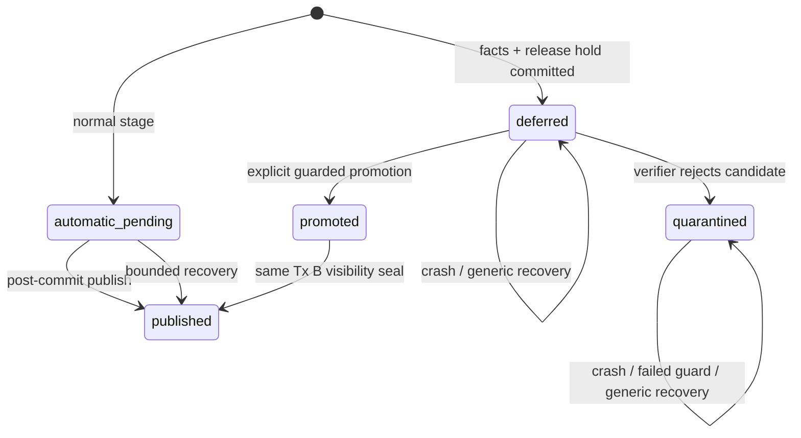
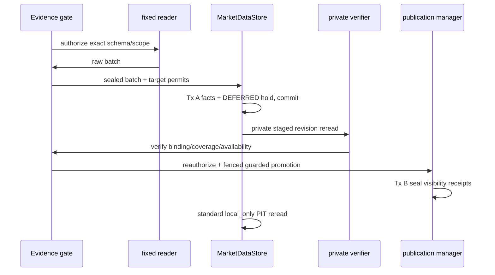

# A 股历史日线受控适配器：延期发布设计与审查包

> 记录日期：2026-09-11  
> 状态：`PREREQUISITE_IMPLEMENTATION / NO-GO`  
> 关联：`L-197-32`、`AC-197-032`、[受控导入边界](LEGACY_STOCK_DAILY_IMPORT_GUARD.md)

## 1. 决策和范围

`STOCK_ZH_A_HIST` 的协议层已经能够冻结读取范围、来源批次、日历、身份、逐目标 permit 和写后回读要求，但当前 `MarketDataStore.persist_provider_result()` 会在事实事务提交后立即发布来源快照。这样一来，未来适配器尚未核验逐 bar revision/source binding 或 local-only 回读时，数据会短暂进入普通查询可见范围。

本包先交付一个通用的 **延期发布隔离态**。它只改变规范化 `md_*` 的发布控制面，不能读旧表、不能启用 AkShare/OpenBB、不能注册 route、scheduler、页面入口或迁移历史行。真实导入继续保持 `NO-GO`。

| 决策 ID | 决策 |
| --- | --- |
| D-197-032-01 | 不改写 `MdPublication` 的 pending/sealed 事实语义。事实事务内另写一条不可忽略的 `MdPublicationReleaseHold`，以 hold state 表达 `DEFERRED`、`QUARANTINED` 或 `PROMOTED`。 |
| D-197-032-02 | 具有 active hold 的 receipt 即使事实事务已提交也没有 `published_at`/visibility sequence，因此所有普通本地读、PIT anchor、页面和策略链都不可见。 |
| D-197-032-03 | `publish_staged()` 与通用 `recover_pending()` 必须锁定/拒绝或跳过 active hold。进程崩溃不能把隔离数据变成可读数据。 |
| D-197-032-04 | 隔离数据只能通过一个显式 promotion API 发布；该 API 在发布事务中执行必需的重新授权/lease guard，并同时将 hold 标为 `PROMOTED`。它不接受页面、路由或 scheduler 的裸 receipt ID。 |
| D-197-032-05 | 本增量不把隔离态本身当作真实来源证据，也不把 unit/SQLite 回归升级为 `AC-197-032 PASS`。 |

## 2. 状态机与可见性不变量

共同不变量如下。

1. `published_at IS NULL` 或 `visibility_sequence IS NULL` 的 receipt 从普通 `read_observations`、calendar read、coverage、cursor、页面和策略读取中排除。
2. `DEFERRED`/`QUARANTINED` 不是普通 pending 的同义词。它必须有独立的 durable hold；不能只依赖“暂时未发布”或 fetch lease 来区分。
3. 通用恢复仅补偿“事实事务已成功而常规发布事务中断”的无 hold receipt。它永远不得选择存在 release hold 的 receipt。
4. promotion 只能在新事务中取得 receipt 与 hold 锁、重验 hold intent、来源 snapshot/lease binding，再分配全局 visibility sequence；任一 guard 失败必须回滚该发布事务。
5. 隔离态写入失败后，事实可以作为审计证据保留，但它不能被 v2、legacy bridge、`/data/market`、`/investment/strategies` 或研究工件读取。

## 3. 计划接口和事务边界

### 3.1 持久化模型

新增 child table `md_publication_release_holds`，不改动已有 `md_publications` 行。每条 hold 以 `publication_id` 为唯一键，并绑定同一 `source_snapshot_id`、固定 workflow `legacy_stock_daily_import`、`intent_sha256`、state、可选 quarantine code/time 与 promotion evidence hash/time。首版状态只允许：

| state | 含义 | `recover_pending()` / `publish_staged()` | 可见性 |
| --- | --- | --- | --- |
| `DEFERRED` | 事实已落库，等待 private staged reread 和 gate 校验 | 跳过 / 拒绝 | 不可见 |
| `QUARANTINED` | verifier 已拒绝；保留审计证据 | 跳过 / 拒绝 | 不可见 |
| `PROMOTED` | guarded promotion 与 receipt visibility seal 在同一事务成功 | 不再需要 generic publish | 可见 |

`intent_sha256` 是未来 adapter 对 canonical target、source batch/scope/source receipt、resolved context、write authorization descriptor 和 lease key/fence 的 canonical digest。它不是本增量的授权替身，而是 promotion 时阻止不同导入运行、target 或 permit 被混用的 durable binding。迁移是 additive child table，需要命名 CHECK、待处理索引和 schema-drift 检查，且 MySQL DDL 仍需要现有维护栅栏。非空 hold evidence 不能通过 downgrade 被静默删除。

### 3.2 发布管理器

`MarketDataPublicationManager.stage()` 保持普通调用形状；新的 hold staging API 在同一事实事务 A 内创建 receipt 和 `DEFERRED` hold。`publish_staged()` 保持现有普通调用形状，但发现任一 active hold 时失败关闭。`recover_pending()` 查询条件必须显式排除任何 hold。

新增的 guarded promotion 方法必须：

1. 只接收隔离 receipt 的 opaque staged handle 和与 hold 相同的 intent digest；
2. 强制要求一个 async pre-publish guard；
3. 在事务 B 中执行该 guard，并复用现有 `MarketDataFetchLeaseHandle` fence 校验；
4. 锁住并复核每个 receipt/hold 仍为 `DEFERRED + unpublished`，再调用现有 visibility allocator；
5. 在同一事务内写入 promotion evidence、`PROMOTED` state、published time 与 sequence；对已发布或 hold/intent 不匹配的 receipt 返回稳定错误，不重新分配 sequence。

guard 是未来 concrete evidence gate 调用 `reauthorize_route_for_write`、验证 source-batch receipt 和逐 target permit 的位置。本增量不提供可伪造的“已认证”默认 guard。

### 3.3 Store 适配器 seam

`MarketDataStore` 保持默认的普通 provider 写入和立即发布行为。未来适配器将显式调用 deferred staging API，并提交 `DeferredPublicationIntent`；该 API 返回不含普通 `received_at`/visible time 的 staged result，避免把本地接收时间或尚未存在的 publication time 误传给 PIT 调用者。

完整 legacy 写入流程应为：

私有 staged reread 与产品 `local_only` reread 是两个不同的接口：前者只能按 staged handle 读取仍隔离的固定 receipt；后者只能在 promotion 后读取已发布 receipt。后续 concrete writer 必须同时完成二者，且不能以 protocol fake、普通查询、表名或 calling code 的 `retrieved_at` 代替。

## 4. 失败处理和恢复

| 情况 | 预期结果 |
| --- | --- |
| 读前 schema/授权/identity/calendar 失败 | 零读取或零 canonical 写入。 |
| Tx A 失败 | 没有事实或 publication receipt 落库。 |
| Tx A 成功、验证器失败 | 事实和 `QUARANTINED` hold 保留用于审计；普通读与 generic recovery 均不可见。 |
| guard 或 lease fence 失败 | Tx B 回滚；receipt 继续隔离。 |
| 进程在 Tx A 后崩溃 | generic recovery 跳过隔离 receipt；需要后续受控 operator/adaptor 重新核验后 promotion。 |
| 进程在 Tx B 后崩溃 | 现有 sealed receipt/PIT 语义不变。 |

## 5. 本增量验收矩阵

| 验收 ID | 本地自动化断言 | 本次状态 |
| --- | --- | --- |
| DP-197-01 | `DEFERRED` provider receipt 的 source snapshot/revision/hold 已持久化，但普通 local read 为空。 | `PENDING` |
| DP-197-02 | `publish_staged()` 拒绝 active hold；`recover_pending()` 跳过 hold，同时仍可恢复普通 receipt。 | `PENDING` |
| DP-197-03 | 通过有效 guarded promotion 后，新的 visibility anchor 才能读到对应 revision。 | `PENDING` |
| DP-197-04 | promotion guard/lease/revision proof 失败时，receipt 没有 visible time/sequence，普通读仍为空。 | `PENDING` |
| DP-197-05 | SQLite migration upgrade、ORM schema、Alembic 单 head、Ruff 与目标 pytest 通过。 | `PENDING` |
| AC-197-032 | 真实表、MySQL/PostgreSQL、来源/许可、页面、策略、真实 receipt 验收。 | `NOT_RUN / NO-GO` |

## 6. 审查结论

该设计只允许开始实现隔离发布基础设施。任何把 `STOCK_ZH_A_HIST` 直接接入 reader、把 attestation 当作授权、让 recovery promotion quarantine、或把 fixture 结果写成真实 AkShare/OpenBB/页面通过的变更，均不符合本审查包。完成本增量后仍须单独审查 concrete gate、reader、canonical writer、private staged reread、MySQL/PostgreSQL 演练和浏览器验收，才可重新评估 `AC-197-032`。
