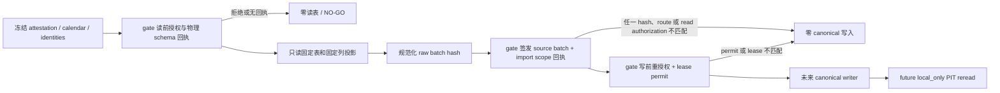

# A 股历史日线遗留表受控导入边界

> 记录日期：2026-09-10
> 状态：`IN_PROGRESS / NO-GO`
> 关联需求：迭代 197 本地优先数据中台；`L-197-32`、`AC-197-032`

本文件约束遗留 `STOCK_ZH_A_HIST` 表未来如何才能成为规范化 `market.bars / 1d` 的**离线证据输入**。当前实现只提供 fail-closed 的归一化、回执和本地重读协议；没有 production reader、evidence gate、canonical writer、Alembic 回填、provider route、页面入口或 scheduler 注册。因此它不能读取任何真实表，也不能让 `/data/market`、`/investment/strategies` 或 legacy `/api/v1/data/kline` 把该表当作已验证的 AkShare 数据。

## 1. 已核实的遗留表事实

`src/backend/app/data_fetch/scripts/stocks/daily/stock_zh_a_hist.py` 的 DDL 仅保存 `symbol`、`name`、`data_date`、创建/更新时间及 `(symbol, data_date)` 唯一键，没有逐行 provider、route、原始回执、schema digest、identity revision、calendar snapshot 或 publication receipt。

同一个写入路径以 `stock_zh_a_hist`（AkShare/Eastmoney）为首选，但在空结果或异常时会写入 Tencent 日线 fallback；后续还可写入 Eastmoney `trends2` 聚合结果。由此产生的行无法仅凭表名、attestation 文本或日期证明它们来自某一个当前获批 AkShare route。任何把该表直接升级为“AkShare 历史事实”的实现都是禁止的。

## 2. 当前候选协议



`app/services/market_data/legacy_stock_daily_import.py` 已定义以下只读/协议层边界。

| 构件 | 约束 |
| --- | --- |
| `LegacyStockDailyReader` | 只能取得 `STOCK_ZH_A_HIST` 的固定八列投影：`symbol`、`data_date`、OHLC、`成交量`、`涨跌幅`；接口显式接收列顺序和物理 schema SHA-256，禁止 `SELECT *`。 |
| `LegacyStockDailyReadScopeReceipt` | 读表前由独立 gate 交付 source registry、provider、route、授权回执 ID 和经过 gate 核验的**物理表/投影 schema SHA-256**。不是模块按 Python 映射自行猜出的 hash。 |
| `LegacyStockDailyImportScope` | 用 canonical JSON 计算独立 `import_scope_sha256`，锁定表、逻辑列投影/语义列映射、raw 格式与排序、route、**read-authorization receipt identity**、attestation 的稳定语义、读表前 calendar PIT、日期到 `EventKey` 映射、coverage、identity canonical ID、identity revision、metadata version 和 `bars/1d/qfq` 合同。`retrieved_at`、source-batch receipt ID、extracted time、输入行顺序和 publication ID 不进入该 hash。 |
| `LegacyStockDailyImportBatch` | `source_batch_sha256` 仅描述选定原始单元格；它与 `import_scope_sha256` 分开，前者不能代替后者。原始行按派生的 EventKey/canonical ID/provider symbol 稳定排序，scope 保存了重建这些派生排序键所需的 calendar/identity 语义。 |
| `LegacyStockDailySourceBatchReceipt` | 必须同时重复 raw-batch hash、import-scope hash、物理 schema hash、registry/provider/route、**read-authorization receipt identity** 和 extraction time。任何不一致在 canonical writer 前拒绝。`extracted_at` 只绑定 source bar 的 `source_available_at`；调用方 `retrieved_at` 仅为描述元数据。 |
| `LegacyStockDailyCanonicalWritePermit` | gate 在 source-batch receipt 后、writer 前按 **每个 canonical target** 签发一个 permit。每个 permit 同时锁定 canonical ID、相同 route/read-authorization identity、`source_batch_sha256`、`import_scope_sha256`、`source_receipt_id`、当前 write-authorization descriptor、resolved-context digest 与 fetch-lease key/fence。它不是调用方构造的授权替身；future adapter 必须在同一受控写边界中用 `MarketDataAccessAuthorizer.reauthorize_route_for_write` 和真实 `MarketDataFetchLeaseHandle` 生成并复核它。缺少任一 target 的 permit 或复用另一 target 的 context/lease 均在 writer 前拒绝。 |
| 写后 reread 协议 | writer 必须回显 source-batch/scope/source-receipt digest、逐 target permit evidence、revision-to-source-snapshot map、source snapshot、observation revision、publication receipt 的 ID/visible time/sequence，及 Store 实际使用的 `local_observation_available_at`。每条 bar 还必须以 `(canonical_id,event_at) → (observation_revision_id,source_snapshot_id)` 不可变绑定，且同一 observation revision 不得被两条 bar 共用；单纯相同的 revision/source ID 集合不足以证明对应关系；一个 source snapshot 也不可证明两个 target。每个 source snapshot 对应的 publication receipt `visible_at` 都不得早于该 Store local receipt。新写入的 Store v2 revision identity（`market-data-observation-revision-v2`）必须把规范化 UTC `provider_available_at` 封入 `revision_key_sha256`；reread 重建并核验该 identity，哪怕将 provenance 改为格式合法但更早的来源时间也必须失败关闭。精确匹配的历史 v1 identity 没有封存该字段，只能返回 `source_available_at=None`；future adapter 必须拒绝该值，不能从 v1 provenance 猜测来源时间。新建 `local_only` reread 的 visibility anchor 必须可见本次每一个 publication receipt；它比较业务字段和 `source_available_at`，要求每条 canonical `available_at` 精确等于该本地 receipt 时间，并逐条核对上述 revision/snapshot binding，不能把 source extraction time 伪造成 Store 可见时间。 |

候选测试替身里的 SQLite reader 也只选择固定投影，用于确认协议不会因 `SELECT *` 而在回执外带入额外列。它不连接项目数据库。

## 3. 当前本地证据

`L-197-32` 已执行：

```bash
/Users/yunjinqi/opt/anaconda3/bin/conda run --no-capture-output -n base python -m pytest \
  tests/market_data_platform/test_legacy_stock_daily_import.py -q
```

结果：`51 passed, 1 warning`。该组覆盖固定表/列映射、读前拒绝、未封存 batch、raw hash、物理 schema hash、scope hash、read-authorization receipt 绑定与重放拒绝、写前 permit 拒绝、permit 对 raw batch/scope/source receipt 的重放拒绝、多 target 缺 permit 拒绝、日历 PIT/事件映射、identity revision/metadata version、稳定排序、caller `retrieved_at` 早于或晚于 sealed `extracted_at`、source/local availability 分离、每条 bar 的唯一 revision/source binding、完整 local-only reread、每个 publication receipt 不早于 Store local receipt，以及 publication visibility sequence。

同一增量还依赖 `test_calendar_trading_day_events.py` 的 typed calendar reader 与 `test_store.py` 对 v2 `revision_key_sha256`/provenance `provider_available_at` 的严格 Store reread；三组组合本地回归为 `104 passed, 1 warning`。本表 importer 仍没有注册为应用服务或路由。

## 4. `AC-197-032` 启用前的强制条件

以下全部满足之前，状态保持 `NO-GO`，不得创建迁移、回填真实行、开通 route 或页面回退。

1. **逐目标 context 与身份证据**：适配器为每个 canonical target 冻结 `ResolvedMarketDataQueryContext`、query fingerprint、identity revision/metadata version、calendar snapshot 和读表前 visibility anchor；不可用 symbol 文本、当前 identity 或隐式 market 推断替代。
2. **当前授权与 lease**：读表前用 `MarketDataAccessAuthorizer.authorize_route`；对每一个 canonical target 在写入前用 `reauthorize_route_for_write`；写后复核 sealed source registry。使用真正的 `MarketDataSourceAuthorization` 和 `MarketDataFetchLeaseHandle`，并在同一受控写边界构造和复核逐 target `LegacyStockDailyCanonicalWritePermit`；permit 必须绑定 target、raw batch、scope 和 source receipt，不能复用 sibling target 的 context 或 lease（key + fence）。不得让本模块的 protocol fake 充当授权。
3. **独立 gate 与物理 schema manifest**：gate 必须在同一受控读取快照中验证真实连接、精确表名、八列顺序/类型、source registry/provider/route、Attestation 和每个 identity/calendar scope，并保存可审计的 schema/authorization manifest；不能把读前 schema 回执与之后不受保护的 `SELECT` 拼接。读后对同一 scope 签发 source-batch receipt；不能靠 DDL 名称、`created_at` 或 Python 常量证明来源。
4. **canonical 持久化和 availability 证据**：writer 只能经 `MarketDataStore.persist_provider_result` 写入，并在 source snapshot、observation revision 和 post-commit `MdPublication` 之间保留 raw batch/scope/schema digest、source receipt、authorization/revalidation 和 lease 证据。adapter 将 sealed `extracted_at` 作为 `ProviderMarketObservation.available_at` 传入；新写入的 Store v2 identity 必须将规范化 UTC `provider_available_at` 封入 `revision_key_sha256`，Store reread 必须重建该 identity 后才返回 `LocalObservationRevision.source_available_at`。缺失、损坏、无时区、晚于 local `available_at` 或改成另一合法更早 timestamp 的 v2 provenance 都必须失败关闭；匹配的历史 v1 identity 则一律返回 `source_available_at=None`，future adapter 必须拒绝它，不能由 v1 provenance 补推。实际可信本地 receipt 必须单独传给 `persist_provider_result(received_at=...)`，并原样保留为 protocol 的 `local_observation_available_at`；`PersistedProviderFetch.received_at` 是 publication 时间，不能拿来替代该 receipt。canonical write 必须为每条 bar 回显唯一的 revision/source-snapshot binding，且每个 source snapshot 的 publication receipt `visible_at` 不得早于该 local receipt。
5. **先认证再可见**：当前 `MarketDataStore.persist_provider_result` 在 protocol 的独立 reread 之前发布 source snapshot。concrete adapter 必须先提供 deferred-publication/quarantine state，或在认证完成前使该 legacy source 对所有产品读取不可见；若 reread、per-bar binding 或 publication evidence 失败，已写事实不能短暂成为 v2、页面或策略的可读数据。
6. **独立数据库验收**：在可销毁的 MySQL 与 PostgreSQL 验收库分别验证空库、完整本地命中、受控一次导入、第二次相同请求零网络、重复/冲突/撤销、部分失败、transaction rollback、quarantine/deferred publication、publication 后 PIT 重读、回放一致性和恢复演练。不得使用 fixture 或 SQLite 单测代替。
7. **真实来源和页面验收**：仅在已批准数据许可、AkShare/OpenBB route、凭据、限流和字段漂移证据就绪后，执行真实来源回执校验，并验证两个页面的 local-first 可见状态；任何 coverage/字段/来源缺口仍显示不完整或未配置，不能显示“已获取并入库”。

## 5. 验收判定

| 验收项 | 当前结论 | 证据边界 |
| --- | --- | --- |
| `L-197-32` 协议与离线拒绝回归 | `PASS` | 仅本地 Python/SQLite fixture；不读项目数据库、不联网。 |
| `AC-197-032` 真实遗留表导入 | `NOT_RUN / NO-GO` | 缺少 concrete gate、逐 target context/auth/lease adapter、deferred-publication/quarantine、canonical writer、迁移、真实 schema/source receipt 和独立验收库。 |
| `/data/market` 本地命中/缺口补齐 | `NOT_RUN / NO-GO` | 本模块未注册 route 或页面查询。 |
| `/investment/strategies` 严格 PIT 绑定 | `NOT_RUN / NO-GO` | 本模块未生成 research binding 或回测工件。 |

后续实现必须先提交一个专门的 adapter 设计与审查包，再独立执行 `AC-197-032`。本文件和现有单元测试不能被用于解除任何真实数据、OpenBB、AkShare、数据库、页面或部署闸门。
