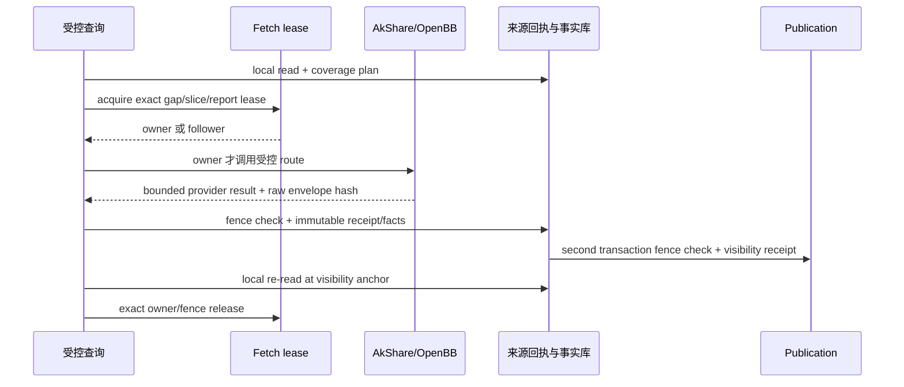

# 迭代 197 数据产品扩展计划

> 状态：设计基线。本文把“页面已经列出”与“已能本地优先读取、在线补齐并重放”分开；不改变当前候选的 `NOT_RUN`、`BLOCKED` 和 `NO-GO` 验收状态。

## 1. 完整覆盖的判定

一个页面数据家族只有同时满足下列条件，才可标记为**已覆盖**：

1. 有服务端签发的 `ready` family contract，字段、频率、口径、市场和数据种类均明确；
2. 能从精确 canonical identity 或完整三元组解析，不接受样例、附近合约、模糊代码或资产类型猜测；
3. 每个已批准 provider route 都有适配器、来源许可证/用途授权、半开时间窗及返回身份校验；
4. 提供方结果写入不可变来源回执、事实修订和 publication 后，下一次 `local_only` 或 `local_first` 可从本地读回；
5. 对该产品的完整性、字段质量、PIT 截止点、分页游标和来源链有可运行的验收；
6. `/data/market` 或已冻结的策略工件实际消费该合同，并能显示其状态和 provenance。

仅有 DTO 枚举、目录卡片、遗留 AkShare 端点、测试夹具或稳定的 `unconfigured` 拒绝，都不满足以上判定。

## 2. 当前 21 个页面家族的产品台账

| 资产 | family | 记录形态 | 当前候选 | 进入完整覆盖所缺工作 |
| --- | --- | --- | --- | --- |
| stock | realtime | 单序列 bars | `READY` | 真实来源和数据库验收 |
| stock | valuation | 单记录 | `UNCONFIGURED` | 单记录产品工作包 |
| stock | liquidity | 单记录参考序列 | `READY`（候选代码） | 真实来源、数据库与页面灰度验收 |
| futures | realtime | 单序列 bars | `READY` | 真实来源和数据库验收 |
| futures | settlement | 单记录 | `UNCONFIGURED` | 单记录产品工作包 |
| futures | inventory | 多记录报告 | `UNCONFIGURED` | 多记录事实模型工作包 |
| bond | realtime | 单序列 bars | `READY` | 真实来源和数据库验收 |
| bond | orderbook | 单快照 | `UNCONFIGURED` | 单记录产品工作包 |
| bond | fixed_income | 单记录 | `UNCONFIGURED` | 单记录产品工作包 |
| fund | realtime | 单序列 bars | `READY` | 真实来源和数据库验收 |
| fund | liquidity | 单记录参考序列 | `READY`（候选代码） | 真实来源、数据库与页面灰度验收 |
| fund | nav | 单记录 | `UNCONFIGURED` | 单记录产品工作包 |
| option | realtime | 单序列 bars | `READY` | 真实来源和数据库验收 |
| option | derivative | 多记录快照 | `UNCONFIGURED` | 多记录事实模型工作包 |
| option | risk_surface | 多记录快照 | `UNCONFIGURED` | 多记录事实模型工作包 |
| fx | realtime | 单序列 bars | `READY` | 真实来源和数据库验收 |
| fx | macro_fx | 单记录 | `UNCONFIGURED` | 单记录产品工作包 |
| fx | range | 单序列 OHLC bars | `READY`（候选代码） | 真实来源、数据库与页面灰度验收 |
| crypto | realtime | 单快照 | `UNCONFIGURED` | 单记录产品工作包 |
| crypto | cme_position | 多记录报告 | `UNCONFIGURED` | 多记录事实模型工作包 |
| crypto | range | 单序列 bars | `UNCONFIGURED` | 单记录产品工作包 |

`READY` 仅说明当前代码已具备受控的 family contract（`bars` 或 `reference_series`）和本地优先链路；它仍不代表真实 AkShare/OpenBB、MySQL/PostgreSQL、多 worker 或页面灰度验收已经通过。

## 3. 工作包和交付顺序

### 3.1 197-A：现有六类 bars 候选

197-A 保持当前范围：`stock/futures/bond/fund/option/fx.realtime`。它负责目录、身份、日历网格、覆盖规划、受控 provider、来源回执、不可变修订、publication、PIT 和页面状态。其多 worker 协调使用按精确 coverage gap 派生的 durable fetch lease；租约只能减少重复在线访问，不能替代真实方言、时钟漂移或部署拓扑验收。

197-A 的完成条件是六个 family 各自完成真实来源的小窗口 `provider → store → local_only` 复读，并在候选 MySQL/PostgreSQL 上完成迁移、UTC、PIT 和多 worker 证据。未满足时保持候选状态。

### 3.2 197-B1：11 个单记录/单序列产品

以下产品可复用大部分 identity、source receipt 和 revision 基础设施，但每个 family 都必须逐个启用，不能通过“同资产已经有 bars”批量放开：

- `stock.valuation`、`stock.liquidity`；
- `futures.settlement`；
- `bond.orderbook`、`bond.fixed_income`；
- `fund.liquidity`、`fund.nav`；
- `fx.macro_fx`、`fx.range`；
- `crypto.realtime`、`crypto.range`。

#### 3.2.1 已落地的 B1-0 合同与目录基础

候选已为 B1 建立六个惰性逻辑数据集：`market.valuation`、`market.liquidity`、`market.settlement`、`market.bond_reference`、`market.fund_nav` 和 `market.fx_reference`。它们与既有 `market.bars`、`market.quote_snapshot` 共用不可变 `md_observation_revisions` 的物理绑定，但各自保留独立 dataset code、字段 profile 和允许资产类型。

family contract 的 `ready` 有两层防线：公共 DTO 仅接受受审核的单记录 `calendar_grid` 或 `snapshot_freshness` 形状；服务端 registry 再对 17 个现有/B1 单记录 family 的 dataset、data kind、频率、必需字段和 coverage model 做精确白名单绑定。`stock.liquidity`、`fund.liquidity` 和 `fx.range` 已完成候选代码 promotion：前两项各有独立的 `reference_series` AkShare route ID，且只接受 `unadjusted + close + CNY + share`；后者使用精确 FX OHLC 日线 route，并固定为 `unadjusted + close + null + null`。这四个语义轴均为精确合同值；包括 `null` 的值也必须由调用方显式传递，省略或变更均在 provider I/O 前失败关闭。server bundle 声明当前资产的受审核候选项；行情页选择器再只展示可显式执行的 `ready + calendar_grid + 无维度 + bars/reference_series` family，用户必须主动选择非默认 family。流动性以声明字段表呈现，FX range 才复用 K 线。`bond.orderbook`、`crypto.realtime` 等快照 profile 仍没有被误绑定到当前不足以表达其字段的 quote-snapshot schema。

这项 promotion 仍只消除了代码和离线契约缺口。其余八个 B1 contract 保持 `unconfigured`；三个已开通 family 也必须完成下面七项清单以及真实环境证据，才能称为完整覆盖。例如 AkShare 小窗口返回零行并不构成 `fx.range` 的真实来源通过证据。

每个单记录产品的实施清单：

1. 定义 field profile、单位/币种/价格口径、事件时间或 as-of 时间、允许频率及 freshness SLA；
2. 定义精确 instrument/venue 解析和 provider 输出到 canonical fields 的映射；
3. 为 AkShare/OpenBB 分别登记可用 market、路由、许可、用途、时间窗和不支持码，不让客户端选择 provider；
4. 选择覆盖模型：`calendar_grid`、`snapshot_freshness` 或明确的 `reference_series` 周期；不得把日线 bars 网格套给快照或估值；
5. 增加 provider 结果身份、边界、字段质量、重复记录和来源载荷 hash 校验；
6. 增加 `provider → store → local_only → strict PIT` 回归和每个已启用来源的真实小窗口证据；
7. 最后才把 family contract 从 `unconfigured` 改为 `ready`，并更新页面字段展示。

### 3.3 197-B2：4 个多记录产品

以下产品不能直接复用当前“一个 event time 对应一个修订”的事实唯一性：

- `futures.inventory`：`report_date + commodity + location + warehouse`；
- `option.derivative`：`snapshot_at + underlying + contract + expiry + strike + right`；
- `option.risk_surface`：`snapshot_at + underlying + expiry + moneyness + model_version`；
- `crypto.cme_position`：`report_date + entity + rank + report_type`。

在任一多记录 family 启用前，必须先交付独立的数据模型迁移和以下契约：

1. **稳定记录身份**：将 server-normalized dimension object 以规范 JSON 序列化，保存可审计的 `semantic_record_key` 与 SHA-256；客户端不能提供任意 key。
2. **事实唯一性**：事实/修订唯一约束至少包含 series、event/report/snapshot time、record-key hash、revision number；不同 strike、仓库或实体不能相互覆盖。
3. **读取与分页**：查询要求声明或服务端签发 slice selector；稳定排序键为 `(event_at, semantic_record_key, revision_number)`，cursor 绑定 selector、record-key 排序和 PIT anchor。
4. **完整性**：期权链/风险曲面使用 `slice_completeness`，库存/CME 报告使用 `report_completeness`。provider 必须提交被请求 slice/report 的计数、边界和完整性证据；空响应只有在来源明确声明“该精确 slice 无记录”时才可作为完整。
5. **PIT 与 provenance**：同一 snapshot/report 的每一行都绑定相同或可追溯的 source receipt，同时保留各行 record key、字段 hash、质量和 `available_at`。读取不能跨 revision 拼装字段。
6. **重放验收**：至少覆盖同一时间两行以上、局部 slice 缺口、修订更正、稳定翻页、截止点前后可见性、provider 重复行以及不完整报告拒绝。

这项迁移不能为追求页面展示速度而弱化为“把链或报告序列化进一个 JSON 字段”。那样无法提供记录级唯一性、PIT 重放、覆盖证明或可审计分页。

## 4. 数据中台的统一写入语义

无论产品形态，写入顺序固定为：

follower 不发起 primary 或 fallback provider 调用，先终止旧读取事务并复读本地事实；若 owner 尚未发布，返回覆盖缺口和 `FETCH_LEASE_HELD`，由页面按既有刷新策略决定何时重试。任何 lease 丢失、授权变化、来源不匹配或完整性不足都不得将网络结果作为响应直接返回。

## 5. 页面和 Iteration 196 的衔接

`/data/market` 只消费 family contract 已声明的字段和频率。产品从 `unconfigured` 升为 `ready` 时，页面须使用 contract 驱动的状态、字段和 provenance，不能添加秘密的遗留端点回退。

`/investment/strategies` 在 Iteration 196 冻结前仅保留默认关闭的 sidecar。196/197 合并后，每个策略、研究和回测工件至少保存：canonical identity、family/version、dataset、source policy、identity/data revision、calendar snapshot、knowledge cutoff、query fingerprint 和来源 receipt/revision 集。自由文本 symbol 或页面曲线不能成为可回测数据输入的唯一证据。

## 6. 扩展验收编号

| 编号 | 验收目标 | 最低证据 |
| --- | --- | --- |
| XP-197-01 | 每个 B1 family 精确身份、字段、频率和拒绝路径 | API/contract/adapter 单元与集成回归 |
| XP-197-02 | 每个 B1 family 本地复用 | 成功网络小窗口后 `local_only` 不产生 provider 调用 |
| XP-197-03 | 快照/参考产品完整性 | freshness 或明确周期缺口用例，不能借 bars 日历推断 |
| XP-197-04 | 多记录稳定 identity | 同 timestamp 至少两条不同维度事实均可存储、读取、PIT 重放 |
| XP-197-05 | 多记录 slice/report completeness | 缺一条、重复一条、越界一条、空 slice、分页续页均有 fail-closed 证据 |
| XP-197-06 | 多 worker 安全 | owner/follower、超时接管、陈旧 fence、事实与 publication 双栅栏、provider 调用计数 |
| XP-197-07 | 页面和策略工件消费 | 浏览器/API/数据库/工件四方一致，且通过 IG-196-01 至 IG-196-05 |
| XP-197-08 | 真实运行环境 | 授权来源、OpenBB 隔离、MySQL/PostgreSQL UTC/PIT、恢复演练和唯一 Alembic head |

在 XP-197-01 至 XP-197-08 对应产品全部通过前，产品台账必须保留 `UNCONFIGURED` 或 `NOT_ACCEPTED`，不能因其他 family 已通过而扩大声明。
