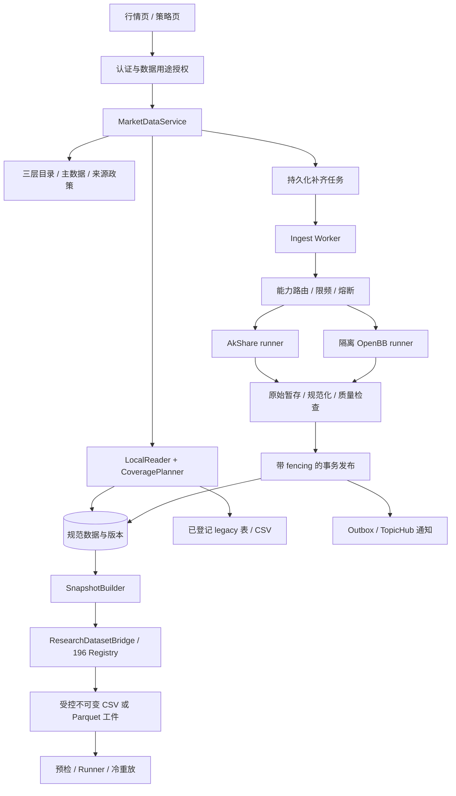
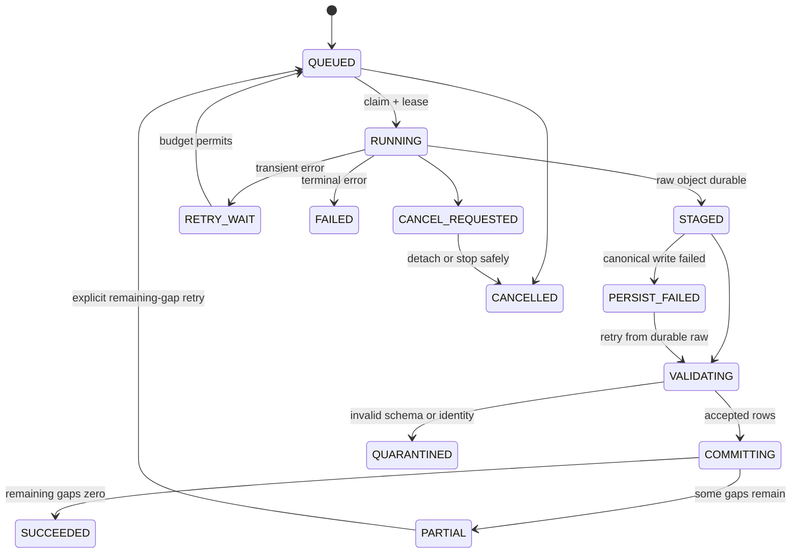

# 迭代 197：统一数据中台设计

> 本文所有新增组件、表、配置和接口均为拟设计合同，不表示已经实现。
> 需求编号见 REQUIREMENTS；逐项资产、主题和频率见 DATA_SCOPE。

## D1. 架构与职责

采用“项目内统一查询服务 + 持久化采集任务 + 隔离 Provider runner”。控制目录和身份沿用应用数据库；行情事实、批次发布和精确覆盖位于规范数据存储。默认规范存储复用现有 AkShare 仓库连接，在其中使用独立 `md_*` 表，不改现有大写原始表。



### D1.1 组件表

| 组件 | 职责 | 不应拥有的职责 |
| --- | --- | --- |
| `MarketDataService` | query/ensure/refresh、结果组装、授权上下文 | 直接调用 SDK、拼 provider 特有 SQL |
| `DatasetCatalogService` | `provider → endpoint → dataset → storage binding` 解析 | 把物理数据库等同于 provider |
| `InstrumentCatalogService` | 复用 AssetInstrument，维护别名和元数据版本 | 根据合约字母猜到期日/乘数 |
| `CoveragePlanner` | 合格记录集合、有效窗口、缺口、刷新和聚合计划 | 通过最近一行推断全区间齐全 |
| `ProviderRouter` | 能力、来源政策、同语义 fallback、额度 | 根据哪个来源先返回就自动替换市场口径 |
| `IngestWorker` | 认领、心跳、提取、暂存、发布、恢复 | 由 HTTP 生命周期承担持久任务 |
| `ProviderAdapter` | TET、来源错误归一、来源元数据 | 写业务数据库、自动批准来源许可 |
| `MarketDataRepository` | 事务、有效行、revision、覆盖、outbox | 在 query 请求里 CREATE/ALTER TABLE |
| `SnapshotBuilder` | 冻结实际数据内容与 schema，生成受控工件 | 自行决定研究切分/密封权限 |
| `ResearchDatasetBridge` | 把数据版本映射到 196 的 Registry/manifest 合同 | 绕过 196 precheck、审批或 holdout 授权 |

复用 `DgProvider/DgEndpoint`、`AssetInstrument`、`AssetDataSourceRegistry`、`AssetSpecModel`、现有脚本/调度和 `DataTopicHub`；不复用内置 synthetic connector 作为真实来源。`AssetSpecModel` 仍是交易执行规格的兼容模型；它与 AssetInstrument 通过 canonical identity/version 显式关联，不各自推导新身份。

## D2. 数据合同和身份

### D2.1 查询对象 `MarketDataQuery v1`

| 字段 | 合同 |
| --- | --- |
| `dataset_code` / `data_kind` | 指定逻辑数据集/种类；前端可用 asset + kind，服务端解析为登记项 |
| `canonical_id` 或 `symbol + asset_type + market` | 精确身份；歧义时返回候选，禁止返回第一条样例 |
| `frequency` / `multiplier` | 明确 `5min/30min/1h/1d/1w/1mo`；原始入口别名在适配层解析 |
| `start/end` | 新 API 为带时区 ISO 时间，内部半开 `[start,end)`；旧日历日期接口的 inclusive end 由适配器转为下一有效边界 |
| `required_fields` | schema 白名单；不同集合可能具有不同有效覆盖 |
| `adjustment/price_basis/currency` | 复权、close/settle/NAV/bid/ask/mid 等显式口径；采用目录默认值也必须回显其版本 |
| `mode` | `local_first/local_only/refresh` |
| `consistency` | `display/strict`；由调用者角色和研究合同限定，不能靠该字段越权 |
| `source_policy_id` | 服务端登记的候选来源及优先级；普通用户不能传任意函数/URL |
| `knowledge_cutoff` | 研究信息可得截止点；展示可省略 |
| `wait_ms` | 0—2,000；超过预算交由持久任务，不延长 web 请求 |
| `page_size/cursor` | 行情页默认 500、上限 2,000；后台工件导出独立流式限额，不受页面分页截断 |

用户/工作空间/服务身份、权限 epoch、允许用途、凭据引用和共享域来自认证上下文。query hash 排除 cursor 和 wait_ms，但包括全部影响内容的语义、目的和来源政策。用户指定的 `purpose=display` 不能提升 Explorer 的权限。

### D2.2 series 与记录键

`series_semantic_key = hash(dataset_code, canonical_id, instrument_metadata_version, frequency, multiplier, adjustment_policy_version, price_basis, currency, unit_policy_version, calendar_version, schema_version, entitlement_scope)`。

实际来源不从这个键中消失：每条 observation/revision 另存 `source_id/platform/upstream/endpoint_version`；每个查询版本冻结 `selection_policy_version` 和实际来源分段。默认优先单来源完整序列。多来源拼接只允许满足已验证等价合同，记录边界及差异检查；复权或连续合约不同版本绝不直接拼接。

| 数据种类 | 业务记录键 | 特有字段 |
| --- | --- | --- |
| bars | series + bar_start + source + revision | bar_end、trading_date、OHLC、volume/turnover、OI、settle、bar_status |
| quote_snapshot | series + source_observed_at + source + revision | quote_kind、bid/ask/last、volume_window、freshness_basis |
| option_chain | chain identity + source_snapshot_at + contract identity + revision | underlying、expiry、strike、call_put、multiplier、quote_time |
| position_report | dataset + report_subject + report_date + category + source + revision | published_at、long/short/OI/change、report period |
| reference_series | dataset + subject + metric + observation_period + source + revision | value、unit、publication/revision、适用币种/价格口径 |

保留 `provider_symbol`，但不能用显示 symbol 单独作主键。价格与金额采用 Decimal/`NUMERIC(28,10)`，数量采用可支持小数的 `NUMERIC(28,10)`；adapter 声明最小精度，溢出/精度丢失必须拒绝。进入 Pandas/backtrader 时的 float 转换记录工件 schema 和容差政策，不在入库前随意四舍五入。

### D2.3 时间与 PIT

分别存储 `event_time/event_end`、`source_published_at`（可空）、`retrieved_at`、`committed_at`。时间统一 UTC，额外保留 exchange timezone、trading_date、日历版本及可得时间证据。对日线把交易日存独立 DATE；不能用 UTC 日期替代中国夜盘交易日。

“现在下载的历史数据”只证明可重现当前 vintage，不自动证明当年就可得。提供两个明确视图：

- `LATEST_REPRODUCIBLE`：使用冻结时已提交的最新版，内容可重放，但不声称历史 PIT。
- `AS_KNOWN_THEN`：仅选择能证明在 knowledge_cutoff 前公开/授权可得的 revision，并限定已固定的系统版本；缺历史 vintage 或可靠发布时间证据时 `PIT_UNVERIFIED`，严格研究不通过。

未知发布时间保留 unknown；保守情况下以 retrieved_at 作为最早可证明持有时刻，不能把它倒填成交易日。对需要逐 bar as-of 的策略，按每个决策时间选择当时可得记录；不能只用整个回测结束日期的一次 cutoff 证明没有未来信息。

## D3. 数据模型与存储布局

### D3.1 应用数据库中的控制目录

| 对象 | 设计 |
| --- | --- |
| `DgDataset` / `dg_datasets` | 继承 189：code 唯一、data_kind、schema_version/schema、业务键、时间/单位/质量定义 |
| `DgStorageTarget` / `dg_storage_targets` | engine、配置引用、用途、健康和迁移版本；不存明文 DSN |
| `DgDatasetStorage` / `dg_dataset_storages` | dataset 与存储 binding、规范/原始角色、允许表/schema、读写/优先级/映射版本 |
| `DgEndpoint.dataset_id` | 继承 189 nullable 关系；新增代码不使用 legacy target_table 作为权威；一次返回多数据种类时登记拆分后的逻辑 endpoint |
| `AssetInstrument` + 拟增 alias 关系 | 复用 canonical_id/metadata_version；别名含 source/market/effective interval；显式唯一性和歧义检查 |
| `AssetDataSourceRegistry` | 扩展版本化 display/persist/research/export/share、保留期限和 entitlement_scope；沿用服务端授权逻辑 |
| `DataTable` 与覆盖兼容模型 | 关联 dataset/storage/version；可投影展示，不作为规范数据完整性权威 |

如果 189 已在后续基线合入，直接扩展其表；若未合入，197 S1 实现一次，不能使用近似名称另建平行目录。现有 `DgIngestJob` 保留历史 preview 语义，新补齐工作放在下述独立工作表，通过统一 UI 聚合并显式 `job_kind`；不复制两份权威任务状态。

### D3.2 规范存储中的运行事实

为满足跨进程和写入事务约束，**工作租约、数据批次、覆盖和版本必须在同一规范存储事务域**。

| 拟建表/组 | 关键内容与约束 |
| --- | --- |
| `md_series` | semantic_key 唯一、冻结的目录/身份/政策版本、local storage binding |
| `md_storage_epochs` | dataset/scope、binding generation、接受写入开关与迁移意图；发布事务锁定并重验，跨库切换先关闭旧库写入 |
| `md_ingest_works`、`md_query_requests` | 工作状态、缺口计划、deadline、attempt、owner、用途；查询请求可订阅共享工作，跨用户读权限独立校验 |
| `md_series_leases` | `(series_id, source_id, entitlement_scope)` 唯一；owner/lease_until/fencing_token，以数据库时间 CAS 更新 |
| `md_ingest_attempts` | 每次外部调用的源、chunk、窗口、耗时、失败类型、配额预留及原始对象引用 |
| `md_ingest_batches` | batch_id、raw hash/ref、schema/normalizer、源头、行数、发布状态、commit_seq |
| `md_bars` | 类型化 OHLCV/OI/settle；unique(series_id,bar_start,source_id,revision_hash)，外键 batch |
| `md_quote_snapshots` | 独立快照时间、报价类型、量额窗口、扩展 JSON；source/revision 唯一 |
| `md_option_chain_snapshots/rows` | 链元数据和合约行，snapshot + contract 唯一，不把合约行计为交易日 |
| `md_position_reports/rows` | 报告及类别行，report identity + category + revision 唯一 |
| `md_reference_observations` | 类型化观测键与 value/unit，加扩展字段；承载估值、NAV、牌价、库存等登记的 reference 数据 |
| `md_dataset_versions` | series、commit_seq 水位、选取政策、revision index hash、日历/质量版本；只读、不可变 |
| `md_coverage_segments` | version + series + required_fields_hash + quality_policy + cutoff；已验证区间与缺口状态，不只存 MIN/MAX |
| `md_quality_issues` | batch/record、规则版本、severity、隔离原因；禁止敏感原始 payload 出现在普通 API |
| `md_snapshot_artifacts` | 冻结版本、记录索引、内容/schema hash、格式、行数、保留引用和受控存储 ref |
| `md_outbox_events` | 事务内写入发布事件；consumer 幂等键 event_id |

代码可以按模型组拆文件；不要求为每个金融字段各建一张表。成交主字段不得全部塞入不可索引的 JSON；不同 kind 使用独立 schema 和存储策略。

索引至少包含 `(series_id, event_time)`、`(series_id, source_id, event_time, commit_seq)`、work 的 `(status,next_attempt_at,lease_until)`。大窗口按时间游标分页，读相同固定 version；页与页之间不得切换 revision。所有查询使用参数化过滤和目录白名单标识符。

### D3.3 部署模式与事务边界

1. 已有 MySQL 仓库：规范 `md_*` 表默认使用仓库的连接，legacy 表保留。显式 `MARKET_DATA_DATABASE_URL` 可指定其他已登记规范存储。
2. 应用 PostgreSQL/SQLite 且无 AkShare MySQL：规范层可以使用对应应用数据库中的 `md_*` 表；legacy MySQL adapter 状态为 `UNAVAILABLE`，不阻止规范层和 Provider 落库。连接选择必须生成可审计的 engine/storage_id，不隐式创建数据库。
3. MySQL/PostgreSQL 支持生产多 worker；SQLite 单 writer，用原子 claim 和唯一键实现串行任务，不能使用“仅进程锁”冒充可恢复事务。
4. 应用目录与规范库可能不同：先读控制目录形成签名/版本化描述，再在规范库完成工作与发布。应用 coverage/UI 通过 outbox 投影，崩溃后重试。没有跨数据库外键或假想的单一事务。
5. 授权每次请求和发布前重验版本，过期或失联导致无法确认授权时拒绝相应操作；数据版本保留采集时的原始授权证据，同时读取检查当前政策。

每个 dataset/scope 同时只有一个 `write_primary`；其他存储仅作为已登记原始源或只读副本。发布事务必须锁定本库 `md_storage_epochs`，重验接受写入开关及 generation，并在同一事务内校验 work fencing token。仅修改控制目录不能使另一个数据库中的旧令牌自动失效。

跨库切换采用可恢复的停写交接：登记迁移意图并置 `DRAINING`，停止发出新工作；在旧规范库锁定 epoch 行、关闭写入并提升 generation，等已持锁发布事务结束，记录最终 commit 水位；把目标库追平到该水位并验证版本/hash；激活目标库的新 generation 后才 CAS 发布控制目录 binding。每一步持久记录，恢复时先核对两端状态；无法确认旧库已停写时不得启用新库。激活前失败可通过新的 generation 恢复旧主库，不能重新启用旧令牌；激活后回切也执行同样交接。交接期间读取固定已提交版本，写入排队或明确暂停。不能让两个物理库各持一个有效 lease 同时作为同一 series 的写主库。副本只在能证明覆盖了请求固定版本时用于读取，否则回主库或返回不可用。

## D4. 本地优先查询与缺口规划

### D4.1 查询流程

```text
authorize(caller, requested_use, dataset, scope)
resolve_exact_identity_and_dataset()
normalize_query_and_freeze_policy_versions()
read_committed_local_data(query)
inspect_registered_legacy_or_csv_only_for_uncovered_parts()
validate_and_publish_eligible_local_imports()
evaluate_required_fields_calendar_quality_freshness_and_cutoff()
if satisfied and mode != refresh: return LOCAL_HIT
if mode == local_only: return local_rows + gaps + typed_status
plan_missing_segments_and_refresh_segments()
join_or_enqueue_persistent_work()
wait_at_most(wait_ms); reread_committed_view()
return rows/metadata or accepted_job; never return uncommitted new rows
```

已登记且可证明身份/质量的 legacy 数据属于本地候选，应先用它补规范层，再考虑联网。为避免每次扫大表，S1 建立显式映射与增量水位；UI 查询只查目标标的/范围的索引。未验证映射只能展示目录，不能自动转成可信研究数据。

`local_first` 对部分合格数据返回 `PARTIAL_PENDING`；完全空且工作未完成返回 `PENDING`。一旦写入完成，所有订阅者按同一 version 重新读取，不把网络结果和旧本地行直接在浏览器拼接。

### D4.2 判断“足够”的顺序

1. 身份、data_kind、市场、价格/复权/币种/单位合同相同。
2. 源和内容允许当前用途，license/entitlement 未过期；fixture、sample、quarantined 不计覆盖。
3. 所需字段存在，质量规则满足，revision 在目标知识时间和系统版本内。
4. 用冻结交易日历、session、上市/退市/到期及停牌记录计算有效期望集合。
5. 逐 observation key 比较实际合格集合，得到头部/中部/尾部缺口；chain/report 则使用其 snapshot/report universe 合同。
6. 独立检查最新快照或未完成 bar 的新鲜度，决定是否刷新。

公式：`missing = expected_keys - accepted_keys - evidenced_non_observation_keys`。未知停牌不属于 evidenced_non_observation；无法建立可信 expected 集合时返回 `COVERAGE_UNKNOWN`，不能声称 100%。覆盖率计算保留分母、缺失、已解释无观测及规则版本。

期权链若来源没有提供完整合约 universe 证明，只能声明“已获取 N 个合约”，不能声明整条链完整。报告在不同发布时间修订时用 revision，不因报告日相同覆盖旧内容。

### D4.3 补齐策略

- 日线按缺失 session 的连续段请求，已保存的段不重复下载；大窗口按 provider 的最大范围/分页切块。
- 某来源只支持整月/整市场请求时，计划记录 `requested_gap` 和 `provider_fetch_window` 的差异及原因；同源同块合并一次，落库后只向各调用者返回授权部分。
- 最新行情与最近已完成日线允许小重叠刷新（建议最近 3 个 session，版本化可调），用于供应商修订；不是每次都重抓全部历史。
- 请求日历需要扩展时先补日历元数据，不把周一至周五硬编码为所有市场交易日。
- 不支持历史/频率为不可重试能力结果；供应商短时空响应先视为不确定，不推进成功水位。
- 合格数据提交后再次计算真实剩余缺口。仅当 remaining gaps=0、质量/时间/用途通过时，strict 请求才为 READY。

### D4.4 新鲜度与负缓存初值

以下是项目默认政策建议，不是来源服务保证；G0 必须按来源真实延迟配置。

| 种类 | 默认检查方式 | 刷新/失效 |
| --- | --- | --- |
| 交易时段报价快照 | source_observed_at + retrieved_at；未知事件时间标记 freshness unknown | 默认 60s 内复用，不早于供应商允许频率；延迟来源保留 delayed 标签 |
| 已收盘日线 | 对有效请求末 session 检查收盘及来源发布缓冲 | 默认收盘后 30min 尝试，失败按 provider 再次可用时间；完整旧窗口不周期性重抓 |
| 周/月 bars | 完整基础日线和 session 完成标记 | 基础版本改变才失效；未结束周期为 provisional |
| 分钟 bars | 按 interval 结束、来源延迟、session 完成 | 最近未完成 bar 单独刷新；不补 future bars |
| 期权链 | 链源 snapshot_at 与实际合约清单 | 默认 60s/来源允许周期；合约到期变化触发重新解析 |
| 报告/净值/库存/宏观 | 发布日程、source_published_at、revision | 每次查询不反复抓同一未发布报告；下次发布时间后失效 |
| 空数据 | 仅缓存已分类的空结果 | unknown/临时错误不标成功；暂时空最多 60s；确证不存在默认 1h，主数据版本变化立即失效 |

缓存键包括 scope、完整查询语义、policy 和 version。负缓存按来源和错误类别隔离；429 缓存遵守 Retry-After，不能污染其他来源的能力。

## D5. AkShare / OpenBB 适配与运行环境

### D5.1 Adapter 合同

每个 adapter 提供 `capabilities`、`normalize_query`、`fetch`、`normalize_result`，返回 `ProviderBatch`：

```text
platform=akshare|openbb|local_import
source_id + upstream_id + endpoint_id/version
original_query_hash + actual_fetch_window + actual_symbols
raw_payload_ref/hash + extracted_at + source_observed/published_at
schema_version + normalizer_version + unit/adjustment/identity evidence
rows + pagination_complete + warnings + errors
```

OpenBB 下的 yfinance 必须保留为真实来源，例如 `platform=openbb, source_id=yfinance`，不能把来源写成只有 `openbb`。同一 upstream 经两个 SDK 包装仍共享限频/熔断，不能算两条独立备用路线。

OpenBB Fetcher 的标准字段保留；本项目 schema 不直接继承 SDK 内部类作为业务 API。额外字段放 namespaced extensions，未知字段不能改变主键或研究政策。OpenBB OBBject 的 warnings/extra 必须解析和留存；`.to_dataframe()` 成功不代表质量合格。

### D5.2 能力记录

能力键包含 provider endpoint、asset/market、data_kind、symbol family、原生/可派生频率、最长历史窗口、分页限制、实时延迟、复权口径、字段、凭据需求、用途和保留限制。分别记录：

`declared_capability`（源码/文档）→ `installed_capability`（锁定环境实际发现）→ `verified_capability`（真实探測及当前授权）。UI 的 `enabled` 取后两者及当前 policy 的交集，不能由 provider 名称或 seed record 推导。

按 DATA_SCOPE 的中国资产优先复用 AkShare 与本地数据；OpenBB 覆盖准确匹配时纳入 fallback。新增海外数据作为另一 market，不用于掩盖原有市场失败。

### D5.3 依赖与部署

- 默认 OpenBB 为独立、锁定 Python 运行环境/worker image，按需安装 provider 扩展；不用共享 Anaconda base 承担后续 SDK 依赖变更。
- 业务主应用和 Ingest Worker 通过版本化 DTO 调用 Provider runner。runner 只拥有供应商凭据和允许的出口，无业务数据库凭据和研究 sealed 存储访问权。
- SDK 导入/构建在部署构建阶段完成；可发现能力和 `/health` 启动读回。运行期禁止 pip install、任意插件路径、任意函数 import 或从用户 clone 目录导入。
- 主应用不启动就绪失败的 provider，且本地已有数据查询不依赖 OpenBB 存活。
- 锁定 openbb/core/providers、Python、依赖清单及构建 hash；升版先跑语义和 golden-response 合同。AGPL 和各来源保存/共享权限按实际使用核定，不以进程隔离推定结论。

### D5.4 配额与故障

初始全局采集并发建议 4，每 upstream/credential 最多 2，任务队列上限 1,000；按部署容量和供应商规则收紧。每外部 chunk 尝试超时默认 20s，单次工作阶段最多 3 次调用（含重试/fallback）且该阶段墙钟 ≤ 60s；大回填由多个持久阶段组成，总 deadline 默认 10min，管理员回填另有显式预算。

并发令牌和额度在数据库原子预留，成功/失败结算；请求超时若计费情况未知，保守记录，不立即释放成可重复花费的额度。429 遵守 Retry-After，带 jitter 的指数退避不超过总 deadline。invalid query/schema、缺 key、未授权、unsupported 不作网络重试；timeout/5xx 可限次重试。schema 漂移隔离来源，不能靠无限换源掩盖数据错误。

连续 5 次暂时失败可触发 60s 熔断，随后单探针半开；阈值按来源冻结。同步 SDK 使用可终止的子进程，超时发终止信号并回收；`asyncio.to_thread` 外层 timeout 不能被认为已经终止底层请求。

## D6. 任务状态、并发和幂等



状态带 attempt 和不可变事件历史；`PERSIST_FAILED` 的状态更新若数据库本身不可达可能无法即时写入，恢复时根据最后 STAGED/lease 与 raw receipt 对账，不能伪造已成功记录。阶段预算耗尽转 `TIMED_OUT` 终态（适用于所有非发布终态）；不能无限处于 RUNNING。

### D6.1 合并重叠请求

先规范化 series 与 scope，计算缺口；在短事务里获取该 series/source 的租约记录/规划锁，合并待处理区间，建立多个 query request 到同一个 work 的订阅关系。网络期间不持数据库长事务。

采集中新到的重叠请求等待已计划块，新增未包含区间记入待处理集合。worker 发布后重算集合，继续未完成部分；客户端取消只移除自身订阅，不能取消其他用户或调度需要的共享工作。不同授权共享域、价格口径或研究分区不能合并。

每次 claim 增加 fencing_token，提交前原子验证 owner/token/lease/deadline/未取消。旧 worker 即使外部调用返回也不能发布；其原始对象保留为可对账孤立产物。MySQL/PostgreSQL 用行锁/CAS，SQLite 单 writer 仍用数据库原子条件，不能只放一个 Python Lock。

外部网络无法承诺 exactly once：断线或崩溃后请求可能重发。承诺的是正常并发场景单提取工作、故障场景可追踪调用，以及数据库有效版本只发布一次。

## D7. 校验、持久化与发布

### D7.1 质量规则

| 级别 | 示例 | 处理 |
| --- | --- | --- |
| 批次拒绝 | 标的/市场不符、schema 漂移、期权链被伪装为 bars、复权未知却要求指定复权 | QUARANTINED，无合格覆盖 |
| 行隔离 | NaN/Inf、无法解析时间、重复业务键冲突、high/low 不一致 | 行与规则留痕；有效行可作为部分数据发布，但缺口保留 |
| 资产特有规则 | 负 volume、无效 expiry/strike、未知交易规格、币种/单位不一致 | 根据数据集政策阻断或隔离；不统一套用“价格必须大于零”到可能为负的期货/利率 |
| 提醒 | 非关键描述字段缺失、来源延迟、provisional bar | 展示 warning；是否研究可用由明确 policy 判断 |

正常时间序列不得 ffill OHLC 来补缺口。成交量为 0 可能合法，null 不得替换为 0。多来源差异检查使用数据集定义的绝对/相对容差，无法证明等价时保留不同来源序列并给出 SOURCE_CONFLICT。

### D7.2 发布顺序

1. 原始响应脱敏后写受控暂存文件/对象，校验大小与 hash。文件系统使用临时路径 → fsync → 原子 rename；对象存储使用已完成对象和校验结果。未持久完成不写“raw available”。
2. 在规范库登记 STAGED batch 和 raw receipt；权限不允许保留完整原始响应时采用获准的最小必要响应载体并明确 `raw_retention_mode`。不能假称可完整重解析。
3. 按冻结映射验证并生成规范行，隔离坏行。
4. 在**一个规范库事务**中，锁定并校验 storage epoch、series 发布行和租约 fencing，写入幂等 revision、创建 dataset version、重算此次受影响覆盖、更新 work/attempt 和 outbox；全部成功才 commit。固定锁顺序为 epoch → 按 ID 排序的 series → work/lease，避免多序列批次死锁。
5. 数据提交后重新读取正式版本响应，outbox 异步更新应用 coverage 投影和 TopicHub；投影失败不回滚已提交事实，重启补投影。

同源相同业务键、相同规范内容 hash 为幂等 no-op，重复抓取仍可留一条观察/检查时间记录；内容改变追加 revision，不覆盖被 snapshot 引用的历史行。`committed_at` 和版本水位不可用 provider 时间代替。

每个 series 的 `commit_seq` 在持有发布行锁的事务中递增，不使用可能先分配、后提交的全局自增 ID 作为已提交水位。同一 series 的不同来源发布也串行通过该锁；版本固定 watermarks、选取政策与 revision index hash。多 series 快照记录每个 series 的版本向量，不把几个数据库的最大序号冒充同一全局时刻。

大批量 staging 可以分块，但分块各有提交水位；总体请求 `READY` 必须覆盖全部必需块。不可先把整段 coverage 标为 complete 再后台写行。

数据库事务回滚保留 durable raw 和失败上下文。若 DB commit 成功但客户端/应用元数据更新失败，重试通过 work/batch 唯一键发现已经提交，直接复用，不重新提取。

### D7.3 文件与数据库一致性

内容对象先持久、数据库后引用；commit 失败产生的未引用对象由 GC 延迟清理，不能在请求失败时盲删可能已被提交引用的对象。GC 采用“mark → 引用复核 → 保留窗 → sweep”，每次记录 manifest 和删除原因；研究 pin、法规/许可保留和正在发布工作均保护引用。

## D8. API 与兼容层

新路由前缀为 `/api/v1/data`，API 内部仍采用版本化 DTO；路径不暴露 SQL 或 provider SDK 调用。

| API | 行为 |
| --- | --- |
| `POST /queries` | query + mode，正常 200（可能部分）、无正式行且 pending 为 202；返回 query_id |
| `GET /queries/{id}` | 读取当前查询进度；带 cursor 时锁定 cursor 中的 dataset version 分页；只有其 owner/授权角色可访问 |
| `POST /ensure` | 严格数据准备；返回已就绪版本或 202/job，不直接启动研究 |
| `POST /refresh-jobs` | 显式刷新指定数据集/窗口，管理员回填有额度；Idempotency-Key |
| `GET /ingest-works/{id}` | 状态、缺口、已提交行数、安全错误和下次尝试时间 |
| `POST /ingest-works/{id}/retry` | 重试剩余缺口或从 STAGED 恢复；不重放已提交块 |
| `POST /query-requests/{id}/cancel` | 取消本请求订阅；必要时工作取消，不影响其他订阅者 |
| `GET /datasets`、`GET /capabilities` | 按当前角色返回可用数据类型、源、市场、频率、使用限制 |
| `GET /coverage` | 精确 dataset/series/version 及所需字段覆盖 |

Idempotency-Key 以 `(principal, operation, key)` 唯一；同 key 不同请求 hash 返回 409。自动查询请求的内容合并依靠 service 语义键，不要求用户知道幂等键。刷新相同查询可用新刷新请求键，但仍受 TTL/最小来源周期限制。

### D8.1 响应样例（结构示意，非真实运行证据）

```json
{
  "query_id": "query-example",
  "status": "PARTIAL_PENDING",
  "data": {"snapshot": null, "rows": []},
  "meta": {
    "dataset_code": "market.stock_daily",
    "data_kind": "bars",
    "canonical_id": "resolved-server-identity",
    "frequency": "1d",
    "coverage": {"status": "partial", "required": 240, "accepted": 235, "missing": 5},
    "gaps": [{"start": "2025-06-09", "end_exclusive": "2025-06-16", "reason": "missing_bars"}],
    "freshness": {"status": "not_applicable", "as_of": "2025-12-31"},
    "read_origin": "local",
    "sources": [{"platform": "akshare", "source_id": "registered-source", "batch_ids": ["batch-example"]}],
    "persistence": {"state": "committed", "dataset_version": "version-example"},
    "pending_work_ids": ["work-example"],
    "research_eligible": false,
    "warnings": ["示例：缺口正在补齐"],
    "next_cursor": null
  }
}
```

响应中的 row 数量必须与分页解释一致；上述 rows 省略内容用于展示结构。`persistence=committed` 只描述本次已返回的本地版本，不表示 pending 缺口已经写完。实际响应另给缺口工作状态，不能只放一个笼统 cached 布尔值。

### D8.2 兼容映射

| 现有接口 | 适配 |
| --- | --- |
| `GET /market-instruments/lookup` | `refresh_online=false` 保持本地兼容读取；`refresh_online=true` 在 warehouse/provider I/O 前以 `MARKET_DATA_LEGACY_ONLINE_REFRESH_DISABLED` 拒绝。新页面的在线补齐只能调用 `/queries` 的受控 `local_first` / `refresh`；返回现有 snapshot/history/indicators，并可加 meta。 |
| `GET /market-instruments/options` | 用统一主数据、可用市场与本地覆盖投影；不返回无来源样例作为真实可用标的 |
| `GET /kline` | 股票 bars 的兼容 facade；保留 kline/records 格式、默认 qfq 在 query 中显式化；网络与持久化集中 |
| `/trust/coverage`、`refresh-local/refresh-warehouse` | 返回兼容结构并附 version；refresh 覆盖是重新检查本地元数据，不默认触发线上回填 |
| `/trust/precheck` | 接收/解析 dataset_version/artifact evidence；可信模式必须检查真实工件，legacy 摘要以 legacy 标记 |
| 现有 dg preview API | 保持诊断预览语义、synthetic 标签；新 ingest API 才报告 `committed` |

错误状态：参数/身份不明 422，身份候选歧义/幂等冲突 409，无确证数据 404 或领域 EMPTY，权限 403，配额 429，上游暂不可用/库故障 503，内容校验失败为任务 QUARANTINED。HTTP 状态不能替代领域 status；浏览器保留正式已提交部分且显示结构化原因码。

## D9. 前端工作流

### D9.1 行情页

页面拆出 `useMarketDataQuery`、`MarketDataStatusBar`、`DataCoverageDetail` 和 `DataFillProgress`。继续提供七类标签、表格、图表和关联目录。新的默认“查询”执行 local_first，显式“刷新来源数据”执行 refresh；每个操作只针对当前数据集和窗口。

状态包括本地可用/部分缺失/正在补齐/保存失败/来源延迟/不支持/无权限。展示数据观察时间、最近检查时间、已保存状态和范围，避免把“刚抓取”写成“刚成交”。CME、期权链和 reference 数据使用独立的结构表/图，不强制 K 线。

query identity 包含 asset、symbol、market、kind、频率、日期和 policy。切换任一项时 abort 旧 HTTP/轮询；旧 job 可继续为其他订阅者运行，但响应必须核对 query_id，不能覆盖新选择。完成通知先校验 query/version 再刷新；卸载时释放订阅。

### D9.2 策略页

“准备数据”形成独立阶段：解析七类身份 → ensure → 质量/PIT/许可检查 → 工件 → 绑定 196 dataset → 预检 → 用户确认的既有研究流程。不能在每轮生成/回测时再从网络读行情。

展示标的/市场、频率、实际区间、所需/已取得 bars、缺口、版本、复权和数据来源。数据缺失或 worker 未完成时禁用运行，并允许查看/重试数据任务。变更请求导致旧 precheck 过期；补齐失败不清空已经确认的 hypothesis 或新建 epoch。

UI 不展示连接串、raw 文件路径、sealed 分区统计/内容、provider key 或 SDK 内部类名。复用现有 i18n/error catalog 和权限交互。

## D10. 研究快照与迭代 196

### D10.1 分工合同

197 拥有合格数据、固定版本和内容工件；196 拥有 research dataset policy、切分、假设确认、epoch、candidate、holdout 授权、模型和审批。197 新增 `ResearchDatasetBridge`，不把 `md_dataset_versions.id` 直接冒充 196 的 dataset_snapshot_id。

桥接必须向 196 提供：instrument manifest、source manifest（含 raw/normalized/artifact hash）、frequency/timezone、adjustment/continuous policy、PIT/vintage evidence、split manifest、execution policy、license tags 和受控 storage reference。196 既有 metadata content_hash、storage_reference_hash 与 197 工件 bytes hash 都要保留和验证，它们不是同一种 hash。

196 公共创建请求目前只允许 DISCOVERY/ITERATION_VALIDATION；SEALED_HOLDOUT/FORWARD_OBSERVATION 由其内部授权路径创建。schema 变化通过 adapter version 处理，不能向公共 DTO 加一个任意 partition 参数来放开权限。

### D10.2 工件生成与运行

1. 选定 committed dataset version，冻结所有实际 revision key、规范化/schema/日历/来源选取政策。
2. 以确定排序、编码、列类型与时间表示生成 Parquet；现有 runner 优先生成兼容 CSV，带 schema sidecar 和内容 hash。两格式来自同一规范版本，但各有自身 bytes hash。
3. 工件持久、校验之后登记 artifact；ResearchDatasetBridge 原子/幂等建立研究引用。跨库不能原子时先建工件和引用状态，再确认绑定；未确认引用不得启动研究，重试按 binding key 复用。
4. `workspace_unit_runtime` 增加精确 artifact 引用适配。新可信运行不再做 prefix/glob 合约文件猜测；旧运行保留 legacy reader 和标签。
5. 预检校验真实工件，而非仅校验外部覆盖摘要。Runner 启动再次验证内容/schema hash、dataset identity 和允许分区；仅挂载该运行获准文件，断网且无供应商凭据。
6. 来源修订产生新 dataset version，不能修改已冻结工件；旧候选继续读旧版本。若许可撤回需限制访问，保留审计 hash 和依法/按许可允许保留的内容，不能重新联网取新版本冒充旧工件。

### D10.3 防止通用数据服务绕过密封

Explorer token 的服务端能力只允许其已授权 DISCOVERY/ITERATION_VALIDATION 范围；对通用 `/queries`、legacy `/kline`、legacy 表预览、CSV 导出、直接规范库及 Provider 出口都执行同一范围限制。禁止仅隐藏 sealed URI，却允许 Explorer 通过公开行情接口重取相同标的和日期。

普通用户行情访问与研究 worker 身份分开；不能把用户全权限 token 传给生成器。真实部署通过凭据、数据库 role、存储权限和出口限制验证，而非只做单元测试。196 未提供这些前置时，197 联合研究门禁为 `BLOCKED_DEPENDENCY_196`。

Forward observation 只能收纳 candidate freeze 后实际到达且符合 196 forward policy 的新观测，不能把已有数据库历史改名为 forward。

## D11. 迁移、调度与灰度

### D11.1 迁移顺序

1. G0 导出精确 baseline：库引擎版本、DDL、行数、逻辑重复键、范围、映射、现有调度标识，196 最终接口与 Alembic heads。
2. 应用库新增三层目录；规范库新增 `md_*` 表，各用自己的 migration version 表。若共用同一物理库，仍隔离版本表和 metadata ownership。
3. 只为明确映射的本地表/CSV 生成 import plan，dry-run 展示预计行数、单位转换、重复/坏行和磁盘估算；未知复权、身份、时间戳按 unknown 隔离。
4. 按主键/时间游标分块导入；保存断点、源水位和批次 hash。保留 legacy writers 运行时，导入完成后从水位做追赶并重查最近窗口；不能假定原始表一直静止。
5. shadow 读仅比较已持久内容，不增加外部调用；shadow 补齐在隔离库/显式小预算中运行。
6. 七类逐项 canary，全部通过后再更改两个新页面的默认数据入口；逐用户/工作空间可回退。

unknown 历史行不能通过“给所有旧数据补一个当前 source_id 和 created_at”升级成 verified PIT。旧补齐缓存因为缺市场/复权等键，只导入能够重新证明语义的部分。迁移报告记录 input/accepted/quarantined/conflicting/skipped，以保证没有静默丢行。

### D11.2 调度收敛

保持现有 AkShare 脚本和调度器标识；新补齐/刷新由统一 `ensure/refresh` 服务生成 work，调度触发与用户按需请求共享合并/配额/发布合同。旧脚本先照旧写 legacy 表，再用受控 importer 提取新增批次，不要求逐脚本双写规范表。

`TaskExecution`、DataTable 元数据、DgIngestJob preview 与 md work 通过关联 ID 和 `job_kind` 展示；只有规范库 committed receipt 能使新“数据已就绪”状态通过。Airflow/其他引擎是否使用由既有部署决定，197 不另外迁移调度平台。

### D11.3 功能开关

拟新增：`MARKET_DATA_QUERY_V2_ENABLED`、`MARKET_DATA_AUTO_FILL_ENABLED`、`MARKET_DATA_OPENBB_ENABLED`、`MARKET_DATA_RESEARCH_BRIDGE_ENABLED`、`MARKET_DATA_LEGACY_IMPORT_ENABLED`，以及按 dataset/market/scope 的 canary allowlist。默认全部关闭，经过环境验收逐项启用。

数据存储、worker 并发、超时、预算、保留配置通过 typed settings 和目录管理；允许默认 engine 解析，禁止自动以生产请求权限建库建表。密钥使用凭据引用，不存 OpenBB user_settings 明文副本到 workspace。

## D12. 运维、容量与回滚

### D12.1 指标和告警

核心指标：local hit/partial/miss（分 kind/market）、真实 provider calls/rows/bytes、planned gap/actual fetch amplification、persist latency/failures、quality rejected、work queue/lease age/retry、source latency/429/circuit、snapshot verification failures、outbox lag。

日志使用现有 request/task/trace 串联 query_id/work_id/batch_id/version；metrics 不把每个 symbol 作为无限高基数 label。告警初值：连续保存失败、outbox lag > 60s、lease 超时未恢复、队列超容量、真实来源 schema 改变、snapshot hash 错误；质量和身份错误优先阻断。

### D12.2 容量政策

S0 测量目标表真实单行 bytes（含索引）及日增量。估算：`历史回填行数 × 实测单行大小 × revision 系数 + raw 对象 + pinned artifacts + 事务日志/临时空间`。示例 1,000 万行 × 300B ≈ 3GB 只是无索引裸数据算例，不能作为采购或上线容量依据。

初始保留建议：已引用规范历史/快照长期 pin；普通原始响应 30 天、未引用暂存 7 天、普通 quote 30 天、任务/审计 180 天，实际取来源许可与业务政策允许值。需要重放的批次保留可重放工件及其必要源证据；删除 raw 后标记 raw unavailable，不影响已经 pin 的规范内容，但不能宣称可从 raw 完整重解析。

磁盘可用比例低于 20%，或低于估算下一批峰值空间的 2 倍时停止新的大回填；已有小查询和可行的提交收尾按资源预算继续。不得为腾空间删除 pin、业务表或未核对产物。

扩展触发条件：规范 bars 超过 1 亿行/持续日增 500 万行，或经过索引与批处理优化后仍不满足 NFR-01，并有真实负载证据。届时评估 Parquet 冷存储与 ClickHouse 分析读副本；关系库继续掌握目录、权限、版本和发布事务，不能双主写同一数据集。

### D12.3 回滚

- 若某 provider 出现语义偏差，立即关闭该 dataset/provider 新采集，保留健康本地版本；隔离错误批次并发布纠正版本，不覆盖旧 snapshot。
- 应用回滚先关闭 auto fill/OpenBB/研究桥接新建，取消未执行新 work；保留规范读兼容层、工件和 existing bindings。恢复旧 UI 不删除新数据。
- 旧二进制无法读新规范库时，先用已验证兼容 exporter 提供固定工件；不能临时把数据写回不兼容 legacy 表。没有兼容消费能力则暂停新研究，现有证据只读。
- schema rollback 只在空/隔离库演练 downgrade；生产回滚不 drop 有数据表，采用 roll-forward 修复或恢复验证过的备份。
- 备份同时覆盖应用控制目录、规范库、raw/快照对象与引用清单。在同一发布水位冻结清单、恢复后比对 count/hash/refs，目标 RPO≤24h、RTO≤4h；镜像数据库 dump 不含对象不是完整备份。

## D13. 主要风险与落实点

| 风险 | 应对与门禁 |
| --- | --- |
| 196 仍变化，接口或部署身份未闭合 | S0 合同重新冻结，bridge 单独版本，G3 联合验收不得跳过依赖 |
| OpenBB 某模型存在但当前中国标的无数据 | 能力实测与同语义路由；保留 AkShare，全七类门禁不缩减 |
| legacy 数据缺复权/单位/PIT | 显式导入 mapping 和 unknown；不可自动成为可信研究数据 |
| 请求量因自动补齐增加 | 本地检查优先、singleflight、负缓存、额度、最小批次合并和队列上限 |
| 多数据库/文件提交不一致 | 事实发布单事务、对象先持久、outbox 和引用恢复测试 |
| 数据中台变成无限重构 | 以两页、七类真实消费为边界；不新增分析平台/调度集群，扩展需容量证据 |

设计未要求本次执行以上任何开发或外部动作；所有验证计划见 ACCEPTANCE。
