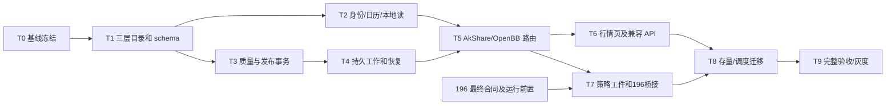

# 迭代 197 数据中台 Implementation Plan

> **For Codex:** 后续明确启动实现后，使用 executing-plans 技能按任务推进；本文件当前仅为文档交付，不授权开始开发。

**Goal:** 两个目标页面的七类既有数据通过统一数据服务实现本地优先、按缺口获取、持久化复用和可信研究快照。

**Architecture:** 继承 189 的三层目录，复用应用数据库与当前行情仓库；规范事实、精确覆盖和采集工作在同一事务域。OpenBB/AkShare 通过有界 runner 提供数据；196 保留研究权限、切分和审批权威。

**Tech Stack:** Python/Anaconda、FastAPI、SQLAlchemy/Alembic、MySQL/PostgreSQL/SQLite、隔离 OpenBB worker、Vue 3/TypeScript、pytest/Vitest/Playwright；CSV 兼容工件与可选 Parquet。

---

## 1. 实施前置与任务归属

当前只完成方案，不创建实现分支、不安装 SDK、不运行采集、不改生产库。实施必须在用户后续启动请求后开始；先读取 196 最终状态和当前 Git/Alembic 基线，不能以当前 dev 缺少 v2 代码为由复制其未完成实现。

实施建议使用 `codex/iteration-197-data-platform` 独立工作树，常规 PR 目标为 `dev`。与其他任务共享文件时保留其修改，每个任务按文件 allowlist 提交；不得把 196 未跟踪文档或 CTP 工作夹带进提交。不同开发者可领取以下任务，但数据模型、发布事务和 196 adapter 各自只有一个主负责人。

| 责任 | 拥有范围 |
| --- | --- |
| 数据架构/后端 A | 目录、主数据、规范模型、覆盖与查询合同 |
| 后端 B | Provider runner、采集任务、限频、发布/恢复，与 A 确认事务接口 |
| 前端 | 两页 query/ensure、状态、轮询和兼容交互；不自行解释数据质量 |
| 196 负责人 | Registry/manifest/权限/runner 集成合同，批准接口边界；不由 197 重新定义研究门 |
| QA/运维 | 独立 oracle、真实来源、数据库/重启/恢复、性能及灰度证据 |

## 2. 依赖图

主干顺序：T0 → T1 → T2/T3 → T4 → T5 → T6/T7 → T8 → T9。可以在合同冻结后分别开发独立资产 adapters 或 UI 组件；schema/lease/publish/迁移不可同时由多人无协调改写。

## 3. 任务包

路径相对仓库根目录；“新增”均为计划路径。测试采用独立数据 oracle 和行为断言，不写仅验证调用了同名 helper 的镜像测试。

### T0：重新冻结现场与七类合同（3—5 人天）

**Owner：** 架构 A；协作：196 负责人、QA。

**文件/产出：** 本迭代 `evidence/<run-id>/baseline.json`、`capability-matrix.json`、`legacy-import-plan.json`；核对 `models/data_governance.py`、`models/asset_research.py`、196 `services/research/dataset_registry.py` 及 schema。

1. 读取工作树、Git 和各 migration head，记录哪些 189/196 模型已经合入，形成唯一拥有者。
2. 按 DATA_SCOPE M/F 项登记每个实际消费 endpoint、schema、市场、频率、源表及当前可用功能；不能只看 UI 选项。
3. 在获准的只读连接上导出 DDL/范围/重复键/单位/复权信息；明文凭据不进产物。
4. 对来源实际能力、许可/保留范围和 OpenBB 锁定安装做小范围探测，决定 OPENBB-LIVE 的真实样例；不跑全市场回填。
5. 与 196 冻结 manifest、artifact、partition、身份和配置合同；记录仍阻塞的联合能力。
6. 确认硬件/负载/人力/容量，完成 G0。缺前置可继续独立合同工作，但不得开启依赖其结果的真实采集或研究。

**退出条件：** 七类与 21 主题没有未归属项；明确现有成功功能、真实外部阻塞、合同上的 unsupported 组合；不得通过缩小范围填平阻塞。

### T1：三层目录与规范模型（6—9 人天）

**Owner：** A；迁移文件由 A 唯一维护。

**新增/修改：** `src/backend/app/models/data_governance.py`、`app/models/market_data_platform.py`、`app/models/asset_research.py`、`app/db/market_data_database.py`、`app/services/market_data/catalog.py`、`app/schemas/market_data_platform.py`、独立规范库 migration 配置；`tests/market_data_platform/test_catalog.py`、`test_migrations.py`。

1. 先写三层解耦合同：同 dataset 两个 provider、两个 storage，篡改旧 endpoint.target_table 不改变新 resolver。
2. 实现/扩展 189 模型；保留三个既有逻辑名称，定义 alias 和 scope 政策；无 owner 的既有来源不自动批准。
3. 定义 D2/D3 的 schema、索引、唯一约束与 repository DTO，预留 source revision 和对象 hash。
4. 实现规范库连接 resolver；目录引用使用 credential ref；主应用与规范库事务域显式区分。
5. 在隔离三数据库执行迁移与旧行读取，确认每域唯一 head；基础控制模型通过后再进入 T2/T3。

**验收：** AC-09 的身份基础、AC-39、AC-42；不得对现有原始表做 destructive migration。

### T2：身份、日历、完整性与本地读取（6—9 人天）

**Owner：** A。

**新增：** `app/services/market_data/identity.py`、`calendars.py`、`coverage.py`、`query.py`、`legacy_reader.py`；`tests/market_data_platform/test_identity.py`、`test_coverage.py`、`test_local_reader.py`。

1. 构建独立时间/记录集合 fixtures，覆盖 AC-03—AC-14；首次运行应暴露旧 MIN/MAX、260 行和样例回退问题。
2. 复用 AssetInstrument 身份与授权 source registry；增加来源/市场别名映射而非正则猜类型。
3. 实现半开窗口、日历版本、所需字段/质量、PIT 过滤及 gap plan。
4. 本地读取先规范层后已登记 legacy/CSV，合格本地导入经 T3 发布；不直接调用现有含样例降级的 lookup。
5. 定义 quote/chain/report 的专用覆盖合同；周期重采样需完整基础 bars。
6. 用 offline 网络阻断测试证明完整本地和 local_only 不联网。

**验收：** AC-01、AC-03—AC-14；形成新 query 与 legacy facade 的契约输入输出样例。

### T3：原始暂存、质量、revision 与事务发布（7—10 人天）

**Owner：** B；与 A 共享 DTO，B 不改目录决策。

**新增：** `app/services/market_data/normalization.py`、`quality.py`、`writer.py`、`artifacts.py`、`repository.py`；`tests/market_data_platform/test_publication.py`、`test_revisions.py`、`test_quality.py`。

1. 先实现写行后/coverage 前失败的 fault-injection 测试，断言未提交事实不可见。
2. 以 raw hash 和 scoped 对象 key 暂存，保证文件 fsync/rename 或对象完整提交；固定 Decimal/UTC/schema 规范。
3. 验证行/批次并隔离；实现幂等追加 revision，禁止改写被 pin 的内容。
4. 单规范库事务完成 fencing 校验、行、version、coverage、work 和 outbox。
5. 区分重入的相同内容、真实供应商修订和跨来源冲突，发布后重读正式版本。
6. 在 MySQL/PostgreSQL 真实事务执行 AC-19—AC-23；SQLite 执行串行同等可见性合同。

**退出条件：** 存储回执可以由独立 SQL/对象 hash 核对；文件和数据库不存在假原子声明。

### T4：持久任务、租约、限频和恢复（6—9 人天）

**Owner：** B。

**新增：** `app/services/market_data/ingestion.py`、`leases.py`、`provider_limits.py`、`outbox.py`、`app/workers/market_data_worker.py`；`tests/market_data_platform/test_concurrency.py`、`test_recovery.py`。

1. 编写两个独立进程的同/重叠 query 并发测试和过期 lease 旧 worker 返回测试。
2. 实现 work/query 订阅关系、待补区间合并、CAS/heartbeat/fencing、不可变 attempt 事件。
3. 接入有界额度预留、共享 upstream 限频、重试/fallback 总预算和熔断。
4. 实现 cancel detach、deadline 与 SDK 子进程终止，测试子进程实际消失。
5. kill 各阶段并恢复；outbox 补投影；验证 60s 恢复目标和无永久 RUNNING。

**验收：** AC-18、AC-23—AC-28、AC-47；网络故障可能重提取的事实必须写进 evidence，不声称外部 exactly once。

### T5：七类 AkShare/OpenBB 适配和统一 ensure（7—11 人天）

**Owner：** B；A 评审语义；每个 asset adapter 领取独立文件。

**新增：** `app/services/market_data/providers/base.py`、`akshare.py`、`openbb.py`、`local_import.py`、`router.py`；隔离 provider runner 构建文件；`tests/market_data_platform/test_provider_contracts.py`、`test_ensure.py`。

1. 为七类现有返回建立 golden contract，覆盖 quote/bar/chain/report/单位/时间/复权。
2. 复用可验证的现有 AkShare 规范化能力，保留真实 source_id；禁用 synthetic connector 的生产候选资格。
3. OpenBB runner 按锁定 provider/model 发现能力，封装 TET/OBBject 转换，不让 SDK 类型渗入业务 API。
4. 连接 query → gap → task → fetch → publish → reread；partial/empty/write-error 分别返回。
5. 在预算内真实执行至少一条当前范围内的 OpenBB 取数/落库/二次复用；无能力时保持 G3 BLOCKED，不用无关美股示例代替。
6. 逐七类执行 offline/integration，填 DATA_SCOPE 能力账本；检查供给不等价时拒绝。

**验收：** AC-02、AC-07、AC-08、AC-15—AC-18；所有七类主要功能接入后才进入完整页面切换。

### T6：行情页、覆盖矩阵和旧 API 兼容（5—8 人天）

**Owner：** 前端；API facade 由 A。

**修改：** `app/api/data/base.py`、`app/api/data/trust.py`、`app/services/market_instrument.py`、`market_data_coverage_service.py`；`src/frontend/src/api/marketData.ts`、`views/data/useDataPage.ts`、`views/DataPage.vue` 和 i18n 文件。

**新增：** `app/api/data/queries.py`；`src/frontend/src/composables/useMarketDataQuery.ts`、`components/data/MarketDataStatusBar.vue`、`DataCoverageDetail.vue`、`DataFillProgress.vue`；相应 Vitest 与 `e2e/iteration197-market-data.spec.ts`。

1. 先锁定旧 false/true 网络合同和 kline/相关表响应；新 DTO 与旧 facade 分开测试。
2. 行情查询切为新 local_first API，补齐状态/分页/版本/错误可见，完成后按 query_id 刷新。
3. 21 个主题改为基于 kind/字段/目录证据展示；链与 CME 使用结构图表。
4. 覆盖矩阵与真实 series/version 共源；refresh coverage 不默认全量采集。
5. 测试取消、快速切换和晚响应，中英文、键盘和基本无障碍。

**验收：** AC-29—AC-32；前端 `typecheck`、定向 Vitest、build 和真实 API E2E。

### T7：策略数据工件与 196 桥接（7—11 人天）

**Owner：** A + 196 负责人；一个人维护 bridge，另一个评审合同。

**新增：** `app/services/market_data/snapshot.py`、`research_bridge.py`、`tests/market_data_platform/test_research_bridge.py`、`test_artifact_reader.py`；`e2e/iteration197-strategy-data.spec.ts`。

**修改：** `market_data_precheck_service.py`、`workspace_unit_runtime.py`、`services/research/dataset_registry.py`（仅届时已合入的合同需要调整时）、`views/strategy/useStrategyPage.ts`、`views/StrategyPage.vue`。

1. 先写“预检文件 A、实际运行文件 B 必须拒绝”、工件 hash/URI 替换、通用 API 读取 sealed 范围拒绝用例。
2. 从 committed version 生成确切 CSV/Parquet、schema sidecar 和 pin 清单；固定排序与 bytes hash。
3. 用 ResearchDatasetBridge 生成真实 source/instrument/execution/split manifest，幂等对接 196 snapshot，不伪造 metadata PASS。
4. 两页七类身份共用主数据；策略所有当前周期走 ensure/capability；参数变化使预检过期。
5. 可信 runner 只消费获准工件，移除新模式 prefix/glob 查数据；旧模式保持 legacy 标签。
6. 在真实 196 部署上验收 service token、数据库 role、对象/出口拒绝，断网运行及冷重放。

**验收：** AC-33—AC-40；196 运行前置未完成时本任务可以交付数据工件合同，但 G3 联合门保留 BLOCKED。

### T8：存量导入、调度与回滚（4—6 人天）

**Owner：** A + 运维；不分散修改 1,106 个 Python 脚本。

**新增：** `scripts/data_platform/plan_legacy_import.py`、`import_legacy_data.py`、`reconcile_data.py`；`docs/operations/data-platform/` 后续 runbooks；相关迁移/调度测试。

**修改：** 已有 `app/services/akshare/script.py`、`data.py`、`scheduler_service.py` 仅增加明确关联/触发边界；如无需改动则保留原状。

1. 提供 dry-run 与分块导入，精确 allowed tables、映射和预算，记录未知历史行。
2. 旧 writer/CSV 保留，规范层按 watermark 追赶；调度调用统一入口，复用 work。
3. 同时触发旧脚本/用户补齐/定时任务，验证幂等和多数据库 outbox 对账。
4. 在隔离存量数据库执行升级与数据读回；生成回滚 read compatibility/工件导出清单。
5. 备份目录/事实/对象到同一水位，恢复到新环境后核对 hash 和研究引用。

**验收：** AC-41—AC-45、AC-48。退出时不删除 legacy 表、CSV 或旧依赖。

### T9：完整验收和灰度（6—9 人天，加真实观察等待期）

**Owner：** QA/运维；各模块 owner 修复其失败。

**新增：** `scripts/acceptance/iteration197_data_platform.py`（合同见 ACCEPTANCE）、本迭代 evidence 及实际验收报告。

1. 完成驱动器、分门证据目录、脱敏和 result schema；先保证“无用例/跳过/外部阻塞”返回非成功状态。
2. 跑完 G1/G2 合同、三数据库矩阵以及两页真实 API 流程，修复后只重跑受影响门和必要回归。
3. 七类逐项执行 G3；OpenBB 实链不可省略，真实源记录 endpoint/时间/身份/窗口/许可。
4. 按冻结负载测 NFR，运行 GC/磁盘/超时/恢复与拒绝测试，不能仅报均值。
5. staging canary 保留至少 5 个交易 session，数字资产至少 7 个自然日；验证有闭市/重新开市事件。
6. 输出逐案例结果及全需求矩阵。所有必需项通过后再提出明确的发布结果；部署动作遵循用户当时授权，不以文档批准替代实际验收。

**退出条件：** G0—G4 全部必需门闭合；否则只声明具体切片结果和外部依赖，不宣布完整 197 验收通过。

## 4. 初始工作量与容量控制

以上任务合计 **57—87 人天**，另预留 30% 风险缓冲，约 **74—113 人天**。这是按七类、多存储、研究接口及恢复验收范围作的规划估计，不是承诺工期。建议配置两名后端、一名前端并有 QA/运维及 196 负责人参与；真实数据授权、196 等待和 staging 观察按日历另计，不能用并行开发消除。

若资源不足，允许拆 PR/里程碑，仍保留全部七类的验收目标。优先减去 P1 扩展和非必要运维组件，不删除 existing 数据功能、不弱化质量/落库/密封门。T0 发现现有表语义大面积未知或来源许可无法获得时，重新估算并明确哪些资产被阻塞。

## 5. PR 与回滚单元

| PR 单元 | 内容 | 回滚粒度 |
| --- | --- | --- |
| P1 | 三层目录/规范模型 | 默认关闭；保留新表和目录，不删除原始数据 |
| P2 | 本地读/质量/事务 | 切回 legacy facade，新规范读保留诊断能力 |
| P3 | worker/provider | 关闭 auto-fill/OpenBB，已提交本地数据继续读 |
| P4 | 行情页 | UI canary 回退，不回滚存储事实 |
| P5 | 196 bridge/工件 | 关闭新 bridge 绑定，已有快照只读；缺兼容 reader 则暂停新研究 |
| P6 | importer/调度/运维 | 停新导入并保留断点，旧任务继续既有路径 |

每个 PR 附变更行为、精确文件 diff、G1/G2 证据及未闭合门。发布前列出真实 G3/G4 结果；不同来源/数据库的失败不能被汇总数字掩盖。

## 6. 当前交接状态

- 已交付：需求、数据范围、现状/OpenBB 调研、设计、验收规范和本实施计划。
- 尚未开始：T0—T9 实施、真实能力探测、数据库迁移、代码测试、行情采集和部署。
- 必须重新核验：迭代 196 最终提交/运行合同、189 是否落地、来源使用与持久化权限、各数据库和 OpenBB 安装组合。
- 本轮源码、依赖、数据库、运行服务、196 文档和三个参考仓库均不属于修改目标。
