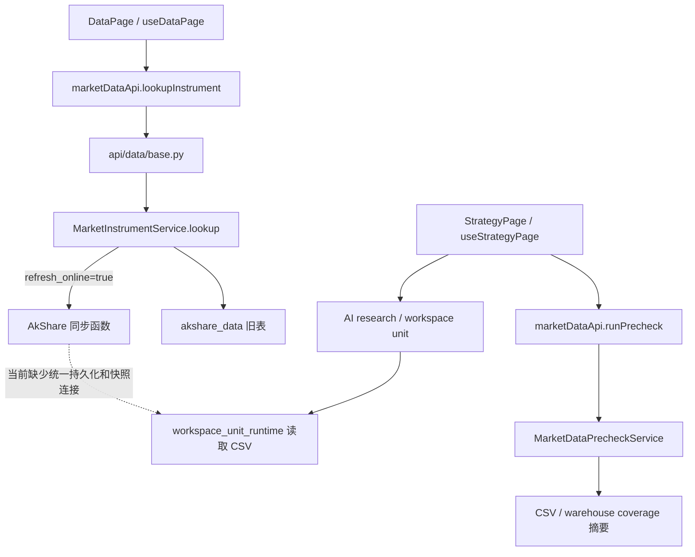

# 迭代 197：现状审计与 OpenBB 调研

> 调研日期：2026-09-05。只读源码和文档调查；没有安装 OpenBB、连接业务数据库、请求真实行情或验收登录后的页面。
> 本文中“已存在”指当前源码可定位，不等于生产启用或真实环境验收成功。

## 1. 证据基线

| 对象 | 本地位置 / 基线 | 用途 |
| --- | --- | --- |
| ai-for-investor | `/Users/yunjinqi/Downloads/backtrader_web`；`dev@a18bcf52682686c30d919fe02d6fd734ee4271b9` | 本次设计的当前代码 |
| OpenBB | `/Users/yunjinqi/Documents/new_projects/OpenBB`；`3e071fcc2cd9f891cac6040ae60296dba76dab46`，提交时间 2026-07-20 | 核心、插件、数据模型、具体 Fetcher 源码 |
| openbb-docs | `/Users/yunjinqi/Documents/new_projects/openbb-docs`；`acd5b2bf2d8603f574bd6b2da2e15e1aae8b017d`，2026-08-24 | 现行 `content/odp` 文档；旧 `old_platform_stash` 不作为现行 API 权威 |
| agents-for-openbb | `/Users/yunjinqi/Documents/new_projects/agents-for-openbb`；`aa1073d2b098ae6cf597dabf0635822aa808dd81`，2026-07-01 | widget 数据请求、引用、流式工具边界 |
| 迭代 196 | 当前工作区 17 份未跟踪文档；实施位置由其状态文档指向 `.worktrees/codex/iteration-196-ai-research-trust` | 读取设计、状态及 dataset registry/schema；不合并其代码 |

本地三个 OpenBB 仓库检查时工作区干净。在线组织页及相关官方仓库另行查阅；没有 pull/fetch，也没有宣称本地 OpenBB 等同于线上最新提交。OpenBB 本地包元数据为 `openbb=4.7.3`、`openbb-core=1.6.13`，只是源码版本，不是本机已安装版本。

实施前应重新冻结项目提交、196 接口、OpenBB 锁定依赖和 adapter 版本；不能直接复用本次日期作为后续运行证据日期。

## 2. 两个页面的实际调用链

### 2.1 当前代码证据与缺口

以下路径相对仓库根目录。行号是本次提交的定位辅助，实施时以函数名和当前代码为准。

| ID | 文件与定位 | 核验结论 | 197 处理 |
| --- | --- | --- | --- |
| E01 | `src/frontend/src/api/marketData.ts:10`；`src/frontend/src/views/data/useDataPage.ts:148,550` | 七类资产；行情周期日/周/月 | 七类统一能力账本与三种周期语义 |
| E02 | `src/backend/app/services/market_instrument.py:265` 的 `lookup` | 默认只返仓库；`refresh_online=True` 即调用在线函数，未依据缺口决定是否联网 | 新默认 `local_first`，显式刷新单独建模 |
| E03 | 同文件 `:432,1049,1119` | 存在 `_fill_history_gap`、缓存读取和缓存写入；文件内没有主链调用 `_fill_history_gap` 的引用 | 不能把辅助代码当成主链已闭环；迁入统一 writer |
| E04 | 同文件 `:404` 的 `_history_requires_refresh` | 主要检查日期交集及最后日期距请求末日的自然日容差；不证明头部、中间缺口或实际交易日完整性 | 按日历、字段、频率和版本计算缺口 |
| E05 | 同文件 `:1049,1119` | 缓存查询 `LIMIT 260`；键为资产类型、symbol、period、date，缺市场、复权和真实来源；运行时建 MySQL 表 | 独立规范 series 身份、分页、DDL 迁移 |
| E06 | 同文件 `:1316,1447` 等仓库查询 | 股票日期无结果可退回最近记录；股票或期货缺标的可换为其他样例；其他资产也有降级逻辑 | 精确身份，范围外行不计覆盖；样例不能成为真实响应 |
| E07 | `src/backend/app/api/data/base.py:22` 的 `/kline` | 路由直接同步调用 AkShare、固定 `qfq`、没有统一持久化 | 保持外部响应兼容，内部收敛到数据服务 |
| E08 | `src/backend/app/db/akshare_data_database.py:21` | 优先显式 `AKSHARE_DATA_DATABASE_URL`，否则仅在应用为 MySQL 时派生 `akshare_data` | 复用解析规则；明确非 MySQL 部署和规范库配置 |
| E09 | `src/backend/app/services/market_data_coverage_service.py:76,323` | 七类 warehouse profile；部分表与行情实际读表不同；用 `MIN/MAX/COUNT` 汇总，不能证明内容连续 | 覆盖从统一 committed series 生成；legacy 摘要只是线索 |
| E10 | `src/backend/app/services/market_data_precheck_service.py:38` | provider 默认 `local_csv`，以覆盖及质量摘要检查 | 绑定具体 dataset version 和工件，不再只检查别处摘要 |
| E11 | `src/frontend/src/views/strategy/useStrategyPage.ts:1152`；`src/frontend/src/views/StrategyPage.vue:453` | 前端 asset type 只启发式识别股票/期货/数字货币；周期有 `1d/1h/30m/5m` | 服务端主数据解决七类身份；保留全部周期入口并回传能力 |
| E12 | `src/backend/app/services/workspace_unit_runtime.py:734,765` | 实际运行以目录、文件名与模糊匹配定位 CSV；并非直接读取行情页仓库 | 固定工件路径和内容哈希；禁止新可信运行模糊匹配合约 |
| E13 | `src/backend/app/services/data_connectors/registry.py` 的 `create_job` | `DgProvider/DgEndpoint/DgIngestJob` 存在，但 job 记录 preview 行数，未持久化返回行 | 复用目录，不把旧 preview completed 当 ingest committed |
| E14 | `src/backend/app/services/data_connectors/executor.py:115` 等 | Yahoo/FRED/CoinGecko/CBOE/CFTC 等内置 callable 使用计算值或静态数据 | 已有名字不代表真实供应商接入；fixture 明确隔离 |
| E15 | `src/backend/app/services/akshare/data.py` 的 `persist_dataframe`；`app/data_fetch/core/mysql_base.py`；`app/services/akshare/script.py` | 已有脚本执行、写库、表元数据、调度等基础，不能全部绕开重建 | 保留 legacy writers；统一新增规范发布路径和调度入口 |
| E16 | `src/backend/app/models/asset_research.py:59,87`；`app/services/asset_research/source_registry.py` | 已有版本化 `AssetInstrument` 和服务端来源授权 | 复用为身份和许可权威，避免建第二套互相冲突的主数据 |
| E17 | `src/backend/app/services/data_topic_hub.py` | TTL、合并、订阅和通知存在于进程内 | 仅作响应缓存/通知；重启复用依赖数据库 |
| E18 | `src/backend/app/services/asset_research/providers/akshare.py` | 六类研究 provider 有原始快照、source manifest 和受控来源前提 | 抽取可复用规范化；197 不绕过其已有授权边界 |

仓库当前 `src/backend/app/data_fetch/scripts` 下静态计数为 **1,106 个 `.py` 文件，含初始化和辅助模块**。这不是 runnable 数，也不代表逐个验证完成。历史其他 worktree 的脚本目录化计数不能直接套用。197 不逐个重写这些脚本。

### 2.2 不能混淆的数据

- `option` 的部分 `history.rows` 实际为当日多合约结构；应归为期权链/合约快照。
- `crypto` 当前将 `crypto_js_spot` 的指定交易对快照，与 `crypto_bitcoin_cme` 的持仓统计放在同一响应；CME 持仓不能作为该交易对的价格历史。
- 外汇银行牌价、中间价、市场成交 OHLC 的交易对象与报价口径不同。
- ETF 市场成交价与开放式基金净值、债券成交价格与收益率曲线不能互换。
- `volume` 的“手/股/张/基础币/报价币”以及涨跌幅的“百分数/小数”需要逐 adapter 标注与校验。

## 3. 既有迭代的继承关系

| 迭代 | 当前文档事实 | 197 决策 |
| --- | --- | --- |
| [188](../迭代188-数据采集治理与可恢复调度/PLAN.md) | 已废弃：职责耦合，且一次装入多引擎、多调度器和多来源 | 不恢复其大范围重建路线 |
| [189](../迭代189-三层数据平台基础/PLAN.md) | 待评审的三层目录方案；只选三个 AkShare/MySQL 试点；当前 `data_governance.py` 未含该方案的 `DgDataset` 等模型 | 继承来源/数据集/存储分离；实施时核对是否已被其他任务落地，合并为唯一模型 |
| [191](../迭代191-AI多资产分析研究与设计/README.md)、[192](../迭代192-可信多资产研究收口与模型治理/PLAN.md) | 已积累主数据、来源权限、PIT 和研究生命周期设计/代码 | 复用相关合同，数据可用性与研究通过分开 |
| [196 状态](../迭代196-改进优化ai生成策略流程/IMPLEMENTATION_STATUS.md) | 文档报告 `IMPLEMENTATION_ACCEPTED=NO-GO`，真实 Provider/Sandbox、候选生产合同等未闭合 | 197 不以本次数据方案替其签发验收 |

196 实施 worktree 的 `app/services/research/dataset_registry.py` 已定义 `DatasetRegistry.create_snapshot`，其 `app/schemas/ai_research_v2.py` 的公开创建请求仅允许 `DISCOVERY/ITERATION_VALIDATION`，含 instrument/split/source manifest、execution policy、PIT cutoff 和受控 storage reference。197 以 adapter 对接这些字段；服务端可处理的 sealed/forward 分区也不能因此向普通 API 开放。该 worktree 在进行中，接口不是已合入 dev 的稳定事实。

本次编制期间，196 文档仍有并行更新。结束前复核的状态仍为 `IMPLEMENTATION_ACCEPTED=NO-GO`：现有预检的元数据/URI 引用哈希还不能证明底层对象字节未被替换；服务端候选物化以及 candidate→evaluation→approval→sandbox 的端到端连接也未闭合。197 设计中的工件 bytes hash 验证和联合运行均是待实现、待验收合同，不能引用 196 的组件测试作为其已具备的证据。

## 4. 从 OpenBB 复用什么

| 证据 | 可借鉴内容 | 项目自己的补充责任 |
| --- | --- | --- |
| [Fetcher 源码](https://github.com/OpenBB-finance/OpenBB/blob/3e071fcc2cd9f891cac6040ae60296dba76dab46/openbb_platform/core/openbb_core/provider/abstract/fetcher.py) | Transform Query → Extract → Transform Data，提取与规范化分离 | 缺口规划、幂等写入、持久化、任务恢复 |
| [Provider 源码](https://github.com/OpenBB-finance/OpenBB/blob/3e071fcc2cd9f891cac6040ae60296dba76dab46/openbb_platform/core/openbb_core/provider/abstract/provider.py) | provider 名、credentials、`fetcher_dict` | 数据集到来源能力映射、配额和真实可用状态 |
| [QueryExecutor](https://github.com/OpenBB-finance/OpenBB/blob/3e071fcc2cd9f891cac6040ae60296dba76dab46/openbb_platform/core/openbb_core/provider/query_executor.py) | 按 provider + model 查找 fetcher、筛选凭据 | 自动 fallback 在本项目编排，不能假定 OpenBB 已自动完成 |
| [OBBject](https://github.com/OpenBB-finance/OpenBB/blob/3e071fcc2cd9f891cac6040ae60296dba76dab46/openbb_platform/core/openbb_core/app/model/obbject.py) | results/provider/warnings/extra、DataFrame 转换 | 落库元数据、每段来源、质量结果、storage version |
| [插件构建说明](https://docs.openbb.co/odp/python/developer/extension_types/provider) | 标准字段与 provider 扩展字段、插件注册 | 固定扩展版本、构建时生成接口、运行时不动态装包 |
| `core/openbb_core/provider/utils/lru.py` | 进程函数 TTL 缓存 | 不能替代跨进程、跨重启的金融数据仓库 |

结论限于已读核心调用链：没有证据表明接上 `obb` 就会自动把所需市场数据写入本项目数据库，或按本项目日历证明所有请求区间完整。197 应显式实现这些职责。

## 5. 社区仓库选择

已查阅用户提供的 [OpenBB 组织仓库目录](https://github.com/orgs/OpenBB-finance/repositories)，并打开以下相关仓库；不对组织全部仓库作代码审计完成声明。

| 仓库 | 本次采用方式 |
| --- | --- |
| [OpenBB](https://github.com/OpenBB-finance/OpenBB) | 数据插件和标准模型的主要参考/可选运行依赖 |
| [openbb-docs](https://github.com/OpenBB-finance/openbb-docs) | 本地现行文档与官方网页交叉核对，API 以锁定源码及安装后能力表为准 |
| [agents-for-openbb](https://github.com/OpenBB-finance/agents-for-openbb) | 借鉴显式 widget 数据请求与引用。已读 `32-vanilla-agent-raw-widget-data-citations/vanilla_agent_raw_context_citations/main.py`，其 `get_widget_data/cite/citations` 是界面/上下文协议，不是持久化服务 |
| [backends-for-openbb](https://github.com/OpenBB-finance/backends-for-openbb) | 参考把已有后端数据暴露为 Workspace widget 的适配思路；197 的 Vue 页面不迁移到 Workspace |
| [openbb-ai](https://github.com/OpenBB-finance/openbb-ai) | 理解 Agent SDK 和工具结果事件；197 不引入第二套研究编排 |
| [agent-rita](https://github.com/OpenBB-finance/agent-rita) | agents README 推荐的进一步 Agent 参考；本次只核对定位，不声称完成其源码评审，不设为 197 依赖 |

Agent 借鉴落点是数据引用：由服务器产生可验证的 dataset version、字段、时间窗及来源摘要。Agent 不自行拼 SQL、选择任意 URL、管理密钥或把工具返回字符串认作可信覆盖证明。

## 6. OpenBB 能力与集成约束

本地 `providers/yfinance/openbb_yfinance/__init__.py` 登记 `EquityHistorical/EtfHistorical/CurrencyHistorical/CryptoHistorical/FuturesHistorical/OptionsChains`。FMP 登记股票、ETF、外汇、数字资产历史等；Deribit 有期货历史和期权链；CBOE 有股票/ETF 历史及期权链。这是**模型存在性**证据，具体中国合约/交易对仍需单独真实探测。

官方 [股票历史](https://docs.openbb.co/odp/python/reference/equity/price/historical)、[期货历史](https://docs.openbb.co/odp/python/reference/derivatives/futures/historical)、[外汇历史](https://docs.openbb.co/odp/python/reference/currency/price/historical)、[数字资产历史](https://docs.openbb.co/odp/python/reference/crypto/price/historical) 用于交叉核对路由。限频、历史窗口、实时/延迟标签和授权范围以具体供应商及实测回执为准。

本地 OpenBB core 对 FastAPI、Pydantic 等有独立版本约束。建议 OpenBB worker 使用隔离、锁定的运行环境，经内部 DTO 与主应用通信；主应用不从用户本地 clone 路径动态导入，也不安装 `openbb[all]` 作为默认方案。具体 SDK 入口通过 adapter 封装；内部 QueryExecutor 可以作为适配实现候选，不能暴露为外部稳定 API。

项目后端元数据为 MIT，OpenBB 核心声明 [AGPL-3.0](https://github.com/OpenBB-finance/OpenBB/blob/develop/LICENSE)，本地 docs/agents 仓库各有 MIT LICENSE。发布前需按实际组合、分发和使用方式核定许可义务；独立进程不是自动免除义务的结论。数据下载、保留、共享、再分发权限另记来源注册表，不能从代码许可证推导。

## 7. 方案比较

| 方案 | 优点 | 代价/缺口 | 判断 |
| --- | --- | --- | --- |
| A：在页面 service 里补 cache + OpenBB if/else | 短期改动少 | 无法统一策略 CSV、期权链、主数据、并发缺口与历史修订 | 可用于诊断原型，不选为终态 |
| B：项目内模块化中台 + 有界采集 worker | 复用已有数据库/权限/调度，统一两页，能分阶段交付 | 需认真设计数据合同、发布事务和迁移 | **推荐** |
| C：立即建设独立大数据微服务平台 | 后续横向扩展空间大 | 容量未量化、运维和迁移成本高；重复 188 范围失控风险 | 仅作为容量触发后的演进 |

尚未验证的实施前置：真实库表 DDL/行数/重复率/授权、线上来源可用率、OpenBB 安装兼容性、196 最终合同、实测吞吐与磁盘规模。这些已分别进入实施 S0 和 G0/G3/G4，不能用静态调研替代。
