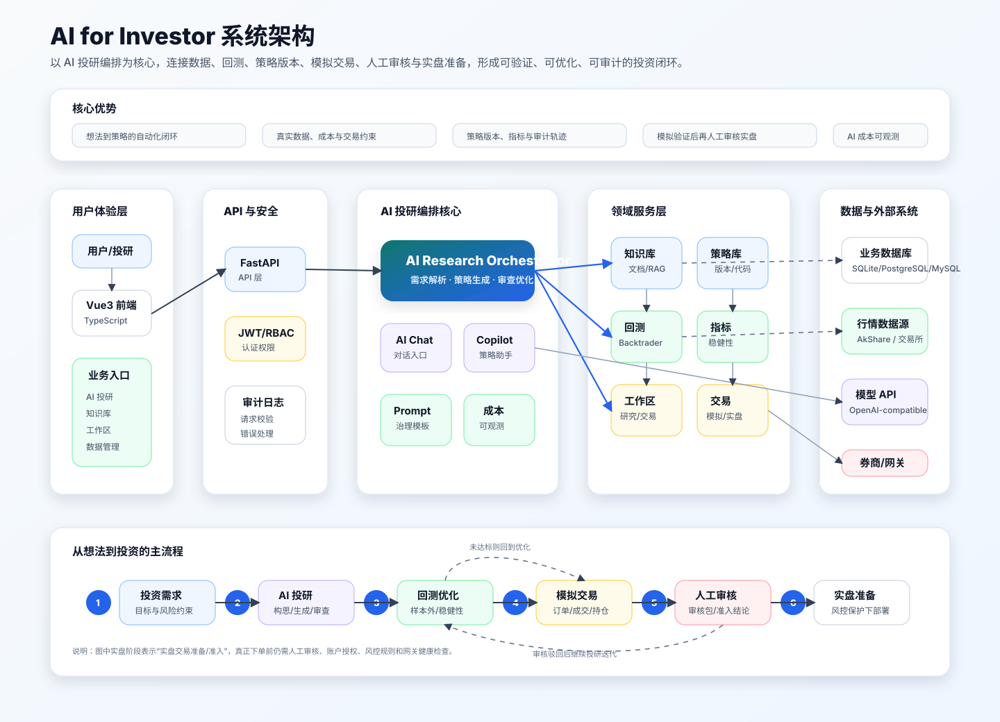

# AI for Investor 核心目标并行迭代计划

## 一、核心目标

AI for Investor 的核心目标是：

> 将用户的保值增值需求、投资想法和交易假设，自动转化为覆盖股票、债券、基金、期货、期权、外汇等资产的可验证、可优化、可部署投资策略，并形成从想法、投研、回测、优化、模拟交易、人工审核到实盘投资交易的完整闭环。

本计划面向多个 AI 并行开发。整体拆成三个互相独立但需要共享契约的迭代方向：

1. **方向 A：投研闭环与策略版本轨迹**
2. **方向 B：数据、回测与稳健性可信度**
3. **方向 C：模拟交易、人工审核与实盘风控**

三个方向可以并行推进，最终在 AI 投研入口、策略工作区和交易工作区汇合。

## 二、当前已具备基础

当前项目已经具备以下基础能力：

- AI 投研页面与配置方案。
- 策略构思、Backtrader 代码生成、回测、审查、优化的基础流水线。
- 样本外验证、质量门槛、任务状态和继续运行能力。
- 策略工作区、策略单元、回测结果、部分指标统计。
- 模拟交易、实盘交接、人工审核相关字段和接口雏形。
- 数据管理、行情数据补齐、部分期货本地真实数据。
- 知识库、AI 配置、Prompt 治理、AI 成本观测等支撑能力。

后续重点不是再增加分散页面，而是把这些能力串成一个稳定、可追踪、可审计、可持续运行的投资闭环。

### 系统架构图

这张图强调 AI for Investor 的核心优势：以 AI 投研编排为中枢，把用户需求、数据、策略、回测、优化、模拟交易、人工审核和实盘准备连接成闭环。



## 三、并行开发总原则

### 1. 分支与职责

建议三个 AI 分别使用独立分支：

- `feature/research-loop`
- `feature/data-backtest-trust`
- `feature/paper-live-risk`

各方向只修改自己负责的核心模块。确需修改共享 schema 或前端同一页面时，先补充共享契约，再由集成人合并。

### 2. 共享数据契约

三个方向统一使用以下概念，避免后续字段割裂：

- `mandate_id`：投资需求 ID。
- `run_id`：一次 AI 投研运行 ID。
- `workspace_id`：研究或交易工作区 ID。
- `strategy_id`：策略 ID。
- `strategy_version_id`：策略版本 ID。
- `unit_id`：策略单元 ID。
- `backtest_id` / `task_id`：回测任务或结果 ID。
- `paper_account_id`：模拟账户 ID。
- `live_handoff_id`：实盘交接包 ID。

### 3. 统一事件格式

所有关键动作都应该落入投研轨迹事件，最低字段如下：

```json
{
  "id": "uuid",
  "run_id": "uuid",
  "workspace_id": "uuid",
  "event_type": "generation|backtest|review|optimization|paper_trading|live_handoff",
  "stage": "generation",
  "status": "pending|running|success|failed|skipped",
  "title": "生成策略代码",
  "summary": "本轮生成趋势跟随策略",
  "input_snapshot": {},
  "output_snapshot": {},
  "metrics_snapshot": {},
  "failure_reason": "",
  "created_at": "iso datetime"
}
```

### 4. 统一质量门槛格式

质量门槛、样本外、稳健性、模拟交易、实盘准入都使用统一评估结构：

```json
{
  "key": "sharpe_ratio",
  "label": "Sharpe",
  "actual": 0.92,
  "threshold": 1.0,
  "operator": ">=",
  "passed": false,
  "severity": "error|warning|info",
  "message": "Sharpe 未达到目标"
}
```

### 5. 数据库迁移约定

三个方向都可能新增表。建议：

- 每个方向独立新增 Alembic revision。
- revision id 使用方向前缀，例如 `20260705_a_*`、`20260705_b_*`、`20260705_c_*`。
- 如并行后出现多头迁移，由集成人新增 Alembic merge revision。
- 不修改彼此已经创建的迁移文件。

## 四、方向 A：投研闭环与策略版本轨迹

### 目标

让用户从一句投资需求开始，能够看到完整的投研过程、策略版本演进、每轮回测和每次 AI 修改原因。最终形成一份可审计、可继续运行、可复盘的投研档案。

### 主要范围

- 投资需求结构化。
- 投研时间线。
- 策略版本管理。
- 策略版本对比。
- AI 修改原因与回测结果绑定。
- AI 投研页面按方案动态展示目标、进度、结果和历史。

### 建议新增模型

后端建议新增：

- `InvestmentMandate`
- `StrategyVersion`
- `ResearchPipelineEvent`
- `StrategyVersionComparison`

核心字段建议：

```text
InvestmentMandate
- id
- user_id
- title
- raw_prompt
- structured_goal
- asset_scope
- risk_constraints
- trading_constraints
- quality_gates
- status
- created_at
- updated_at

StrategyVersion
- id
- strategy_id
- run_id
- workspace_id
- unit_id
- version_no
- code
- params
- parent_version_id
- change_summary
- ai_rationale
- backtest_task_id
- metrics_snapshot
- quality_gate_evaluations
- created_at

ResearchPipelineEvent
- id
- mandate_id
- run_id
- workspace_id
- strategy_version_id
- event_type
- stage
- status
- title
- summary
- input_snapshot
- output_snapshot
- metrics_snapshot
- failure_reason
- created_at
```

### 后端任务

1. 新增投资需求解析服务。
   - 文件建议：`src/backend/app/services/investment_mandate_service.py`
   - 支持从自然语言中解析资产、周期、目标、风险约束、质量门槛。
   - 第一版可以用规则 + LLM 结构化输出，失败时保留原始 prompt。

2. 新增投研事件服务。
   - 文件建议：`src/backend/app/services/research_pipeline_event_service.py`
   - AI 投研每个阶段开始、完成、失败都写事件。
   - 支持按 `run_id`、`workspace_id` 查询时间线。

3. 新增策略版本服务。
   - 文件建议：`src/backend/app/services/strategy_version_service.py`
   - 每轮生成或优化后创建一个策略版本。
   - 回测完成后把指标和质量门槛回写到对应版本。

4. 改造 `AIStrategyResearchService`。
   - 接收或创建 `mandate_id`。
   - 每轮生成、回测、审查、优化时写入事件。
   - 每轮策略代码变化时写入 `StrategyVersion`。

5. 新增 API。
   - `POST /api/v1/strategy/ai-research/mandates`
   - `GET /api/v1/strategy/ai-research/mandates/{mandate_id}`
   - `GET /api/v1/strategy/ai-research/runs/{run_id}/timeline`
   - `GET /api/v1/strategy/ai-research/runs/{run_id}/versions`
   - `GET /api/v1/strategy/ai-research/versions/{version_id}`
   - `GET /api/v1/strategy/ai-research/versions/{left_id}/compare/{right_id}`

### 前端任务

1. AI 投研表单增加“投资需求确认”区。
   - 展示用户原始需求。
   - 展示结构化目标。
   - 用户可以编辑后再启动投研。

2. AI 投研结果区增加“投研时间线”。
   - 每个事件显示阶段、状态、摘要、失败原因、指标快照。
   - 点击事件可查看输入、输出、代码、回测指标。

3. 增加“策略版本”视图。
   - 展示版本号、生成时间、AI 修改原因、回测结果、质量门槛。
   - 支持两个版本对比。

4. 当前方案切换时，目标、进度、研究输出、时间线、版本列表必须同步变化。

### 测试任务

- 后端：
  - 需求解析测试。
  - 事件写入与查询测试。
  - 策略版本创建、回写、对比测试。
  - AI 投研失败时事件仍能落库。

- 前端：
  - 方案切换后目标和历史结果同步变化。
  - 时间线渲染不同状态。
  - 策略版本列表和对比入口可用。

### 验收标准

- 输入一个新的投资需求后，系统生成结构化需求并要求确认。
- 每一次 AI 投研运行都有完整时间线。
- 每一轮策略代码都有版本记录。
- 用户可以看到“为什么这一版比上一版更好或更差”。
- 失败任务也能从时间线继续定位失败阶段和原因。

## 五、方向 B：数据、回测与稳健性可信度

### 目标

让 AI 生成的策略不只是能跑通，而是在真实数据、真实资产规格、真实交易成本和稳健性验证下可信。

### 主要范围

- 多资产主数据。
- 数据覆盖率与质量检查。
- 回测前数据预检。
- 统一手续费、滑点、成交约束。
- 回测指标统一口径。
- 稳健性验证与过拟合评分。

### 建议新增模型

```text
AssetSpec
- id
- asset_type
- symbol
- name
- exchange
- currency
- contract_multiplier
- margin_rate
- tick_size
- lot_size
- min_order_size
- commission_rate
- commission_fixed
- slippage_model
- trading_calendar
- metadata
- created_at
- updated_at

MarketDataCoverage
- id
- asset_type
- symbol
- timeframe
- provider
- start_date
- end_date
- row_count
- missing_count
- missing_ratio
- latest_bar_time
- quality_status
- updated_at

MarketDataQualityReport
- id
- asset_type
- symbol
- timeframe
- provider
- issue_type
- severity
- issue_count
- sample_payload
- created_at

RobustnessTestResult
- id
- run_id
- strategy_version_id
- backtest_id
- method
- status
- metrics
- gate_evaluations
- report
- created_at
```

### 后端任务

1. 新增资产规格服务。
   - 文件建议：`src/backend/app/services/asset_spec_service.py`
   - 从本地配置、交易所规格、已有 futures fee 数据中解析资产约束。
   - AI 投研和回测统一调用该服务。

2. 新增数据覆盖率服务。
   - 文件建议：`src/backend/app/services/market_data_coverage_service.py`
   - 统计每个资产、周期、数据源的起止日期、行数、缺失率。
   - `/data/market` 下拉框可基于覆盖率表筛选所有可用资产。

3. 新增数据质量检查。
   - 检查缺口、重复、空值、异常价格、异常成交量。
   - 对期货检查连续合约、换月缺口、夜盘数据覆盖。
   - 回测前自动调用预检，不通过时给出明确原因。

4. 抽象交易执行模型。
   - 文件建议：`src/backend/app/services/backtest/execution_model.py`
   - 支持：
     - 手续费。
     - 滑点。
     - 最小下单量。
     - 合约乘数。
     - 保证金。
     - 成交量限制。
     - 股票涨跌停/停牌占位。

5. 统一回测指标。
   - 以一个 `MetricsService` 作为唯一指标计算入口。
   - 统一 Sharpe、交易次数、平均持仓、最大连赢、最大连亏、胜率、盈亏比、年化收益、最大回撤。
   - 前端所有回测结果、策略单元结果、AI 投研结果都使用同一指标字段。

6. 新增稳健性测试。
   - walk-forward validation。
   - 样本内/样本外对比。
   - 参数敏感性分析。
   - Monte Carlo 交易重排。
   - 过拟合评分。

7. AI 投研质量门槛接入稳健性。
   - 达到基础回测门槛后，自动运行稳健性验证。
   - 稳健性失败时进入优化阶段，不进入模拟交易。

### 前端任务

1. `/data/market` 增加数据覆盖矩阵。
   - 资产类型、资产、周期、数据源、起止日期、缺失率、质量状态。

2. AI 投研配置区增加数据预检结果。
   - 选择资产和周期后显示是否可回测。
   - 不可回测时显示缺少哪些数据。

3. 回测结果页增加稳健性验证区域。
   - walk-forward。
   - 样本外。
   - 参数敏感性。
   - 过拟合评分。

4. 策略单元打开回测结果时减少等待。
   - 优先展示已缓存摘要。
   - 明细图表异步加载。
   - 回测结果标题使用策略单元名称。

### 测试任务

- 资产规格解析测试。
- 数据覆盖率统计测试。
- 数据质量报告测试。
- 回测前预检测试。
- 指标统一口径测试。
- 稳健性验证测试。
- 前端资产下拉筛选和回测结果快速打开测试。

### 验收标准

- AI 投研提交前能明确知道数据是否足够。
- 股票、期货、债券等资产都可以通过下拉框筛选。
- 回测指标在所有页面口径一致。
- 策略达标后必须经过稳健性验证才能进入模拟交易。
- 回测结果打开速度明显提升，首屏展示不依赖完整明细加载。

## 六、方向 C：模拟交易、人工审核与实盘风控

### 目标

让通过回测和稳健性验证的策略真正进入持续模拟交易，并在模拟交易通过后生成实盘审核包；人工审核通过后，才能进入带风控的实盘准备或实盘运行。

### 主要范围

- 模拟账户。
- 模拟订单、成交、持仓、资金曲线。
- 模拟交易持续运行。
- 模拟交易每日复核。
- 实盘审核包。
- 人工审核流程。
- 实盘前风控检查。
- 运行监控和告警。

### 建议新增模型

```text
PaperAccount
- id
- user_id
- name
- currency
- initial_cash
- cash
- equity
- status
- created_at
- updated_at

PaperOrder
- id
- account_id
- workspace_id
- unit_id
- strategy_version_id
- symbol
- side
- order_type
- quantity
- price
- status
- submitted_at
- filled_at
- failure_reason

PaperTrade
- id
- order_id
- account_id
- symbol
- side
- quantity
- price
- commission
- slippage
- traded_at

PaperPosition
- id
- account_id
- symbol
- quantity
- avg_price
- market_price
- unrealized_pnl
- updated_at

PaperReviewReport
- id
- run_id
- paper_account_id
- workspace_id
- unit_id
- observation_days
- metrics
- rule_evaluations
- ready_for_live
- next_actions
- created_at

LiveHandoffReview
- id
- run_id
- live_handoff_id
- reviewer_id
- decision
- comment
- planned_go_live_at
- created_at

RiskRule
- id
- scope_type
- scope_id
- rule_type
- threshold
- status
- created_at
```

### 后端任务

1. 新增模拟交易引擎。
   - 文件建议：`src/backend/app/services/paper_trading/broker.py`
   - 支持模拟账户、订单、成交、持仓、资金曲线。
   - 初期可以使用最新 K 线 close 价成交，后续扩展盘口和滑点。

2. 新增模拟交易运行器。
   - 文件建议：`src/backend/app/services/paper_trading/runner.py`
   - 定时拉取最新行情。
   - 调用策略生成信号。
   - 执行模拟下单和风控检查。
   - 记录运行状态。

3. AI 投研接入模拟交易。
   - 基础回测、样本外、稳健性全部通过后，创建或复用模拟账户。
   - 创建模拟交易工作区和策略单元。
   - 启动模拟交易运行器。

4. 新增模拟交易复核。
   - 文件建议：`src/backend/app/services/paper_trading/review_service.py`
   - 复核观察天数、真实手续费、滑点、回撤、滚动 Sharpe、交易次数。
   - 输出是否允许提交实盘审核。

5. 新增实盘审核包。
   - 文件建议：`src/backend/app/services/live_handoff_review_service.py`
   - 汇总投资需求、策略版本、回测、稳健性、模拟交易、风险说明。
   - 支持通过、拒绝、要求继续优化。

6. 新增统一风控服务。
   - 文件建议：`src/backend/app/services/risk_gate_service.py`
   - 下单前检查：
     - 最大仓位。
     - 最大单笔金额。
     - 最大日亏损。
     - 最大回撤。
     - 保证金占用。
     - 黑名单资产。
   - 成交后检查：
     - 实际滑点。
     - 持仓暴露。
     - 账户风险预算。

7. 新增告警能力。
   - 策略运行失败、订单失败、连接失败、风控拒单、回撤超限时生成告警。

### 前端任务

1. 模拟交易详情页。
   - 账户权益。
   - 当前持仓。
   - 最近订单。
   - 最近成交。
   - 资金曲线。
   - 策略信号。

2. AI 投研结果区展示模拟交易状态。
   - 是否已启动。
   - 观察天数。
   - 当前指标。
   - 是否满足实盘审核条件。

3. 实盘审核工作台。
   - 查看实盘审核包。
   - 查看策略代码、回测、稳健性、模拟交易结果。
   - 通过、拒绝、要求继续优化。

4. 风控配置与运行监控。
   - 策略级风控。
   - 账户级风控。
   - 一键暂停策略。
   - 风控告警列表。

### 测试任务

- 模拟账户资金变动测试。
- 模拟订单成交测试。
- 模拟持仓更新测试。
- 模拟交易复核规则测试。
- 实盘审核通过/拒绝测试。
- 风控拒单测试。
- 前端模拟交易和审核工作台测试。

### 验收标准

- AI 投研达标后能创建并启动模拟交易实例。
- 模拟交易能持续记录订单、成交、持仓和权益。
- 观察期结束后能生成模拟交易复核报告。
- 未通过人工审核不能进入实盘准备。
- 实盘准备或运行前必须通过风控检查。

## 七、集成顺序

### 第 0 阶段：共享契约冻结

预计 1 天。

交付：

- 确认三个方向共用字段。
- 确认事件格式。
- 确认质量门槛格式。
- 确认指标字段命名。
- 确认前端路由和页面归属。

### 第 1 阶段：后端基础落库

预计 3 到 5 天。

- 方向 A：投资需求、策略版本、投研事件。
- 方向 B：资产规格、数据覆盖率、数据质量报告。
- 方向 C：模拟账户、订单、成交、持仓、审核记录、风控规则。

### 第 2 阶段：服务接入

预计 5 到 7 天。

- 方向 A：AI 投研流水线写事件和版本。
- 方向 B：回测前预检、统一指标、稳健性验证。
- 方向 C：模拟交易运行器、复核报告、风控检查。

### 第 3 阶段：前端产品化

预计 5 到 7 天。

- 方向 A：需求确认、时间线、版本对比。
- 方向 B：数据覆盖矩阵、预检结果、稳健性报告。
- 方向 C：模拟交易详情、实盘审核、风控监控。

### 第 4 阶段：端到端联调

预计 3 到 5 天。

验收链路：

1. 用户输入投资需求。
2. 系统解析并确认需求。
3. AI 生成策略。
4. 自动回测。
5. 自动优化。
6. 样本外和稳健性验证。
7. 自动进入模拟交易。
8. 模拟交易复核。
9. 生成人工审核包。
10. 审核通过后进入实盘准备。

## 八、跨方向依赖

### 方向 A 依赖方向 B

- 策略版本需要绑定统一指标结果。
- 投研时间线需要展示数据预检、稳健性验证结果。

### 方向 A 依赖方向 C

- 投研时间线需要展示模拟交易启动、复核、实盘审核状态。
- 策略版本需要知道是否已被推送模拟交易或实盘准备。

### 方向 B 依赖方向 A

- 稳健性结果需要绑定 `run_id` 和 `strategy_version_id`。

### 方向 C 依赖方向 A 和 B

- 模拟交易必须绑定已通过验证的策略版本。
- 实盘审核包必须包含投研事件、策略版本、回测、稳健性和模拟交易复核结果。

## 九、共同 Definition of Done

每个方向完成时必须满足：

- 有数据库迁移。
- 有 Pydantic schema。
- 有服务层单元测试。
- 有 API 测试。
- 有前端基础测试。
- 错误路径有明确失败原因。
- 关键动作写入投研事件或审计记录。
- 不硬编码密钥。
- 不把本地 `.env`、运行日志、截图 artifacts、临时数据提交进 Git。

## 十、建议优先验收场景

第一条完整闭环建议选择期货品种，例如 `RB0` 或 `SC0`：

1. 用户输入：<br>
   “为螺纹钢主连设计一个日线趋势策略，目标是控制回撤并获得稳定收益。”

2. 系统解析需求：
   - 资产：期货。
   - 标的：RB0。
   - 周期：1d。
   - 目标：稳健增值。
   - 风险：控制回撤。

3. 数据预检：
   - 检查 RB0 日线数据覆盖。
   - 检查合约乘数、保证金、手续费。

4. AI 投研：
   - 生成策略。
   - 回测。
   - 优化。
   - 样本外。
   - 稳健性验证。

5. 模拟交易：
   - 创建模拟账户。
   - 创建模拟交易工作区。
   - 启动模拟交易。
   - 记录模拟订单、成交、持仓。

6. 审核：
   - 生成实盘审核包。
   - 人工审核通过或驳回。

这个场景跑通后，再扩展股票、债券、基金、期权、外汇。

## 十一、风险与控制

### 风险 1：三个 AI 同时修改 `StrategyPage.vue`

控制：

- 方向 A 负责 AI 投研主页面结构。
- 方向 B 只新增数据预检和稳健性子组件。
- 方向 C 只新增模拟交易和审核子组件。
- 尽量把大组件拆到 `src/frontend/src/components/strategy-research/`。

### 风险 2：指标口径再次分裂

控制：

- 方向 B 拥有唯一 `MetricsService`。
- 其他方向只读指标，不重复计算。

### 风险 3：模拟交易和实盘边界不清

控制：

- 模拟交易使用 `PaperBrokerService`。
- 实盘使用 live gateway。
- 两者都必须经过 `RiskGateService`。
- 实盘默认锁定，人工审核通过后才允许准备。

### 风险 4：数据缺失导致 AI 投研体验不稳定

控制：

- AI 投研提交前必须执行数据预检。
- 数据不足时禁止直接进入回测，提示补齐方案。
- 支持使用本地缓存数据做开发验收。

## 十二、最终产品形态

完成本计划后，AI for Investor 应该具备以下产品闭环：

```text
投资需求
  -> 需求结构化
  -> AI 投研方案
  -> 策略版本生成
  -> 回测与优化
  -> 样本外验证
  -> 稳健性验证
  -> 模拟交易
  -> 模拟交易复核
  -> 人工实盘审核
  -> 风控保护下的实盘准备
```

这条闭环是项目后续商业化和产品化的主线。
