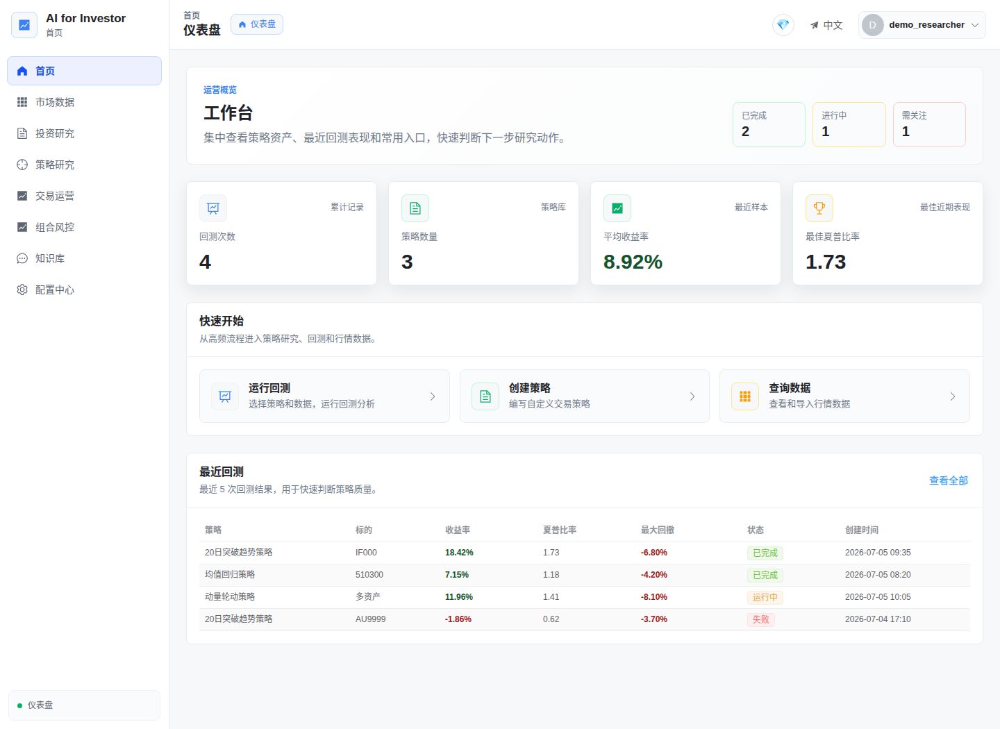
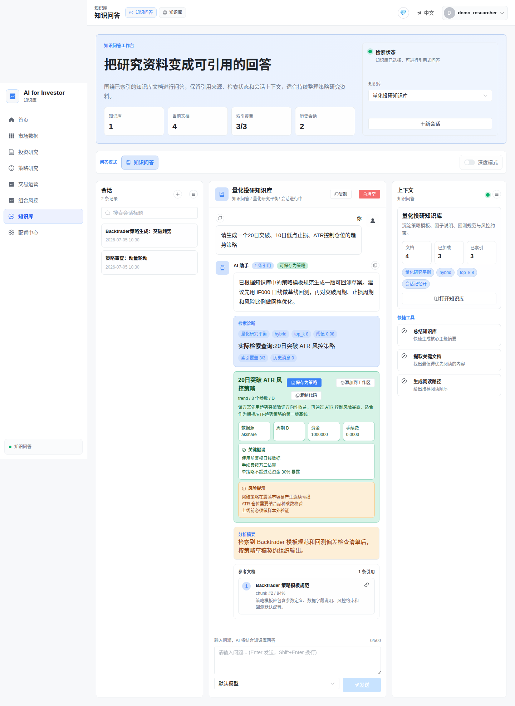
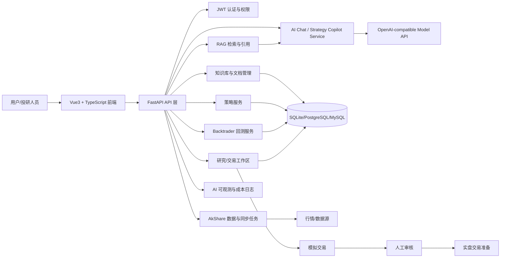
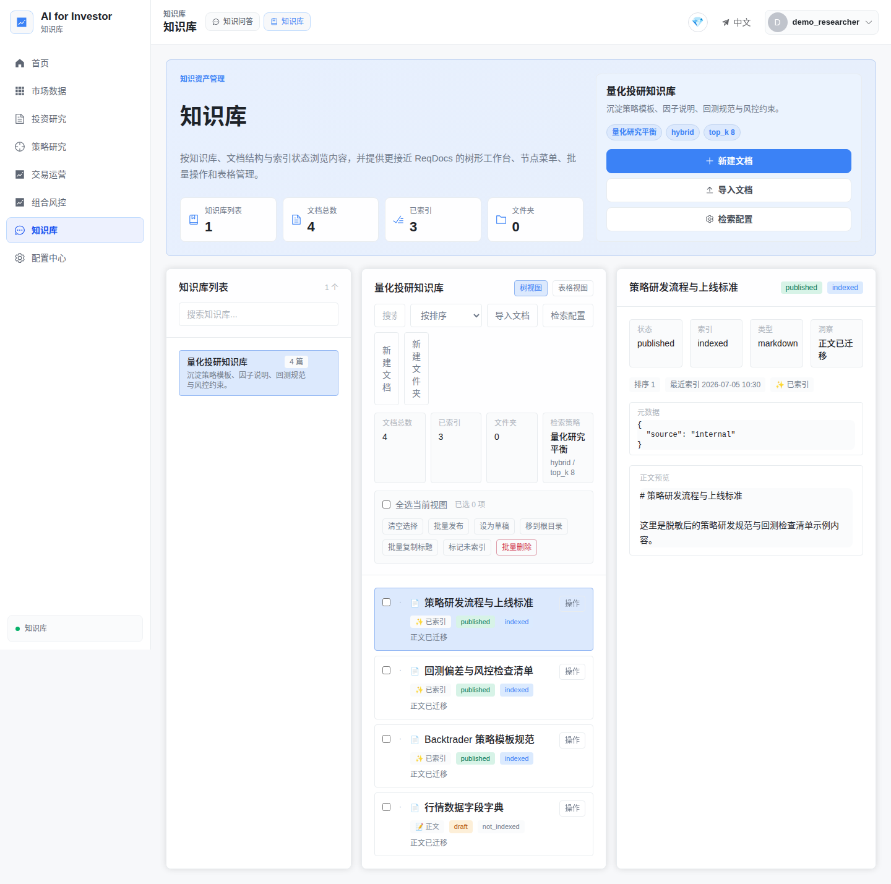
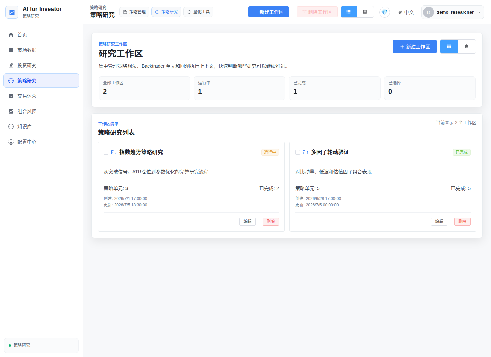
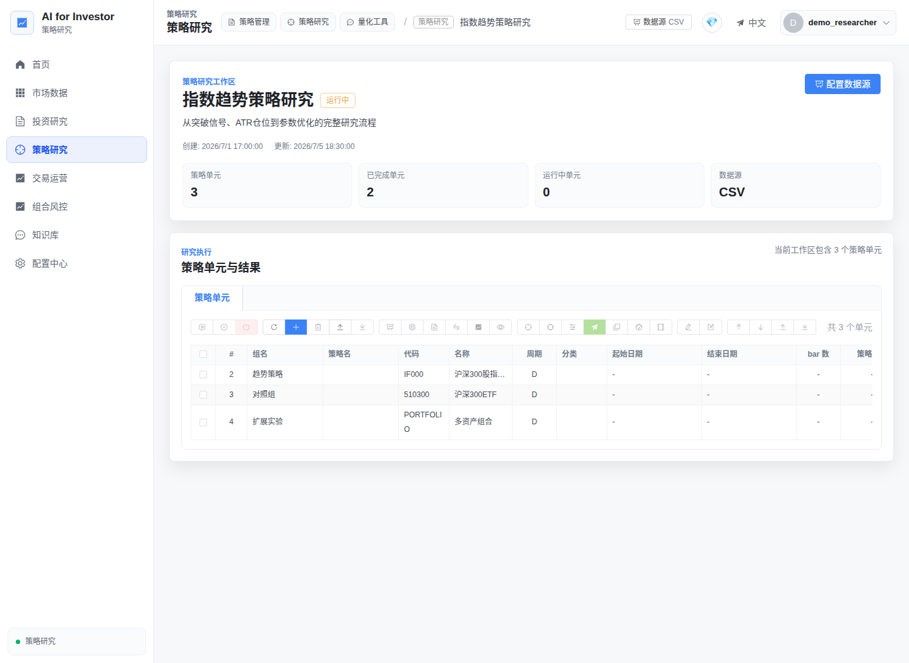

# AI-for-Investor 项目介绍

> 版本口径：基于当前 `backtrader_web` 项目实现整理，截图使用本地演示数据生成，不包含客户敏感信息。正式申报前请将“试用团队、使用频次、成员姓名”等待填项替换为真实统计。

## 一、产品介绍

AI-for-Investor 是一个 AI 驱动的投研平台。

用户只需要输入需求和想法，即可自动生成策略、执行回测、完成参数优化、诊断策略、提出改进建议并不断迭代，最终将满足需求的策略推送到模拟交易中进行模拟交易，经过模拟交易检验，经过人工审核之后，进入实盘投资交易，形成完整的想法到投资的完整流程，提高效率，降低成本。

## 二、核心价值

让用户把保值增值的需求和想法，快速转化为股票、债券、基金、期货、期权、外汇等资产的可验证、可优化、可部署的投资策略。

核心价值体现在三点：

- **降低策略研发门槛**：把自然语言想法转成结构化策略草稿、Backtrader 代码、参数、风险点和默认回测配置。
- **缩短验证闭环**：策略草稿可保存到策略中心、加入研究工作区、一键触发回测，并沉淀报告与复盘建议。
- **强化过程可审计**：知识库问答保留引用来源，AI 调用记录模型、Token、成本、延迟、失败原因和 Prompt hash，不保存原始敏感内容。

## 三、功能介绍

平台围绕“自然语言研究 -> 知识库问答 -> 策略生成 -> 回测验证 -> 工作区沉淀 -> 模拟交易/实盘准备”构建闭环。

| 功能模块 | 主要能力 | 解决的问题 |
|---|---|---|
| 工作台 | 回测次数、策略数、收益、夏普、最近回测状态汇总 | 让投研负责人快速判断当前策略资产和执行状态 |
| AI Copilot | 知识问答、策略构思、Backtrader 策略生成、策略审查 | 把零散想法快速变成可执行策略草案 |
| 知识库/RAG | 文档管理、索引覆盖、引用跳转、检索诊断 | 避免回答无来源、研究材料分散不可复用 |
| 策略中心 | 策略 CRUD、模板、代码编辑、版本沉淀 | 降低重复写策略代码的成本 |
| 研究工作区 | 策略单元、分组、批量执行、报告、参数优化入口 | 把多策略/多参数实验组织成可追踪项目 |
| 回测与分析 | Backtrader 执行、fincore 指标、历史结果列表 | 快速验证收益、回撤、夏普、交易统计 |
| 数据管理 | AkShare 接口、脚本、任务、执行记录、数据表浏览、MySQL 同步 | 降低行情数据接入和同步配置成本 |
| 模拟/实盘交易 | 研究工作区到交易工作区、网关状态、人工审核边界 | 支持从验证到模拟盘，再到人工批准后的实盘准备 |

## 四、背景与痛点

当前量化投研工作中，策略从想法到可上线往往存在多个低效环节：

| 低效环节 | 典型表现 | 影响 |
|---|---|---|
| 需求与策略实现脱节 | 研究员描述想法，开发人员再转代码，指标、周期、风控口径容易偏差 | 反复沟通，策略初稿周期长 |
| 回测配置重复 | 标的、周期、初始资金、手续费、数据源每次手工配置 | 大量低价值重复劳动 |
| 代码审查效率低 | 未来函数、过拟合、仓位风险、数据偏差依赖人工逐项检查 | 容易漏检，策略上线风险高 |
| 研究资料分散 | 策略规范、历史复盘、字段字典、风险清单散落在文档中 | 新策略无法复用已有知识 |
| 报告与复盘耗时 | 回测后还要人工整理收益、回撤、失败原因和下一步优化建议 | 复盘输出不稳定，团队知识难沉淀 |
| 环境与数据链路繁琐 | 数据接口、同步任务、数据库、网关配置分散 | 新人和新环境启动成本高 |

AI-for-Investor 将这些步骤组织到统一工作台中，用 AI 做“策略初稿、知识检索、结构化复盘”，用系统做“回测执行、结果记录、权限与审计”，最终减少人工在重复配置、文档查找、初稿生成上的时间消耗。

## 五、技术方案

### 5.1 模型选型

当前项目不依赖自研模型或客户数据微调，采用**可配置的 OpenAI-compatible `chat/completions` API 调用层**：

- 通过 `AI_CHAT_ENABLED`、`AI_CHAT_BASE_URL`、`AI_CHAT_API_KEY`、`AI_CHAT_MODEL` 配置模型服务。
- 可接入云端大模型、企业私有模型网关或 LiteLLM 聚合层。
- 默认不把客户数据用于训练；AI 调用日志只保留 Prompt hash、Token、成本、延迟和错误元数据。
- 对低风险任务使用低成本模型，对策略审查、复杂复盘等任务可路由到更强模型。

### 5.2 系统架构图

### 5.3 Prompt 策略

平台按助手模式组织 Prompt，不同模式注入不同约束：

- **知识问答**：要求基于知识库片段回答，返回引用、检索诊断和降级原因。
- **策略构思**：把想法拆成信号、数据、风控、回测计划和下一步实验。
- **Backtrader 策略生成**：输出结构化 `strategy_draft`，包括策略名称、代码、参数、数据源、默认回测设置、关键假设、风险点和下一步。
- **策略审查**：重点检查未来函数、过拟合、交易成本、仓位暴露、样本外验证不足等风险。

Prompt 模板支持注册、版本化、灰度比例和回退默认模板；AI 调用日志记录实际模板版本，便于后续对比成功率、延迟和成本。

### 5.4 RAG 与 Agent 设计思路

RAG 侧采用“知识库 -> 文档 -> 文档块 -> 检索 -> 引用”的设计：

- 文档按知识库归属管理，支持索引状态、文档详情和引用跳转。
- 检索配置包含 `top_k`、最小相似度、关键词权重、标题权重、会话记忆等参数。
- 当没有检索上下文或模型未配置时，系统返回明确 `reason_code`，不伪装成完整 AI 回答。

Agent 侧采用“轻量编排”而非完全自动交易：

1. 用户输入自然语言目标。
2. AI 生成策略草稿和风险提示。
3. 用户确认后保存策略、加入研究工作区。
4. 系统运行回测、生成报告摘要和复盘建议。
5. 通过模拟交易观察后，由人工审核是否进入实盘准备。

## 六、开源组件

项目自身采用 MIT License。主要第三方组件及协议如下，完整清单以 `src/frontend/package-lock.json`、`src/backend/pyproject.toml` 和部署环境扫描结果为准。

| 类别 | 组件 | 协议 |
|---|---|---|
| 后端 Web | FastAPI、Pydantic、SQLAlchemy、PyJWT、Loguru | MIT |
| 后端运行 | Uvicorn、Jinja2、Passlib | BSD / BSD 类协议 |
| 回测与量化 | Backtrader、AkShare | MIT |
| 指标与数据处理 | fincore、Pandas、NumPy | Apache-2.0 / BSD |
| AI 接入与观测 | LiteLLM、OpenTelemetry | MIT / Apache-2.0 |
| 数据库驱动 | aiosqlite、mysql-connector-python | MIT / GPLv2 with FOSS License Exception |
| 前端框架 | Vue、Vue Router、Pinia、Vue I18n、Vite | MIT |
| UI 与图表 | Element Plus、ECharts、vue-echarts、Monaco Editor | MIT / Apache-2.0 |
| 测试与质量 | pytest、Ruff、Vitest、Playwright、ESLint、TypeScript | MIT / Apache-2.0 |

合规建议：推广前应在 CI 中增加 `pip-audit`、`npm audit`、许可证扫描和 SBOM 导出；对 GPL 类或带例外条款的组件，由法务确认分发方式与合规要求。

## 七、数据说明与合规处理

| 数据类型 | 来源 | 是否敏感 | 处理措施 |
|---|---|---|---|
| 行情与市场数据 | AkShare、数据脚本、用户配置的数据源 | 通常不含个人敏感信息 | 记录来源、时间范围和复权方式；用于回测需保留可复现配置 |
| 知识库文档 | 内部策略规范、字段字典、复盘材料、用户上传文档 | 可能包含内部研究信息 | 按用户/知识库隔离；上传前脱敏账号、客户名称、交易指令和密钥 |
| 策略代码与回测结果 | 用户生成或导入 | 可能包含策略机密 | JWT 权限控制、用户归属校验、最小权限访问 |
| AI 调用日志 | 系统自动记录 | 不保存原始 Prompt/Response | 仅保存 `prompt_hash`、Token、成本、模型、延迟、状态和错误摘要 |
| 券商与实盘信息 | 网关配置、交易账号、持仓订单 | 高敏感 | 密钥放入 `.env` 或密钥管理服务；实盘动作必须人工审核和权限隔离 |

本次截图全部使用本地演示数据生成，不含真实客户、真实账户、真实持仓或真实交易指令。

## 八、实际应用情况与成效

当前仓库已具备 MVP 试用条件，但未包含生产环境真实埋点汇总。正式申报时建议从 `ai_call_logs`、审计事件、回测任务表和工作区记录导出真实数据。

| 项目 | 当前口径 |
|---|---|
| 已试用团队/项目 | 待填：建议先在量化投研组、策略开发组、数据平台组做 POC |
| 日均使用频次 | 待填：建议按 AI 对话次数、策略草稿数、回测任务数分别统计 |
| 已验证链路 | 自然语言策略生成、知识库问答、策略加入工作区、回测执行、报告复盘 |
| 推荐 POC 周期 | 2-4 周，覆盖 3-5 个真实策略需求 |

按单次策略研究流程估算，预期节省如下：

| 工作项 | 传统方式 | 使用平台后 | 预期节省 |
|---|---:|---:|---:|
| 策略初稿与参数草案 | 2-4 小时 | 20-40 分钟 | 60%-80% |
| 回测配置与结果整理 | 30-60 分钟 | 5-15 分钟 | 70%-85% |
| 知识查找与规范确认 | 30 分钟以上 | 5-10 分钟 | 65%-80% |
| 复盘摘要与改进建议 | 30-60 分钟 | 5-15 分钟 | 70%-85% |

## 九、落地可行性分析

### 所需资源支持

| 资源 | 建议配置 |
|---|---|
| 计算资源 | 1 台应用服务器起步；回测任务较多时单独扩展 Worker |
| 数据库 | POC 用 SQLite；团队推广建议 PostgreSQL/MySQL |
| 模型服务 | 企业模型网关或兼容 `chat/completions` 的 API；配置每日预算 |
| 数据源 | 明确行情源、复权规则、字段字典和数据更新时间 |
| 安全 | 密钥管理、权限分级、审计日志、实盘交易人工审批 |
| 运维 | Docker Compose/CI、监控告警、备份恢复、许可证扫描 |

### 潜在风险与应对

| 风险 | 影响 | 应对 |
|---|---|---|
| AI 生成策略不正确 | 错误策略进入回测或模拟盘 | 强制人工确认、策略审查、回测验证、样本外验证 |
| 数据质量问题 | 回测结果失真 | 数据源版本化、字段校验、异常数据检测 |
| 成本不可控 | 模型调用费用增长 | AI 成本看板、预算阈值、模型分级路由 |
| 敏感信息泄露 | 合规风险 | Prompt hash 日志、脱敏上传、私有模型网关、权限隔离 |
| 实盘交易风险 | 真实资金损失 | 默认高风险能力边界、模拟盘验证、人工审批、风控限额 |
| 开源许可证风险 | 分发或商用合规问题 | SBOM、许可证扫描、法务确认 GPL/例外条款 |

## 十、团队分工

| 成员 | 角色 | 具体分工 | 产出 |
|---|---|---|---|
| 待填：项目负责人 | 产品与项目管理 | 需求范围、里程碑、试点团队协调、验收指标 | 产品方案、POC 计划、验收报告 |
| 待填：AI/算法负责人 | AI Copilot 与 RAG | 模型接入、Prompt 模板、知识库检索、策略草稿结构 | AI 对话、RAG、策略生成与审查能力 |
| 待填：后端负责人 | 后端与回测引擎 | FastAPI、策略服务、回测服务、工作区、数据同步、权限 | API、服务层、数据库模型、回测执行链路 |
| 待填：前端负责人 | 前端体验 | Vue 页面、工作台、AI 对话、知识库、工作区、可视化 | 前端工作台与操作流程 |
| 待填：测试/安全负责人 | 质量与合规 | 单元/E2E 测试、性能基线、许可证扫描、脱敏规范 | 测试报告、安全与合规清单 |
| 待填：业务代表 | 投研试点 | 提供真实策略需求、验证回测结果、评估节省时间 | 试点用例、反馈记录、推广建议 |

## 十一、结论

AI-for-Investor 的核心不是单点聊天机器人，而是面向量化投研的完整工作流工具：用 RAG 保证研究依据可追溯，用 AI Copilot 加速策略初稿和复盘，用 Backtrader 和工作区承接回测验证，用可观测与权限控制支撑团队推广。它适合作为投研团队的 AI 工具试点项目，在明确数据合规、人工审核和成本预算后，具备推广到更大范围的可行性。
